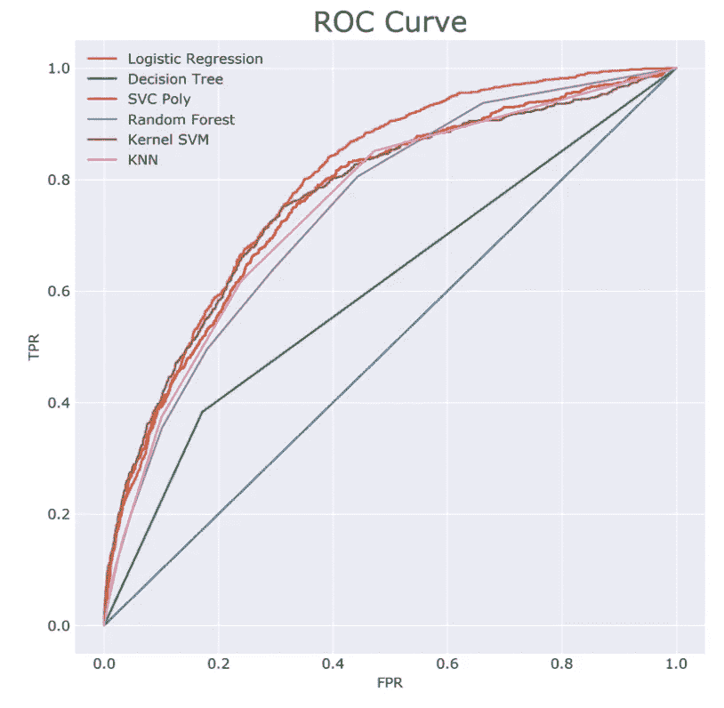
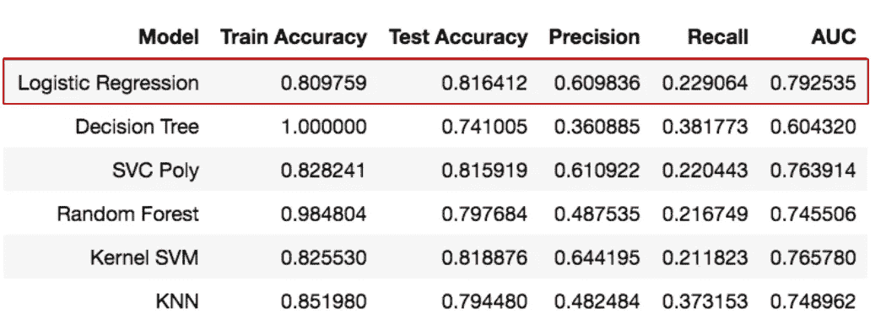
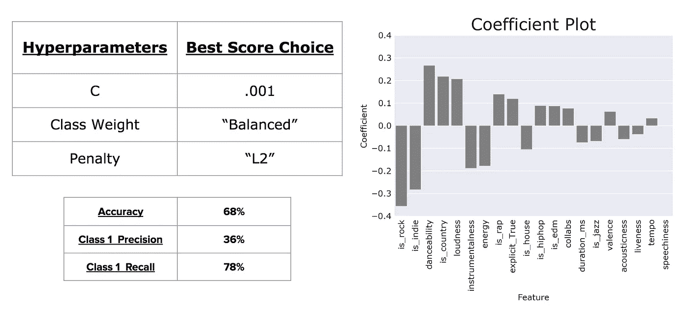
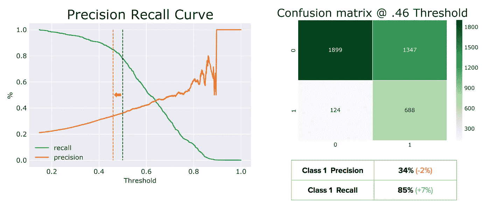
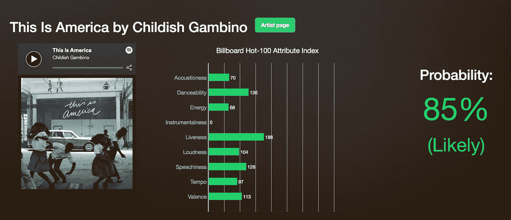
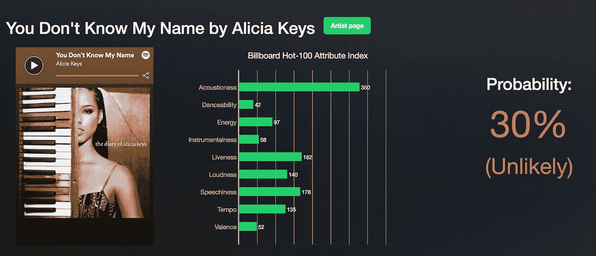

# 它能制图吗？

> 原文：<https://towardsdatascience.com/can-it-chart-8bf6139f1ae8?source=collection_archive---------9----------------------->

*注:我申请的链接可以在* [*这里*](http://canitchart.us-east-2.elasticbeanstalk.com/) *找到。输入歌曲及其对应的艺术家，看看它在 Billboard Hot-100 中的表现如何。中间的图表是每首歌曲的音频特征与普通公告牌歌曲的音频特征相比的指数。要查看艺术家的整体评价，请点按“艺术家页面”部分。*

# **概述**

在音乐行业，A&R 分部传统上负责通过“直觉”和依靠业内“引领潮流者”等方法来发掘人才。这对于希望成名的新艺术家来说可能是一个问题，但不一定有良好的关系。随着艺术家越来越多地使用社交媒体渠道，创作音乐的门槛越来越低，A&R 分部可能会在决策过程中受到阻碍。

但是，如果我们尝试自动化寻找新人才的过程会怎么样呢？作为一个初步的搜索工具，我们能找到有潜力成为下一个大事件的歌曲和艺术家吗？

我开发了一个名为“它能制图吗？”，它使用 Spotify 的歌曲特征来预测一首歌是否有能力出现在 BillBoard Hot 100 上。

# 方法学

对于我的目标变量，我想看看一首歌是否在公告牌百强排行榜上。热门 100 排行榜是美国歌曲的行业标准排行榜，主要基于销售、电台播放和在线流媒体。从商业的角度来看，如果你能找到一个有潜力进入 Billbaord Hot 100 的艺术家，你最终可以增加你的唱片公司的盈利能力。

这个项目是一个二元分类问题，有以下标签:

*   **第 0 类**——“不会图表”
*   **第 1 类**——“意志图表”

为了不错过“*下一件大事*”，我对 1 级回忆进行了大量优化。然而，找到被错误分类的歌曲是可以的，因为这些歌曲在以后的评估中可能会被认为是“荣誉奖”。

# 获取数据

在 SongFacts.com，我使用 BeautifulSoup，一个网络搜集库，获得了从 2010 年 1 月 1 日到 2018 年 5 月 6 日发行的歌曲列表。然后我把同一时期所有的 Billboard 热门 100 首歌都加入了 SongFacts.com 排行榜。从那里，我利用 Spotify API 为歌曲集提取音频功能和艺术家流派。

到最后，我有一个不平衡的类集合:类 0:类 1 = 4:1。

# 模特培训

当训练我的模型时，我希望我的模型有某种可解释性。虽然支持向量机乍看起来表现不错，但它们缺乏讲故事的能力。我决定采用逻辑回归，因为它在我的受试者操作特征曲线下的面积是所有模型中最高的。然而，我的回忆很低，所以我需要微调一些超参数。

在调整我的超参数以最大化召回率后，我能够将我的 1 类召回率提高到 78%。从这个模型中，我提取了特征系数，发现摇滚和独立艺术家不太可能出现在 Billboard Hot 100 上，但乡村艺术家更有可能出现。此外，一首歌越适合跳舞或越响亮，它就越有可能出现在 Billboard Hot 100 上。

精确度和召回率之间有一个内在的平衡，虽然精确度=召回率的平衡存在于 0.63 左右，但我想在不损失太多精确度的情况下尽可能提高召回率。通过将阈值从 0.5 移动到 0.46，我能够将 1 类召回率提高 7%，而精确度仅损失 2%。

注意:发布这个项目后，我研究了加权类，发现通过给类增加一个权重而不是“平衡”,我可以在不移动阈值的情况下实现 85%的召回率和 35%的准确率。

# 模型示例

我在五月初创建了这个项目，大约在那时幼稚的甘比诺的《这就是美国》出版了。我的模型预测这首歌有 85%的可能性会登上排行榜，它在[2018 年 5 月 14 日](https://www.billboard.com/articles/columns/chart-beat/8455823/childish-gambino-this-is-america-no-1-hot-100)的 Hot-100 排行榜上排名第一。还不错。

在另一个例子中，我的模型预测艾丽西亚·凯斯的《你不知道我的名字》不会出现在 Billboard Hot-100 上。然而，这首歌在 2004 年 1 月 31 日登上了公告牌百强榜的第三名。我的模特怎么会和这首歌差这么远？也许在 2000 年早期，流行的是 R & B 歌曲，而这些歌曲并不代表当前十年的流行音乐。将来，我需要将更多的歌曲放入数据集中，并淡化公告牌歌曲占所有歌曲的比例，以总体上代表音乐。

感谢阅读！