# 线性模型能预测一个足球运动员的价值吗？

> 原文：<https://towardsdatascience.com/can-linear-models-predict-a-footballers-value-33d772211e5d?source=collection_archive---------2----------------------->

Photo by [Emilio Garcia](https://unsplash.com/@piensaenpixel?utm_source=medium&utm_medium=referral) on [Unsplash](https://unsplash.com?utm_source=medium&utm_medium=referral)

本着 2018 年世界杯的精神，我决定展示我最近做的一个项目，它融合了我最强烈的两个兴趣——数据科学和足球！目的是看看在英超联赛中一名球员的受欢迎程度和他的市场价值之间是否有关系，因为仅仅通过他的统计数据很难恰当地评估一名球员的价值。一个简单的例子是防守型中场球员通常看起来做得更少*，*但对任何球队都是非常有价值的。我还扯进了一些关于球员和前 6 名球队的有趣观察！

这里使用的数据是从各种来源搜集来的，包括 transfermrkt.com 和梦幻英超。它包含了 FPL 网站上列出的每支球队的所有球员，他们都有相应的市场价值。例如，transfermrkt.com 的 FPL 队名单上有麦克托米内，但他没有市场价值，这意味着他被排除在数据之外。这是 2017/18 赛季英超联赛所有球员的综合数据集，于 7 月 20 日得到确认。因此，可能会有一些后来签署的遗漏。

抓取使用了一些很酷的 RVest 和 Selenium 技术——点击[此处](https://github.com/shubham-maurya/epl-data-scraping)了解更多细节。

# 一些初步分析

# 谁是 EPL 最有价值的球员？

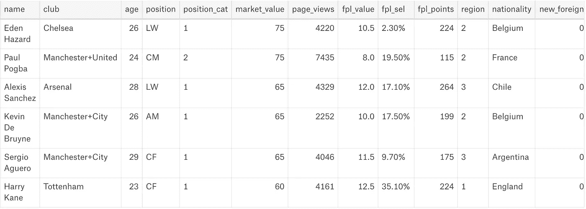

正如所料，游戏中的一些最大的名字正在英格兰超级联赛中比赛。

# 谁是最受欢迎的球员？

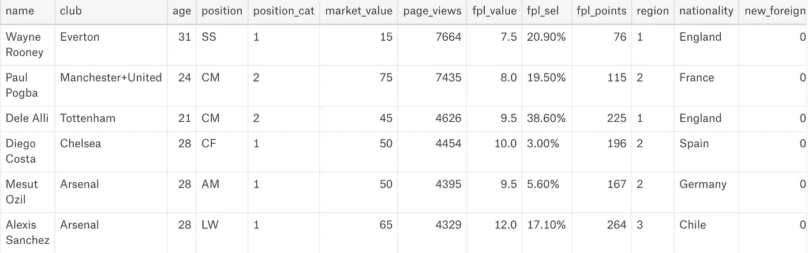

鲁尼显然是第一名，他效力于曼联，是英超传奇人物。

# 市场价值分布

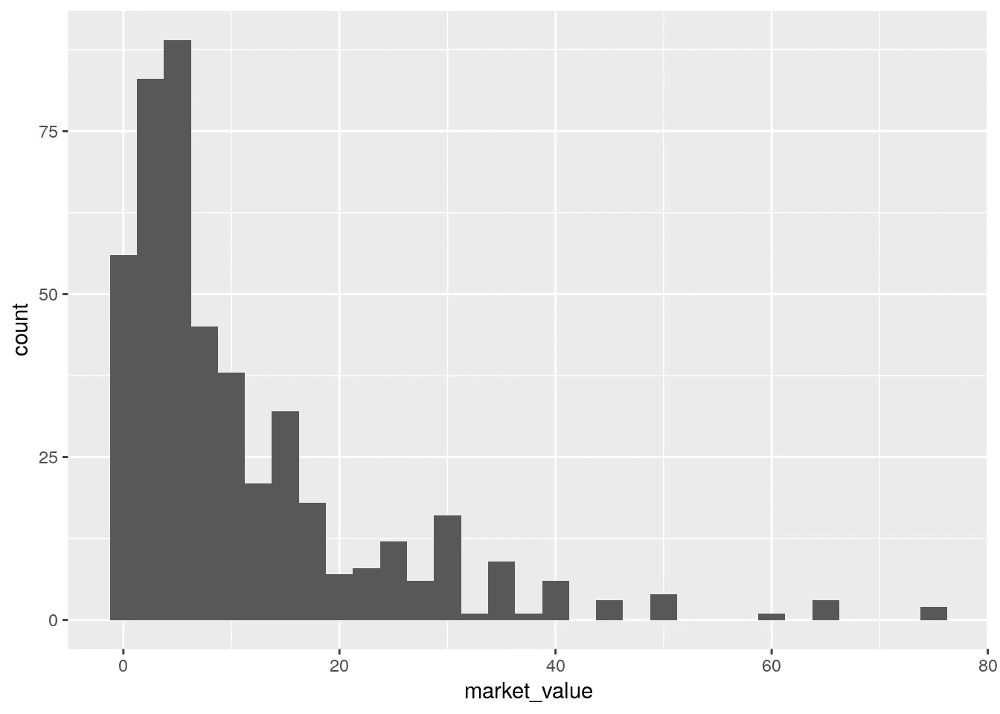

显然不是正态分布，但这是意料之中的。球队往往很少有精英球员，而在他们的*阵容*中有大量低+中价值球员。对球队前 15 名球员的分析可能看起来更像是正态分布，因为我们排除了低价值的边缘/青年球员。

## 前 6 名看起来有什么不同吗？

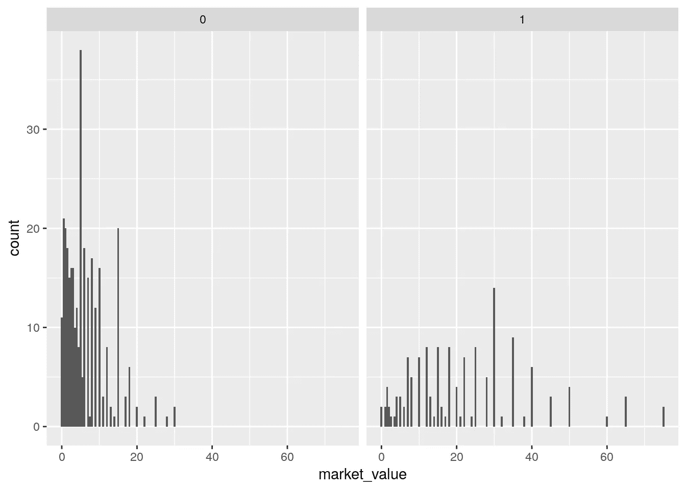

1 indicates top 6, 0 indicates other

有意思。前 6 名似乎有分散的球员，而其他人的大部分球员价值都在 1000 万以下(transfermrkt 的估值，不是我的)。

# 流行度分布

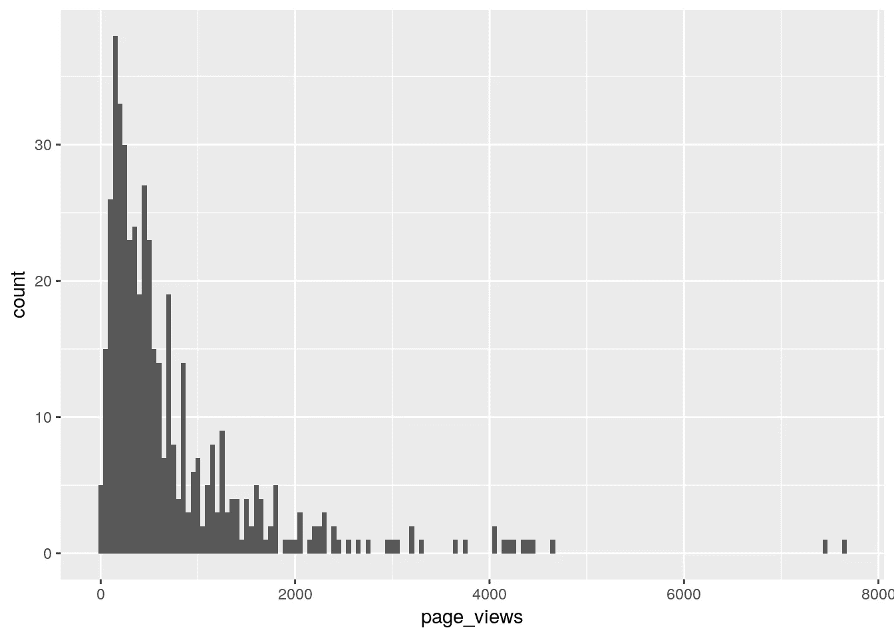

类似的市场价值分布，除了最后的两个异常值——韦恩·鲁尼和保罗·博格巴。虽然鲁尼已经是目前最知名的英格兰足球运动员，但他也打破了博比·查尔顿爵士保持的曼联进球最多的纪录。这一点，加上对他曼联生涯的不断猜测，无疑导致了他的页面浏览量的增加。另一方面，保罗·博格巴是严格审查的结合体(是世界上最昂贵的转会)(更新:不再是了！)，回到曼联(可以肯定地看到人们在寻找他)，以及他是一个非常有市场的，可见的球员的事实。

## 前 6 名与其他人

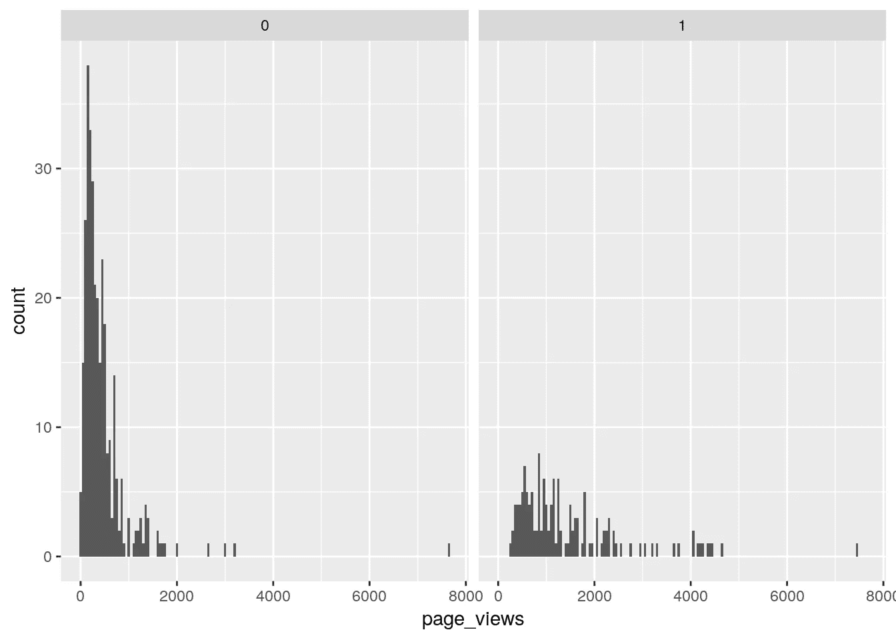

Graph 1 indicates top 6 teams, 0 indicates other teams

同样，排名前 6 的俱乐部似乎有着广泛的球员受欢迎程度。此外，韦恩鲁尼现在在埃弗顿，为其他球队解释离群值。

# 详细分析

显然，我试图建立的案例是，似乎有证据表明一个球员的市场价值与他的受欢迎程度相关联。这很有趣，因为在足球界，能力和表现是出了名的难以量化。这取决于位置、教练的战术、对手、联赛、你自己队友的能力等等。因此，给一个球员估价是非常困难的，尽管这是必须要做的。
像 WhoScored 这样的网站有每个球员每场比赛的分数，而 Fantasy Premier League 会在每个球员的头上贴上一个数值。看看*受欢迎程度*能否被用作*能力*的基本代表将会很有趣，这也是我将通过回归模型尝试的。

# FPL 估价

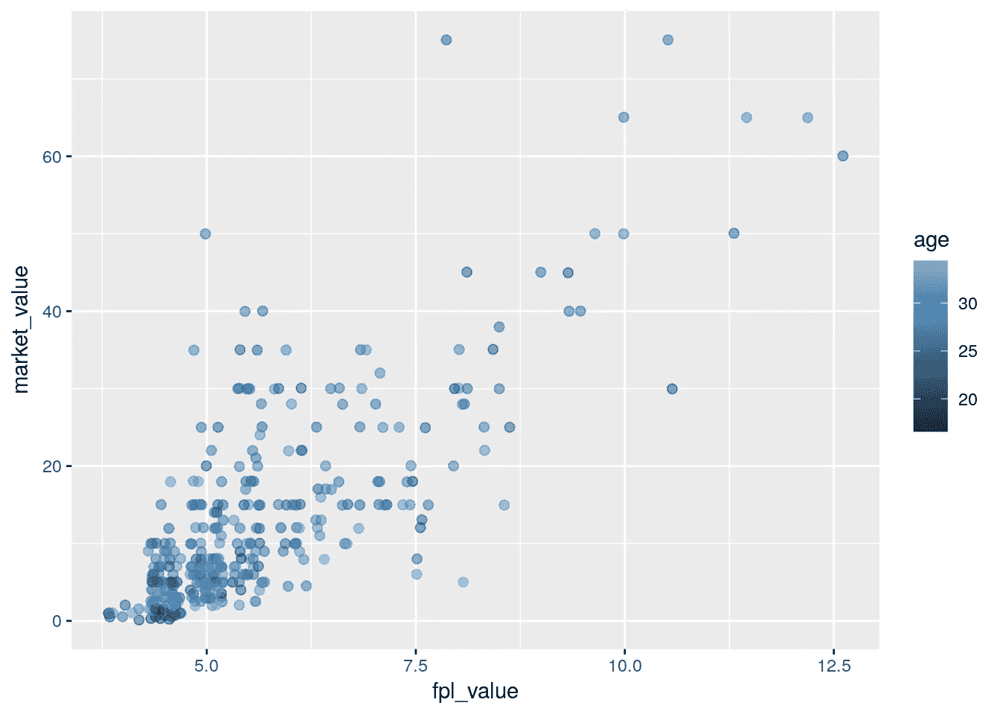

FPL 价值和 transfermrkt 价值之间似乎有很好的一致，尽管 FPL 的估值显然是短期的，所以年龄不是一个重要因素。我期待看到更多球员出现在右下方——老球员，市场价值低，但 FPL 价值高，理论上像彼得·切赫和亚亚·图雷。也许有更好的方式来强调这一点。

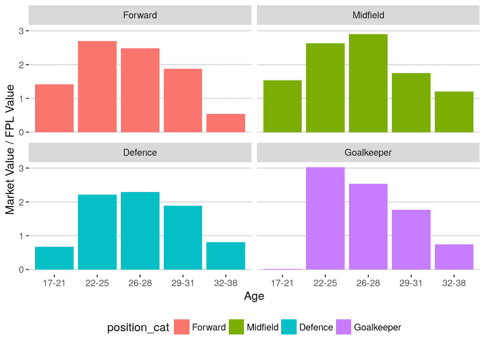

这似乎是对的。如果 FPL 的价值等同于转会市场的价值，我们会看到一个恒定的比率，跨越年龄组。但事实上，最低的 FPL 价值是 400 万，非常年轻和未经证明的球员比例很低。同样，在另一端，老球员的市场价值很低，但他们在下个赛季仍然有价值。有趣的是远期交易的比率如何在超过 32 时跌落悬崖，这可能意味着它们的市场估值非常低。

# 随着年龄增长的市场价值

一般来说，老玩家的市场价值会更低，这是相当直观的。粗略的说明-

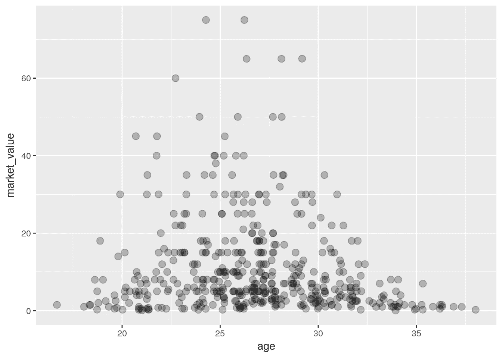

高价值玩家集中在 24-32 岁之间，在 27 岁左右达到顶峰。重要的是要注意，这绝不是线性关系，这就是为什么我在下面的回归模型中使用年龄类别。另一种方法是做一个变点回归，这意味着建立两个模型，其中一个模型的年龄=阈值。

# 谁在哪个位置进货？

曼城拥有潜力巨大的前锋和攻击型中场，但他们的防守非常薄弱(自从门迪、沃克和达尼洛到来后就没有了——但他们不在这个数据集中)。就位置优势而言，前六名的排名如何？

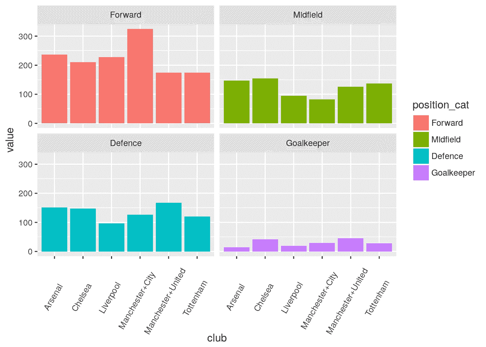

曼城的进攻总市值遥遥领先于其他球队。不过，他们和利物浦的后防明显较弱，哪个城市已经整改。曼联的德基和罗梅罗显然是 6 强中的佼佼者。

# 受欢迎程度是能力的代表

正如下一节所解释的，我们测试了能力和受欢迎程度之间存在关系的假设。能力很难通过绩效指标来衡量和比较。出于本节的目的，我假设 **FPL 估值**是一个公平的能力衡量标准。尽管这可能并不完美，我们还是应该能够阿瑟能力和声望之间的关系。

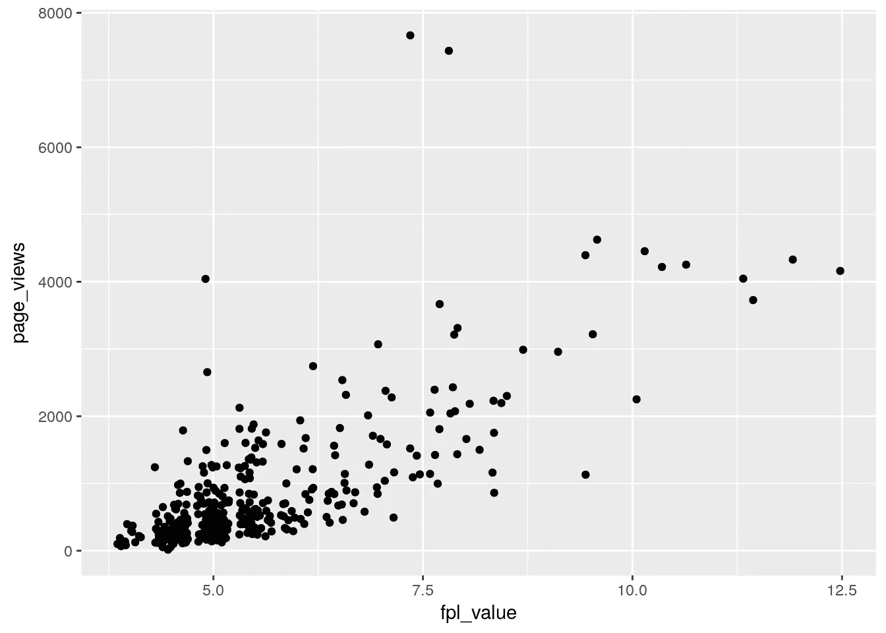

FPL 的估值和受欢迎程度之间似乎有一种很好的线性关系，只有几个明显的例外(韦恩·鲁尼，唉)。精彩！这将有助于下面的模型。

# 回归模型

主要目的是看看市场价值是否可以用知名度作为能力的代表来确定。一个玩家的市场价值可以直观地表示为-

> *市值~能力+职位+年龄*

这应该理解为*市值*是*能力、职位*和*年龄的函数。*

后两个很容易观察到，但是能力是一个很难衡量的属性。有各种各样的衡量标准，但我决定用一个简单的指标来衡量——流行度(或者更具体地说，去年维基百科的页面浏览量)。我选择维基百科观点的原因如下-

*   比 Twitter/脸书要好，因为它不依赖于玩家是否有个人资料。
*   比脸书/Instagram 的粉丝要好，因为这些人也受到球员帖子的参与度的影响。
*   很容易得到所需的时间框架——我想排除 5 月至 7 月，因为这将夸大 2016/17 赛季转会球员的受欢迎程度。

使用页面浏览量有其自身的问题与其他因素的相关性-

1.  来自英格兰本土的球员可能会得到更多的点击率，因为他们在自己的主场联赛中比赛，即球员的国籍可能很重要。
2.  不同类别的球员得到不同程度的关注——前锋肯定比后卫受欢迎得多！
3.  新的签约可能会得到更多的关注，甚至超过转会期。
4.  顶级俱乐部拥有更多的国际观众。
5.  玩家可能会获得大量的点击率，因为在此之前他们几乎不为人知。想想 2016/17 赛季的马库斯·拉什福德。
6.  长期受伤的球员可能只有很少的安打，仅仅是因为他们没有上场比赛。

在模型中，我控制 1–4，但不控制 5 和 6。5 和 6 都需要大量的工作来确定突破和长期伤害，这可能是有用的未来模型的补充。

对于因素 1-4:

1.  检索每个玩家的国籍，并将其放入 4 个桶中:

*   1 代表英国
*   2 代表欧盟(英国退出欧盟将此作为自然分类)
*   3 适用于美洲
*   4 适用于世界其他地区

创建了一个名为`region`的新列，作为具有 4 个级别的因子。

1.  包括用于页面视图和位置类别的交互术语。
2.  标记了 2016/17 赛季的新签约，并与页面浏览量进行了互动。
3.  创建了一个由曼联、曼城、切尔西、阿森纳、利物浦和热刺组成的专栏。这也与页面浏览量有关。

除了这些相互作用，年龄也作为一个分类变量包括在内(由于它与市场价值的非线性关系)。

# 数据集修改

1.  新晋级的俱乐部被排除在数据之外，只是因为英超联赛提供了更高水平的宣传，而这些俱乐部在前一年没有接触过。
2.  出于同样的原因，17/18 赛季来自国外的新援也被排除在外。但是，英超内部转会的球员会被保留。这意味着林德洛夫被排除在外，但卢卡库没有。
3.  采用`market_value`的 sqrt 值，因为`market_value`是右尾重的，这可能导致异方差。
4.  但是，这就导致了`sqrt(market_value)`和`page_views`的关系看起来是这样的——

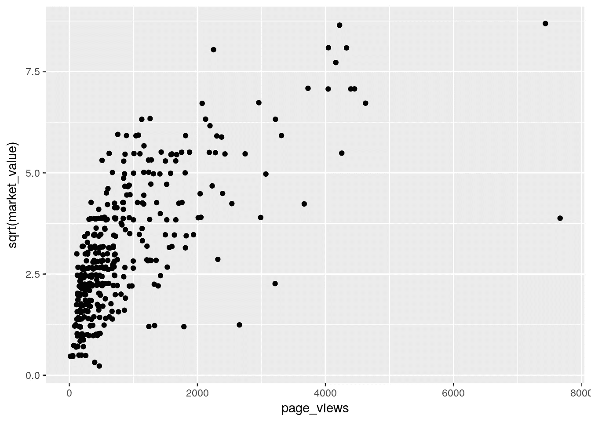

我也在`page_views`上应用了一个 sqrt 转换，得到了下面的图表

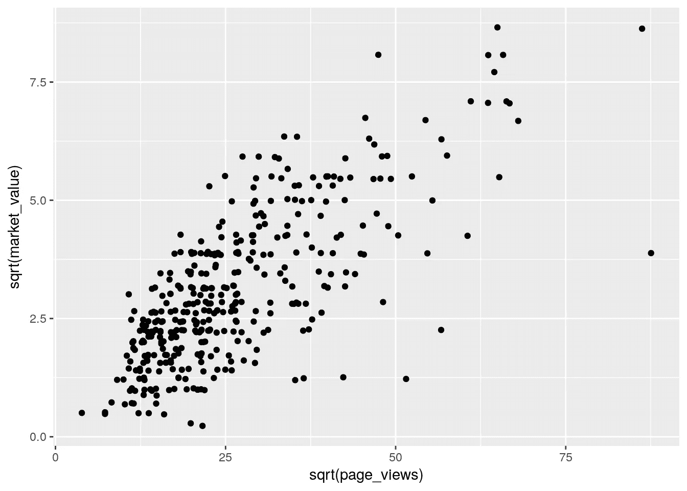

这看起来大致是线性的，韦恩·鲁尼是个例外。

现在对该数据应用多元线性回归模型得到的 R 值超过 70%！此外，`page_views`的系数极其显著。显然，`sqrt(market_value)`和`sqrt(page_views)`之间是线性关系。

# 残差图能告诉我们什么？

残差图应该能够告诉我们数据中是否存在异方差问题。

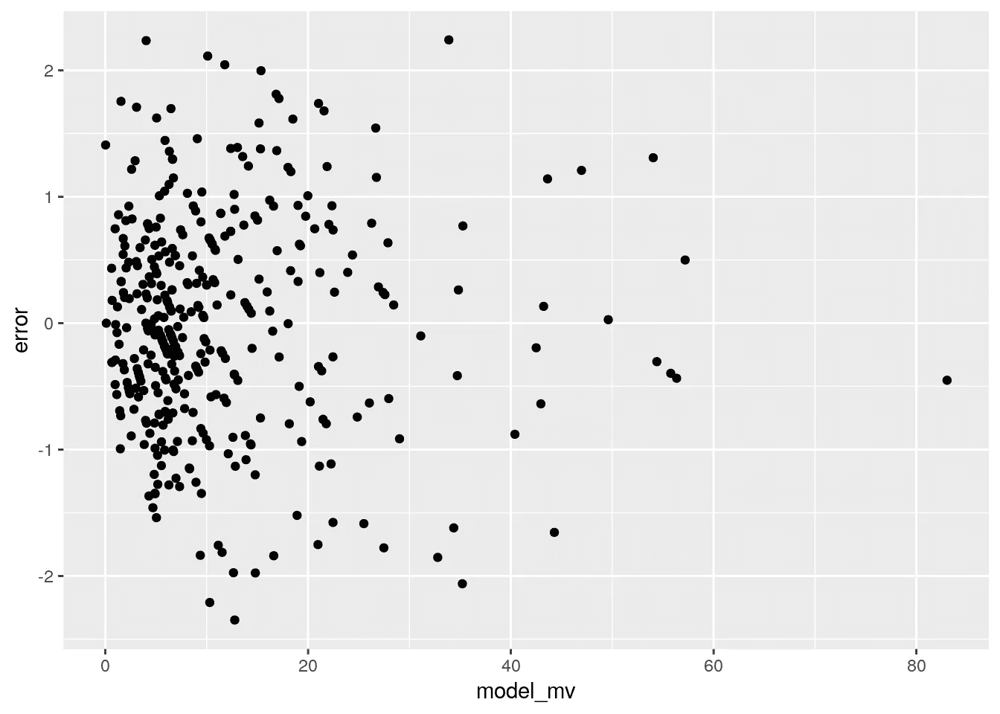

Error Distribution Plot

Q-Q Plot

残差图似乎有随机分布的误差，qq 图证实它们是正态分布的。

# EPL 人气

一个有趣的副产品是，与其他联赛相比，英超联赛有多受欢迎。由于从国外联赛引进的球员数量很少，这仍然是一个粗略的方法。然而，差异大到足以大于噪声。

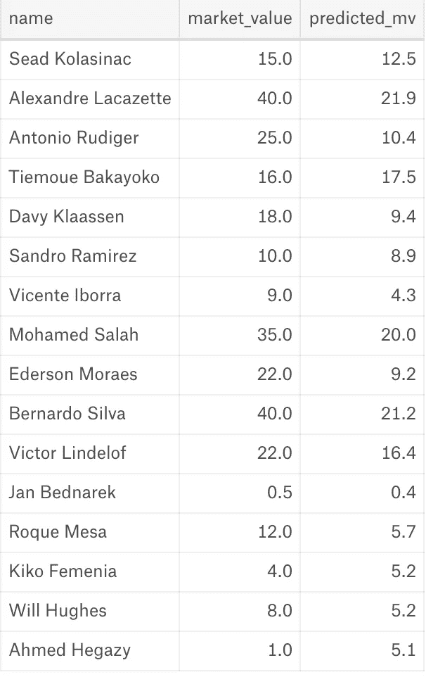

我们知道这种模式肯定有效，因为它有来自其他联盟的被低估的球员。理由是——EPL 2000 万球员的点击率比法甲 2000 万球员的点击率高。正因为如此，**每次**页面浏览量的*值*远低于 EPL。但由于模型是用 EPL 的数据建立的，页面浏览量的系数是从 EPL 得出的。因此，来自不太受欢迎的联赛的外国球员被低估了。

我希望你和我一样觉得这很刺激。如果你觉得有趣，请投赞成票！

要访问该项目中使用的数据和代码库，请单击此处的。