# 机器能学习正弦的概念吗

> 原文：<https://towardsdatascience.com/can-machine-learn-the-concept-of-sine-4047dced3f11?source=collection_archive---------2----------------------->

众所周知，人工神经网络擅长模拟任何函数。我想知道他们是否能更进一步，学习一个函数的广义模型。为简单起见，让我们尝试学习一个只有一个参数 A 的正弦函数，它控制频率:

y = sin(A*x)

对于我们人类来说，一旦我们理解了正弦函数，我们就知道它在任何参数 A 下的行为。如果我们看到一个部分正弦波，我们就可以知道 A 应该是什么，我们可以将该波外推至无穷大。

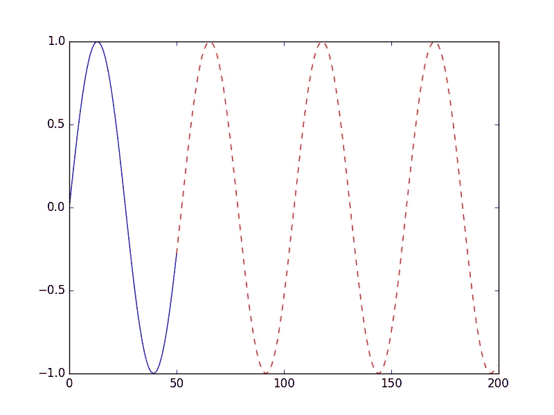

ML 能预测一个它没见过的参数 A 的正弦波吗？

# 实验设置

让我们做一个实验来找出答案。我们把这个问题描述为一个时间序列预测问题。给定一些与函数 sin(A*x)匹配的数据点，尝试预测未来值。当然，挑战在于我们想学习正弦的一般概念。我们希望能够预测未来值，甚至是我们的模型在训练期间从未见过的参数(A)。

我们将使用 Keras，并尝试几种不同的模型——常用于函数建模的全连接网络，常用于模式识别的 CNN，以及常用于序列建模(如 NLP)的 LSTM。

对于每个模型，我们将在(0.06，0.12)范围内的参数 A 下进行训练。对于测试，我们将尝试在 0.033、0.06、0.083 和 0.163 的值下进行预测。这样，我们可以看到在训练范围内有 2 个参数，在训练范围外有 2 个参数的性能。

在测试过程中，我们将从正确 A 下的真实 sin(A*x)值历史开始，这相当于给人一个部分正弦波。当我们进行预测时，值 y 的未来预测将使用 y 的早期预测值。举个例子，假设我们从 40 个真实数据样本开始，y[0] … y[39]，y[i] = sin(A*i)。我们使用我们的模型来预测 y[40]。然后我们会用 y[1] … y[40]，其中 y[40]是预测值，来预测 y[41]。

我们这样做，而不是使用 sin(A*i)来预测 y[i+1]的原因是，通过累积误差，使我们的模型中的误差更容易看到。

# 全连接网络

在 Keras 中，完全连接的层称为密集层。我们在 FC 网络中使用 3 个密集层。

```
model = models.Sequential()
model.add(Dense(100, input_shape=(INPUT_COUNT,)))
model.add(LeakyReLU(alpha=0.03))
model.add(Dense(100))
model.add(LeakyReLU(alpha=0.03))
model.add(Dense(1))
```

输入形状是 INPUT_COUNT(定义为 40)之前的数据点。最后一个密集层有一个单元，因为我们在给定前 40 个值的情况下预测下一个值。

下面是结果。绿色虚线是预测。同样，在训练期间，参数 A 在 0.06 至 0.12 的范围内。

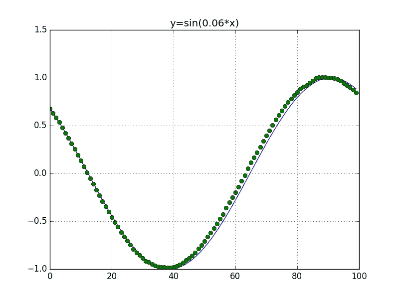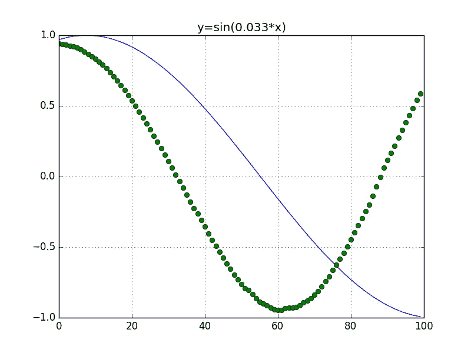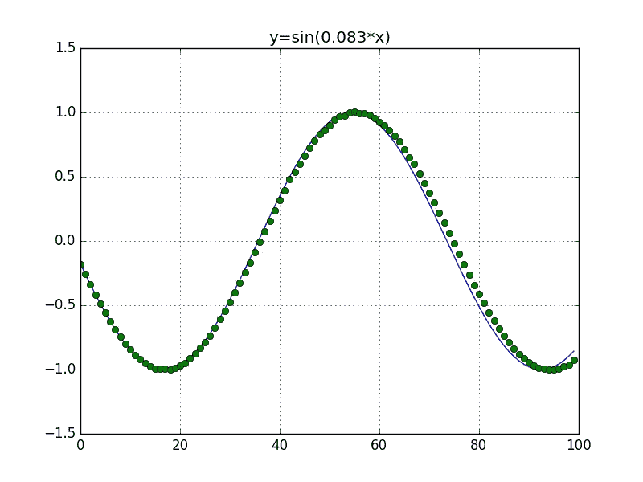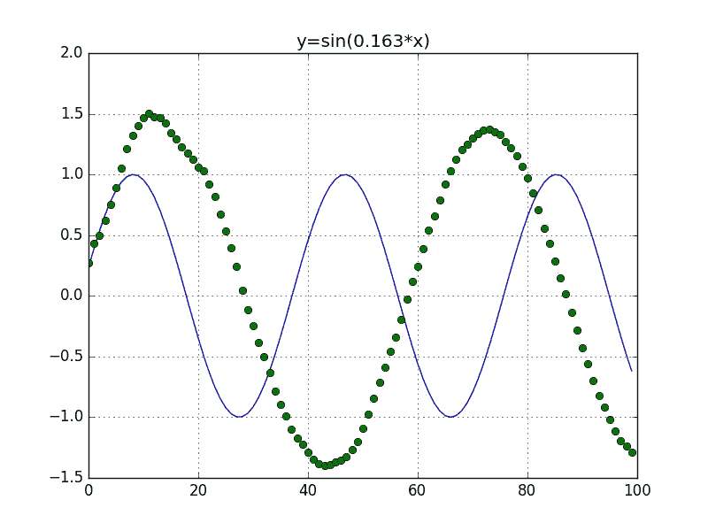

正如我们所看到的，我们的模型很好地管理了 0.06 和 0.083 的值，但是对于 0.033 和 0.163 却表现不佳。基本上一旦参数 A 超出训练范围，我们的模型就处理不了。

请注意，在图表上，我们的函数不是从 0 开始，因为我们使用了 40 个数据点作为历史数据来输入模型。所有图表都偏移了这 40 个数据点。

# 美国有线新闻网；卷积神经网络

我们使用 Conv1D 层，因为我们的数据是一维的。

```
model = models.Sequential()
model.add(Conv1D(100, 3, strides=1, input_shape=(INPUT_COUNT, 1)))
model.add(LeakyReLU(alpha=0.03))
model.add(Conv1D(100, 3, strides=1))
model.add(LeakyReLU(alpha=0.03))
model.add(Flatten())
model.add(Dense(100))
model.add(LeakyReLU(alpha=0.03))
model.add(Dense(1))
```

对于卷积，我们使用大小为 3 的滤波器，步长为 1。我们没有做最大池，因为位置在回归问题中很重要。

与 FC 网络类似，输入是 40 个先前的数据点，输出是曲线上的下一个点。

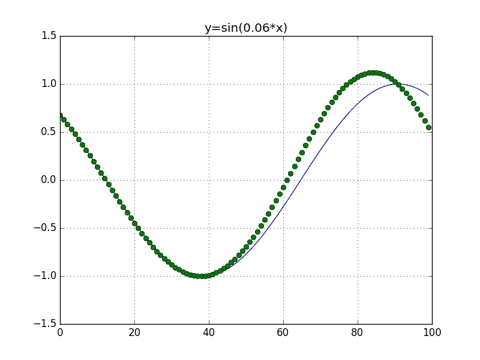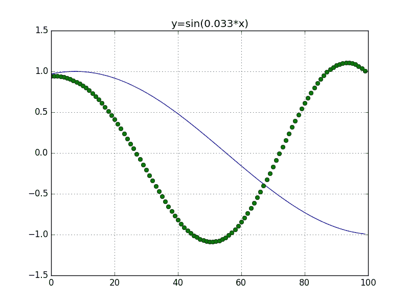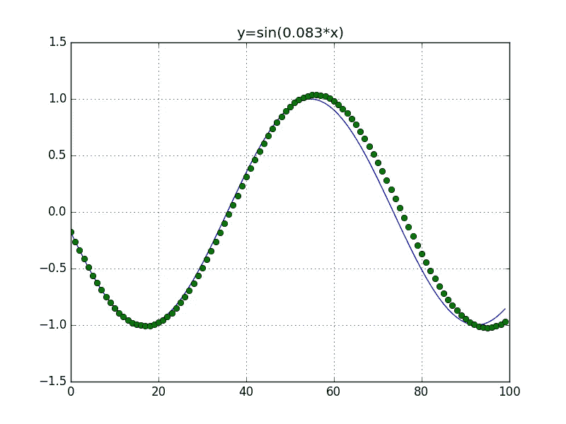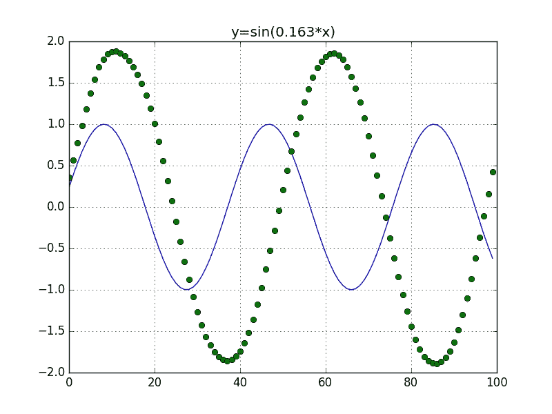

结果类似于完全连接的网络。在给定任何参数 a 的情况下，它不能学习正弦的一般公式。

# LSTM

LSTM 网络保留了它在过去看到的数据的记忆。因此，我们输入的数据是不同的形式。我们只需要一次输入一个数据点，而不是 FC 和 CNN 模型过去 40 个数据点的历史记录。如下图所示，input_batch_size 为(1，1，1)。

```
model = models.Sequential()
model.add(LSTM(100, batch_input_shape=(1, 1, 1), return_sequences=True, stateful=True))
model.add(LSTM(100, return_sequences=False, stateful=True))
model.add(Dense(1))
```

因为我们一次只能输入一个数据点，因为后面的数据点依赖于前面的数据点建立的 LSTM 内部状态，所以我们不能利用硬件中的并行性。结果训练真的很慢。因为这个原因，我没有对 LSTM 参数做太多的实验。这是结果。

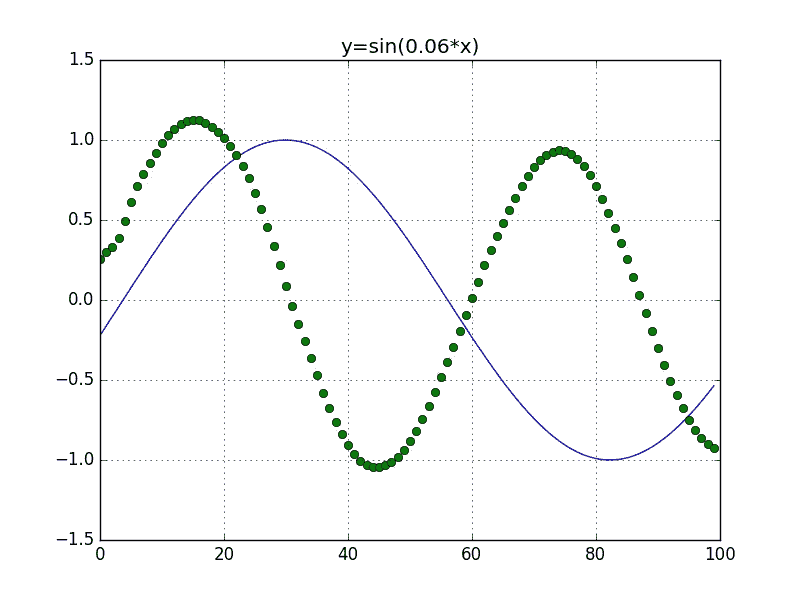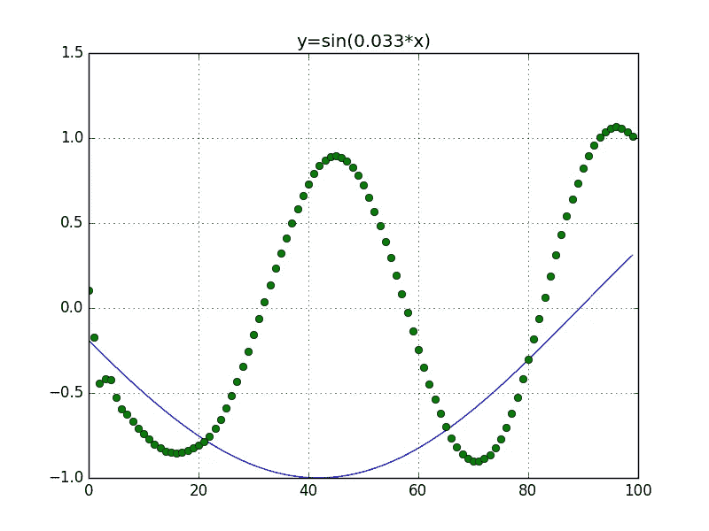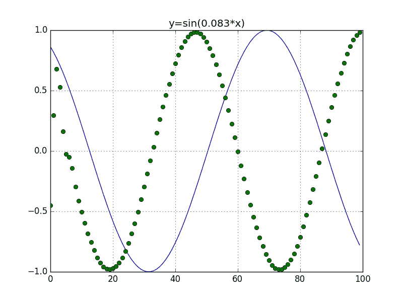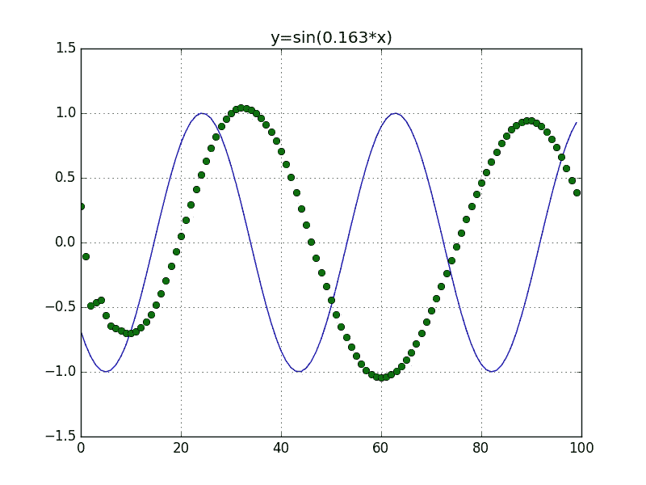

结果比 FC 和 CNN 还惨。同样，这可能是因为我没有做足够的工作。另一方面，我也不指望它表现得更好，因为其他模型有足够的历史数据，而且数据是重复的。

# 结论

我发现这个问题很有趣，因为在生活中我们经常需要使用历史数据来预测时间序列中的未来。如果神经网络模型能够推广重复模式的概念，甚至在频率变化时也能预测模式，那么它们在我们的应用中将更加强大。

在我们的实验中，我们看到模型都学习了正弦函数的一般形状，但未能在训练范围之外的频率下生成未来的数据点。

这里的结论是 NN 模型很难概括正弦的概念，还是简单地说我很烂，没能建立一个能解决这个问题的模型？我的代码在 github 上:

[](https://github.com/looselyconnected/ml-examples) [## 松散连接/ml-示例

### 机器学习的例子。

github.com](https://github.com/looselyconnected/ml-examples) 

请使用它，将您的意见发送给我，并让我知道是否有更好的模型可以解决这个问题。谢谢你。