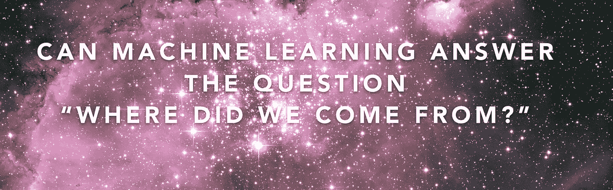
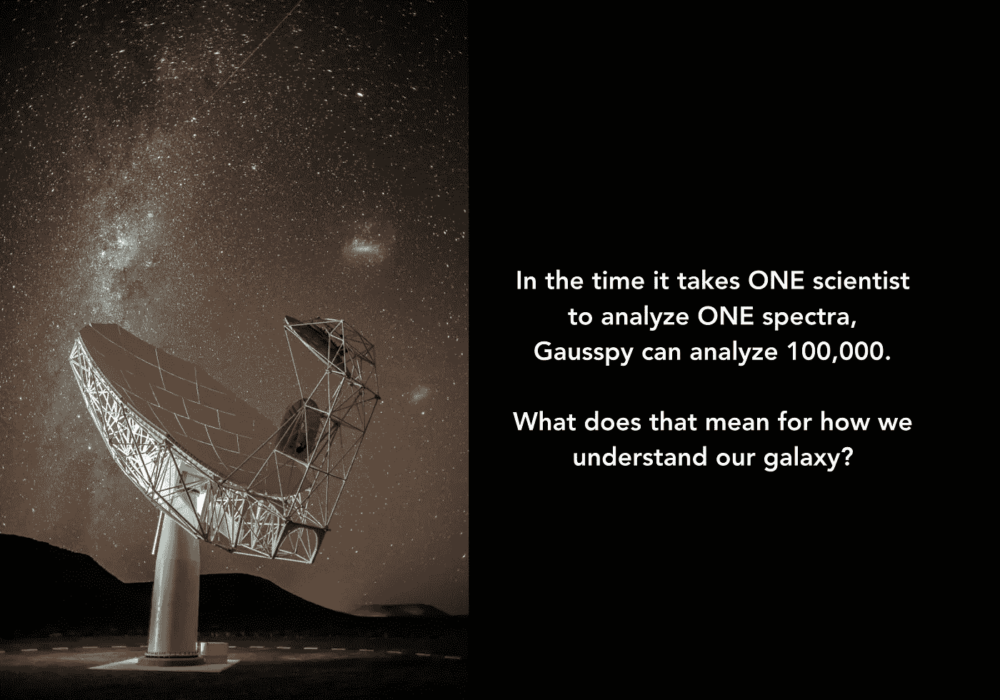

# 机器学习能回答“我们从哪里来”这个问题吗？

> 原文：<https://towardsdatascience.com/can-machine-learning-answer-the-question-where-did-we-come-from-223894bfeea6?source=collection_archive---------6----------------------->

为了了解我们从哪里来，科学家们从探索星系为什么会诞生，如何成长，以及为什么会死亡开始。

我们生活在一个星系中，每个星系的生命周期都是一个故事，总是有这三个阶段。很容易看到每个阶段的星系，但是如果没有更好地了解恒星的形成以及气体是如何变成恒星的，我们将永远不会知道它们为什么会衰老，为什么会死亡。

50 多年来，天文学家一直在人工测量和模拟恒星的形成，但未来的理解取决于分析更大的新一代望远镜的更多数据。在无法利用测量恒星形成所需的大量数据的情况下，理论家们转而依赖于通常令人信服但未经证实的模型。

这一切都将改变。

上周，我向公众发布了一个机器学习代码库，从根本上提高了科学家分析下一代望远镜数据的能力。

我开发了[算法](http://iopscience.iop.org/article/10.1088/0004-6256/149/4/138)，和[对应的代码](https://github.com/gausspy/gausspy)，当时我还是威斯康星大学的博士后研究员。该代码库允许在 2015 年发表的一篇论文中概述的[算法的实际应用。这项工作由威斯康星大学麦迪逊分校天文系教授 Snezana Stanimirovic 获得的国家科学基金会资助。](http://adsabs.harvard.edu/abs/2015AJ....149..138L)

Gausspy 允许科学家们首次使用来自更大望远镜的更多数据来测试理论，以找出恒星形成的原因，它们老化和死亡的原因，并更接近理解我们为什么在这里的最基本问题。

那么，为什么从坐在实验室手动分析光谱的科学家到机器学习用了 50 年？

科学需要有人从需要它的领域之外的角度来解决这个问题。

射电天文学需要它来了解它们的光谱。我的背景是机器学习应用于需要人类解决的棘手问题。我个人选择这个项目不仅仅是为了科学，而是因为我看到了他们面临的一个巨大的问题，并且知道我可以在这个问题上做出很大的努力。这个问题困扰了射电天文学家几十年。

早期的采用令人印象深刻，并证实了这项创新对天文学的未来有多么重要。

虽然代码库上周才刚刚发布，但我在 2015 年完成了 Gausspy，并开始寻找下一个机器学习挑战。就在我离开博士后岗位的时候，我遇到了我的合作伙伴，并成立了 [VEDA Data Solutions](http://www.vedadata.com) 。

我总是最喜欢从一个领域跳到另一个领域，解决长期存在的数据问题，做出颠覆性的发现，然后转向下一个最“不稳定”的领域。所以我的知识面很广。我带来了解决问题的最佳技术和能力，因为我从我看到的每个领域中获取了最佳的数据分析风格，并将其应用于其他没有考虑这些方式的领域。

我在 [VEDA](http://www.vedadata.com) 的风格只是这个链条中的下一步，不仅跨越领域，还跨越部门和垂直领域。我很高兴能与科学界分享 Gausspy，并期待通过我们在 [VEDA](http://www.vedadata.com) 的工作解决更多的问题和分享新的发现。