# 机器学习能预测贫困吗？

> 原文：<https://towardsdatascience.com/can-machine-learning-predict-poverty-5b4847a2f6b4?source=collection_archive---------3----------------------->

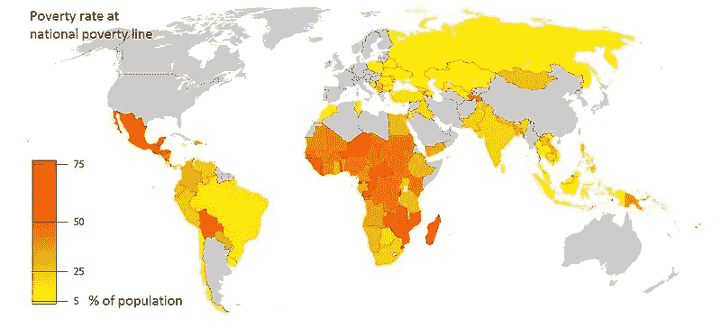

世界银行在竞赛主办网站 drivendata.org 主办了贫困预测竞赛。比赛的链接是[这里](https://www.drivendata.org/competitions/50/worldbank-poverty-prediction/)。我们决定在这个数据集上测试我们的机器学习技能。在 [ParallelDots](https://www.paralleldots.com/) 的大多数常规工作都围绕三个主题:图像和视频的视觉分析、医疗保健人工智能和自然语言处理，这三个主题都是使用深度学习技术解决的。这个比赛是一个尝试新事物的机会，并建立我们的内部代码库来处理表格数据集，就像我们在比赛中一样。

我们希望从竞赛中获得的最终结果是:

1.  尝试多种可能解决问题的机器学习模型。
2.  尝试现有的 AutoML 方法。(AutoML 方法只需要你自己进行特征工程并找出管道的其余部分)
3.  创建一个最佳模型来解决问题，而不需要集合太多的模型来提高分数。由于 AIaaS 是我们的日常工作，优化一个好的模型对我们来说更重要，因为集成很难作为服务部署。
4.  建立一个代码库来解决未来的数据科学和机器学习问题。

# 分析数据集(不费吹灰之力)

在任何机器学习项目中，第一项任务是分析数据集并查看其属性。通过查看数据集，我们可以获得一些正确的信息:

1.  有三个不同国家的数据文件。
2.  所有的字段都是匿名和编码的，所以你不知道这些字段是什么意思。这将特定领域特性工程的可能性降低到零。
3.  这三个国家的数据完全不同，因此需要建立三个模型，每个国家一个。

(快速)深入数据的一个方法是使用新的软件包 Pandas-Profiling(可以从 GitHub [这里](https://github.com/pandas-profiling/pandas-profiling)下载)。这个包做了大量的初步分析，并将它们保存为漂亮的 HTML 文件，人们可以在浏览器上查看。我们对所有三个国家的数据进行了 Pandas-Profiling 分析，以了解数据类型、频率、相关性等。

在下图中可以看到其中一个国家的示例输出:

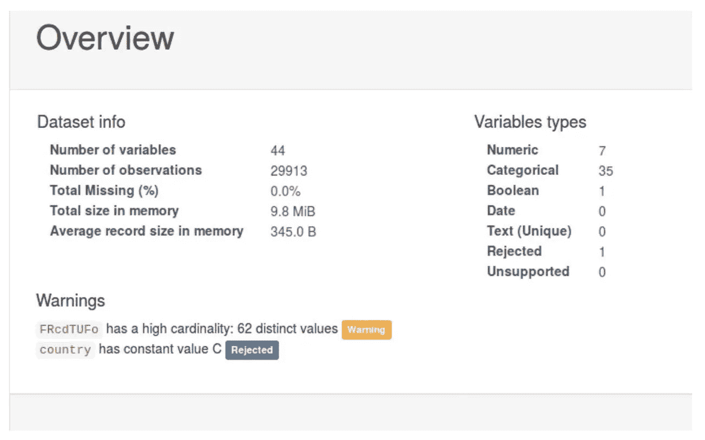

*Pandas Profiling shows overview for the country C data*

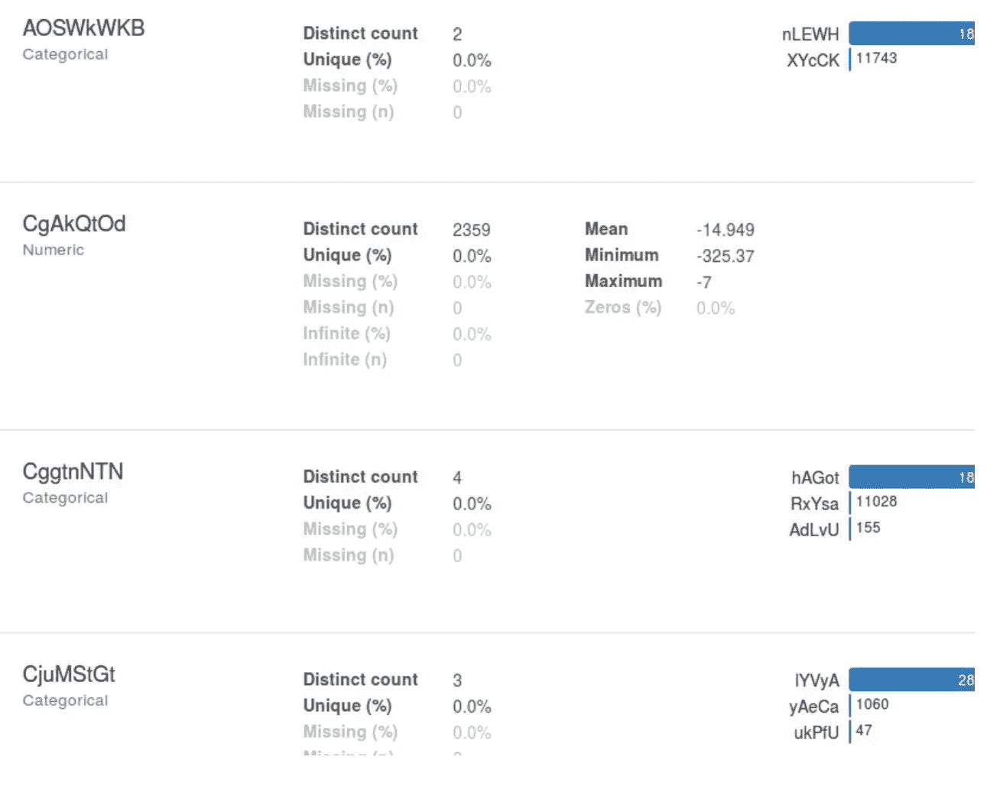

*Feature Level Statistics details created by Pandas Profiling*

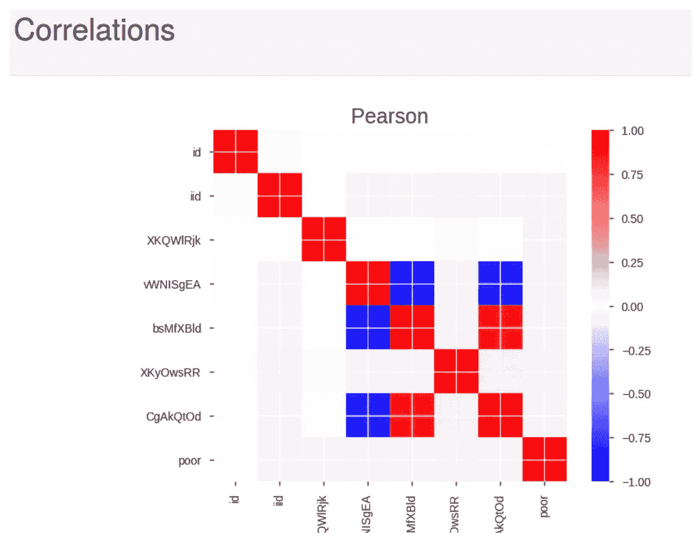

*Correlations amongst different features*

我们可以得出的更多结论是:

1.  大多数分类字段似乎都有一个默认值，这是该字段最常见的值。(例如，在上图中，您可以看到字段 AOSWkWKB 有一个默认值，它需要 80%以上的时间)
2.  数据集是高度不平衡的，我们需要在训练时注意这一事实。

# 建立数据模型的两种方法

如果查看对象的数据类型，可以看到数据是分类值(可以从常量可枚举值中取一的属性)和数值(浮点数和整数)的混合。事实上，这就是世界银行提供的随机森林基准的建模方式，可在此处获得。然而，当你看数字量时，它们并不多，可能代表出生日期等数量。(如果你上过[的 Coursera 课程](https://www.coursera.org/learn/competitive-data-science)，Dmitry 在处理匿名化数据集一节中谈到了类似的领域)。因此，我们想尝试的另一种方法是将所有字段视为分类属性。我们最终都尝试了。

# 数据不平衡

数据集的另一个重要属性是+ve 和-ve 类之间的不平衡(非贫困人口远远超过贫困人口)。对于国家 A，数据仍然是平衡的，但是对于 B 和 C，数据具有非常偏斜的分布。为了在这种扭曲的数据上训练模型，我们使用 Python 中的[不平衡学习库](http://contrib.scikit-learn.org/imbalanced-learn/stable/)尝试了不同的方法:

1.  在倾斜的数据集上进行训练(效果不错，不太好)
2.  在负类欠采样的数据集上训练(表现非常差，即使最好的机器学习模型也可以与该数据集的基线一样好地工作)
3.  对+ve 类进行过采样(工作得相当好)
4.  使用 SMOTE 算法的过采样(不如正常的过采样有效，主要是因为 SMOTE 算法不是真正为分类属性定义的)
5.  使用 ADASYN 进行过采样(不如正常过采样有效)

# 预处理

数据集预处理如下:

1.  所有分类特征都被转换成二元特征。
2.  数值被归一化。测试了最大-最小和平均-标准差归一化。
3.  家庭一级和个人一级的数据被合并(个人一级的数据为所有家庭的每个成员提供单独的数据)。对于个人和家庭数据中常见的属性，只保留了家庭一级的数据。家庭中的所有数字特征都取平均值(这可能不是最好的方法)，并且所有分类值都聚合为家庭中最奇怪的值(例如，如果特征 X 在家庭中的值为 1，1，1，0，我们会将家庭的组合值取为 0)。原因是许多分类变量都有默认值，而我们期望奇数值有更多的信息。

# 我们尝试过的方法

我们现在讨论我们尝试过的多种方法。

*   **首先，我们来谈谈那些不起作用的事情:**

1.  我们认为分类字段的默认属性可能对建模没有用处。为了检查这一点，我们训练了具有和不具有默认属性的机器学习模型。没有输入缺省属性的模型比输入缺省值的模型表现更差。
2.  SMOTE 和 ADASYN 过采样并没有给出比正常过采样更好的结果。
3.  两个阶段的机器学习，第一个阶段创建决策树以获得特征的重要性，另一个阶段训练最重要的特征。我们尝试这种技术没有任何收获。
4.  尝试不同的方法来标准化数值数据并没有改变准确性。然而，非规范化数值属性的准确性较差。

*   **帮助我们提高分数的窍门:**

1.  数字和分类特征组合比所有分类属性更适合于训练算法。至少对决策树来说是这样。
2.  为缺失数据选择默认值有助于我们提高准确性。我们开始时将所有缺失的值设为 0，但后来使用了更好的-999。
3.  跨机器学习超参数的网格搜索让我们不费吹灰之力就在验证集上获得了 2–4%的提升。
4.  一个强大的 AutoML 基线可以帮助我们很好地开始。

*   **我们想尝试但不能/没有/懒得编码的招数:**

1.  通过获取非默认分类值的笛卡尔乘积，然后选择重要特征来训练模型的特征工程。
2.  通过以不同方式组合数字特征并对生成的特征进行特征选择的特征工程。
3.  尝试多个模型的集合。我们之前设定的目标是得到一个好的模型，但最终还是训练了很多方法。我们可以把它们组合成一个整体，就像堆叠一样。

## 机器学习算法

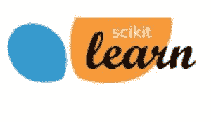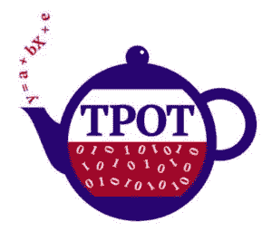

我们使用的库:SKLearn、XGBOOST 和 TPOT

我们现在将讨论我们尝试过的机器学习方法。按时间顺序谈论事情，如我们尝试方法的顺序。请注意，自从我们第一次尝试以来，所有对我们有用的技巧都不存在了，我们一个一个地把它们包括进来。请看每一次试验的要点，了解当时的管道是什么。除非另有说明，所有使用的机器学习模型均来自 [Scikit 学习库](http://scikit-learn.org/)。

*   **带有默认参数的常见疑点**

1.  我们开始用默认参数尝试常见的可疑情况。逻辑回归、SVM 和随机森林。我们还尝试了一个名为 CATBOOST 的新库，但是我们找不到很多关于它的超参数的文档，也不能很好地适应数据，所以决定用更著名的 XGBOOST 替换它。我们还了解 XGBOOST 超参数调优(我们知道我们必须在后面的阶段进行)。
2.  第一次尝试将所有列建模为分类数据和不平衡数据集。
3.  所有的模型都符合要求，并且在验证数据上给了我们比扔硬币更好的准确性。这告诉我们，数据提取管道是好的(没有明显的错误，但需要更多的微调)。
4.  像竞争提供商提供的基线一样，随机森林和带有默认超参数的 XGBOOST 显示了良好的结果。
5.  LR 和 SVM 可以很好地模拟数据(不如 RF 和 XGBOOST，因为默认超参数的方差较小)。SVM (SKLearn SVC)也有很好的准确性，但它返回的概率在 SKLearn 中并不真正可用(我发现这是默认[超参数](https://github.com/scikit-learn/scikit-learn/issues/4800)的常见问题)，这使我们放弃了 SVM，因为竞争是根据平均对数损失进行判断的，这需要额外的努力来确保概率数字是正确的。只是 SVC 收益的概率不完全是概率，而是某种分数。

*   **TPOT: AutoML 做了一个很好的基线**

1.  仍然继续所有的特征都被认为是分类的，我们试图用一种叫做 [TPOT](https://automl.info/tpot/) 的自动方法来拟合基线。
2.  TPOT 使用遗传算法为手头的问题找出一个好的机器学习管道，以及与之一起使用的超参数。
3.  这使我们在提交时在竞赛公共排行榜上名列前 100。
4.  TPOT 需要时间来找出管道，并在几个小时内对整个数据集进行收敛。

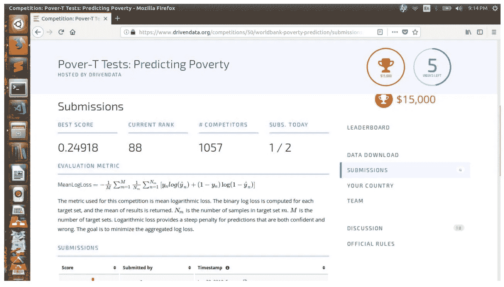

*   **神经网络可以用吗？有人知道神经网络吗？**

我们对深度学习的热爱让我们跃跃欲试，试图用神经网络来解决这个问题。我们开始训练一个好的神经网络算法来解决这个问题。请注意，此时我们正在做实验，将所有列都视为分类。有很多分类变量，需要预测一个标签的问题是什么？文本分类。这是神经网络大放异彩的一个地方。然而，与文本不同，这个数据集没有序列的概念，所以我们决定使用文本分类中常见的神经网络，但不考虑顺序。那个算法就是 [FastText](http://fasttext.cc/) 。我们编写了一个(深度)版本的快速文本，就像 keras 中的算法一样，在数据集上进行训练。我们训练神经网络的另一件事是过采样少数类，因为它不能很好地训练不平衡的数据。

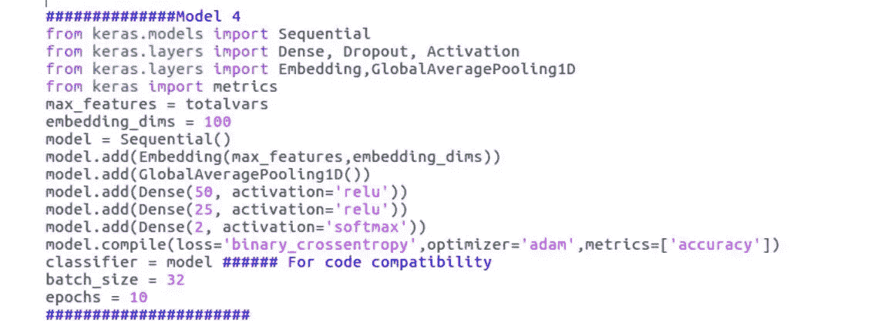

*FFNN Used*

我们尝试使用最近提出的自归一化神经网络进行训练。这给了我们在验证集上的自由碰撞的准确性。

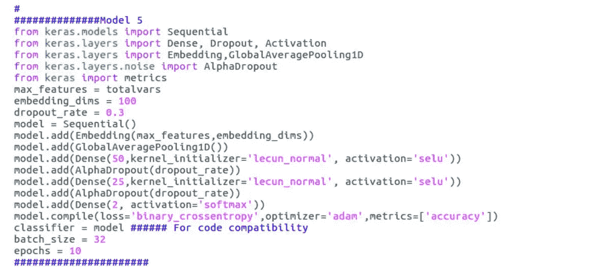

*Self Normalized FFNN (SELU) we used*

虽然当我们使用深度神经网络，特别是神经网络时，我们在验证集上获得了准确性。在 B 国，我们获得了最高的准确率(甚至比我们表现最好的模型还要好),这是因为我们使用了自标准化深度神经网络，结果并没有转化到排行榜上，我们一直得到低分(高对数损失)。

*   **改进 AutoML 基线并调整 XGBOOST**

我们创建的 AutoML 基线仍然盯着我们的脸，因为我们所有的手工方法仍然更差。因此，我们决定改用经过测试的 XGBOOST 模型来提高分数。我们编写了一个数据管道，用于尝试我们在该部分开始时提到的不同技巧(成功/不成功)，以及一个管道，用于在不同的超参数上进行网格搜索，并尝试 5 重交叉验证。

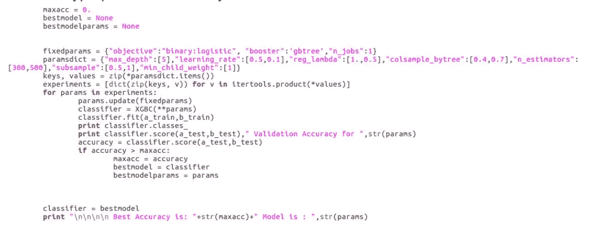

*Grid Search Example for the single validation set*

上面的技巧与网格搜索相结合，极大地提高了我们的分数，我们可以击败 0.2 logloss，然后也可以击败 0.9 logloss。我们尝试了另一个 TPOT AutoML，使用我们成功的技巧生成的数据集，但它只能占用排行榜上接近 0.2 logloss 的管道。所以最终 XGBOOST 模型被证明是最好的。当我们尝试对随机森林算法的参数进行网格搜索时，我们无法获得相同数量级的精度。

与公开比赛排行榜相比，我们在私人排行榜上的得分/排名略有下降。我们在 90%左右结束了比赛。

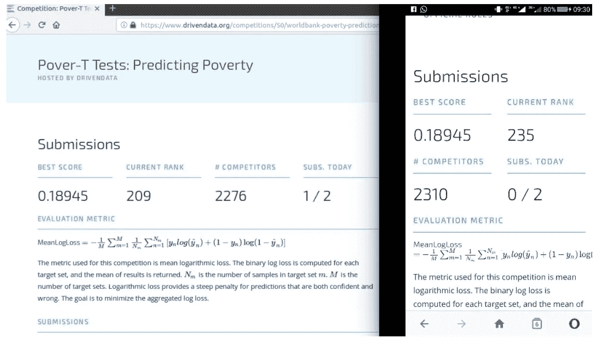

我们希望你喜欢这篇文章。请[注册](http://user.apis.paralleldots.com/signing-up?utm_source=blog&utm_medium=chat&utm_campaign=paralleldots_blog)一个免费的[平行账号](https://www.paralleldots.com)开始你的 AI 之旅。你也可以在这里查看 PrallelDots AI API[的演示。](https://www.paralleldots.com/ai-apis)

点击阅读原文[。](https://blog.paralleldots.com/product/competitive-analysis/can-machine-learning-predict-poverty/)