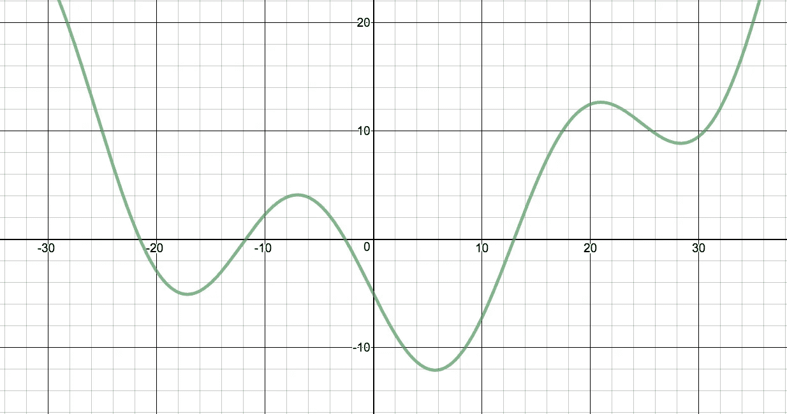
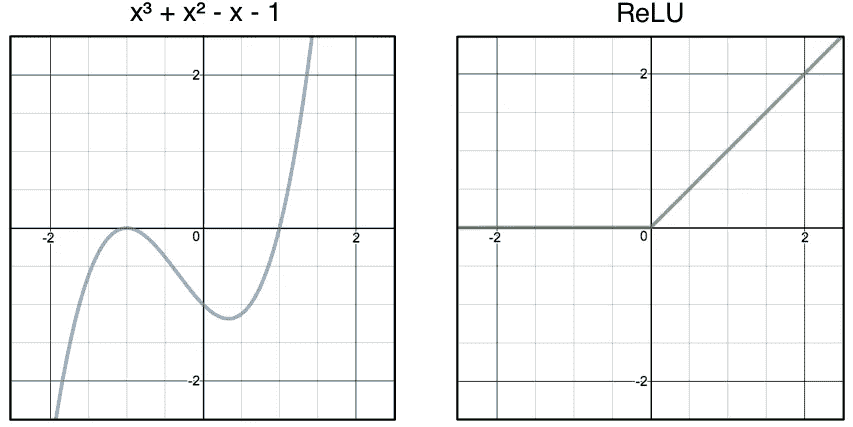
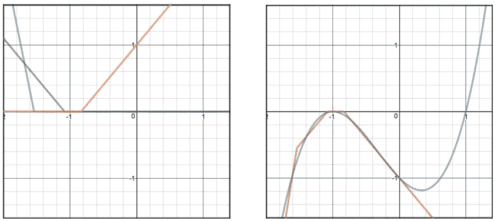
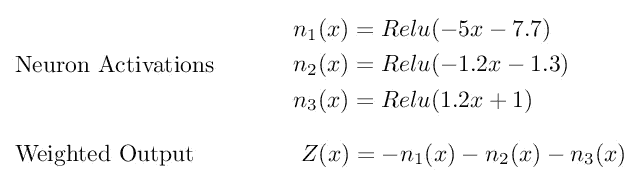
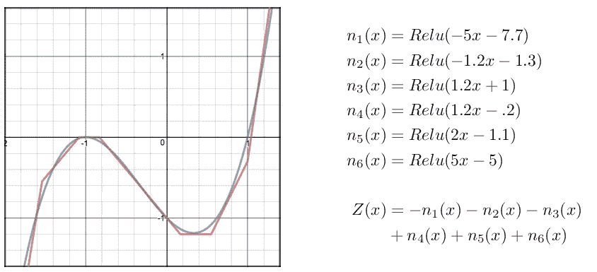
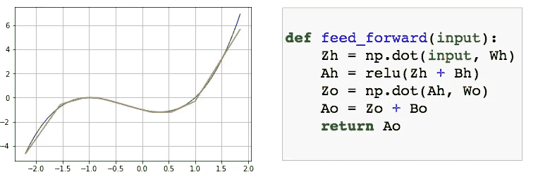
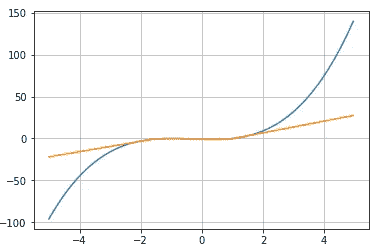
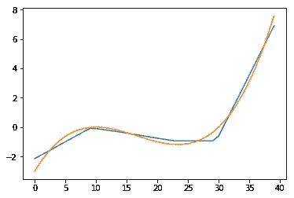

# 神经网络能解决任何问题吗？

> 原文：<https://towardsdatascience.com/can-neural-networks-really-learn-any-function-65e106617fc6?source=collection_archive---------0----------------------->

## 可视化通用逼近定理



Let’s see you try modeling that, neural network!

在你深度学习之旅的某个时候，你可能会遇到[通用近似定理](https://en.wikipedia.org/wiki/Universal_approximation_theorem)。

> 具有单一层的前馈网络足以表示任何函数，但是该层可能大得不可行，并且可能无法正确地学习和概括。
> 
> ——伊恩·古德菲勒， [DLB](http://www.deeplearningbook.org/contents/mlp.html)

这是一个令人难以置信的说法。如果你认为大多数问题都可以归结为函数，那么这种说法意味着神经网络在理论上可以解决任何问题。如果人类智能可以用函数来建模(也许是非常复杂的函数)，那么我们今天就有了复制人类智能的工具。神经网络可能是人工智能版的巴贝奇分析引擎(1822)，而终结者需要一台 Macbook Pro，但仍然如此。也许 UAT 解释了为什么深度学习如此成功地解决了人工智能中的“难题”——图像识别、机器翻译、语音转文本等。

**TLDR；**我用视觉和经验向自己证明，使用单个隐藏层和 6 个神经元，UAT 适用于非平凡函数( *x +x -x -1)* 。我假装自己是一个神经网络，试图自己“学习”正确的权重。我还在代码中验证了这一点。

## 神经网络怎么可能模拟任何功能？

这个问题难倒了我很久，我在网上找不到很好的解释。大多数句子与等式的比率高于 0.57 的解释应该是这样的:

> 通过激活函数引入非线性允许我们逼近任何函数。很简单，真的。—埃隆·马斯克

所以非线性激活函数是秘方？我们真的可以通过将一系列 Sigmoid 激活链接在一起来模拟任何功能吗？ [ReLU](https://en.wikipedia.org/wiki/Rectifier_(neural_networks)) 功能怎么样？肯定不是——里面有单词 *linear* ！校正线性单位！

我最终发现了迈克尔·尼尔森的[教程](http://neuralnetworksanddeeplearning.com/chap4.html)，它是如此之好，以至于几乎使这篇文章过时(我强烈建议你阅读它！)，但现在让我们回到过去，假装迈克尔那天带着他的家人去了迪斯尼乐园，而不是写有史以来世界上最伟大的神经网络教程。谢谢你，迈克尔；)

## 手动执行梯度下降

我很早就意识到我不会赢得这场钻研数学[证明](https://www.google.com/url?sa=t&rct=j&q=&esrc=s&source=web&cd=5&cad=rja&uact=8&ved=0ahUKEwiZgu7fsqfSAhUK2mMKHTqEARoQFggyMAQ&url=https%3A%2F%2Fpdfs.semanticscholar.org%2F05ce%2Fb32839c26c8d2cb38d5529cf7720a68c3fab.pdf&usg=AFQjCNFmNUFS5QB5nPkijKhEpVPJS6hCFg&sig2=6NRz_NrV6p6rv_i63CQV-w)的战斗，所以我决定采取一种实验性的方法。我去了[德斯莫斯](https://www.desmos.com/calculator/cfvtjusqmq)，开始将 ReLU 激活函数链接在一起，看看我是否能构建一些看起来有趣的东西。每次尝试后，我都调整我的函数，使它们看起来更像目标——听起来熟悉吗？



**Left:** target function **Right:** raw materials

我选择 *x +x -x -1* 作为我的目标函数。仅使用 ReLU `max(0,x)` *，*我反复尝试不同的 ReLU 组合，直到我有一个大致类似目标的输出。这是我用 3 个 ReLUs 的加权和得出的结果。



**Left**: 3 ReLU functions ***Right****: Weighted sum of the 3 ReLU functions*

还不错？左图显示了 ReLU 函数。右图显示了我的模型与目标相比的输出。你可以把每个 ReLU 函数想象成一个神经元。因此，组合 3 个 ReLU 函数就像训练一个由 3 个隐藏神经元组成的网络。这是我用来生成这些图表的方程式。



每个神经元的输出等于 ReLU 环绕加权输入 ***wx + b*** *。*

我发现我可以通过改变偏差来左右移动 ReLU 函数，并通过改变权重来调整斜率。我将这 3 个函数组合成加权输入的最终和( **Z** )，这是大多数神经网络的标准做法。

**Z** 中的负号代表最后一层的权重，我将其设置为-1，以便沿 x 轴“翻转”图形，以匹配我们的凹形目标。在又玩了一会儿之后，我终于得出了下面的 7 个等式，这 7 个等式加在一起大约是 x +x -x -1。



所以至少在视觉上，用一个隐藏层和一些神经元来模拟非平凡函数是可能的。相当酷。

## 将我的体重硬编码到一个真实的网络中

这是一个用我的假权重和偏见初始化的神经网络图。如果你给这个网络一个类似于 *x +x -x-1* 的数据集，它*应该*能够近似得到-2 和 2 之间的输入的正确输出。


最后一个语句，*是-2 和 2 之间任何输入的近似正确输出，*是关键。通用逼近定理指出，对于在 ***特定范围*** 内的输入，具有 1 个隐层的神经网络可以逼近任何 ***连续*** 函数。如果函数跳跃或者有很大的间隙，我们就无法逼近它。此外，如果我们在 10 和 20 之间的输入上训练一个网络，我们不能肯定地说它是否将在 40 和 50 之间的输入上工作。

## 我的重量真的有用吗？

我想以编程的方式证明，当插入一个有一个隐藏层和 6 个神经元的基本神经网络时，我得出的权重实际上是有效的。然而，我没有训练网络来学习权重，而是用自己挑选的值替换了它的默认权重和偏差。下面的方法`feed_forward()` 采用输入向量(例如[-2，-1，0，1..])并使用我的权重输出预测向量。事情是这样的:



Zh,Zo: weighted inputs . Wh,Wo: weights. Bh,Bo: biases. Ah,Ao: activations

看那个！我是个天才。这正是我们想要的。但是如果我们的老板要求我们将范围从-2 扩大到 2 呢？如果她想要-5 比 5 呢？



x = np.arange(-5, 5, .1)

啊，不太好。但这实际上支持了我们早先的结论:一个具有一个隐藏层的神经网络可以逼近任何连续函数，但仅适用于特定范围*内的输入。如果像我们一样，在-2 和 2 之间的输入上训练一个网络，那么它将对类似范围的输入工作良好，但你不能指望它在不重新训练模型或添加更多隐藏神经元的情况下推广到其他输入。*

## *我的体重可以学吗？*

*现在我们知道 Brendan Fortuner 可以自己学习这些权重，但是具有 1 个隐藏层和 6 个神经元的真实世界神经网络是否也可以学习这些参数或导致相同结果的其他参数？让我们用 [scikit-neuralnetwork](http://scikit-neuralnetwork.readthedocs.io/en/latest/module_mlp.html#regressor) 来测试这个理论。我们将设计一个网络，使其适用于回归问题，并将其配置为使用 ReLU、随机梯度下降和均方误差——通常的组合。*

*成功了！*

**

*以下是 Scikit 学到的重量。它们显然与我自己的不同，但数量级是相同的。*

```
*hiddenLayerWeights = [
 [-1.5272, -1.0567, -0.2828, 1.0399, 0.1243, 2.2446]
]
finalLayerWeights = [
  [-2.2466],
  [ 1.0707],
  [-1.0643],
  [ 1.8229],
  [-0.4581],
  [ 2.9386]
]*
```

*也许如果我把这篇博文重写 10 万遍，我会自己得出这些参数，但是现在我们只能推测。也许有一天，我会对我的赞成票求导，并朝着观点最大化的方向更新我的句子。*

*如果你喜欢阅读，请点击下面的*【♥】****按钮！****