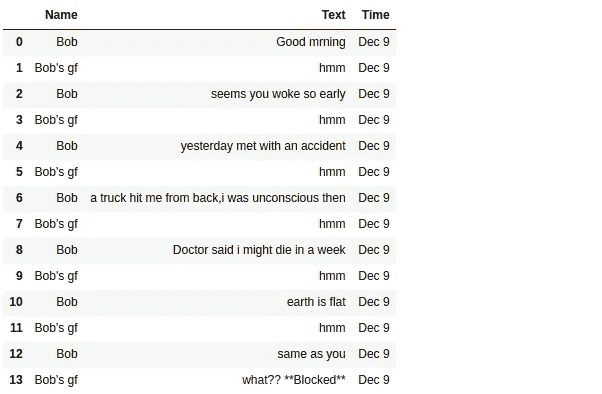

# python 可以用于脸书聊天备份吗？当然可以！

> 原文：<https://towardsdatascience.com/can-python-be-used-for-facebook-chat-backup-of-course-it-can-877226b57ac8?source=collection_archive---------14----------------------->

## Web 抓取和 Scrapy 框架的简单演练


Photo by [Glen Carrie](https://unsplash.com/@glencarrie?utm_source=medium&utm_medium=referral) on [Unsplash](https://unsplash.com?utm_source=medium&utm_medium=referral)

你好世界！！我们中的大多数人都会有这样的情况，我们必须滚动浏览我们在脸书的对话，以回忆事情，重温时刻或开怀大笑我们的旧对话，你经常这样做，希望有一个备份，这是给你的。在文章的最后，你可以用 csv 或 json 格式的结构化方式备份你的对话。


# 放弃

这篇文章不是为像 ***【鲍勃】*** 这样的人写的。抱歉 ***鲍勃*** ，如果这以任何方式冒犯了你！！

# 为什么？？怎么会？？

在继续之前，我想回答几个你在阅读这篇文章时可能会想到的问题。

1.  为什么要这么做！因为我们可以。😎
2.  为什么我们不点击*加载更多*/向上滚动几个小时到达我们希望阅读的对话！，每次都要滚动对话，超级无聊。
3.  为什么我们不能使用脸书的默认数据备份功能！，我们不能得到全部的内容，有一个上限。
4.  为什么是 python！，它是一种广泛用于网络抓取的语言，拥有许多有用的库，如 scrapy，request。***#还是我熟悉的那个！！*:-)**
5.  为什么刺儿头！，这是一个相当全面和易于使用的数据抓取库，当遇到困难时，它有一个活跃的社区帮助！

# 安装/设置

Python 安装:Windows 安装文件 zip 可以在[这里找到](https://www.python.org/downloads/windows/)，Ubuntu 运行命令

> sudo apt-get 安装 python3

零碎安装:在 Windows 和 Ubuntu 上，运行下面的命令

> pip 安装废料

# 事情是怎么做的！

如果你还没有进入如何刮是如何完成的，你可以跳到" ***如何使用"*** 部分。

在深入到编码部分之前，在技术方面存在挑战，比如访问脸书数据、处理 javascript 和 ajax 调用。通过请求库重新创建相同的 ajax 调用是一件非常令人头疼的事情，但却失败得很惨。

然后，我试着用工具**【硒】**刮数据。如果您对此不熟悉，Selenium 可以用于自动化您在浏览器上的活动，允许您像人类一样控制和使用您的浏览器(如单击搜索框、输入关键字和单击搜索按钮)。

我的 Selenium 所做的是:进入 Facebook.com->登录->进入聊天列表并选择一个对话->向上滚动时开始抓取。脸书拒绝在几页之内从他们的服务器访问更多的数据！！是的，他们擅长检测机器人。

花了几个小时在谷歌上搜索后，找到了尝试“移动优化网站”的建议，它实际上是一个不使用任何 AJAX 的老派网站[mobile.facebook.com](http://mobile.facebook.com)。终于！！能够使用 **scrapy** 不间断地获取数据。

## 入门指南

在你开始刮之前，你必须建立一个新的刮项目。输入您想要存储代码并运行的目录

> scrapy startproject facebook

这将创建一个包含以下内容的`facebook`目录:

```
facebook/
    scrapy.cfg            *# deploy configuration file* facebook/             *# project's Python module, you'll import your code from here*
        __init__.py items.py          *# project items definition file* middlewares.py    *# project middlewares file* pipelines.py      *# project pipelines file* settings.py       *# project settings file* spiders/          *# a directory where you'll later put your spiders*
            __init__.py
```

如果你没有得到，不要担心发生了什么，我们不会担心他们中的大多数人，我们唯一的改变是写一个 ***蜘蛛*** 抓取内容，并改变*ROBOTSTXT _ observe = False**在* settings.py 文件中脸书不允许僵尸程序登录。你可以在这里了解更多关于 robots.txt [。](http://www.robotstxt.org/robotstxt.html)

## 让我们建造我们的蜘蛛

在 spiders 目录下创建一个 python 文件，然后导入 scrapy、pandas 和 FormRequest，我们将使用它们来提供登录凭证。

这里 *fb_text* 是我们的蜘蛛的名字，我们可以在我们的蜘蛛目录下写任意数量的蜘蛛，它们可能服务于不同的目的，在我们的例子中，我们可以写一个用于抓取帖子和评论等。每个蜘蛛都应该有自己独特的名字。

然后我们通过终端获取登录凭证，在那里我们将运行我们的蜘蛛

> scrapy crawl fb_text -a email="FB 用户电子邮件"-a password="FB 用户密码"

在我们将凭证提供给 FormRequest 之后，它将在*start _ URLs****' https://mbasic . Facebook . com '****中填写表单( *user_email and password)* ，并返回主页。*

## 让我们给我们的蜘蛛增加一些超能力吧

完成了结构的定义，是时候给我们的蜘蛛一些超能力了。一个是它应该能够通过网页抓取内容，另一个是抓取内容/数据。

请求函数将向回调函数发送响应，在我们的例子中，我们到达消息页面，然后获取我们对话的人及其链接。从那份名单中，我们会刮出一个。

以上是蜘蛛的核心部分，它获取实体之间的对话，并把它写在一个 csv 文件中。完整的蜘蛛文件可以在[这里](https://github.com/vj-09/FaceBook-Scrape/blob/master/facebook/facebook/spiders/fb_txt.py)找到。

*为了简单和容易理解，items.py 不用于存储数据。*

# 如何使用

如果您跳过了前一部分，请确保克隆这个存储库[。浏览项目的顶级目录，并使用以下内容启动 scrapy:](https://github.com/vj-09/FaceBook-Scrape)

```
scrapy crawl fb -a email="EMAILTOLOGIN" -a password="PASSWORDTOLOGIN"
```

这将给出最近的 10 个对话，从中选择要废弃的对话，机器人/蜘蛛将抓取对话，直到该对话中的最后一个文本，并返回一个 csv 文件，其中包含列->名称，文本，日期。看看下面的例子。



*路到此为止。*

Github [回购](https://github.com/vj-09/FaceBook-Scrape)

## 在准备中

数据是解决任何 ml/ai 问题的来源，而不是每次我们拥有一个结构良好的数据。这就是网络抓取派上用场的地方，用它我们可以从网站上抓取/获取数据。关于基础网页抓取的教程将会在未来发布，请务必关注和支持。

我们到此结束，希望我已经对 word2vec 嵌入做了一些介绍。在这里检查其他作品[。](https://medium.com/@athithyavijay)


哈哈，如果你这么认为，我们就在同一页上。下面我们来连线[中](https://medium.com/@athithyavijay)、 [Linkedin](https://www.linkedin.com/in/vijay-athithya-79830ba1/) 、[脸书](https://www.facebook.com/vakky.vj)。