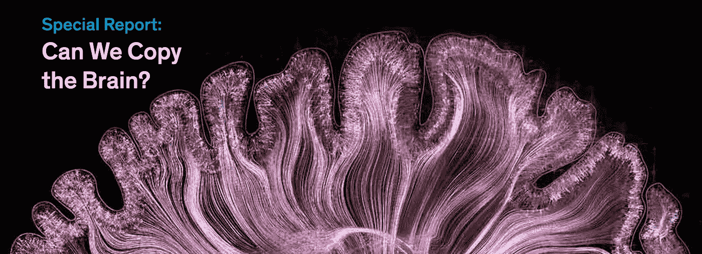
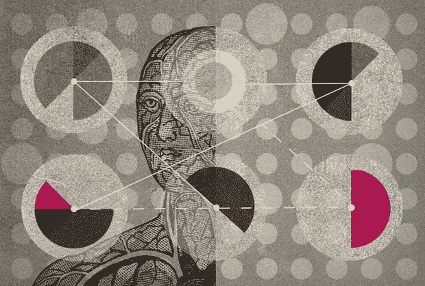
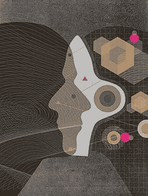
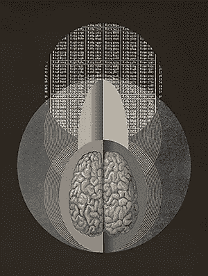
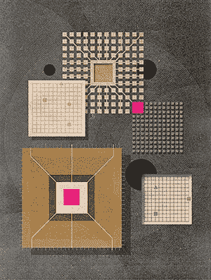
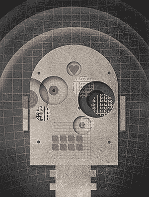

# 我们能复制大脑吗？

> 原文：<https://towardsdatascience.com/can-we-copy-the-brain-9ddbff5e0dde?source=collection_archive---------3----------------------->

*IEEE Spectrum 特别报告综述:我们能复制大脑吗？*

本月的 [IEEE Spectrum 有一个关于合成大脑的故事](http://spectrum.ieee.org/static/special-report-can-we-copy-the-brain)。在这篇文章中，我将回顾这个故事，并对探索的现状进行评论:在合成系统中复制人脑。这篇文章是关于神经科学，神经形态学，人工神经网络，深度学习，生物和合成中的计算硬件，以及所有这些如何在创造人类水平或高于人类水平的合成大脑的人类大挑战中走到一起。

[**为什么我们要复制大脑**](http://spectrum.ieee.org/computing/hardware/can-we-copy-the-brain) **:** 我们之所以要这样做，是因为我们想创造出能替我们工作的智能机器。为了做我们的工作，机器将不得不生活在我们的环境中，拥有与我们相似的感官，并能够完成同样的任务。它还不止于此:在大多数任务中，机器能比我们做得更多更好，就像我们比其他生命形式做得更好一样。我们希望他们做我们做不到的事情，把我们能做的事情做得更好。这叫做进步，我们需要这样做来绕过生物进化，加快生物进化的速度。这篇文章很好地总结了这将是什么，以及机器将为我们做什么。更多评论见下文 PS1 部分。关于工作，请参见 PS3。

[**未来，机器会借用我们大脑的最佳招数**](http://spectrum.ieee.org/computing/software/in-the-future-machines-will-borrow-our-brains-best-tricks) **:** 人脑是我们所知的最高效的计算机器之一。从这个意义上说，它是已知宇宙(人类已知的)中最好的“大脑”。什么是大脑？它是一台允许我们在自己的环境中生活的电脑。人生是什么？哦，好吧，也许现在，让我们只说我们的生活致力于繁衍后代，确保我们的后代最好的，促进下一代和他们的成功，保护所有这一切发生的最佳环境(或者我们现在？).

今天，我们人类受自己大脑的启发，正试图建造人造大脑。而慢慢的，[近几年](https://tryolabs.com/blog/2016/12/06/major-advancements-deep-learning-2016/)(网上更多文章和评论！)，人工神经网络和深度学习已经慢慢侵蚀了计算机和人类能力之间的很多差距。只是 ***不可避免*** 它们会变得越来越像一个人，因为我们实际上是带着那个目标在建造它们！我们希望他们*为我们*做事，比如驾驶我们的汽车，提供客户服务，做一个完美的数字助理，阅读你的思想[、预测你的需求](https://medium.com/towards-data-science/a-new-kind-of-deep-neural-networks-749bcde19108)。也渗透到世界上的每一个仪器和传感器中，所以它们可以更好地帮助我们在正确的时间获得正确的信息，有时甚至不需要我们去要求。

但是建造一个合成大脑并不意味着我们需要复制我们自己的大脑。事实上，这根本不是我们的目标，我们的目标是做一个更好的！我们的大脑是由细胞和生物组织构成的，我们的合成大脑是由硅和电线构成的。这些媒体的物理性质并不相同，因此我们只能从大脑算法中获得灵感，一步一步地构建更好更大的合成硬件。我们已经在梦想能够自己创建计算架构的神经网络。与神经网络训练其权重的方式相同，它也可以训练消除所有这一切中的最后一次人工输入:[学习创建神经网络模型定义](https://arxiv.org/abs/1606.04474)！

即使我们想限制自己创造一个我们大脑的克隆体，它仍然会迅速进化超出我们的能力，因为建造它的目标之一是不断学习新知识和改善行为。因此，不可避免的是，我们最终会拥有一个比我们更好的大脑，好得我们甚至无法想象。也许就像我们的大脑被比作昆虫的大脑一样——甚至更多。一个生物可以变得多么聪明和有知识是没有限制的。

[**作为计算机的大脑:数学不好，其他都好**](http://spectrum.ieee.org/computing/hardware/the-brain-as-computer-bad-at-math-good-at-everything-else) :我们人类研究神经网络已经很久了。我们也已经研究我们的大脑很长时间了。但是我们仍然不知道如何通过观察一个场景来预测将要发生的事情，这是我们生活中每时每刻都在做的事情。我们仍然不知道我们如何*学习新概念*，我们如何将它们添加到我们已经知道的东西中，我们如何利用过去预测未来，以及我们如何识别复杂的时空数据，例如识别现实世界中的行为。[见本摘要](https://medium.com/towards-data-science/a-new-kind-of-deep-neural-networks-749bcde19108)。我们也不知道如何最好地与真实或模拟的世界互动，或者我们如何学习与世界互动。

我们可能不知道这一切。但是我们正在取得进展。我们从[学习识别物体](https://medium.com/towards-data-science/neural-network-architectures-156e5bad51ba)(和脸，和[道路场景](https://codeac29.github.io/projects/linknet/index.html))开始。然后我们学习了[分类和创建序列](https://arxiv.org/abs/1308.0850)(包括演讲、文本理解、语言翻译、图像到文本的翻译、图像到图像的翻译等等)。我们还在尝试[学习如何在没有大量标记数据的情况下进行学习](https://medium.com/intuitionmachine/navigating-the-unsupervised-learning-landscape-951bd5842df9)(无监督学习)。我们开始玩电子游戏，先是简单的，然后是难的，现在是非常复杂的。人工智能算法将[了解我们世界的力学和物理学](https://arxiv.org/abs/1603.01312)只是时间问题。

我们真的很擅长这个，在所有这些任务中比人类做得更好——或者一些！我们不打算停止，直到我们有机器人可以为我们做普通的任务:烹饪，清洁，洗碗，叠衣服，与我们说话(Alexa，Siri，Cortana 等)，理解我们的感觉和情绪，以及更多与人类智力和能力相关的任务！但是我们如何到达那里呢？我们非常擅长让神经网络对事物进行分类，现在[我们需要它们进行预测。](https://aboveintelligent.com/artificial-intelligence-past-present-future-cb954fc7da3b)学习长序列事件，对长序列事件进行分类。由于有无限多的可能事件，我们无法用例子训练一个人工智能，我们没有所有的例子，所以*我们需要它自己学习*。关于我们的大脑如何学习做到这一点的最佳理论是通过不断预测未来，因此它知道忽略所有不重要的和以前见过的事件，但同时知道一些事件是否是新的。无监督和自我监督学习将是重要的组成部分。[更多在此。](https://medium.com/towards-data-science/a-new-kind-of-deep-neural-networks-749bcde19108)

还要注意的是，这种深度学习的进步大部分不是来自神经科学或心理学，就像制造好电池不是来自炼金术一样。

本文还提到了计算硬件，指出传统计算机可能不如某些神经形态计算机方法好。我们在这里评论这个话题。肯定会有更高效的硬件出现，这些硬件可能能够运行最新和最伟大的深度学习算法，例如[我们在这里的工作。](https://medium.com/@culurciello/snowflake-ae51c238ead6)而且可能有神经形态的成分，比如尖峰网络，稀疏数据的异步通信，但不是这一天。如今，神经形态硬件尚未运行任何类似于深度学习算法的巨大成功，例如手机上的[谷歌](https://cloud.google.com/speech/) / [百度](https://arxiv.org/abs/1512.02595)、手机上的[谷歌文本翻译](https://www.google.com/intl/en/about/behind-the-scenes/la-bamba-translate/)，或者云端图像的[标记](https://cloud.google.com/vision/)。这些是我们今天取得的切实成果，他们使用深度学习，他们在标记数据集上使用反向传播，他们使用传统的数字硬件，[很快将成为专用硬件](https://medium.com/@culurciello/snowflake-ae51c238ead6)。

[**智能机器需要向新大脑皮层学习什么**](http://spectrum.ieee.org/computing/software/what-intelligent-machines-need-to-learn-from-the-neocortex) **:** 这是一个*咄*的时刻。杰夫·霍金斯写了一本[非常激动人心的书](http://www.onintelligence.org/)，就在十年前左右。它极大地鼓舞了我所有的学生、我们的电子实验室和我自己，去研究合成大脑，并从我们所知道的和可以测量的人脑中获取灵感。

但从那以后，人工神经网络和深度学习抢了他的风头。当然，我们需要学会重新布线。当然，我们正在学习一种*稀疏表示。*所有深度神经网络都是这样做的——参见 PS2。当然，我们需要学习在环境中表演(*化身*)，我们已经通过[学习玩视频游戏](https://www.theverge.com/2017/4/3/15164490/alibaba-ai-starcraft-combat)和[驾驶汽车](https://codeac29.github.io/projects/linknet/index.html)做到了这一点。

但是当然，它没有说如何处理现实世界的任务，因为 Numenta 仍然停留在它独特的商业模式中，在这种模式中，它既不能帮助自己，也不能帮助社区。最好是倾听社区的声音，分享它的成功，资助聪明人和创业公司。也许杰夫确实认为他一个人就能解决这一切，而且比任何人都强。我们都是这种自我中心行为的受害者…

我必须补充一点，我同意杰夫对以分类为中心的深度学习算法无法处理更复杂任务的沮丧。[我们已经在这里写了这个](https://medium.com/towards-data-science/a-new-kind-of-deep-neural-networks-749bcde19108)。但是正如你在这个链接中看到的，我们都在这个领域工作，很快就会有很大的进步，就像在分类任务中一样。请放心！杰夫说:“当我考虑未来时，我担心我们的目标不够高”。如果杰夫和努门塔加入，我们会更快更好，并重新定位我们的目标。

[**AI 设计师在老鼠大脑中寻找灵感**](http://spectrum.ieee.org/biomedical/imaging/ai-designers-find-inspiration-in-rat-brains) **:** 这里我们来了解一下大脑/认知/智力所有问题的罪魁祸首:*研究大脑*。我花了 10 多年时间试图建立更好的神经科学仪器，目标是帮助神经科学家了解人类如何感知视觉世界。[参见第 16 页](https://medium.com/@culurciello/e-lab-produtions-1997-2013-72485faaab24)上的内容。这是在人们仍然用 1 根或几根导线刺激神经元的时候，并且在我最感兴趣的主题上只取得了有限的进展:理解神经网络是如何连接的，对信息进行编码，以及构建真实世界的更高级表示。我为什么关心这个？因为知道大脑是如何做到这些的，可以让我们更快地构建一个合成大脑，因为我们会首先应用生物学的原理，而不是试图通过试验和错误来弄清楚事情。请记住，无论如何，生物学是在数十亿年的进化中，通过反复试验才达到这一步的…

随着时间的推移，我对大脑研究和神经科学的进展越来越失望，因为:

*   我们没有合适的仪器来研究小型或中型神经网络规模的大脑，这一领域的大多数科学建议都是在我们现有的基础上进行小规模的渐进改进，而不是系统地建立一套新的神经科学工具和仪器
*   许多同事仍然认为，脉冲神经网络有一些特殊之处，没有模型能够捕捉到真正的生物大脑，或者生物神经元的细节是神奇的，永远无法在人工神经元中复制
*   由于缺乏能够记录真实神经网络中所有可能的输入和输出的工具，研究内层神经元的表示仍然是不可能的。绘制连接图会有所帮助，但至少在某种程度上，必须知道每个神经元应该做什么
*   为了帮助解决这个问题，我们提出了复杂的光基因记录仪器，可以研究现实生活条件下(行为动物)大脑的时空演变，但很少有研究人员想使用它们，摆脱电极神经记录的潮流

使用人工神经网络可以超越这些限制，同时保持对生物学原理的不同程度的忠诚。人工神经网络可以在计算机上模拟设计，可以运行得非常快，并且可以在今天用于实际任务。*这基本上是深度学习在过去 5-10 年里一直在做的事情。*这些系统也是完全可观察的:我们确切地知道神经元如何工作，它们给出什么样的反应，以及在所有条件下输入是什么。我们也完全知道他们是如何被训练以特定的方式表演的。

但问题是:*遵循什么生物学原理是重要的？虽然我们没有这个问题的答案，但我们可以肯定地得出结论，如果人工神经网络能够解决实际任务，它将是重要的，不管它是否完美地模仿了生物对应部分。研究 1 毫米厚的大脑皮层，并希望我们能够了解大脑是如何工作和学习的，这是站不住脚的。我们可能会得到很多数据和细节，但所有这些都可以被丢弃，因为唯一潜在的工作原理是重要的。例如:我们不需要知道每一个分子或每一滴水在溪流中的位置，我们只需要知道它的平均流向和溪流的平均大小。为了测试这些潜在的模型，我们可以使用我们的想法或模拟，或者更好的是，设计一个可以为我们设计合成系统的系统。我们不需要对一块组织的每个方面进行逆向工程，因为它与其底层算法和操作原理几乎没有关联。同样，我们不需要知道我们的耳朵和声带是如何工作的，就可以用无线手机向全世界发送声音，超越这个星球上任何生物实体的能力。飞机机翼也是如此。*

文章说:“AI 是**而不是**建立在类似大脑中的“神经网络”上？他们使用过度简化的神经元模型。差异很多，而且很重要”。这种说法已经被多次提出，声称生物学有一些我们不知道的特殊属性，不知道它我们就不能取得任何进展。这显然是没有意义的，因为我们在不知道所有细节的情况下已经取得了很多进展，事实上这可能证明细节不重要。没有任何证据表明，如果我们向深度学习的简单人工神经元添加一些“细节”，系统可以提高性能。没有证据表明，因为所有的神经形态系统都在玩具模型和数据上运行，并且不能够扩展到深度学习的成功。所以至今无法比较。也许有一天会是这样，但我向你保证，你的“细节”可以简单地编码为更多的神经元和更多的层，或者简单的重新布线。

阅读 Spectrum 上的这篇文章让我想起在过去的 5-10 年里情况并没有改变，我们仍然不知道大脑有多少功能，我们仍然没有工具来研究这个问题。有很多来自 T2 的信息来支持这种说法，在美国的 T4 和欧洲的 T7 都有两个关于研究大脑的大型项目，但都非常有限。我并不否定这个领域，我只是在这里陈述我的观察。我希望一些聪明的人来发明新的工具，就像我已经尝试过的，现在可能已经失败了。但请让我们停止用几根电线戳大脑，并继续声称脑电图有一天会解决我们所有的问题。如果我们能在神经科学领域取得一些进展，我会是一个非常高兴的人，但我认为目前的做事方式、基础研究、目标和工具必须重新设定和设计。

也许这就是为什么在这篇 IEEE Spectrum 文章中，所有神经科学家都说要达到人类水平的人工智能需要数百年，而所有人工智能研究人员都说需要 20-50 年。因为在神经科学中，到目前为止，在解释神经网络方面几乎没有进展，而在人工智能/深度学习中，进展每天都在发生。我称之为人工智能/神经科学鸿沟，它只会越来越大。

[**神经形态芯片注定要进行深度学习——或者默默无闻**](http://spectrum.ieee.org/semiconductors/design/neuromorphic-chips-are-destined-for-deep-learningor-obscurity) **和** [**我们现在就可以建造一个人工大脑**](http://spectrum.ieee.org/computing/hardware/we-could-build-an-artificial-brain-right-now) :这个我们已经[在这篇文章](https://medium.com/towards-data-science/neuromorphic-and-spiking-or-not-894a836dc3b3)中广泛讨论过了。

[**为什么鼠脑机器人如此擅长导航不熟悉的地形**](http://spectrum.ieee.org/robotics/robotics-software/why-ratbrained-robots-are-so-good-at-navigating-unfamiliar-terrain) **:** 注意我们在这里实现了一个[类似的系统](https://medium.com/@culurciello/shopper-artificial-intelligence-to-help-you-shop-d252bd995f78)。它所要做的就是记住某个位置的景色。因为导航是任何在环境中移动的物体的基本需求，所以从某个角度来看，它可以被实现为空间的表示。知道自己在哪里，就意味着回忆起某个景色。

[**能否量化机器意识？**](http://spectrum.ieee.org/computing/hardware/can-we-quantify-machine-consciousness) 意识只是世界和自己的模型。喜欢从另一个人的角度看自己，但完全意识到自己的感觉和感官。任何具有足够计算能力的大脑都将能够做到这一点，无论是在硅中还是在生物学中。随着我们构建越来越复杂的人工神经网络，我们看到了同样的模式:最终，少数神经元对各种“体验”进行编码。现在他们可能会对对象和类进行编码，但他们也可以对[奖励和惩罚](https://www.cs.toronto.edu/~vmnih/docs/dqn.pdf)进行编码，并且很快会对动作和延期奖励等长序列进行编码。这些与人类的经历没有什么不同，甚至就神经科学所能告诉我们的而言。

我不相信意识是人类的特权，任何足够大的人造大脑都能够创造一个自身和环境的模型。事实上，[我们已经论证过](https://medium.com/towards-data-science/a-new-kind-of-deep-neural-networks-749bcde19108)这必须能够预测环境中发生的事情以及我们行动的结果。我对这篇文章评价不高，我更希望看到作者用他们的智慧来帮助我们创建有用的系统，而不是那些关于哲学和任何人都可以谈论的事情的猜想。

最让我困扰的固着是:*人类是特殊的，*人类的大脑是特殊的，没有什么会永远比较，没有什么能更好。这都是胡说八道。在进化史上，我们看到这种情况一直在发生。我们已经从单细胞生物进化成我们现在的样子，尽管我们更有能力适应其他生命形式，但这并不意味着我们将永远如此，或者我们有一种特殊的属性。我们的 DNA 基本上和这个星球上的许多其他生物是一样的！我们一直在进步，我们很幸运现在处于领先地位，但这并不意味着会持续下去。不管有没有你，进化都在继续。

而我们在这个星球上的进化就是使用[的生物材料](https://en.wikipedia.org/wiki/Carbon-based_life)。[没有人说我们不能从岩石和金属中，或者从火和烟中创造智慧。事实上，它可能已经发生了，但我们有限的感官可能阻止我们看到它。认为人类在任何方面都是特殊的想法都不是很开明，事实上，如果你环顾四周，你会看到人类在未来的某个时候会像现在的蟑螂一样。](http://www.dailygalaxy.com/my_weblog/2011/05/stephen-hawking-on-non-carbon-based-alien-life.html)

# 后手稿

PS1:为什么我们要复制大脑，第二部分:许多人认为人脑和人类是特殊的，但如果你看看进化树，我们可以看到我们唯一的优势是我们在金字塔的顶端。但没别的了。其他较低的生命形式与我们有很多共同之处:当我们面对更高的智慧时，我们会有同样的命运。我们可能被更高的智慧拜访，或者我们可能创造它，我认为这将在很短的时间内发生。正如 Jürgen Schmidhuber 在文章中所说，一旦我们创造出比我们更有智慧的东西，这种智慧很可能会想要探索和理解我们生活的宇宙，不受生物躯体和(相对)较短时间框架的限制。

但在真正的超人 AI 出现之前，我们将尝试在计算机程序中复制许多其他人类能力，如绘画、制作艺术、绘画、雕刻、制作音乐等。虽然开始时合成艺术可能只和人类一样好，但它最终会进化到更高的形式，也许是我们永远无法理解的形式。

关于这个话题的一部有趣的电影是[超越](http://www.imdb.com/title/tt2209764/)。我喜欢这部电影中的人工智能为了更大的利益与人类融合的方式。

PS2: 如果一个神经元有 10000 个输入，但只有 100 个是活跃的，这是一个稀疏信号。如果你有一个 100 个输入都活跃的神经元，这并不稀疏，但交流的数据是相同的，因此系统的效率。

如果你担心机器会抢走我们的工作，不要担心！在一个机器做我们所有工作的世界里，我们将不再需要工作，我们可以只是玩耍和娱乐！我们也不想要那些机器将会做的工作，因为我们正试图摆脱危险和无聊的工作，花更多的时间像《T4》中的人类一样结束自己的一生

# 更多信息:

[**想了解更多你在这里读到的内容**:请看这段视频。](https://aboveintelligent.com/artificial-intelligence-past-present-future-cb954fc7da3b)

# 关于作者

我在硬件和软件方面都有将近 20 年的神经网络经验(一个罕见的组合)。在这里看关于我:[媒介](https://medium.com/@culurciello/)、[网页](https://e-lab.github.io/html/contact-eugenio-culurciello.html)、[学者](https://scholar.google.com/citations?user=SeGmqkIAAAAJ)、 [LinkedIn](https://www.linkedin.com/in/eugenioculurciello/) 等等…