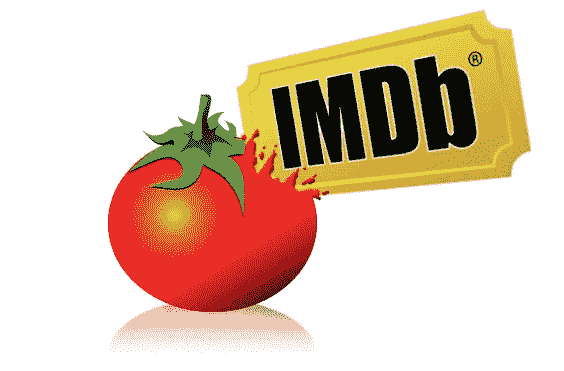
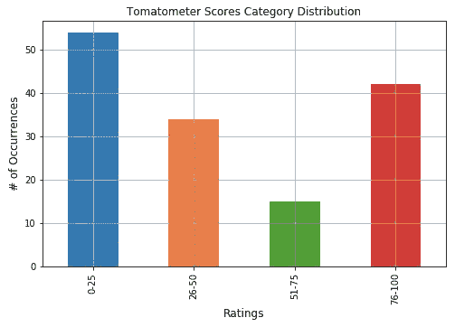
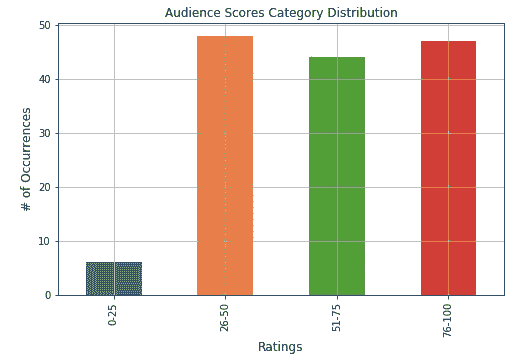
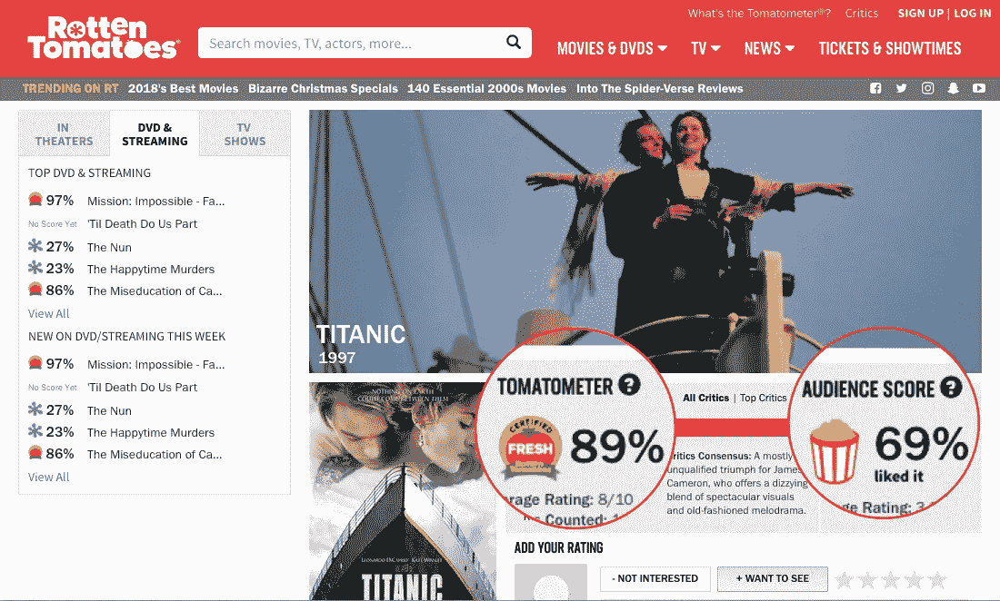
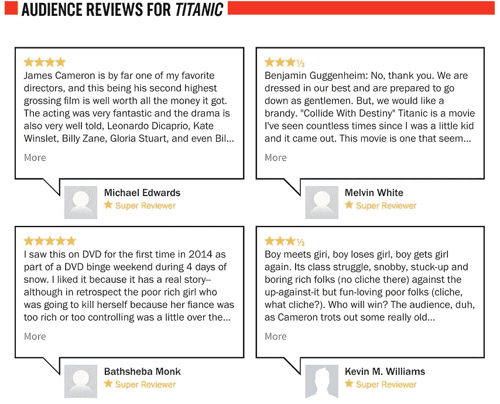
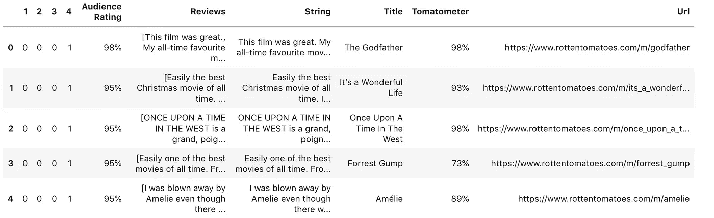
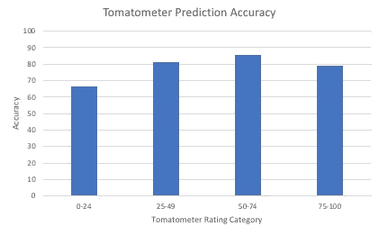
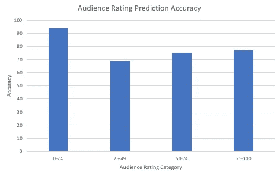
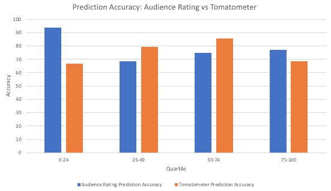

# 我们能预测烂番茄收视率吗？

> 原文：<https://towardsdatascience.com/can-we-predict-rotten-tomatoes-ratings-8b5f5b7d7eff?source=collection_archive---------13----------------------->

## *什么时候一部电影其实是烂的还是新鲜的？*

## 像 IMDb 和烂番茄这样的电影评论网站已经成为许多影迷生活的一部分。

电影观众可以通过查看一个数字(电影评级在 0%到 100%之间)轻松确定观看什么电影并比较某些电影。

*但是……你有没有想过这些评级是如何确定的？*



Picture Source: [http://you-deserve-this.blogspot.com/2012/08/imdb-top-250-vs-rotten-tomatoes.html](http://you-deserve-this.blogspot.com/2012/08/imdb-top-250-vs-rotten-tomatoes.html)

一些票房大片和“经典”在这些网站上的电影评级相当低，这并不罕见。这让我们想知道你在网上看到的电影评论*实际上是否反映了大众的观点？*

看看 IMDb 和烂番茄，我们发现这两个电影聚合网站都没有说明他们的电影评级百分比是如何计算的。

[IMDb 的帮助页面](https://help.imdb.com/article/imdb/track-movies-tv/faq-for-imdb-ratings/G67Y87TFYYP6TWAV#):

> 我们采用 IMDb 注册用户的所有个人评分，并使用它们来计算单个评分。我们不使用算术平均值(即所有投票的总和除以投票数)，尽管我们在投票细分页面上显示了平均值和平均投票数；相反，显示在标题页面上的评级是一个加权平均值。

[烂番茄《关于页](https://www.rottentomatoes.com/about):

> Tomatometer 评分代表专业评论家对给定电影或电视节目的正面评价的百分比。在电影或电视节目收到至少五条评论后，就可以计算出电影或电视节目的自动评分。
> 
> 由爆米花桶表示的观众分数是对电影或电视节目给予正面评价的所有用户的百分比。

最初，我们感兴趣的是了解 IMDb 加权平均的特征，但是他们的[使用条件](https://www.imdb.com/conditions)禁止数据抓取。因此，为了我们的项目，我们与烂番茄合作。

# 构建电影评分模型

我们最感兴趣的是回答两个关键问题。

1.  在计算收视率时，烂番茄是否更强调电影评论的某些方面？
2.  烂番茄的收视率和它的观众评分有关系吗？

在我们探索是否可以创建我们自己的评分机制的过程中，我们采取了几个步骤。

# 阶段 1:定义数据集

我们手动选择了大约 150 部烂番茄观众评分在 0-100%之间的电影。我们的目标是让电影收视率在四分位数之间平均分布。下面展示了落入每个四分位数范围的电影的分布。为了保持一致性，我们将 0–25%的电影作为第一个四分位数，26–50%作为第二个四分位数，51–75%作为第三个四分位数，最后 76–100%作为第四个四分位数。

**数据集中观众和观众评分的分布:观察值**

我们在建立电影列表时注意到的一件事是，烂番茄电影的收视率很少低于 25%。因此，您可以看到，虽然收视率在前三个四分位数的电影数量相对一致，但在收视率前四分位数和前四分位数的电影数量之间存在明显差异。

我们认为，缺乏收视率很低的电影是因为收视率是由大量烂番茄用户产生的，他们没有权力或资格对电影进行评级。任何人都可以去烂番茄给任何电影打分。因此，分数可能会被那些仅仅因为喜欢这部电影而给出很高评级的人扭曲。或者，因为这些评级是由所有用户产生的，它们更准确地描绘了公众的意见，人们通常倾向于喜欢大多数电影，并给它们更高的评级。



Number of Movies for each Quartile for Tomatometer and Audience Scores

有趣的是，尽管我们的数据集是根据观众评分建立的，但我们注意到观众评分的四分位数之间的差异程度较低。

我们认为这是因为 Tomatometer 评级是由合法的、经认可的电影和电视评论家制作的。这些评论家的职业是比较和评价电影，因此，他们能够确定在电影业中什么被认为是“坏”或“好”的电影。因为他们在电影评级方面更有技巧，我们认为这些评论家可能对电影持有更强烈的观点，并倾向于根据他们的观点对电影进行很高或很低的评级。

**接下来，我们对这部电影的哪些信息最感兴趣？**

*   **自动测量仪**。这个分数是根据电影和电视评论家的评论得出的。它[“衡量的是(观众评分)正面多于负面的百分比，并给电影分配一个总体的新鲜或糟糕的评级。超过 60%的分数被认为是新鲜的，59%及以下的分数是腐烂的"](https://www.vox.com/culture/2017/8/31/16107948/rotten-tomatoes-score-get-their-ratings-top-critics-certified-fresh-aggregate-mean)



Screenshots from [Titanic](https://www.rottentomatoes.com/m/titanic/) on Rotten Tomatoes

*   **观众评分**。这个分数[“是所有给电影…正面评价的用户的百分比，”](https://www.rottentomatoes.com/about) 3.5/5 星及以上是正面的。任何烂番茄用户都可以给出观众评分，而不仅仅是电影或电视评论家。
*   **观众点评**。书面评论
    附有任何烂番茄用户给出的星级评定。
*   **烂番茄电影页面网址**。我们跟踪 URL 更多是为了日常管理，以防我们想要返回页面收集更多信息。

# 阶段 2:收集数据

因为访问烂番茄的 API 需要批准，所以我们转向使用 BeautifulSoup 来构建我们的数据集。

在收集数据的过程中有两个主要步骤。

1.  **网络抓取**:我们迭代开发了几个 Python 类，帮助我们获得前面提到的正确的电影属性。我们类中最重要的部分之一是有一个分页参数，在这里我们可以指定我们想要多少页观众评论。
2.  **迭代地将数据写入输出文件**:JSON 输出文件被迭代地写入，以防止脚本可能崩溃并清除先前擦除的数据。这在初始测试中特别有用，可以帮助我们调试和简化流程。

```
class TextReviews():def __init__(self, url, limit=1):
  self.page = AudienceReviews(url)
  self.limit = limit
  self.reviews = []# helper function to page for reviews, outputs as an array of reviews
 def getReviews(self):
  for i in range(self.limit):
   self.reviews += self.page.getReviews()
   next_page = self.page.nextPage()if next_page:
    self.page = AudienceReviews(next_page)
   else:
    break# return ''.join(self.reviews)
  return self.reviews
```

*`[*score.py*](https://github.com/estherelle/fresh-or-rotten/blob/master/score.py)`*节选，我们用来刮烂番茄的观众评论。**

*我们为我们的电影列表和每个相应的 URL 创建了一个. csv 文件。我们从每部电影中提取所需的数据，转换成 JSON 数据格式，如左图所示。我们还将每部电影添加到其相应的分级四分位数中。*

**

*Dataframe of Movies after Loading JSON*

*然后，我们将数据加载到 pandas 数据框架中，如上所示。我们将包含每部电影的观众评论的字符串列表转换为一个字符串。然后，我们通过执行基本的文本预处理(如小写、标点符号删除和停用词删除)来清理数据。除此之外，我们还做了词汇化，而不是词干化，因为它将单词转换成它的词根，而不是去掉后缀。*

# *阶段 3:创建分类器*

*现在，我们需要创建分类器，将观众评论字符串转换为评级(为了提高准确性，我们选择按四分位数 1、2、3、4 对其进行评级，而不是分配精确的评级)。*

*我们的目标是建立一个分类器，预测给定电影的评级落在哪个点范围内——或者哪个四分位数。对于我们的初始数据集，我们试图从收视率似乎均匀分布的电影列表中抓取。我们还将观众评论的页数限制在 20 页，这样我们就可以最大限度地减少流行电影和不太流行电影的观众评论数量之间的差异。*

*为了使矢量器、转换器和分类器更容易使用，我们使用了一个 scikit-learn 管道类，其行为类似于一个复合分类器。使用普通的 TF IDF 和朴素贝叶斯分类器，我们得到了 28%的准确率——非常低。我们意识到这是因为我们的分类不是二元的，而是多类的，这意味着它使用了多个相互排斥的标签。因此，我们切换到 OneVsRest 分类器，仍然使用 TF IDF。我们的准确度结果要好得多。*

# *分类器准确度*

*TOMATOMETER*

**

*正如我们的图表所示，我们的分类器在预测电影时最准确，这些电影将落入电影评分的第二和第三个四分位数。*

*收视率*

**

*正如我们的图表所示，我们的分类器最准确地预测了将落入观众评级第一四分位数的电影。*

*我们认为观众评论总能准确预测收视率，这让我们对这些结果感到非常惊讶。因此，我们已经证实了我们的假设，即这些电影评级并不反映一般公众的实际意见。这让我们相信，也许烂番茄在收视率中包含了其他他们没有透露的因素。*

*TOMATOMETER 与观众评分*

**

*对于第一个和第四个四分位数，我们的分类器对收视率产生了更准确的预测。然而，对于第二和第三个四分位数，我们的分类器更准确地预测了 Tomatometer 评级。我们的分类器向我们表明，使用烂番茄的观众评论，我们无法始终准确地预测这些电影的观众评级或自动评分。因此，很明显，在决定烂番茄网站上显示的评分时，还有其他因素需要考虑。*

# *摘要*

*从我们的研究中，我们能够确定烂番茄上的电影评分，以及其他网站上的评分，并没有准确地显示公众对这部电影的看法。尽管我们预计观众评分与观众评论的制作评分不匹配，但我们惊讶地发现，观众评分也没有反映观众评论。*

*这是一个非常有趣的尝试，看看我们如何根据公众评论建立自己的电影评级机制。观众影评中的一些值得注意的词显示在下面的词云中:*

**

*Word Cloud Generated from Review Text Input*

*我们建议电影观众警惕他们在电影网站上看到的电影评级，如烂番茄和 IMDb。这些分数中包含的信息不能准确反映人们对这部电影的真实想法。由于各种原因，这些分数可能会有偏差，并且可能会受到烂番茄的影响，从而影响利润和收视率。我们希望继续这项研究，以发现这些分数中包含的元素是什么，以及它们是否准确反映了人口的意见。*

*如果有兴趣，可以在这里查看我们的代码。我们的存储库包含运行烂番茄刮刀和分析所需的所有源代码。*

*【2018 年秋季 DIS 大数据计算分析最终项目*

*在媒体上关注我们:[罗宾·罗斯](https://medium.com/u/d8eed48e9987?source=post_page-----8b5f5b7d7eff--------------------------------)，[萨尼卡·巴帕特](https://medium.com/u/4214fc2ce4f6?source=post_page-----8b5f5b7d7eff--------------------------------)，[埃斯特·l .](https://medium.com/u/d1568da352d9?source=post_page-----8b5f5b7d7eff--------------------------------)*