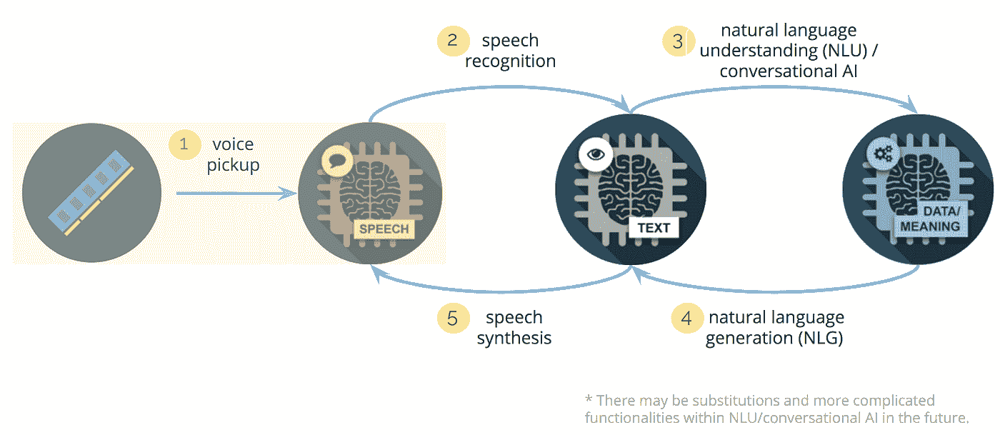
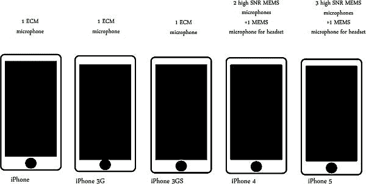
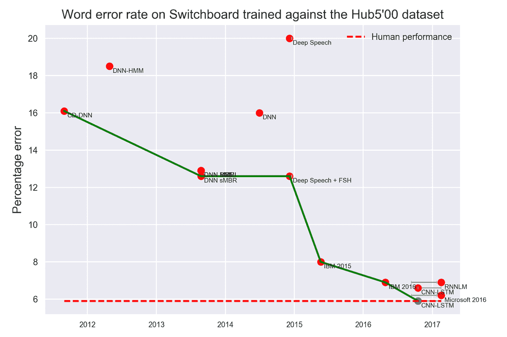
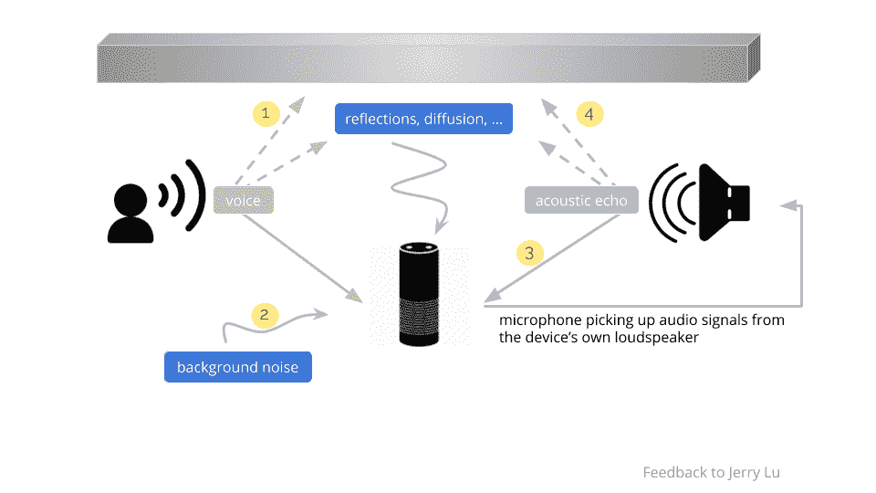
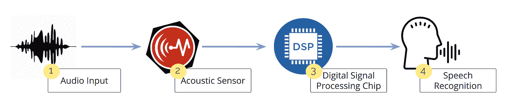
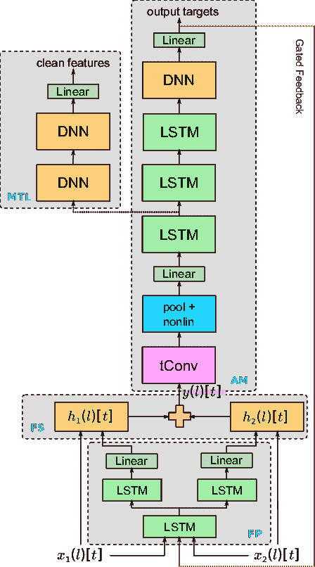
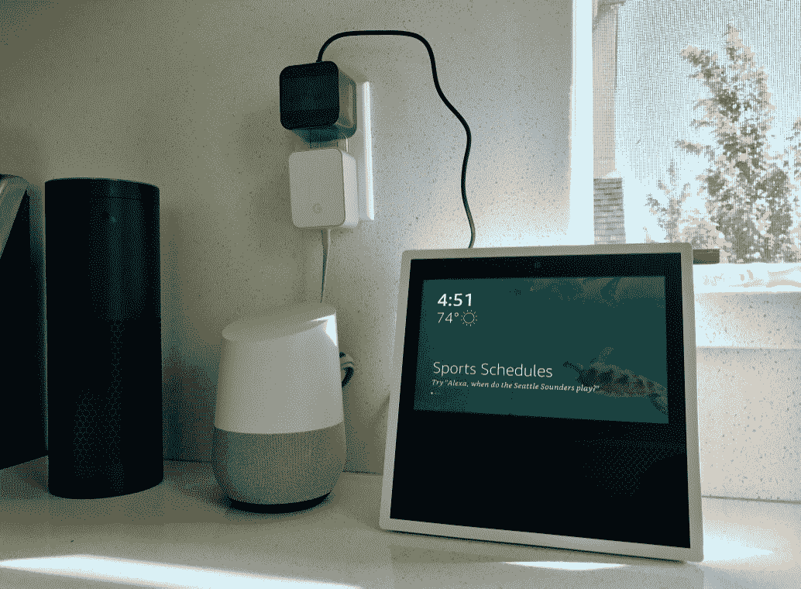
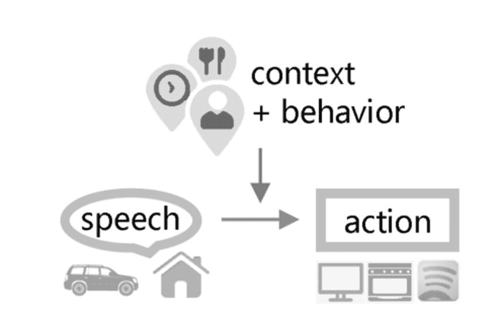

# 你现在能听到我吗？远场声音

> 原文：<https://towardsdatascience.com/can-you-hear-me-now-far-field-voice-475298ae1fd3?source=collection_archive---------1----------------------->

## 在我之前的[帖子](https://medium.com/startup-grind/the-network-effect-of-voice-ba47f08ad2de)中，我提出了一个案例，即成功的人工智能公司将通过围绕数据创造网络效应或开发专有算法，在“计算语音”价值链中开发一条护城河。在这篇文章中，我将研究价值链的第一步，语音信号的最初拾取，并找出创业公司可以成功的机会。

## 放大声音

语音控制是一种与硬件和相关服务交互的直观方法。这比连接键盘和鼠标、敲击屏幕键盘或点击遥控器要自然得多。

随着我们看到越来越多的语音激活设备，了解设备如何能够监听和理解语音命令是非常重要的。这个过程中有许多组件，但我们将研究的两个组件是麦克风阵列(硬件)和深度学习架构(软件)，它们使这样一个复杂的系统工作。

## 硬件|麦克风阵列

语音识别系统通常使用多个麦克风来降低混响和噪声的影响。每一代 iPhone 的麦克风数量都在增加，从第一代 iPhone 的一个增加到 iPhone 5 和 6S 的四个。

甚至像亚马逊 Echo 这样的智能扬声器设备也使用了多达 7 个麦克风。实际上，回声麦克风是以六边形布局排列的，每个顶点一个麦克风，中间一个麦克风。每个麦克风接收信号之间的延迟使设备能够识别声音的来源，并消除来自其他方向的噪声。这种现象被称为波束形成。

## 软件|深度学习

深度学习在语音拾取方面发挥了基础性作用。识别口语的能力是几年前建立的，但深度神经网络(DNNs)等基于学习的技术已经允许语言处理在许多测试案例中达到或超过人类的表现。

AI Progress Measurement | Electronic Frontier Foundation: [https://www.eff.org/ai/metrics](https://www.eff.org/ai/metrics)

只有硬件和语音识别算法的强大结合才能带来产品的成功。对于糟糕的麦克风，无论采用多智能的深度学习模型，识别精度都会下降。另一方面，拥有次优机器学习的优秀麦克风并不能产生必要的准确性。

## 远场拾音的问题

虽然最先进的语音识别系统在麦克风靠近说话的情况下表现相当好，但在麦克风远离用户的情况下性能会下降。

想象一个常见的场景，一个人在室内，对着亚马逊回声说话。

回声捕获的音频将受到以下因素的影响:1)扬声器对着房间墙壁的声音，2)来自外部的背景噪声，3)来自设备扬声器的声学回声，以及 4)对着房间墙壁的输出音频。

这些因素都会导致低信噪比(SNR)、房间混响以及语音和噪声的未知方向，所有这些都是需要解决的重要挑战。随着用户远离产品的麦克风，语音级别会降低，而背景噪音级别保持不变。除了噪音和混响，其他挑战包括缺乏大规模远场数据和未经探索的高效深度学习架构。底线是，在这些远场场景中，语音识别和人类表现之间仍然存在巨大的差距。

## 远场拾音是如何工作的？

语音识别系统通常使用单独的模块来执行语音识别。

1.  音频输入被发送到声学传感器，
2.  其将声音信号转换成电子信号，然后转换成数字信号。
3.  然后，它进入一个数字信号处理芯片，在那里用固定的嵌入式算法进行语音增强。这些嵌入式算法执行传统的信号处理技术:声源定位(定位声音的方向)和波束形成(抑制背景噪声)。
4.  得到的增强信号进入用于语音识别的传统声学模型。

*麦克风技术旨在用基于深度学习的可训练算法取代固定的嵌入式算法。*

固定算法和组件的缺点是，它们无法适应建立在它们之上的可训练机器学习系统的其余部分。当你把一个可训练的深度学习系统放在一组固定的芯片上时，深度学习模型必须学习嵌入式算法正在做什么，撤销它，并在它的基础上执行自己的计算。这使远场语音识别变得复杂，因为音频输入已经失真，并且在 1)将信号从声音转换为电信号再转换为数字信号，然后 2)预处理的每个步骤中，您都会丢失信息。

谷歌一直处于这项[研究](https://drive.google.com/file/d/0ByfBg9vVsBJ-OHpycWV6VllxVGM/view)的前沿，展示了使用原始波形作为声学传感器的输出，从而避免了当今系统内置芯片所做的任何预处理(即定位、波束形成)。

Google’s neural network adaptive beamforming model architecture

实质上，谷歌希望将这一过程中的第 3 步和第 4 步结合起来。这个想法是给麦克风阵列更多的自由度来优化基于数据的算法。对于声学传感器，你只希望它能够正确检测，不会增加太多的噪声或失真，并且系统的其余部分可以使用可训练的深度学习架构来检索其信息。

## 创业的机会

通常，固定算法是基于试探法为一般情况开发的，而基于深度学习的算法是用实际数据本身为特定任务训练的。当你有一个基于深度学习的系统时，由嵌入算法的固定芯片组成的麦克风可能不是你想要的。

在这种情况下，任何语音识别应用的理想硬件设置都应该在这些固定的嵌入式芯片上进行最少的数字信号处理。它应该接受原始波形，并在其上建立复杂的深度学习算法，这些算法既可训练又灵活。

接下来的问题就变成了，你是否可以收集大量的训练数据，为那个特定的硬件训练一个深度学习算法，或者使用其他深度学习技术来补偿声学传感器的差异。如今的问题是，深度学习语音识别模型是在不同硬件上收集的数十万小时的数据上训练的。

为了与拥有完整设计能力的大型科技巨头竞争，初创公司需要寻找机会通过数据、软件或自动化来破坏价值链。

硬件领域有着巨大的潜力，因为复杂的深度学习技术必须部署在高度定制的廉价硬件上。

the battle of voice-enabled hardware, @ziwang ’s toys

所有现有的主要数据集都将得到利用，这些模型的使用范围很广。为尚不存在的数据集构建基础设施来收集、注释和训练新模型的公司将会成功。

就拿像 [Vesper](http://vespermems.com/) 这样的公司来说。他们正在通过利用压电材料的物理特性来改变麦克风的设计方式(我将在未来的帖子中解释底层技术)。因此，他们的麦克风技术不会像传统麦克风那样受到灰尘和环境退化的影响，因此他们的麦克风质量更高，从而提供更高的保真度结果，作为传输的信号进行进一步处理。

*生产级识别的关键是数据的广泛使用、数据扩充的先进技术和模型架构。*

固定算法和组件的弱点在于，它们无法适应建立在它们之上的可训练机器学习系统。但是，如果你的端到端模型像上面讨论的那样，深度学习模型实际上可以通过将它们与总体目标相关联来学习应该提取哪些信息特征，这就是语音识别中解码的字符或单词。

自动化将包括个性化设备和持续学习。

例如，利用从特定用户收集的数据，可以优化整个管道以更好地了解该用户。

但是个性化仍然带来许多问题。在部署了良好的初始系统之后，随着行为的改变，深度学习算法需要基于使用的持续训练。

无论是为用户提高性能(例如，使用他们的语言、语音等),都需要优秀的硬件和智能软件。)或提供用户特定的解决方案(例如，具有个性化语音、个性等的助理。).个性化的硬件和深度学习系统可以在这两个领域带来竞争优势。

百度最近发布了他们的[深度语音 2](http://research.baidu.com/deep-voice-2-multi-speaker-neural-text-speech/) 系统，走在了这项研究的前沿。该系统完全由深度神经网络构建而成，仅用半小时的音频就可以学习一个人声音的细微差别，并可以学习模仿数百种不同的说话者。该系统赋予机器新的语音多样性，并将极大地为语音识别带来个性化和亲切感。

对于初创公司来说，一个有趣的个性化机会是率先将他们的语音识别系统应用于其他语言并进行营销。虽然像百度这样的公司可能会在不久的将来将 Deep Voice 2 改编成中文这样的语言，但这样的公司今天忽略了这个问题。

个性化的另一个有趣的领域和垂直利基可能是可访问性。例如，[艾娃](https://www.ava.me/)正在使用语音识别软件为有听力障碍的人将对话翻译成文本。同样，土耳其一家名为 [WeWalk](https://arikovani.com/projeler/akilli-baston/detay) 的有趣初创公司正在为视障人士制造智能拐杖，并利用细微差别通信来实现他们的语音技术。

个性化和持续学习将加速语音优先革命，允许机器复制类似人类的交互，平滑尴尬的对话，并实现定制。

[流利。总部位于蒙特利尔的 AI 公司正在软件和个性化方面进行改进。这家公司的解决方案试图直接从音频输入到自然语言处理，中间没有语音到文本的步骤，直接从口头命令和上下文中提取意图。通过这样做，他们的意图识别系统变得真正个性化，从用户依赖的口音、变化的上下文和声学行为中学习，以识别不同环境影响下的常用短语。](http://www.fluent.ai/)

通过与原始设备制造商和供应商的进一步合作，Fluent。人工智能解决方案能够对收集的数据进行更多的控制。通过这种合作关系，流利。与传统技术相比，人工智能可以为原始设备制造商提供更快、更具成本效益的市场之路，以及更广泛的覆盖范围。

综上所述，如果一家规模较小、反应敏捷的公司专注于数据、软件和自动化这三个关键领域中的一个或多个，那么它就有很大的发展空间。最终，能够拥有整个语音堆栈的创业公司——包括通过硬件收集的数据和软件中可训练的深度学习算法——将具有竞争优势，在语音识别和语言理解方面提供更好的性能。