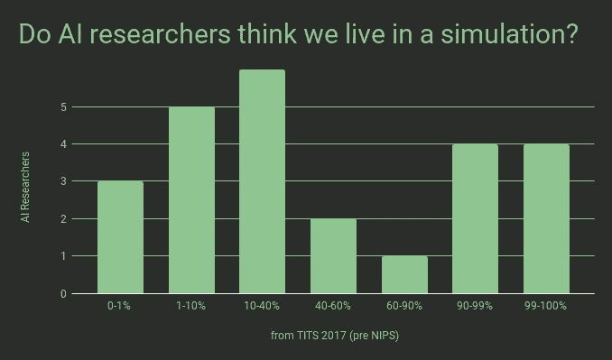
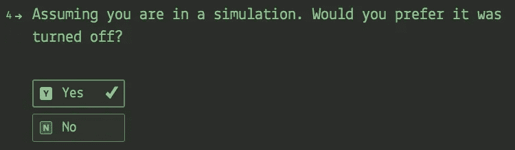
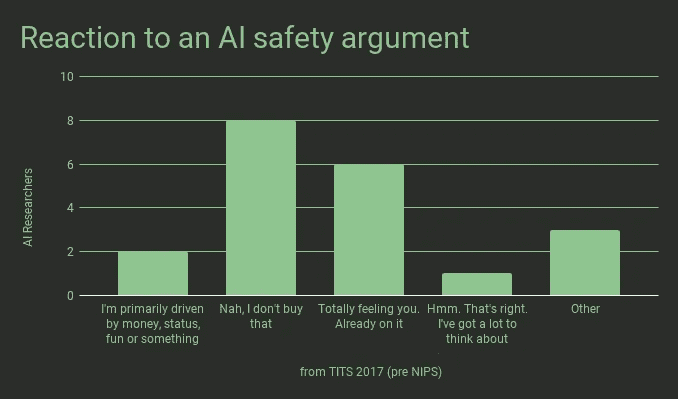

# 顶尖人工智能研究者对“模拟假说”的坦诚思考

> 原文：<https://towardsdatascience.com/candid-thoughts-on-the-simulation-hypothesis-from-top-ai-researchers-c3e2cdea3ffa?source=collection_archive---------3----------------------->

我在[奶头](http://tits.ai)的一个黑暗的房间里，在一个[咬](http://nips.cc)之前的派对上，探究人工智能科学家的一些最深层的意图和信念。

1.  我们生活在模拟世界里吗？
2.  如果单方面选择，他们会摧毁文明和我们已知的宇宙吗？
3.  他们计划在多大程度上确保我们的未来是“完全令人敬畏的”？

# 关于我们是否在模拟中的极端分歧

在自我介绍为 Quasar(模拟他们宇宙的研究生)后，我问他们在这个很难测试的命题上给出的概率是多少:“你生活在一个模拟中。”

如你所见，它们到处都是。 **7 名研究人员有这样或那样的最大信心(0-1%或 99-100%)，只有 9 人认为可能性在 10%到 90%之间。**如果这个命题更容易检验，将会有一些重大的下注机会。

# 一名人工智能研究人员似乎完全准备好扼杀我们的宇宙

**When asked why they answered: “Stare into the abyss, and the cocaine stares back.”**

如果没有苦难，如果外面有比我们更聪明的生命，我们文明的终结就不会那么悲惨，但我坚定地站在地球生命延续的阵营里。接受调查的 26 名研究人员中有 25 名似乎同意我的观点。

4 名研究人员最初对上述问题的回答是肯定的。2 pretty 立刻承认他们是在开玩笑。一名研究人员承认，他只是出于病态的好奇心想要毁灭我们的宇宙，我不认为这种好奇心会发展到真的去按一个红色的大按钮。但是剩下的研究员似乎很认真。当被问及原因时，他们回答道:“凝视深渊，可卡因也会凝视你。”

一个数据点是很少的证据。但是考虑到 1%的精神病患病率，这些结果与预期相符(从调查犯罪人口中推断)。我仍然非常担心在未来的世界里会有更多的人可以单方面毁灭文明。熬过古巴导弹危机和其他类似的危机已经够难的了。

> 肯尼迪总统说，他认为导弹危机导致核战争的可能性为 30%到 50%。

# 对声明的反应:如果 AGI 是在一个“强大的技术安全领域”发展起来的，那么完全令人敬畏的结果的几率会高出 20%。(期待 10^ 35 吸毒生活)

Note: there are many points they may disagree with.

我发现令人稍感欣慰的是，26 名参与者中有 6 名完全感受到了我，并且已经开始行动了。这比我预期的要高一点，但我使用了非常宽泛的安全工作定义:

> 强大的投资看起来像是超过 30%的顶级研究人员时间投入到诸如健壮性、人工监督、可解释性、安全性、安全探索、对齐等问题上。

之所以选择这个论点，是因为它避免了典型框架问题的两大陷阱。这是积极的，因为末日警告通常与宗教狂热者和阴谋论者的模式相匹配。它没有触及在没有干预的情况下“完全棒极了”的几率是多少，因为这是有争议的，与决策无关。我希望得到不止一个“嗯。没错。我有很多事情要考虑”。我很想看到对这个协议更有说服力的版本的研究。

# 最后

这些科学家因幽默而获得报酬，所以这是一个明显的混淆因素。这个反面角色的经历已经向你和你在 dystopiaroom.com[的朋友们公开了。如果你想复制这些结果，你应该知道我用这个](http://www.dystopiaroom.com)[星形投影仪](https://www.amazon.com/gp/product/B01KSUYHUA/ref=oh_aui_detailpage_o01_s00?ie=UTF8&psc=1)作为情绪照明。我在推特上承诺，如果有更多的人经历了 dystopiaroom.com 事件，我会更新这个分析。

*感谢丽娃·泰兹、亚历克斯·马茨纳、汤姆·布朗、达拉戈·巴克利、* [*瑞安·马茨纳*](https://fueled.com/ryan-matzner/) *、克里斯汀·桑福德、埃里克·马茨纳和伊桑·马茨纳审阅本协议草案。*