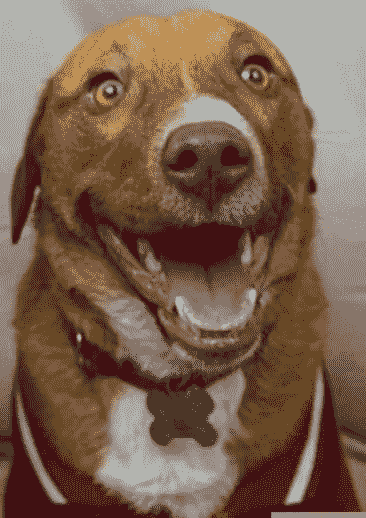
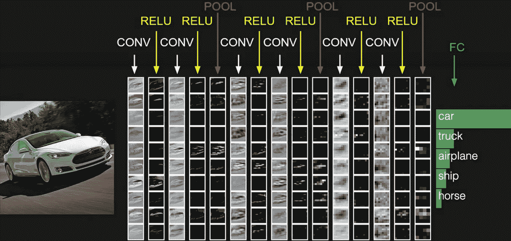
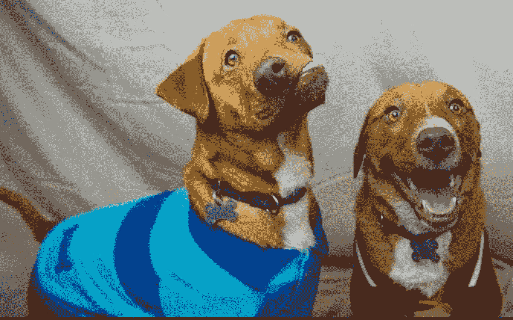

# 胶囊神经网络:下一代神经网络？第一部分:CNN 及其问题。

> 原文：<https://towardsdatascience.com/capsule-neural-networks-are-here-to-finally-recognize-spatial-relationships-693b7c99b12?source=collection_archive---------3----------------------->

## 可选(“常规”)神经网络是机器学习领域的最新热点，但它们也有缺陷。胶囊神经网络是 Hinton 的最新发展，它帮助我们解决了其中的一些问题。

> 这是**系列**帖子的一部分，旨在教授胶囊神经网络。这第一篇文章将解释“正常”(卷积)神经网络及其问题。

神经网络可能是机器学习中最热门的领域。近年来，有许多新的发展，改善神经网络和建设，使他们更容易。然而，它们大多是渐进式的，例如增加更多的层或稍微改进激活功能，但没有引入一种*新的*类型的架构或主题。

[Geoffery Hinton](https://research.google.com/pubs/GeoffreyHinton.html) 是许多高度利用的深度学习算法的创始人之一，包括神经网络的许多发展——难怪，有神经科学和人工智能背景。

2017 年 10 月下旬，Geoffrey Hinton、Sara Sabour 和 Nicholas Frosst 在 Google Brain 下发表了一篇名为“[胶囊间动态路由](https://arxiv.org/abs/1710.09829)”的研究论文，介绍了神经网络的一项真正创新。这是令人兴奋的，因为这种发展已经被期待了很久，将可能刺激更多的研究和围绕它的进展，并被认为使神经网络比现在更好。

# 基线:卷积神经网络

卷积神经网络(CNN)是非常灵活的机器学习模型，它最初是受我们大脑工作原理的启发。

> 神经网络利用“神经元”层将原始数据处理成模式和对象。

神经网络的主要构件是“卷积”层(因此得名)。它是做什么的？它从上一层获取原始信息，理解其中的模式，并将其向前发送到下一层，以理解更大的画面。

如果你是神经网络新手，想了解它，我推荐:

1.  观看由 [3Blue1Brown](https://www.youtube.com/watch?v=aircAruvnKk) 制作的动画视频。
2.  想要更详细的文字/视觉指南，你可以看看这个[初学者博客](https://adeshpande3.github.io/adeshpande3.github.io/A-Beginner%27s-Guide-To-Understanding-Convolutional-Neural-Networks/)
3.  如果你能处理更多的数学和细节，你可以阅读斯坦福大学 CS231 的指南。

    *以防你没有做到以上任何一点，并打算继续，这里有一个手动波浪形的简要概述。*

## **卷积神经网络背后的直觉**

让我们从头开始。
神经网络接收原始输入数据。假设这是一只狗的涂鸦。当你看到一只狗，你的大脑会自动检测出它是一只狗。但是对于计算机来说，图像实际上只是代表颜色通道中颜色强度的一组数字。假设它只是一个黑色的白色涂鸦，那么我们可以用一个数组来表示它，其中每个单元格代表像素从黑到白的亮度。



Example dog face for a Neural Network to recognize. Source: [The Sun, image: lovable dog rescue](https://www.thesun.co.uk/living/3009674/dog-called-picasso-because-of-his-wonky-face-is-looking-for-a-new-home-and-offers-are-already-flooding-in/)

我们的目标是什么？我们的目标是让网络从视觉上理解图片中的内容(对它来说，图片只是一个数字序列)。一种方法是自下而上的:首先查看小组像素，理解它们(如小线条和曲线:狗耳朵的曲线，瞳孔的小圆圈，腿的小线条)，然后建立这些线条和曲线的更大组(如:耳朵，鼻子，鼻子，眼睛)，理解这些形状的更大组(如:脸，腿，尾巴)，最后理解狗的整个图片。

它是通过许多层将信息按顺序从一层传递到另一层来实现的。
如果这对你来说是新的，请看我对卷积网络结构的总结: [**了解卷积神经网络**](https://quip.com/a4MBABJJB7oN) **。**

如果你没读过，但对你来说还是新的，下面是一个更短的摘要:

## [**了解卷积神经网络**](https://quip.com/a4MBABJJB7oN) **。**

1.  **卷积层**。第一个卷积层将图像空间映射到一个更低的空间，总结每组中发生的事情，比如说 5x5 像素，这是一条垂直线吗？水平线？什么形状的曲线？*这发生在逐元素乘法中，然后将滤波器中的所有值与原始滤波器值相加，并求和为单个数字。*
2.  这就引出了 ***神经元，或者说*** 卷积 ***滤波器*** *。每个过滤器/神经元被设计成对一种特定的形式(一条垂直线？一条水平线？等等……)。*来自第 1 层的像素组到达这些神经元，并根据该切片与神经元寻找的内容的相似程度来照亮与其结构匹配的神经元。
3.  **激活(通常是“ReLU”)层** —在每个卷积层之后，我们应用一个非线性层(或激活层)，这将非线性引入系统，使其能够发现数据中的非线性关系。ReLU 非常简单:将任何负输入设为 0，或者如果是正的，保持不变。 *ReLU(x) = max(0，x)。*
4.  **汇集层**。这允许减少“不必要的”信息，总结我们对一个地区的了解，并继续提炼信息。例如，这可能是“MaxPooling ”,其中计算机将只取传递的该补丁的最高值，以便计算机知道“在这些 5x5 像素周围，最主要的值是 255。我不知道具体在哪一个像素上，但确切的位置并不重要，因为它就在附近。→ ***注意:这个不好。我们在这里丢失信息。胶囊网这里没有这个操作，这是一个进步。***
5.  **辍学层。**该层通过将激活设置为零来“删除”该层中的一组随机激活。这使得网络更加健壮(有点像你吃泥土增强你的免疫系统，网络对小的变化更加免疫)并减少过度适应。这仅在训练网络时使用。
6.  **最后一个完全连接的层。**对于一个分类问题，我们希望每个最终神经元代表最终的类。它查看前一层的输出(我们记得它应该代表高级功能的激活图),并确定哪些功能与特定的类最相关。
7.  **SoftMax —** 有时添加这一层是为了以另一种方式表示每个类的输出，我们稍后可以在损失函数中传递这些输出。Softmax 表示各种类别的概率分布。

通常，有更多层提供非线性和维度保持(如在边缘周围填充 0 ),这有助于提高网络的鲁棒性和控制过拟合。但是这些是你需要理解接下来会发生什么的基础。

**现在重要的是，这些层只是按顺序连接。这与胶囊网络的结构相反。**



Neural Network Structure, [From a Google article be Szegedy, Toshev & Erhan presenting Neural Networks](https://pdfs.semanticscholar.org/d8b9/eadcadb12d4d4e19201b4c5519470e21114c.pdf)

# W 卷积神经网络的问题在哪里？

如果你对此感兴趣， [*观看韩丁的讲座*](https://www.youtube.com/watch?v=rTawFwUvnLE&feature=youtu.be) *解释*到底*他们有什么问题。下面你会看到胶囊网络改进的几个关键点。*

Hinton 说，他们的子结构层次太少(网络是由神经元组成的层组成的，就是这样)；我们需要将每一层中的神经元分组到“胶囊”中，就像迷你列一样，进行大量的内部计算，然后*输出一个汇总结果。*

# 问题#1:共享会丢失信息

CNN 使用“汇集”或等效的方法来“总结”在较小区域发生的事情，并理解图像中越来越大的块。这是一个让 CNN 运行良好的解决方案，但是它丢失了有价值的信息。

胶囊网络会计算出一个*(平移和旋转)较小特征之间的关系来组成一个较大的特征。
这种信息的丢失导致空间信息的丢失。*

## *问题# 2:CNN 没有考虑图像各部分之间的空间关系。因此，它们对方向也过于敏感。*

> **二次采样(和合并)会丢失鼻子和嘴等高级部分之间的精确空间关系。身份识别需要精确的空间关系。**

*[*(韩丁，2012*](https://www.youtube.com/watch?v=TFIMqt0yT2I&feature=youtu.be) *，在他的讲座中)。*

**CNN 不考虑底层对象之间的空间关系。**通过这些平坦的神经元层根据它们看到的物体而发光，它们识别出这些物体的存在。但是随后它们被传递到其他激活和汇集层，并传递到下一层神经元(过滤器)，而不识别我们在该单层中识别的这些对象之间的关系*。*
他们只是说明自己的存在。

**所以一个*(简单化)*神经网络会毫不犹豫地将这两只狗，巴勃罗和毕加索，归类为“柯基-比特-牛头梗混血儿”的同样好的代表。***

**

**Normal (Convolutional) Neural Network will recognize both of these lovely dogs as the same type of dog face, because it does not care about WHERE the elements of the dog’s face are located relatively to each other in space. Picasso (the dog on the left) will luckily not be discriminated against by the model, but we really want a model to realize this is not a regular example of a* corgi-pit-bull-terrier mix *dog. Image source:* [*The Sun. Image: Lovable Dog Rescue*](https://www.thesun.co.uk/living/3009674/dog-called-picasso-because-of-his-wonky-face-is-looking-for-a-new-home-and-offers-are-already-flooding-in/)*

*网络会将这两只狗归类为“柯基-比特-牛头梗混合”狗的类似良好表示，因为它们在面部合成卷积层回答相同的条件，例如:*

```
*if: (2 eyes & pitbullmix_snout 
     + pitbullmix_wet_nose & mouth)
then: pitbullmix_face*
```

*错误地激活 pitbullmix_face 的神经元，而不是类似于:*

```
*if: 2 eyes 
& BELOW: pitbullmix_snout 
     & pitbullmix_wet_nose 
& BELOW: mouth 
then: pitbullmix_face*
```

***相反，胶囊网络代表方向以及内容，并连接神经元胶囊之间，以推断空间关系并保留姿势信息。**

缺少分组的胶囊表示、姿态计算，以及胶囊之间的重叠检查导致下一个问题。*

## *问题# 3:CNN 无法将对几何关系的理解转移到新的观点上。*

*这使得它们对原始图像本身更敏感，以便将图像分类为同一类别。

CNN 在解决与他们接受过训练的数据相似的问题方面非常棒。它可以对图像或其中与它以前见过的东西非常接近的物体进行分类。但是如果物体稍微旋转，从稍微不同的角度拍摄，特别是在 3D 中，倾斜或在另一个方向上，而不是 CNN 所看到的-网络不会很好地识别它。

一种解决方案是**人工创建图像或组的倾斜表示**并将它们添加到“训练”集中。然而，这仍然缺乏一个更坚固的结构。*

## *编码视点不变的空间关系姿态*

*那么我们如何对 3D 对象之间的空间关系进行编码呢？辛顿从一个已经解决了这个问题的领域获得了灵感:3D 计算机图形学。
在三维图形中，一个[](https://en.wikipedia.org/wiki/Pose_(computer_vision))****[**矩阵**](http://digitalrune.github.io/DigitalRune-Documentation/html/d995ee69-0650-4993-babd-1cdb1fd8fd7a.htm) 是一种表示物体之间关系的特殊技术。姿态本质上是代表*平移*加上*旋转的矩阵。现在我们明白了。我们可以使用子对象之间的姿势关系来保留空间关系信息；测量物体之间的相对旋转和平移作为 4D 姿态矩阵。
这将是理解胶囊间动态路由的关键。******

********既然我们已经知道了神经网络及其空间识别问题的基础知识，我们可以继续了解最近开发的解决方案:胶囊神经网络。这将是我下一篇文章的主题。*** *敬请期待！******