# 胶囊神经网络–第 2 部分:什么是胶囊？

> 原文：<https://towardsdatascience.com/capsule-neural-networks-part-2-what-is-a-capsule-846d5418929f?source=collection_archive---------6----------------------->

## 胶囊神经网络中的这些“胶囊”是关于什么的？这篇文章将以简单的语言(和狗脸)给你完整的直觉和洞察力，以及后来深入理解它们的技术细节。

> 这是胶囊网络解释系列的第二部分。[帖子#1 在这里](/capsule-neural-networks-are-here-to-finally-recognize-spatial-relationships-693b7c99b12)，如果你还没看的话，看看吧。

# 胶囊:直觉

在经典的 CNN 中，第一层的每个神经元代表一个像素。然后，它将这些信息转发给下一层。接下来的卷积层将一群神经元组合在一起，这样单个神经元就可以代表一整帧(一群)神经元。因此，它可以学习表示一组看起来有点像*鼻子、*的像素，特别是如果我们的数据集中有许多这样的例子，当识别图像是否是狗时，神经网络将学习增加那个*鼻子神经元*特征的权重(重要性)。

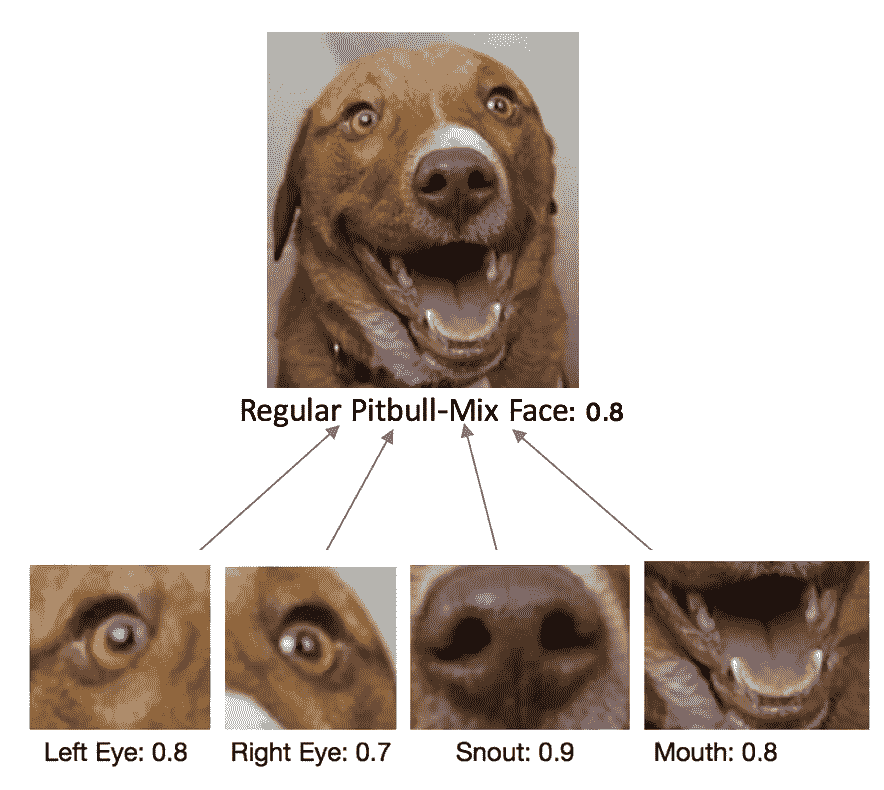

Abstraction 1 of how a regular Convolutional Neural Network would recognize sub-structures **present** in the big picture, regardless of their location

然而，这种方法只关心特定位置周围的图片中对象的存在；但是它对物体的空间关系和方向不敏感。
**但不惧！胶囊来拯救我们了！*胶囊*** s 是一个新概念，它可以包含**更多关于每个【对象】的** 信息。

胶囊是一个 ***向量*** (一个具有大小和方向的元素)指定了对象的*特征及其 ***可能性*** 。这些特征可以是任何实例化参数，如“*姿态“*”(位置、大小、方向)、变形、速度、反照率(光反射)、色调、纹理等。*

*因此，例如，神经网络可以学习拥有一个代表“眼睛”的胶囊，它将包含关于它所看到的所有眼睛变化的信息，而不是针对不同眼睛变化的不同神经元。例如，除了关于看起来像“眼睛”的像素组的信息之外，胶囊还可以指定它的属性，如角度和大小，因此，如果我们使用这些角度或大小参数，它可以用相同的一般眼睛信息来表示各种眼睛。*

*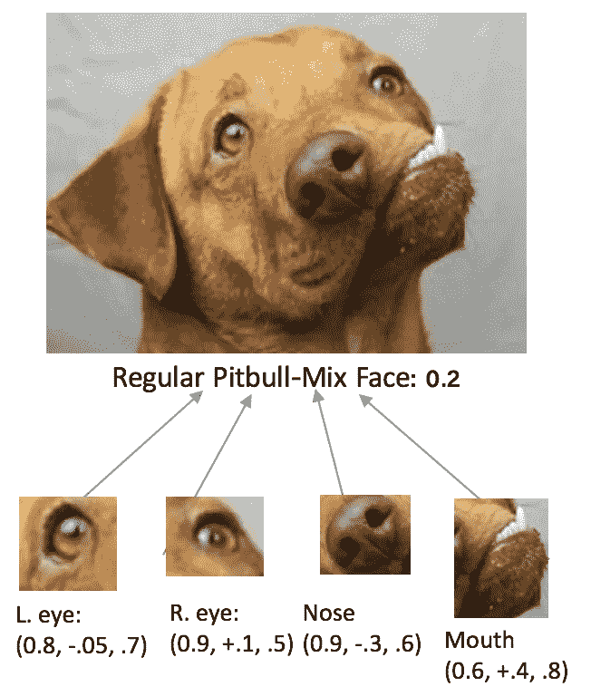*

*Abstraction of how a Capsule Neural Network would recognize sub-structures present in the big picture, along with information about the location and direction of these elements.*

*现在，就像神经网络有多层神经元一样，胶囊网络也可以有多层胶囊。所以可能有更高的胶囊代表它们下面的一组物体(胶囊)。例如，在第三层你可能有代表“眼睛”、“鼻子”、“嘴”的胶囊，在第四层你可能有代表“狗脸”的胶囊。因此，胶囊在识别一系列变化的特征时更加灵活和稳健。*

*但是等等……还有更多！*

*我们的智能胶囊可以利用这些信息进行更好的识别。直观上，**胶囊网络可以问:*所有这些特征都是相似的旋转和大小吗？*** 如果不是，这个有问题的图像不太可能是狗脸(这个标签会得到较低的概率分数)。如果是的话，这增加了我们的信心，这具有重要的意义:我们刚刚创建了一个网络，它可以识别对象，即使它们是从原始输入转换而来的。下面再详细说说这两点。

**(1)capsnes 可以根据方向和大小的不一致性进行更好的分类以便识别。**如果子元素(鼻子、眼睛和嘴巴)在方向和大小上彼此不一致(比如我们的毕加索！)*，* t *这时较高的胶囊会注意到并且会不太确定这是一张(常规的)狗脸。*对于中枢神经系统中的正常神经元，我们无法做到这一点；我们只有可能让一组像素看起来像没有方向信息的东西。通过比较胶囊每个特征的兼容性，我们可以发现它们是不一致的，并且(遗憾的是)排除了 Picasso 的可能性。

**②观点不变性。**经典的 CNN 只能基于以相似的方向和大小存储的相似的狗脸检测器来识别狗脸。这是因为狗脸的特征存储在像素帧内的位置。例如，它可能有一个狗脸的表示，其中鼻子在像素[50，50]左右，嘴在像素[50，20]左右，眼睛在像素[20，70]和[70，70]左右。然后，它将只识别在图片中相似位置具有相似特征的图像。因此，对于“旋转 30°的狗脸”或“小狗脸”，它必须有一个单独的*表示。这些表示最终会映射到同一个类，但这仍然意味着 CNN 必须事先看到每种类型转换的足够多的例子，以创建它的内部表示，并在将来识别它。相比之下，胶囊网络可以具有“狗脸”的一般表示，并检查其每个特征(鼻子、嘴等)的变换(旋转、大小等)。它检查是否所有特征都以相同的量和方向*旋转或变换*，从而更加确信它确实是一张狗脸。神经网络可以直接检测到*这个子结构集合实际上等同于由相同数量转换的更高结构。*这意味着 capsnes**将类**一般化，而不是记住该类的每个视点变量**，因此它对视点是不变的。****

*这是个好消息！为什么？因为视点不变意味着: **(a)它对输入的方向和大小的变化更鲁棒(b)它将需要少得多的** **数据**(这通常很难得到)***内部表示**，从而更有效地正确分类。这意味着(c)**caps net 可以识别新的、*未见过的*类变体，而无需对它们进行训练！****

**从概念上讲，这是一个非常好的消息，因为*更像是* ***更像是我们人类在视觉上所做的，因此是一个重要的改进*** *。当鼻子在 1.70 米，嘴在 1.67 米时，我们不是记住一张脸，而是存储嘴和鼻子之间的关系，从而可以检测出它们的任何变化。

辛顿把这种**称为胶囊的等方差**。
**等变**是对一类*对象*的检测，这些对象可以*相互*变换(即，通过旋转、移位或任何变换)。除了识别物体本身及其变形之外，CapsNet**equ variance**还意味着它们可以检测出 ***物体现在处于何种变形状态。*** 我们强制模型将特征变体学习到一个胶囊中，这样我们*可以*用更少的训练数据更有效地推断可能的变体。
所以当物体移动，倾斜，或者大小不同时，但是*是同一个底层物体，*胶囊还是会以很高的概率检测到这个物体。这是可能的，因为胶囊在以长度为概率的向量中包含关于对象的信息，所以如果对象被变换，长度将不会改变，但是它朝向它所表示的变换维度的方向将会改变。对象的这种更健壮的表示也可以使其对对抗性攻击更健壮。简而言之，对抗性攻击是一种“愚弄”神经网络的方法，通过以人眼几乎察觉不到的方式调整图像中的像素，来确定一个对象`[dog]`实际上是另一个东西`[Trump]`，但在神经网络代表另一个对象的方向上刚好足够，直到网络认为它是另一个对象。具有该对象的更一般化、更健康和更健壮的表示，特别是具有对对象修改的视点不变性和弹性，可以帮助网络保持识别它是相同的对象，从而减轻这些攻击。*******

*****这对于当神经网络图像识别决定现实生活事件时很重要:像**自动驾驶汽车检测** `**[STOP]**` **迹象。**一个(受过良好教育的)罪犯可以在那个标志上贴一个几乎看不见的标签，然后“黑掉”汽车，将这个标志识别为一个`[“Speed = 60”]`标志并继续行驶。但是，一个基于 CapsNets 而不是 CNN 的系统将更能抵御这种敌对攻击。我针对一种常见的对抗性攻击“FGSM”测试了该模型，在噪声= 50 的水平下，它的准确率下降到了 73%。它没有抗药性，但比正常的中枢神经网络表现更好。*****

> *****你大概知道了。*****
> 
> *****现在让我们开始讨论细节。*****

# *****胶囊:定义*****

*****胶囊是一个抽象的概念，由一组神经元组成，其活动向量包含关于该对象的更多信息。有许多方法可以实现这一点。Hinton 等人选择了一种特殊的方法来实现这一点，这种方法允许使用“动态路由”。我们将在这里讨论这个实现。

Sabour，Frosst & Hinton (2017)用这个定义和概述打开了他们的论文:*****

> *****胶囊是一组神经元，其活动向量表示诸如对象或对象部分的特定类型的实体的实例化参数。我们用活动向量的长度来表示实体存在的概率，用它的方向来表示实例化参数。处于一个级别的活动胶囊通过变换矩阵对更高级别的胶囊的实例化参数进行预测。当多个预测一致时，更高水平的胶囊变得活跃。”*****

# *****胶囊代表什么？*****

*****在他们的论文和所有可用的实现中，胶囊网络被用于 MNIST 手写的 0-9 位数数据集——经典的 ML 分类任务。现在让我们来看这个例子。*****

*   *******每个囊都是一组神经元。*******
*   *******在 DigitCaps 层中，每个神经元代表**一个**维度**，其中数字可以不同:比例和粗细、笔画粗细、倾斜、宽度、平移等。作者在每个胶囊中使用 16 个神经元来代表 16 个维度，其中一个数字可以不同。*****

*****我们最想从胶囊中得到的是它的输出。
**胶囊的*输出*是一个矢量。**
向量本身的长度表达了“实体的存在”——意思是这个物体被[ `5` ]的概率。向量的 ***方向*** 被强制表示属性本身(宽度、厚度、倾斜...).它的大小被强制小于 1(因为大小它总是正的，所以在 0-1 之间),并表示成为该类的概率。它指向一个点，这个点代表它有多大，它的角度是什么。

我们来勾画一个简单的例子。
之前，我们让一个神经元接收表示子对象的单个标量，并输出单个标量。假设我们有一些“5”数字神经元靠近 CNN 的末端，接收来自一种特殊的 5:*****

*****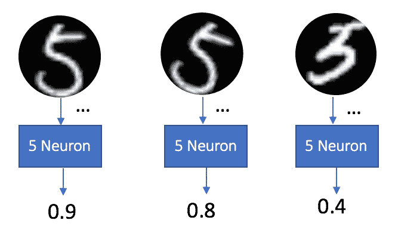*****

*****现在，我们可以对更多的信息进行编码，如果不是一个神经元，而是一个有两个神经元的囊，也可以指示手指的角度。向量本身的长度表示该输入有多可能是该胶囊所表示的；与单个神经元输出的概率信息相同。*****

*****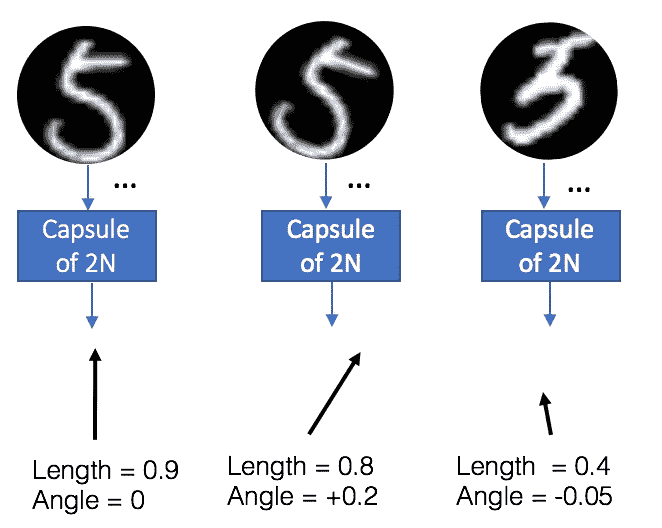*****

******长度计算为矢量的大小。如果第一个向量是* `v=(0,0.9)`，那么它的长度就是= `sqrt√(0^2 + 0.9^2) = 0.9`。现在我们可以在胶囊中添加更多的神经元来捕捉更多的维度:尺度和厚度、宽度、笔画粗细、倾斜等。

Hinton 等人(2017)在其论文中展示了在 MNIST 数据集上训练的 DigitCaps 图层胶囊中各种维度的结果，其中包含这些维度:*****

*****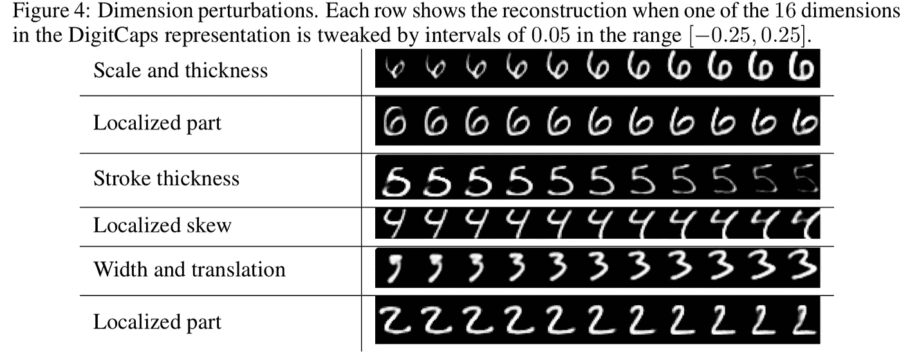*****

*****From the original paper: Sabour, Frosst and Hinton (2017), Google Brain [[https://arxiv.org/pdf/1710.09829.pdf](https://arxiv.org/pdf/1710.09829.pdf)]*****

# *****胶囊是做什么的？*****

*****胶囊学习正确的转换并优化其输出。这是怎么回事？首先，让我们回忆一下传统神经元在 CNN 中的作用:*****

*****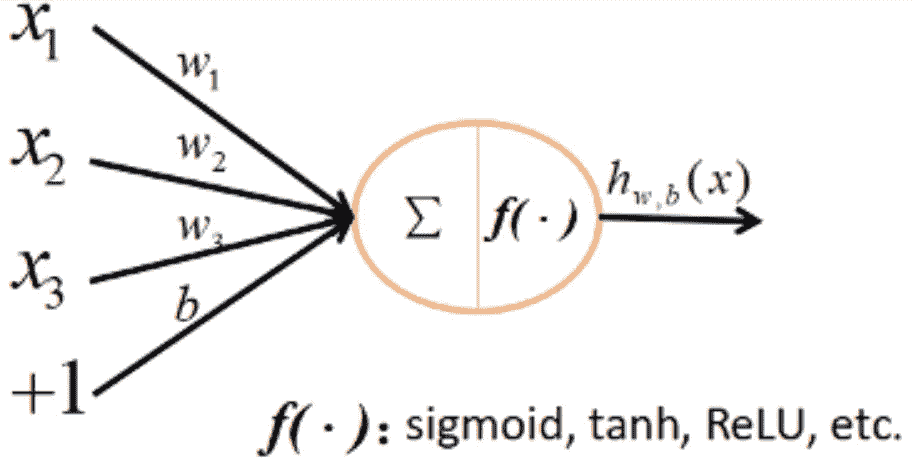*****

*****Traditional Neuron part — image from [Naturomics](https://github.com/naturomics/CapsNet-Tensorflow)*****

1.  *****接收标量作为输入(X1，X2，X3)，附加常数(1)表示偏置权重*****
2.  *****对输入标量执行加权求和(通过标量权重 w1、w2、w3 和 b)*****
3.  *****应用非线性激活函数*f()******
4.  *****输出标量 h(取决于其学习的权重参数 *w，b.******

*****我们自己的太空舱也以类似的方式运作，但有很大的不同。*****

*****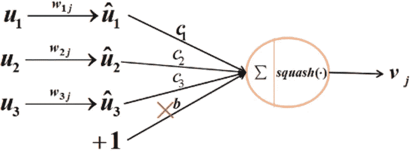*****

*****Capsule Networks Neuron structure. Image from [Naturomics](https://github.com/naturomics/CapsNet-Tensorflow)*****

*******1。输入一个矢量( *u_i* )。**传统神经元接收单个标量作为输入并输出单个标量，而胶囊接收输入向量并输出向量。这些输入向量 *u1、u2、u3* 来自前一层的胶囊。假设他们代表眼睛，鼻子/鼻子和狗嘴。它们的长度代表了它们正确识别所接收内容的概率。它们的方向表示胶囊的维度空间中底层对象的变化/状态。*****

*****请注意，第一层胶囊没有相同的输入，因为它不是由其他胶囊产生的。这个后面会讨论。*****

*****还要注意，没有*偏置*作为输入。该偏差可以包含在下一阶段“仿射变换”中，其中变换矩阵 Wij 可以包含该偏差和更复杂的运算。*****

*******2。仿射变换**。*****

*****这一步是胶囊独有的。它将一个**变换矩阵** *Wij* 应用于前一层的矢量 *u1/u2/u3* 。例如，假设我们从一个大小为***m***×**×k**的矩阵和一个大小为( *k，d)*的输入*向量 ui* 开始，我们将该向量转换为一个大小为 *(m，D)* 的新矩阵*u*【̂***Ji***。((*m*×*k*)×(*k*×1)⟹*m*×1)。*********

*******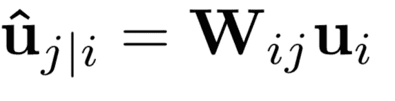*******

*******这个转换矩阵很重要；它可以表示丢失的**空间关系**以及输入的子对象(狗的鼻子、狗的右眼)和输出的高级对象(狗的脸)之间的其他关系。例如，矩阵 W1j 之一可以表示右眼在狗脸的右上部分的信息，狗脸应该大大约 20 倍，并且脸的角度应该与眼睛的角度相同。这个矩阵的目的是*将输入向量转换成代表下一级的预测输出向量的位置——人脸(更高级别的特征)。*在这个矩阵乘法之后，我们得到了面部的预测位置。这发生在每个矢量上。所以 u1 代表根据眼睛预测的狗脸位置，u2 代表根据鼻子预测的狗脸位置，u1 代表根据嘴预测的狗脸位置。这样，我们可以叠加这些预测，看看它们是否相关或相互干扰。如果他们都预测在同一个地方应该有一只狗，我们对 dog_face 的预测就更有把握了。基于每个输入叠加 dog_face 预测的示例:*******

*****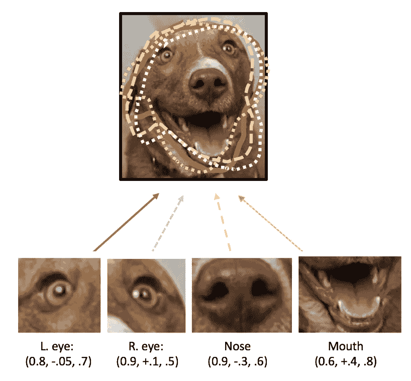*****

*****3.**输入向量** *U^j|i* 的加权和( S *ums C_ij******

*******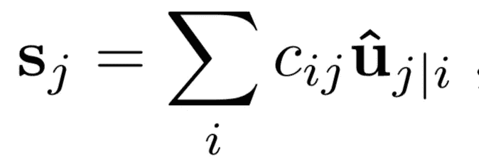*******

*******Weighted Sum of input vectors*******

*   *******C_ij 是“耦合系数”,我们使用动态路由算法(将在下面解释)找到它。它们的加权和∑ *cij* 被设计为和为 1。就目前而言，动态路由的一个简短直觉是，它是一种胶囊"*决定*"向何处发送其输出的方式。这是通过预测如果它和这个太空舱一起走，它的变形会落在太空的什么地方来实现的。我们从所有的胶囊到所有的胶囊，所以对于每一个下一个胶囊，我们有一个空间充满了前一层胶囊的假设点。这个胶囊将到达它的投影更靠近来自其他胶囊的其他点群的地方。*******
*   *******因此[口鼻囊](较低层次)可以投影哪个较高层次的囊会与其投影更一致—(在面部囊、躯干囊、腿囊之间；吻部的投影将更接近面部被膜上的投影)。因此，它将基于此拟合来优化其 C_ij 权重，最大化与 face_capsule 的拟合，最小化与 legs_capsule 的拟合。*******

*********4。“挤压函数”:一种新的矢量非线性激活函数*********

*****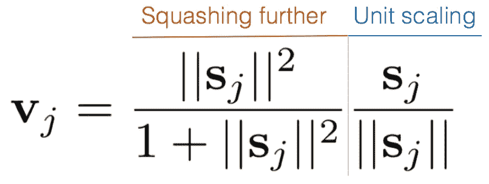*****

*****Squashing function breakdown*****

1.  *****传统上，神经元层映射到一个非线性“激活”函数的不同层，这个函数最常见的是 **ReLU** (简单到 f(x)=max(0，x)，只把所有的负值消去为 0)。*****
2.  *****胶囊网络需要从向量转换到向量，Hinton 的设计要求输出向量的长度必须在 0-1 之间(或者更准确地说，0-单位长度),才能表示概率。然而，它必须保持其方向。它如何确保这一点？他们创造了一种新的激活功能，称为“挤压”功能。它将向量缩小到 1 或更小，同时保持它们的方向。具体来说，它将大约 3–4 以上的长向量缩小到大约 1(单位向量大小)，小于 1 的向量大幅缩小(在等式的左侧，它们被平方并被自身+ 1 除)。注意，这个向量的大小表示对象属于这个胶囊的概率。*****
3.  *****(例如，对于||Sj||=1，这部分应该是 1/2=0.5，但是对于大小为||0.1||，0.1/1.1 = 0.09091 的向量*****
4.  *****挤压函数可以计算为(从 [gram-ai 的 PyTorch 实现](https://github.com/gram-ai/capsule-networks/blob/master/capsule_network.py)开始，我们将在后面介绍):*****

```
*****# squashing function as we’ve seen before
def squash(self, tensor, dim=-1):
   squared_norm = (tensor ** 2).sum(dim=dim, keepdim=True)
   scale = squared_norm / (1 + squared_norm)
   return scale * tensor / torch.sqrt(squared_norm)*****
```

1.  *******输出:产生的矢量。**成品。*****

# *****摘要*****

*****总之，胶囊的内部工作是:*****

1.  *******接收输入向量**(代表眼睛)*****
2.  *******应用编码空间关系的“仿射变换”或变换矩阵(**在眼睛和 dog_face 之间，投影脸部应该在的位置)*****
3.  *******通过路由算法学习的 C 个权重应用加权和*******
4.  *******使用非线性“挤压”激活功能将其“挤压”至 0–1*******
5.  *****得到了我们的新矢量，准备发送。*****

*****自然组学的这张表很好地总结了正常“神经元”和胶囊之间的主要差异:*****

*****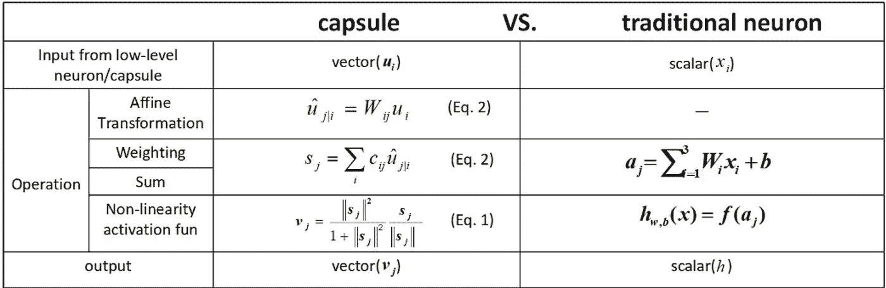*****

*****Key differences between a traditional neuron and a capsule. Source: [Naturomics](https://github.com/naturomics/CapsNet-Tensorflow)*****

*****恭喜你。如果你一路走到了这里(即使只是略读了一些技术部分)，你就知道了关于“胶囊”你需要知道的一切！*****

*****但是我们仍然需要知道: ***你用这些胶囊做什么？你如何将它们连接成一个神经网络？下一篇文章将解释胶囊之间动态路由信息的算法和架构*** *。******

*****如果你想看到下一个帖子以及未来更多的帖子，请鼓掌！*****

*****直到下一次，*****

*****托梅尔*****

*****[linkedin.com/in/tomere](http://linkedin.com/in/tomere)*****