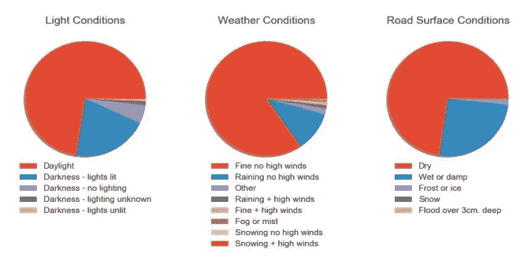
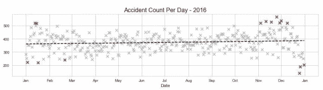
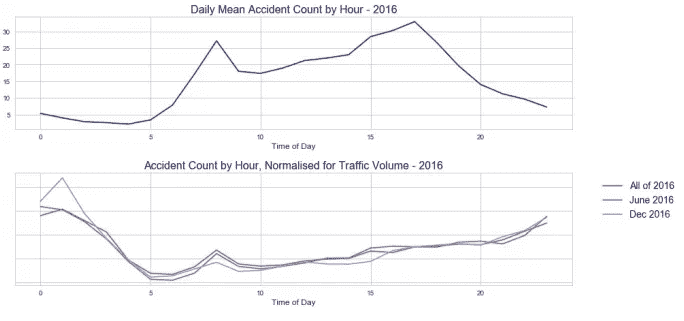
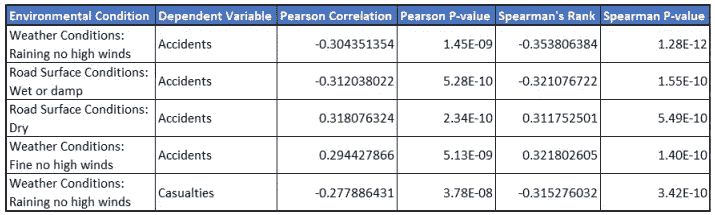
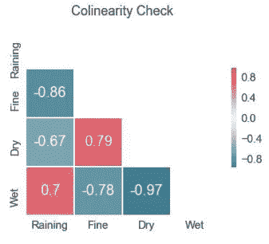
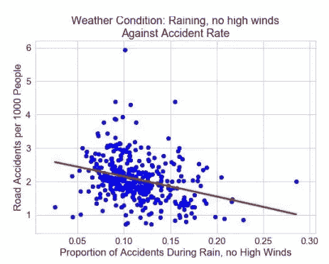
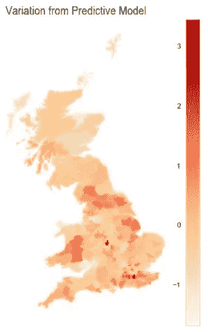
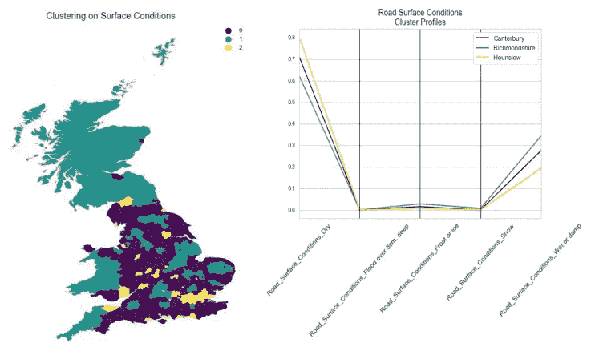

# 车祸和天气:环境条件对交通事故率影响的探索性分析

> 原文：<https://towardsdatascience.com/car-crashes-and-the-weather-an-exploratory-analysis-of-environmental-conditions-impact-on-traffic-12bcb7f9afed?source=collection_archive---------4----------------------->

在恶劣天气条件和光线不足的情况下驾驶会增加事故风险，这似乎是一个合理的假设，但我对英国交通事故数据的分析显示了一些令人惊讶的结果。

这篇文章改编自一篇更详细的报告，该报告可以在 [GitHub](https://github.com/tobystaines/RoadAccidentsPODS) 上找到，以及分析中使用的代码和数据。

在英国，每年有超过 130，000 起涉及伤害的交通碰撞报告给警方，导致 1，700 到 1，800 人死亡[1]。交通部每年发布这些事故的数据[2],自 1979 年以来，一直以类似的格式记录和发布，尽管在这项工作中，我只关注了 2016 年，这是可获得结果的最近一年。

与数据一起发布的还有一份报告[1]，该报告对事故和死亡率的年度趋势给出了一些有趣的见解，并通过查看特定的道路使用者类型(如汽车驾驶员、骑自行车者、行人等)对数据进行了细分。).它还考虑了可能相关的因素，如天气、酒后驾车率，甚至国内生产总值对事故率的影响。然而，该报告几乎没有详细说明地区趋势、全年或全天的模式，或者物理环境和撞车率之间是否存在关系。

我想调查这些点，通过挖掘数据来探索全国事故状况的模式，并看看我是否能揭示环境条件和事故率之间的任何关系。

## 数据

数据由三个主表组成:

1.  事故——32 个变量，详细说明位置、时间、日期、照明、天气和路面状况、伤亡人数、道路类型和其他变量。每个观察结果都代表了 2016 年向警方报告的 136，621 起涉及伤害的碰撞中的一次。
2.  伤亡人数——通过“事故指数”链接到事故表，该表有 16 列，提供了有关伤亡人数的详细信息。共有 181，384 行，每行代表一个在碰撞中受伤的人。
3.  车辆——此表给出了涉及碰撞的车辆的详细信息，但不用于本次调查

我还获得了政府对 2016 年英国不同类型道路上行驶距离的估计[3]，2016 年每周每天每小时的道路交通相对密度[3]，以及 2016 年地方当局(LA)层面的英国人口[4]。国家统计局提供的给出每个洛杉矶地理边界的 shapefile 用于制图目的[5]。

## 数据准备

数据中的分类变量存储为数字代码，单独的电子表格详细说明了每个变量的每个代码的含义。为了将数据转换为可读的格式，它与数据字典一起被加载到 Pandas 数据框中，代码被转换为值，然后被导出到一个新的 csv 中，用于所有剩余的工作。

初次查看时，数据似乎几乎完全完整，但仔细检查后发现，一些值相当于缺失数据(例如“未知”)。有 3999 项记录的关键变量数据缺失。这些只代表了不到 3%的数据，所以我认为它们对整体结果影响很小，并将其删除。

为了调查不同道路类型的事故率，我需要对不同道路类型的行驶距离进行综合评估[3]。这两个数据集对道路类型使用不同的分类，因此我将主数据集中更细粒度的道路类型转化为行驶距离估算中使用的类型。

# 国家一级

首先，我选择检查每起事故发生时的照明条件、路面条件和天气条件，以及它们发生的时间。

## 照明、道路和天气条件

所有这些变量显示了相似的分布(见图 1)，一类占观察值的 70-85 %,二类占 10-25 %,其余为不常见情况。这并不奇怪，因为尽管没有关于天气状况的数据，我们知道在英国天气通常是干燥和晴朗的(与刻板印象相反！)，但有时会下雨，更多的驾驶是在白天进行的。

Fig 1: Occurrence of Environmental Conditions

## 跨时间分布

接下来我想寻找的是一种季节性模式。按日期对事件进行分组产生了图 2 所示的曲线图。虽然方差在冬季月份略高，但全年的总比率变化很小(月平均值的标准偏差小于 5%)，如虚线回归线所示。考虑到每月交通量的变化，标准偏差仍然只有 8%。

有趣的一点是 12 月下旬的三个异常值。这是一年中撞车次数最少的三天:圣诞节、节礼日和除夕。

Fig 2: Traffic accidents throughout the year. Outliers (>2sd from mean) are highlighted in red.

按一天中的时间对事故进行分组显示，早晚高峰时的事故率不足为奇，夜间的事故率比白天低得多。将原始数据除以每小时的相对交通流量显示出非常不同的模式，夜间的相对事故率远远高于白天，高峰时间的影响较小。

然而，这种变化似乎不太可能是光照条件的结果，因为 12 月和 6 月的模式没有显著差异，尽管这两个月的日照时间非常不同。

Fig 3: Distribution of accidents throughout the day

# 比较地方当局

为了在区域之间进行比较，我将分类变量“光照条件”、“天气条件”和“地表条件”转换为虚拟变量，并按 LA 分组，给出每个 LA 的每个值出现的频率。

在这一阶段还纳入了人口估计，从而能够计算每 1000 名居民的洛杉矶事故率。这显然是一个不完善的衡量标准，因为它假设了一个地区的常住人口和开车到那里的人之间的关系，这不一定有效，但它为分析提供了一个良好的起点。洛杉矶的道路交通量在这里非常有用，但它们仅在国家一级可用。

为了避免扭曲结果，一个极端的异常值洛杉矶，伦敦金融城，被确定并删除。由于其居民人口少，但非常繁忙，该市的事故率为每 1000 名居民 38.8 起，是第二高的洛杉矶事故率的六倍多(威斯敏斯特为 5.94 起，可能受到类似偏见的影响，但程度较低，不会明显影响结果)。

虚拟变量计数被转化为每个 LA 的总事故计数的比例。在没有详细天气数据的情况下，这为我提供了一个每个地方的天气状况的代理。

考虑到这些变量的偏斜性质(参见照明、道路和天气条件部分)，并且为了便于变量之间以及 LAs 之间的比较，这些比例在 LAs 中的分布在 0 和 1 之间进行了重新调整。

这一过程产生了 18 个新列。将每一项与事故、伤亡、重伤和死亡率相对照，并计算 Pearson 和 Spearman 的等级分数，结果显示这些组合中的大多数并没有很强的相关性。在进行的 72 次比较中，表 1 列出了绝对相关系数大于 0.3 的 5 次比较。值得注意的是，没有一个选定的环境条件与照明有关。

Table 1:Correlation between environmental conditions and accident or casualty rate

确定了潜在的相关性后，下一步是建立一个回归模型，看看这个模型如何适用于全国。多元回归假设预测变量之间没有关系，但很明显在这种情况下会有一些关系。两个天气条件值和两个路面条件值是源自相同变量的成对值。此外，潮湿的路面显然与下雨有关，干燥的路面则与好天气有关。图 4 证实了所有四个变量都是密切相关的。

Fig 4: Confirming co-linearity of potential predictors

这允许使用简单的单变量回归模型。选择“没有大风的雨”是因为它与事故率的相关性最强。图 5 显示了它们的关系。然后从每个地方当局的真实事故率和图 6 中绘制的残差中减去得到的多项式回归模型(以红色显示)。

Fig 5: Raining, no high winds against Accident Rate

该模型没有显示出明显的区域模式，尽管在伦敦和伯明翰周围的郊区可以看到高于预期的事故率。

Fig 6: A map of the UK showing the difference between true accident rate and that predicted by a linear regression model based on rainy, low wind weather conditions. High values indicate a higher than expected accident rate.

随着天气和地表条件被确定为事故率的一个可能的促成因素，我想看看是否有可能确定这些条件具有相似频率的 LAs 组。k 表示在重新标度的路面条件下的聚类没有提供好的结果。还尝试了聚类，将变量重新调整为均匀分布，但这给了较罕见的条件太多的权重。回到原来的比例产生三个清晰的集群。图 7 显示了最接近每个集群质心的 LA 的轮廓和集群的地理分布

Fig 7: Clustering on Surface Conditions. Left: Geographical distribution of clusters. Right: Parallel coordinates plot showing the profile of the LAs closest to the cluster centroids.

# 讨论结果

这项调查的预期是，在黑暗中和恶劣天气下驾驶是危险的，这将通过冬季以及在通常更寒冷和更潮湿的地区(该国的北部和西部)较高的车祸率得到证明，但这并没有得到结果的支持。全年交通事故率无明显变化；每月的事故率变化很小，12 月和 6 月的每小时事故模式非常相似。分析还发现，在不同照明条件下发生的事故比例与这些事故的发生率或严重程度之间没有联系。

天气/路面状况与事故率之间存在关系，但与预期相反。涉及潮湿条件的事故比例较高的 LAs 的总体事故率往往较低。

一个可能的原因是，糟糕的天气不但没有导致更多的事故，反而减少了事故，因为它会阻碍驾驶，导致司机减少，道路不那么拥挤，车速降低。这种关系不是特别强，但这可以支持上述假设，因为无论天气如何，经常需要旅行。准确的洛杉矶每日天气记录和交通流量估计将允许在这一地区进行更大的调查。

按照城市区域的清晰地理模式，该国温暖、干燥的南部和东部，寒冷、潮湿的北部和西部，以及一些海拔较高的地区，如奔宁山脉，有可能识别出具有类似事故状况的 LAs 集群(图 7 ),这些集群与预期相符。

虽然结果有些令人惊讶，但调查的目标已经达到，但仍有许多数据领域可以进一步调查，例如在不同条件下，交叉口布局或车辆类型如何与碰撞率相关。

# 最后…

感谢阅读！如果你喜欢我的作品，请留下一些掌声。如果你想了解更多，我使用的代码可以在 [GitHub](https://github.com/tobystaines/RoadAccidentsPODS) 上找到，还有[随同工作的原始报告](https://github.com/tobystaines/RoadAccidentsPODS/blob/master/Environmental%20Conditions%20and%20Road%20Traffic%20Collisions%20in%20the%20UK%20v1.2.pdf)，比这篇文章更深入一点。

## 工具

除了在 Excel 中为准备加载数据而做的一些微小的格式更改之外，所有其他工作都是使用 Python 完成的。Numpy 和 Pandas 用于大部分数据操作。Sci-kit Learn 用于归一化数据(quantile_transform 和 MinMaxScaler)、Kmeans 聚类(KMeans)和识别最接近每个聚类中心的 LA(pairwise _ distances _ arg min _ min)。Matplotlib 和 Seaborn 用于基于图形的可视化，Geopandas 用于地理可视化。

## 参考

[1] D. for T. UK 政府，“英国报告的道路伤亡人数，年度报告:2016—gov . UK”[在线]。可用:[https://www . gov . uk/government/statistics/reported-road-residences-great-Britain annual-report-2016。](https://www.gov.uk/government/statistics/reported-road-casualties-great-britainannual-report-2016.)【访问时间:2017 年 10 月 30 日】。

[2] D .代表英国政府，“道路安全数据—数据集”，2017 年。【在线】。可用:[https://data.gov.uk/dataset/road-accidents-safety-data.](https://data.gov.uk/dataset/road-accidents-safety-data.)【访问时间:2017 年 10 月 30 日】。

[3] D .对于 T. UK 政府，“GB 道路交通计数-数据集。”【在线】。可用:[https://data.gov.uk/dataset/gb-road-traffic-counts.](https://data.gov.uk/dataset/gb-road-traffic-counts.)【访问时间:2017 年 11 月 5 日】。

[4] O 代表 N. S .联合王国政府，“联合王国、英格兰和威尔士、苏格兰和北爱尔兰的人口估计数——国家统计局。”【在线】。可用:[https://www . ons . gov . uk/peoplepulationandcommunity/populationandmigration/populationestimat](https://www.ons.gov.uk/peoplepopulationandcommunity/populationandmigration/populationestimat)es/datasets/populationestimates forukenglandwalesscotland northern Ireland。[访问日期:2017 年 11 月 30 日]。

[5] O .对于 N. S. UK 政府，“英国地方当局辖区(2016 年 12 月)完全剪切边界—数据集。”【在线】。可用:[https://data . gov . uk/dataset/local-authority-district s December-2016-full-clipped-boundaries-in-great-Britain 2。](https://data.gov.uk/dataset/local-authority-districtsdecember-2016-full-clipped-boundaries-in-great-britain2.)【访问时间:2017 年 11 月 30 日】。