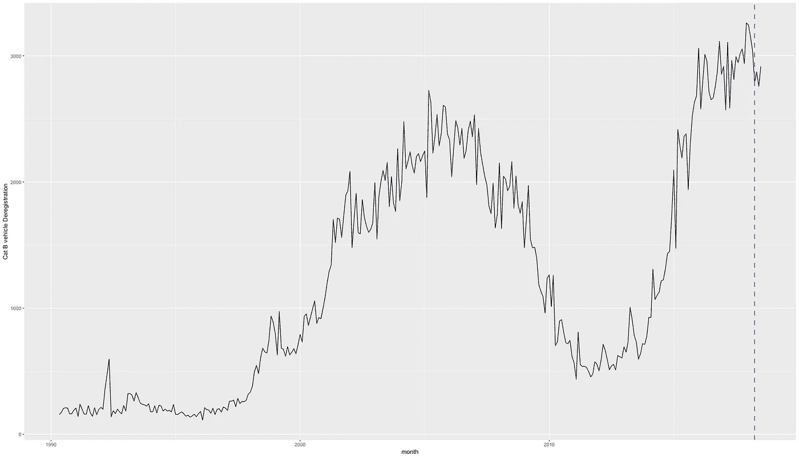
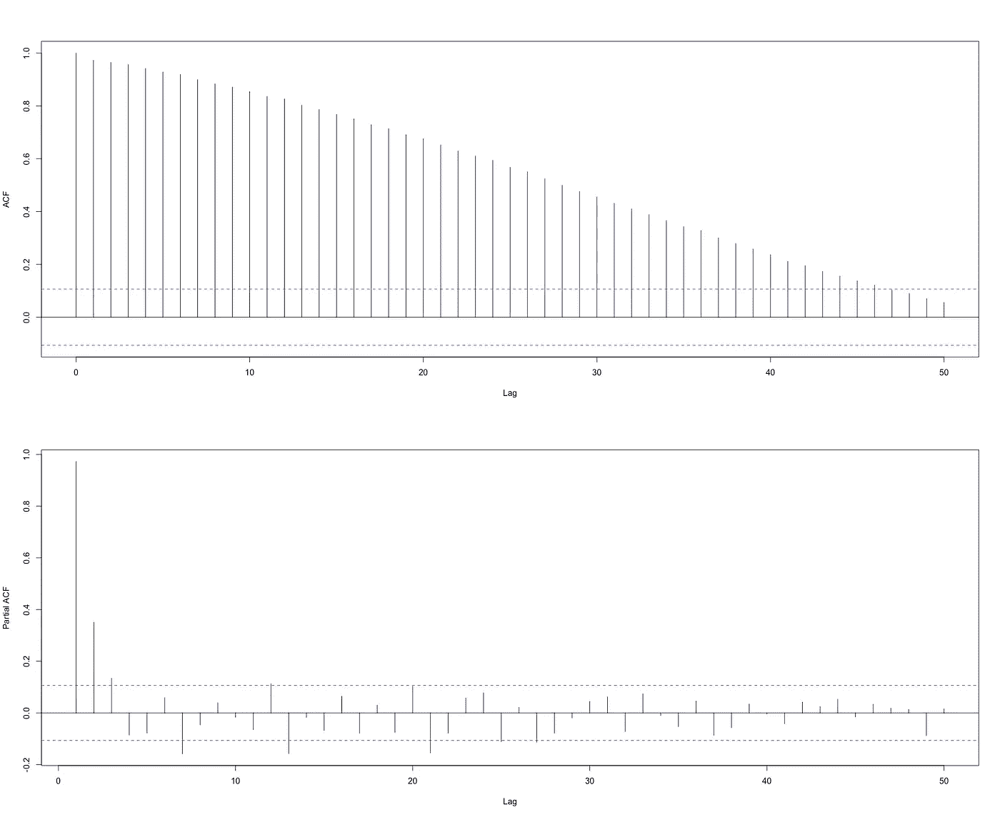
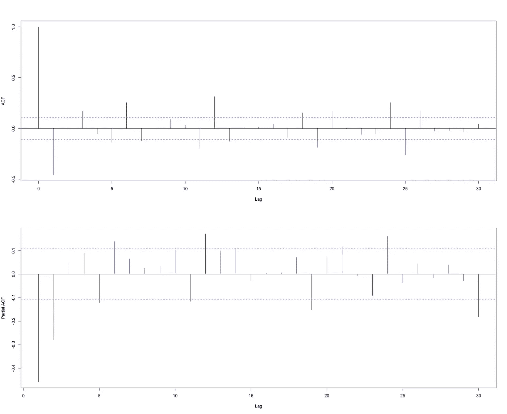
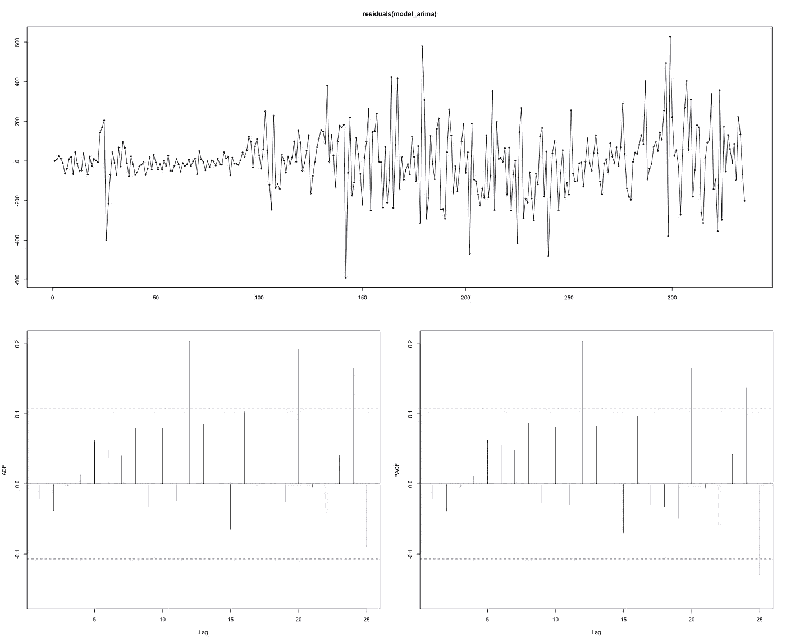
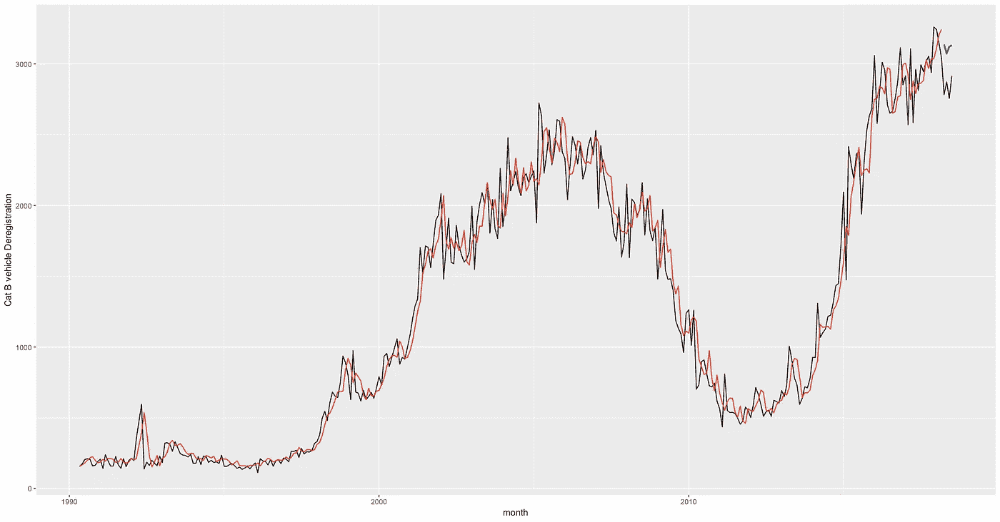
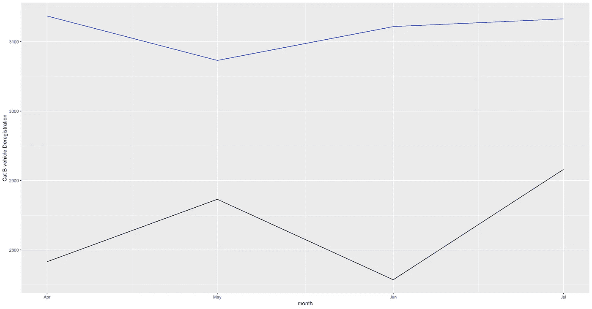
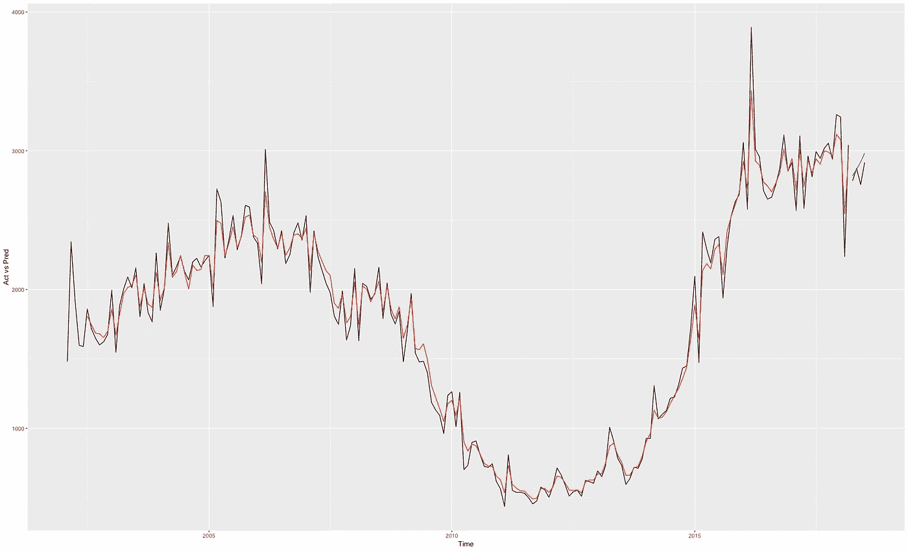
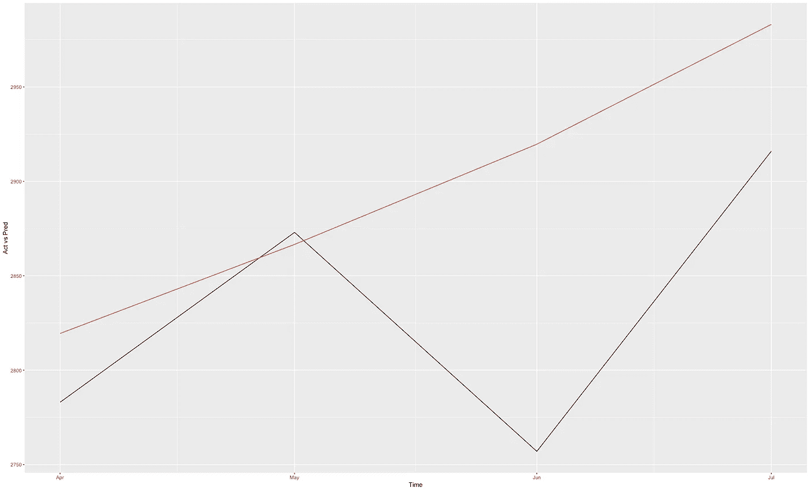
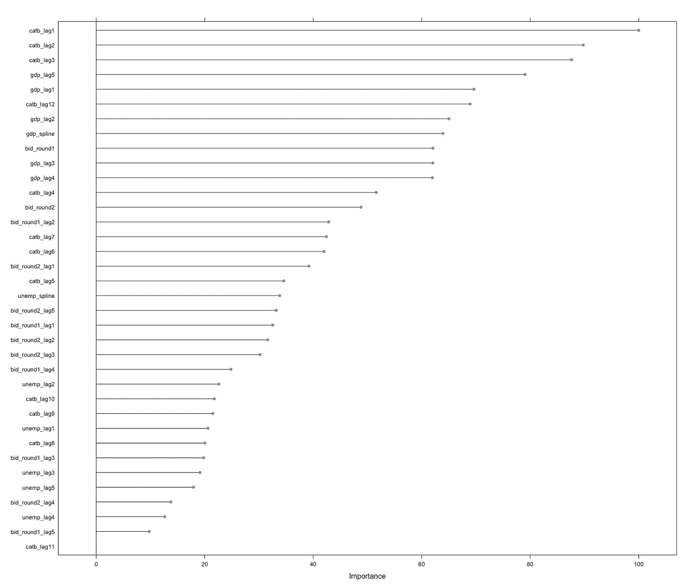

# 新加坡的汽车注销:可以预测吗？

> 原文：<https://towardsdatascience.com/car-de-registrations-in-singapore-can-they-be-predicted-e531327ea1c7?source=collection_archive---------17----------------------->

## R 中使用 ARIMA 和随机森林的时间序列建模

(编辑:我最近在 Python 上复制了整个项目，GitHub repo 的链接是[这里](https://github.com/reubenlee3/car-deregistrations-py/blob/master/Car-Rental%20Deregistration.ipynb)！)

“你好世界！”

对于我的第一篇帖子，我想简单谈谈我在 2018 年夏天从事的一个预测项目。这是一个令人愉快的过程，而且非常有趣。鉴于我在维也纳的冬季交流项目中获得的一些教育启示(基本上我有很多空闲时间)，我决定就我的结果写一篇短文。此外，这将是一个从更广泛的社区寻求反馈和评论的好时机，作为更广泛的学习体验的一部分。

*免责声明:我涉足统计学/数据科学/ML 纯粹是出于兴趣(当然也是为了赶上 21 世纪的潮流)，所以我尽最大努力让自己掌握所有必要的知识。如果在下面的帖子中有任何技术上的误解，请告诉我正确的方向！*:)

我们走吧！：

# **语境**

在新加坡，与世界上其他国家的居民相比，个人拥有汽车对新加坡人来说有着更不同的意义。为了成为一个“备受尊敬”的车主，你必须首先获得一个有效期为 10 年的权利证书。确切地说，在这里获得 COE 的过程对我来说有点混乱，但这涉及到某种形式的投标。只有当您成功地为您的车辆获得正确的 COE 类别时，您才能最终拥有您的汽车。

也就是说，当汽车的 COE 达到 10 年标志时，它的道路使用不再合法。因此，车主可以选择购买一辆拥有新 COE 的新车，更新他们的 COE，或者干脆报废汽车以获得某种形式的折扣。在任何情况下，如果您选择不更新当前汽车的 COE，您将需要注销它。

那么汽车注销数据到底有什么大不了的呢？：

*   可以说，汽车注销的趋势对于那些产品围绕汽车 10 年生命周期的公司的商业决策具有重要意义。
*   这些趋势也可能是消费者情绪的宏观经济指标。

在这篇文章中，我将只是(无聊地)试图无力地预测新加坡汽车注销的未来价值。我在这个项目上的 Github repo 可以在这里找到！

# 第 1 部分:数据准备和可视化

所有数据都可以在 Singstat 表格生成器上找到，这是一个非常棒的工具。我要看的车的类别是**B 类**是 1600cc 及以上的车，或者发动机功率输出超过 97 kW。该数据为月度序列，第一个时间点为 1990 年 2 月。对时间序列图的初步扫描显示了一些异常值，我决定使用 *tsclean* 函数清除这些异常值。



Figure 1: Time Series of Cat B car de-registrations

对我来说看起来很像时间序列图。我观察到某种形式的单周期行为(但在没有更多数据点的情况下，我们不能太确定)，没有明显的季节性和总体上升趋势。

在通过任何预测模型运行数据之前，我会首先将它们分成训练/测试集。对于这篇文章，训练集将是截至 2018 年 3 月的所有数据点，我将在随后的 4 个月(2018 年 4 月:7 月)测试我的模型。为了便于说明，训练和测试数据分割显示为上面时间序列中紫色虚线左侧和右侧的点。

# 第 2 部分:拟合 ARIMA 模型

我想尝试的第一个模型是 ARIMA 模型。本质上，ARIMA 由三部分组成:自回归部分(AR(p))、积分部分(I(d))和移动平均部分(MA(q))。我很想深入了解更多的细节，但我不认为我是合适的人选。对于 ARIMA 更多的技术解释，我发现在谷歌上搜索[“什么是 ARIMA”](https://www.quora.com/What-is-ARIMA)的第一个链接是最有信息量的！

我在这里的任务是指定这三个参数 *(p，d，q)* 到底是什么，这可以手动完成——这是我接下来要做的，并且使用*预测*包中的 *auto.arima* 函数在 R 上自动完成。

为了让我能够拟合 ARIMA 模型，数据必须首先是稳定的。平稳本质上意味着时间序列的均值和方差不是时间的函数。根据这一假设，我认为从图 1 中可以很清楚地看出，这一时间序列不是平稳的。为了证实这一点，我绘制了时间序列的 ACF 和 PACF 图，以及一个增强的 Dickey Fuller (ADF)平稳性测试来证明我的说法:

```
Augmented Dickey-Fuller Test
Dickey-Fuller = -1.268, Lag order = 6, p-value = **0.8854**
alternative hypothesis: stationary
```



Figure 2: ACF and PACF plots of the Cat B vehicle de-registration

ADF 的高 p 值告诉我们，我们不拒绝零，表明序列确实是非平稳的。从 ACF/PACF 图中，我们可以推断出两件事:

*   在 ACF 图中，稳定下降的模式表明了 B 类车辆注销与其滞后之间的相关性，本质上意味着该序列不是稳定的
*   ACF 的稳定下降模式和 PACF 的急剧下降(滞后 3 之后)表明 3 阶 MA 模式(q = 3)

为了将我的非平稳序列转换成平稳序列，我将对序列进行一次差分，并运行与上述相同的程序来测试差分后的序列现在是否平稳。

```
Augmented Dickey-Fuller Test
Dickey-Fuller = -6.3372, Lag order = 6, p-value = **0.01**
alternative hypothesis: stationary
```



Figure 3: ACF and PACF plots of the Cat B vehicle de-registration after 1st differencing

不错，在对序列进行一次差分后，ADF 测试现在显示序列是稳定的，但 ACF 图仍然显示一些与滞后相关的迹象，每 2 个滞后出现一次。类似地，PACF 图显示了每 5 或 6 个滞后的循环模式。也许可能的模型会有参数 *(p = 5:6，d = 1，q = 2)* ？为了便于练习，我确实循环了几个 *(p，d，q)* 的组合，并选择了 AIC 值最低的模型，这可以在我的脚本中看到。然而，在这篇文章中，我将展示来自 *auto.arima* 函数的结果。

```
Series: train_ts_arima$Catb_clean 
**ARIMA(3,1,2)** with driftCoefficients:
 ar1 ar2 ar3 ma1 ma2 drift
 -1.4925 -1.3896 -0.4577 0.9660 0.7325 8.7529
s.e. 0.0963 0.0992 0.0625 0.0965 0.0872 5.4097sigma² estimated as 25681: log likelihood=-2166.91
AIC=4347.81 AICc=4348.16 BIC=4374.49
```

嘿！至少我有两个参数是正确的！ *auto.arima* 函数指定 *(p = 3，d = 1，q = 2)* 为现在的最佳模型，让我们看看模型残差是否有意义，以及我是否可以使用该模型进行未来预测。



Figure 4: ARIMA model residual,

嗯。模型残差似乎具有变化的方差，并且在 ACF 和 PACF 图中有显著的尖峰，特别是在滞后 12 左右重复出现。*对此能做些什么？*也许我可以试着将 p*或 q*设置为 12，然后看看结果如何，或者我也可以在拟合 ARIMA 模型之前对这个系列进行自然记录(事后看来，我应该早点这么做)。尽管如此，为了便于说明，请允许我仅使用这个当前模型来预测未来四个月的情况- **注意，这个模型可能不是最准确的。**



Figure 5: Actual values in black, fitted ARIMA values in red, new forecasted values in blue

嗯，样品内拟合似乎很有希望。在我的拟合值中似乎有一个周期的超前，但这可能是因为在*拟合*函数中的 *h* 规范，它定义了它将预测多少步。样本外性能如何？

放大到图形的右上方(蓝色)会产生:



Figure 6: Forecasted values for (April : July 2018) using ARIMA model in blue, actual figures in black

2018 年 4 月至 7 月的预测值似乎有点偏离，但嘿，我想这是意料之中的。我可以想象大量的宏观经济和社会因素/指标可能会对汽车注销产生影响，因此期望该模型仅根据其历史价值来预测未来价值可能会有所推动。将来，引入其他解释变量的 ARIMAX 模型可能有助于改进模型预测。

# 第 3 部分:随机森林时间！

在维也纳的冬季交流中，我主要学习了机器学习应用模块，并正式接触了当今世界使用的各种预测模型。我的教授接着开玩笑说，“如果你不知道如何处理你所有的数据，就把它们扔进一个随机的森林模型，看看会有什么结果”。为什么我们不这样做呢？

从我的脚本中可以看出，在幕后，一些额外的数据准备是必要的。TLDR:

*   增加了新加坡的 GDP 值、人口规模、失业数据和每个投标窗口收到的投标数量。凭直觉，我认为这些预测因素应该在影响汽车注销数量方面发挥作用。所有数据集都可以从 Singstat 获得。
*   对于 GDP、人口和失业等数据，我需要从中获得月度数据。不幸的是，这些数据大约每季度公布一次。因此，我在 *splinefun* 函数下使用了一种叫做[三次插值](https://en.wikipedia.org/wiki/Spline_interpolation)的方法来生成每月的数字。
*   然后，我创建了所有预测值的滞后值。回想一下，到目前为止，我的四个主要预测指标是:B 类车辆注销、GDP、人口、失业和投标数据。对于 B 类车辆注销数据，我包括了多达 12 个标记，对于其余数据，我包括了多达 5 个标记。要包括的滞后数是任意确定的。
*   训练和测试分割保持不变，但是必须对训练集进行小的调整，以减少 *NA* 值的数量。在这种情况下，我的训练集的起点从 1990 年 5 月移到了 2002 年 2 月。

完成后，是时候创造一个森林了！

为了实现随机森林，我将使用 *caret* 包， *method = "rf"* 。要调优的超参数只有一个，就是 *mtry* 。为此，我进行了网格搜索，以找出最佳值。对于交叉验证过程，我使用常见的 10 重交叉验证来减少过度拟合，并增加我的随机森林的健壮性。

结果呢？让我们来看看随机森林模型的样本内性能:



Figure 7: Actual values of Cat B vehicle de-registration in black, fitted RF model values in red, forecasted values in blue

还不错！这些预测在预测峰值方面有所欠缺，但总体趋势是存在的。样本外性能如何？



Figure 8: Actual values in black, forecasted RF values in red

在预测 2018 年 4 月至 7 月的价值方面，RF 模型似乎做得更好。如您所见，至少在四月和五月，预测值似乎非常接近实际值。然而，它没有预测到 6 月份的下降，7 月份的预测也略有偏差。

同时，让我们来看看变量的一些相对重要性:



Figure 9: Variable importance plot (note that if a variable is a lagged variable it is denoted “…_lag”.

这里的一个要点是，前 7 个“最重要”的变量是滞后值。现在我知道这是有意义的，因为我们经常查看当前时间段内发生的事情，以便为下一个时间段做出决定，但在真实世界的数据集中看到这种情况是非常令人着迷的。

# 结论

嗯，就是这样！这标志着我第一次尝试在真实世界数据集(而不是通常的 iris 或 titanic 数据集)上玩预测建模的结束。从商业角度来看，鉴于汽车市场在消费者家庭支出中所占的比重如此之大，我相信这些模型会有很多应用。写这篇文章是一个非常愉快的过程，我非常感谢反馈和评论！

# 参考

[](https://www.datascience.com/blog/introduction-to-forecasting-with-arima-in-r-learn-data-science-tutorials) [## ARIMA 预测简介

### 具体话题经验:新手职业经验:一些行业经验以前的知识…

www.datascience.com](https://www.datascience.com/blog/introduction-to-forecasting-with-arima-in-r-learn-data-science-tutorials)