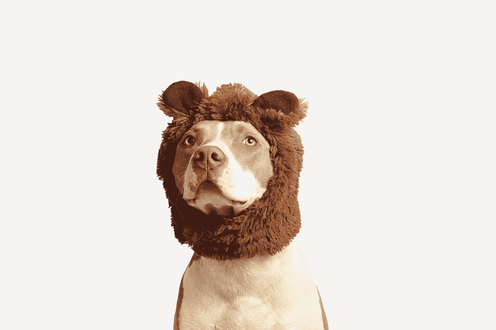
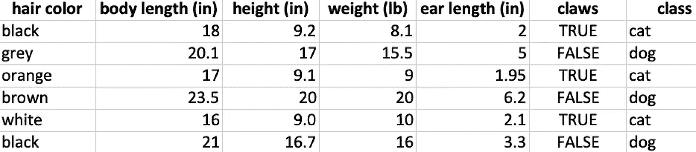
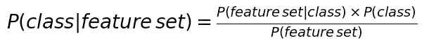
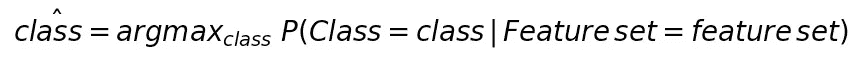

# 猫还是狗？朴素贝叶斯简介

> 原文：<https://towardsdatascience.com/cat-or-dog-introduction-to-naive-bayes-c507f1a6d1a8?source=collection_archive---------14----------------------->

如果你读过任何关于机器学习的介绍性书籍或文章，你可能会偶然发现[朴素贝叶斯](https://en.wikipedia.org/wiki/Naive_Bayes_classifier#Semi-supervised_parameter_estimation)。这是一种通俗易懂的分类算法。

让我们退一步，解开朴素贝叶斯。

简而言之，朴素贝叶斯就是

*   分类算法
*   监督学习算法
*   概率分类器

**朴素贝叶斯是一种分类算法**。一个复杂的名字来说，给定一个例子，朴素贝叶斯能够给它分配一个类别，就像给它贴上一个标签说*猫*或*狗*，如果它*看到*一只猫的图像或一只狗的图像。

它也是被称为**监督学习算法的算法家族的一部分。**这是*通过查看正确分类的示例来学习*的算法类型。按照机器学习的说法，每个例子都是一组*特征*，即描述特定例子的属性。该算法用来学习的一组例子被称为*训练集*，它用来检查其分类能力的新的和从未见过的例子被称为*测试集。*算法最终向其分配一个*类*或*标签。*

朴素贝叶斯也是一个概率分类器。算法*学习*来预测的类或标签是创建它所显示的所有类的[概率分布](https://en.wikipedia.org/wiki/Probability_distribution)的结果，然后决定将哪个分配给每个示例。概率分类器查看[条件概率分布](https://en.wikipedia.org/wiki/Conditional_probability_distribution)，即在给定一组特定特征的情况下分配一个类别的概率。

假设你有这个(微小的)数据集，将动物分为两类:猫和狗。

A minuscule, dummy dataset 😁

如果该算法要计算出将哪个类分配给与上述类似的示例，即预测其类，它将考虑两件事:

a)假设毛发颜色为黑色，体长为 18 英寸，身高为 9.2，体重为 8.1 磅，…

b)在给定相同特征的情况下，成为狗的概率。

一般来说，条件概率是 P(类别|特征集)。在我们的例子中，classes = {cat，dog}和 feature set = {hair color，body length，height，weight，ear length，爪子}。

朴素贝叶斯将计算所有类的条件概率，因为它是朴素的，**它将假设每个特征都是相互独立的**。它将假设任何特征之间没有相关性，因此，它们对预测类的贡献不受其他特征的影响。

名字说明了一切。它使用[贝叶斯定理](https://en.wikipedia.org/wiki/Bayes%27_theorem)来计算条件概率

Bayes Theorem

概率 P( *类* | *特征集*)也被称为*后验*，即在考虑所有给定条件后，事实发生后的概率。它是给定一组可以在猫身上观察到的特征(属性)，将一幅图像分类为一只猫的图像的概率。P( *类*)被称为*先验*，因为它是你事先知道的所有信息，是猫还是狗的概率。P( *特征集*)被称为*证据*，因为它是你所观察到的概率，特征集。而 P( *特征集* | *类*)被称为*可能性*，意思是给定这个特定的特征集，这是一个猫的图像的可能性有多大。

计算完所有类别的概率后，就该做决定了。

## 我应该给这个例子分配什么类呢？

将一个类别分配给一个新的、从未见过的特征集的决策是一个 [*最大后验决策*](https://en.wikipedia.org/wiki/Maximum_a_posteriori_estimation) 。一种是估计哪个*后验*概率，例如 P(特征集|猫)或 P(特征集|狗)，将最大化看到该特定类的实例的可能性。

一般来说，你有

左手边那个戴着*帽子的*就是你的预测。

该算法将挑选具有较高概率的类。

总之，朴素贝叶斯利用贝叶斯定理来*学习*最能描述*训练集*中提供的示例的特征。它依靠最大后验决策规则来预测*测试集*中提供的每个新的、以前从未见过的示例的类别。

**主要优点是**

*   简单
*   需要小的训练集
*   计算速度快
*   与特征和训练示例的数量成线性比例
*   处理二进制(猫，不是猫)和多类分类(猫，狗，老鼠)

**缺点**

*   在现实世界中很少成立的强特征独立性假设。记住，这是天真的
*   基于其独立性假设，可能提供较差的估计

*感谢阅读！*