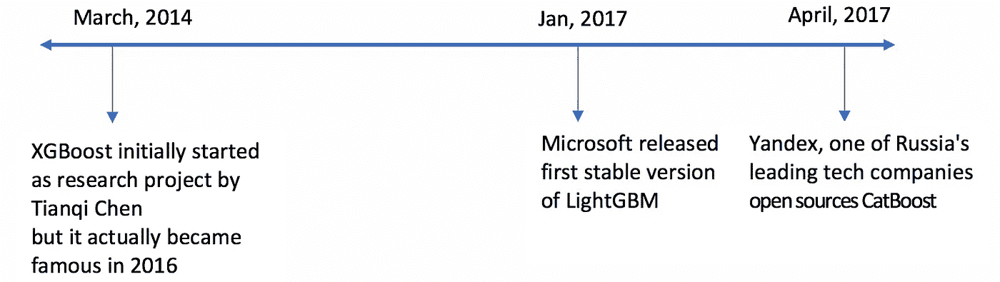
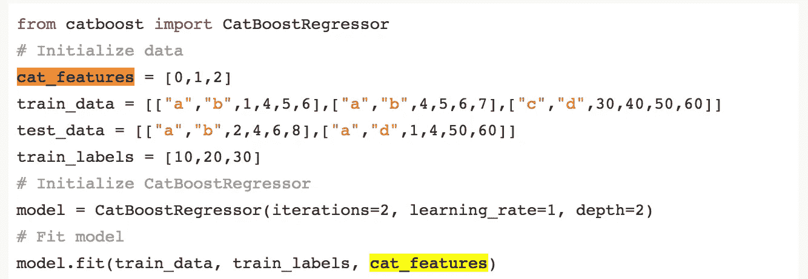
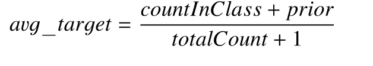
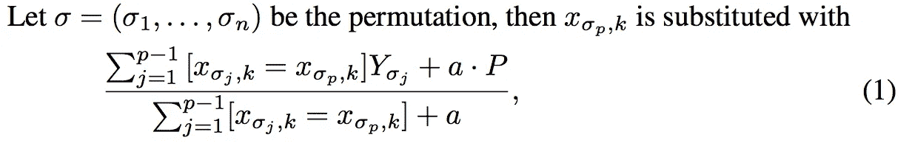
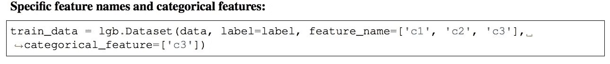
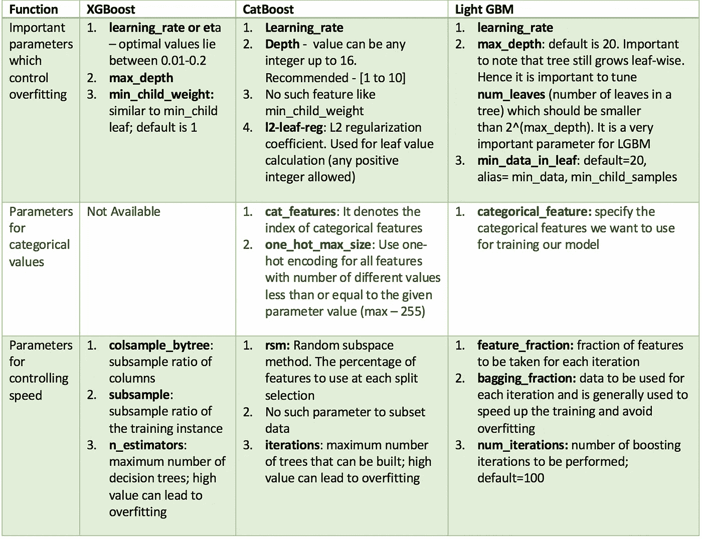
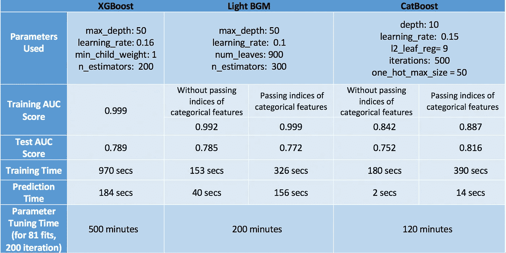

# CatBoost 与轻型 GBM 和 XGBoost

> 原文：<https://towardsdatascience.com/catboost-vs-light-gbm-vs-xgboost-5f93620723db?source=collection_archive---------0----------------------->

谁将赢得这场预言之战，代价是什么？我们来探索一下。

我最近参加了这个 Kaggle 竞赛(斯坦福大学的 WIDS·数据通)，在那里我使用各种推进算法进入了前 10 名。从那以后，我一直对每个模型的精细工作非常好奇，包括参数调整、优点和缺点，因此决定写这篇博客。尽管最近神经网络重新出现并受到欢迎，但我还是专注于 boosting 算法，因为它们在有限的训练数据、很少的训练时间和很少的参数调整专业知识的情况下仍然更有用。

由于 XGBoost(通常称为 GBM 黑仔)在机器学习领域已经有很长一段时间了，现在有很多文章专门讨论它，这篇文章将更多地关注 CatBoost 和 LGBM。以下是我们将涉及的主题-

*   结构差异
*   每个算法对分类变量的处理
*   了解参数
*   数据集上的实现
*   每种算法的性能

# LightGBM 和 XGBoost 的结构差异

LightGBM 使用一种新颖的基于梯度的单侧采样(GOSS)技术来过滤数据实例，以找到拆分值，而 XGBoost 使用预先排序的算法&基于直方图的算法来计算最佳拆分。这里的实例指的是观察结果/样本。

首先，让我们了解预排序拆分是如何工作的

*   对于每个节点，枚举所有功能
*   对于每个特征，按特征值对实例进行排序
*   使用线性扫描来决定沿着该特征基础的最佳分割[信息增益](https://en.wikipedia.org/wiki/Information_gain_ratio)
*   根据所有功能选择最佳分割解决方案

简而言之，基于直方图的算法将一个特征的所有数据点分割成离散的仓，并使用这些仓来找到直方图的分割值。虽然它在训练速度上比列举预排序特征值上所有可能的分裂点的预排序算法更有效，但在速度上仍落后于 GOSS。

**那么是什么让这种戈斯方法如此有效呢？** 在 AdaBoost 中，样本权重作为样本重要性的一个很好的指标。然而，在梯度提升决策树(GBDT)中，没有本地样本权重，因此不能直接应用为 AdaBoost 提出的采样方法。接下来是基于梯度的采样。

> 梯度表示损失函数的正切的斜率，因此在逻辑上，如果数据点的梯度在某种意义上很大，这些点对于找到最佳分裂点是重要的，因为它们具有较高的误差

GOSS 保留所有具有大梯度的实例，并对具有小梯度的实例执行随机采样。例如，假设我有 500，000 行数据，其中 10，000 行具有更高的梯度。所以我的算法会选择(较高梯度的 10k 行+随机选择的剩余 490k 行的 x%)。假设 x 是 10%，根据找到的拆分值，所选的行总数是 500K 中的 59k。

> 这里采用的基本假设是，具有小梯度的训练实例的样本具有较小的训练误差，并且它已经被很好地训练。
> 为了保持相同的数据分布，在计算信息增益时，GOSS 对梯度较小的数据实例引入了常数乘数。因此，GOSS 在减少数据实例的数量和保持学习决策树的准确性之间取得了良好的平衡。

Leaf with higher gradient/error is used for growing further in LGBM

# 每个模型如何对待分类变量？

## CatBoost

CatBoost 可以灵活地给出分类列的索引，以便可以使用 one_hot_max_size 将其编码为一键编码(对于不同值的数量小于或等于给定参数值的所有要素使用一键编码)。

如果您没有在 cat_features 参数中传递任何东西，CatBoost 会将所有列视为数字变量。

> **注意:如果 cat_features 中没有提供包含字符串值的列，CatBoost 会抛出一个错误。此外，默认情况下，具有默认 int 类型的列将被视为数字，必须在 cat_features 中指定它，以使算法将其视为分类。**

对于具有大于 one_hot_max_size 的唯一类别数的剩余分类列，CatBoost 使用一种高效的编码方法，该方法类似于均值编码，但减少了过度拟合。过程是这样的—
1。以随机顺序排列该组输入观察值。产生多个随机排列
2。将标签值从浮点或类别转换为整数
3。使用以下公式将所有分类特征值转换为数值:

其中， **CountInClass** 是对象的标签值等于“1”的次数，当前分类特征值
**在**之前是分子的初始值。它由起始参数决定。 **TotalCount** 是具有与当前值匹配的分类特征值的对象总数(直到当前值)。
在数学上，这可以用下面的等式来表示:

## LightGBM

与 CatBoost 类似，LightGBM 也可以通过输入特性名称来处理分类特性。它不会转换为一键编码，并且比一键编码快得多。LGBM 使用一种特殊的算法来寻找分类特征的分割值[ [链接](http://www.csiss.org/SPACE/workshops/2004/SAC/files/fisher.pdf) ]。

> **注意:在为 LGBM 构建数据集之前，应该将分类特征转换为 int 类型。即使通过 categorical _ feature 参数传递，它也不接受字符串值。**

## XGBoost

与 CatBoost 或 LGBM 不同，XGBoost 本身不能处理分类特征，它只接受类似随机森林的数值。因此，在向 XGBoost 提供分类数据之前，必须执行各种编码，如标签编码、均值编码或一键编码。

# 超参数的相似性

所有这些模型都有许多参数需要调整，但我们将只讨论重要的参数。下面是这些参数的列表，根据它们的功能以及它们在不同型号中的对应关系。

# 数据集上的实现

我使用的是 2015 年航班延误的 Kaggle [数据集](https://www.kaggle.com/usdot/flight-delays/data)，因为它同时具有分类和数字特征。该数据集大约有 500 万行，对于每种类型的提升，该数据集有助于判断优化模型在速度和准确性方面的性能。我将使用这个数据的 10%的子集~ 50 万行。
以下是用于建模的特征:

*   **月、日、星期几**:数据类型 int
*   **航空公司和航班号**:数据类型 int
*   **出发地 _ 机场**和**目的地 _ 机场:**数据类型字符串
*   **出发时间:**数据类型浮点型
*   **ARRIVAL_DELAY** :这将是目标，并被转换为布尔变量，指示超过 10 分钟的延迟
*   **距离和飞行时间**:数据类型浮点

## XGBoost

## 轻型 GBM

## CatBoost

在优化 CatBoost 的参数时，很难传递分类特征的索引。因此，我在没有传递分类特征的情况下调整了参数，并评估了两个模型——一个有分类特征，另一个没有分类特征。我单独调整了 one_hot_max_size，因为它不会影响其他参数。

# 结果

# 结束注释

对于评估模型，我们应该从速度和准确性两个方面来考察模型的性能。

记住这一点，CatBoost 在测试集上具有最高的准确性(0.816)，最小的过拟合(训练和测试准确性都很接近)以及最小的预测时间和调整时间。但这仅仅是因为我们考虑了分类变量并调优了 one_hot_max_size。如果我们不利用 CatBoost 的这些特性，它的表现最差，只有 0.752 的精度。因此，我们了解到，只有当我们在数据中有分类变量并且我们适当地调整它们时，CatBoost 才表现良好。

我们的下一个表演者是 XGBoost，它通常工作得很好。它的准确性非常接近 CatBoost，即使忽略了我们在数据中有分类变量的事实，我们已经将其转换为消费的数值。然而，XGBoost 唯一的问题是它太慢了。特别是调整它的参数真的令人沮丧(我花了 6 个小时来运行 GridSearchCV——非常糟糕的主意！).更好的方法是单独调优参数，而不是使用 GridSearchCV。查看这篇[博客](https://www.analyticsvidhya.com/blog/2016/03/complete-guide-parameter-tuning-xgboost-with-codes-python/)文章，了解如何智能地调整参数。

最后，最后一名是 Light GBM。这里需要注意的重要一点是，当使用 cat_features 时，它在速度和准确性方面的表现都很差。我认为它表现不佳的原因是因为它对分类数据使用了某种修改的均值编码，这导致了过度拟合(与测试精度相比，训练精度相当高，为 0.999)。然而，如果我们像 XGBoost 一样正常使用它，它可以实现类似的(如果不是更高的)精度，但速度比 XGBoost
(LGBM — 0.785，XGBoost — 0.789)快得多。

最后，我不得不说，这些观察对于这个特定的数据集是正确的，对于其他数据集可能有效，也可能无效。然而，有一点是肯定的，XGBoost 比其他两种算法要慢。

那么你最喜欢哪一个呢？请评论原因。
非常感谢您的任何反馈或改进建议！

查看我的其他博客[这里](https://medium.com/@aswalin)！

**领英:**[**www.linkedin.com/in/alvira-swalin**](http://www.linkedin.com/in/alvira-swalin)

## 资源

1.  [http://learningsys.org/nips17/assets/papers/paper_11.pdf](http://learningsys.org/nips17/assets/papers/paper_11.pdf)
2.  [https://papers . nips . cc/paper/6907-light GBM-a-highly-efficient-gradient-boosting-decision-tree . pdf](https://papers.nips.cc/paper/6907-lightgbm-a-highly-efficient-gradient-boosting-decision-tree.pdf)
3.  [https://arxiv.org/pdf/1603.02754.pdf](https://arxiv.org/pdf/1603.02754.pdf)
4.  https://github.com/Microsoft/LightGBM
5.  [https://www . analyticsvidhya . com/blog/2017/06/which-algorithm-take-the-crown-light-GBM-vs-xgboost/](https://www.analyticsvidhya.com/blog/2017/06/which-algorithm-takes-the-crown-light-gbm-vs-xgboost/)
6.  [https://stats . stack exchange . com/questions/307555/mathematical-differences-between-GBM-xgboost-light GBM-catboost](https://stats.stackexchange.com/questions/307555/mathematical-differences-between-gbm-xgboost-lightgbm-catboost)