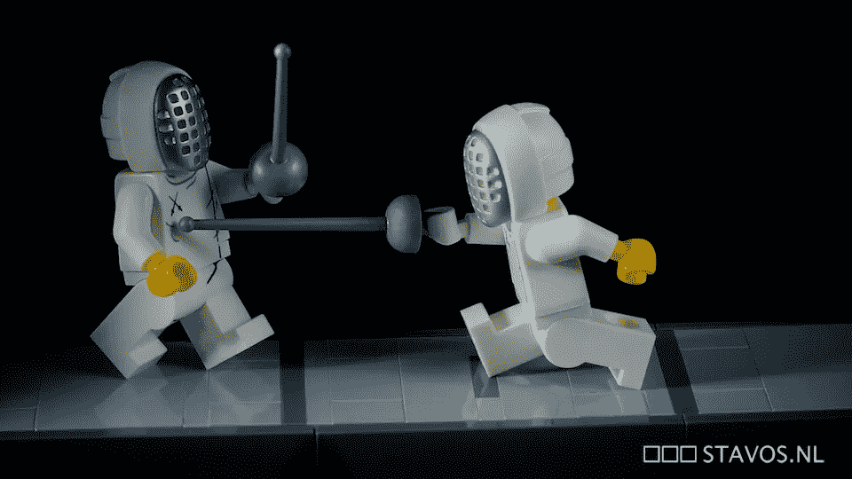
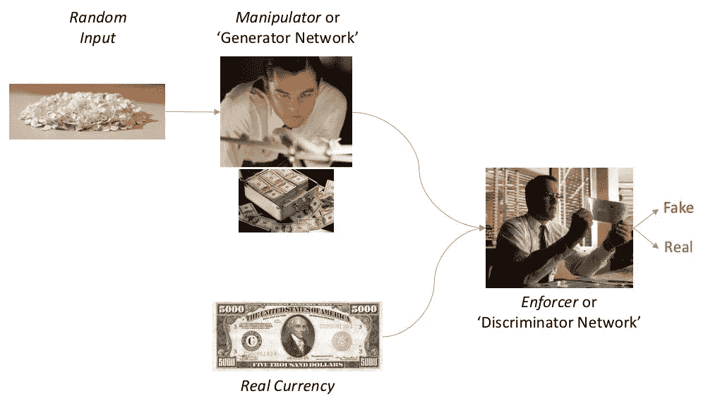
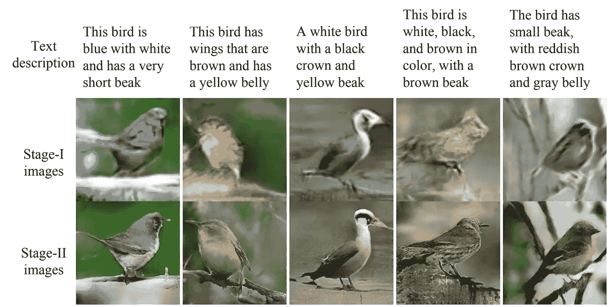

# 如果你能抓住我:GANs 或决斗神经网络的简单英语解释

> 原文：<https://towardsdatascience.com/catch-me-if-you-can-a-simple-english-explanation-of-gans-or-dueling-neural-nets-319a273434db?source=collection_archive---------5----------------------->

Photo by [CloudVisual](https://unsplash.com/photos/DCtwjzQ9uVE?utm_source=unsplash&utm_medium=referral&utm_content=creditCopyText) on [Unsplash](https://unsplash.com/?utm_source=unsplash&utm_medium=referral&utm_content=creditCopyText)

> 根据《麻省理工科技评论》的[年度十大科技榜单](https://www.technologyreview.com/lists/technologies/2018/)，深度学习是 2018 年最大的突破性技术之一

***【熟能生巧】***

我不太确定人类，但任何从事机器学习的人都会同意，实践，或*优质训练数据*让机器变得完美。嗯，差不多了..但绝对比我们凡人多得多。

一个完美的 AI 实现在任何领域都和魔术没什么区别。但问题是，随着机器开始学习，它们对数据的渴望是无法满足的……就像希腊神话中的坦塔罗斯，他的渴望永远无法满足。

数据科学家的时间都花在获取(和清理)越来越多的数据以输入机器上。他们的夜晚都浪费在教授机器从所有这些数据中学习，一遍又一遍地训练模型。

“数据”和“训练”两方面的严重缺陷使得 A & I 从 m **A** g **I** c 中消失，变得毫无意义。这，就是今天 AI 进步的最大瓶颈。

但是等等..如果机器可以承担任何人类的任务，为什么这个不能呢？我们能让机器自学吗？不，这不是文字游戏。和..是的，这是可行的。

(Pic source: [stavos](https://www.flickr.com/photos/stavos52093/) on flickr)

## 决斗神经网络

输入 [GANs](https://arxiv.org/pdf/1406.2661.pdf) ..或其复杂的声音扩展，生成敌对网络。如果深度学习是下一个拿走蛋糕的大东西，那么甘就是蛋糕上的奶油。可能性从未如此令人兴奋！

但是，首先什么是 GAN？我们会试着用简单的英语来完成接下来的对话，不要使用令人讨厌的术语。所以，对诸如'*概率*'、*感知器*'、*激活*'、*卷积*等天书一样的东西，绝对说不。

我给你讲个故事吧。

## 上演完美的猫捉老鼠游戏

想象一部典型的电影，两个疏远的兄弟拥抱相反的人生哲学。一个人以 ***【操纵者】*** 的身份开始了印制假币的新黑社会行动，另一个人则加入了一个局，成立了一个新的部门，以 ***【执法者】*** 的身份检测假币。

首先，假设黑社会中的*‘操纵者’*一开始就处于劣势，对原始货币的样子一无所知。该局的*【执行者】*只知道真实货币看起来有多少的基本情况。

然后游戏开始了。

*机械手*开始印刷，但是最初的赝品很糟糕。它甚至不需要训练有素的眼睛来检测假货，并且每一个假货都被执法人员迅速检测出来。

*操纵者*很勤奋，不断制造假货，同时也学习以前的尝试中没有成功的地方。通过对假货的大量实验&一些反馈，假货的质量开始慢慢上升(当然，前提是运营没有停止！)

最终，*操纵器*开始获得一些随机的仿冒品，而这没有被*执行者*发现。因此，另一边是它的学习时间，而*执行者*学习如何检测这些更聪明的伪造品。

随着*执法者*变得更加聪明，假货再次被发现。*操纵者*别无选择，只能升级制假操作以制造更多看起来像真的假货。

这场持续的猫捉老鼠的游戏还在继续，并最终让*操纵者*和*执行者*都成为专家。以至于赝品与真品难以区分，而且对如此精巧的赝品的检测变得几乎不可思议。

你明白了。这就是 GANs 的基本概念。

Photos ©Dreamworks

## 语境中的生成性对抗网络

现在让我们把我们的故事和演员翻译成 GANs。

GANs — a schematic flow with the key players

*机械手*和*执行器*都是模型，是深度学习神经网络的变种。

*操纵器*被称为 *'* ***生成器网络*** *'* ，它的任务是创建训练数据，随机启动并尽可能地逼真。*执行者*是 *'* ***鉴别器网络*** *'* ，其工作是检测并分类这些为‘真’或‘假’，并变得相当擅长。

通过将两个模型作为*对手进行配对，*我们为它们设置了一个*健康的*竞争。每个人都尝试在数千次迭代中掌握自己的工作，没有人工干预。瞧，我们最终得到了看起来像真的赝品，还有一个可以检测出大多数骗局的模型。

这就是为什么 GANs 是人工智能中的大师，因为它们既解决了现实世界中的问题*当你没有足够的数据开始时生成“数据”*，又解决了*“训练”模型*没有人工干预，这是一种无监督学习的形式。

至少这是他们要去的地方，而且他们已经开始行动了。在过去的几年里，GANs 稳步发展，产生了数百种变体，更多的创新正在进行中。

> 生成对抗网络是近十年来机器学习中最有趣的想法。— Yann LeCun，脸书人工智能公司董事

## 甘斯的效用是什么？

一台完美的货币印钞机或概念上类似的东西会给世界带来什么好处？显然很多，让我们看看 3 个广泛的领域。

**1。创意追求**

难以置信的是，机器终于打开了它们的右脑。毕竟，当一个书呆子程序员突然开始写获奖的诗歌时，谁不会感到惊讶呢？

用一种新发现的模仿真实图像的方法，GANs 开始创造想象中的名人，或带有艺术家独特签名的新杰作。这种能力的潜在用例跨越了创造性学科。

Imaginary Celebrities: Nvidia GANS model generated images using Celeb faces [dataset](http://mmlab.ie.cuhk.edu.hk/projects/CelebA.html) as reference. ([Paper](http://research.nvidia.com/sites/default/files/pubs/2017-10_Progressive-Growing-of/karras2018iclr-paper.pdf))

**2。翻译文本**

假设你想知道一个人不戴眼镜或者换个新发型会是什么样子，你只需要创建这个。这与询问当天的天气或规划即将到来的通勤没有太大区别。

通过创造新的动植物来满足用户的需求，甘斯就像一个实现愿望的精灵。遗憾的是他们不能给作品注入生命..至少现在还没有。

Text to Image synthesis (Paper: [https://arxiv.org/abs/1612.03242](https://www.youtube.com/redirect?q=https%3A%2F%2Farxiv.org%2Fabs%2F1612.03242&redir_token=ex8VKrJg_hcrLx3weDwn99R842B8MTUyMTk1MDMzN0AxNTIxODYzOTM3&v=rAbhypxs1qQ&event=video_description))

**3。生成训练数据**

GANs 承担着创建大量训练数据的重任，这些数据可以将人工智能带入进步的快车道。想象一下 GANs 产生了和我们相似的真实 3D 世界，有数百万英里的道路&所有可能的交通场景。

与其让无人驾驶汽车或无人驾驶飞机在现实世界中接受训练并引发可怕的事故，不如让它们在虚拟世界中接受训练并成为专业驾驶员。有了 GPU 计算，这可以瞬间完成。

Synthesising roads & real-life objects (GitHub: [https://tcwang0509.github.io/pix2pixHD/](https://tcwang0509.github.io/pix2pixHD/))

虽然这些都是方向性的应用，但是 gan 已经被应用于高影响力的商业应用中，如[药物研发](https://www.eurekalert.org/pub_releases/2017-06/imi-iml053117.php)，并且在实验的早期阶段有数百个[用例。](https://github.com/nashory/gans-awesome-applications#face-aging)

虽然这听起来可能已经是革命性的，但甘斯最好的还在后头。本文的目的是分享一个简单、全面的教程来传播对这一重要技术的认识。现在，让我们等待魔法的展现吧！

*对数据科学充满热情？随意在* [*LinkedIn*](https://www.linkedin.com/in/ganes-kesari/) *或者*[*Twitter*](http://twitter.com/kesaritweets)*上加我。*

 [## Ganes Kesari | LinkedIn

### 在其他网站上包含此 LinkedIn 个人资料

www.linkedin.com](https://www.linkedin.com/in/ganes-kesari/)