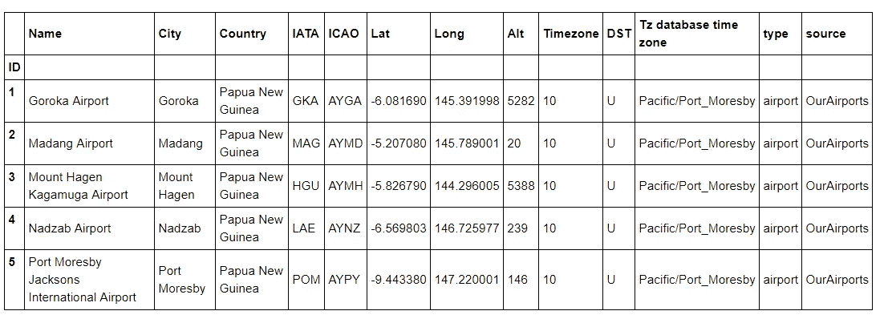
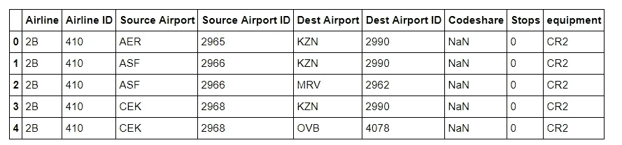
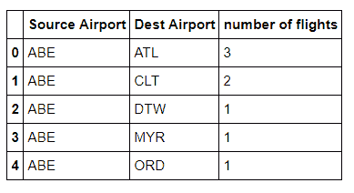
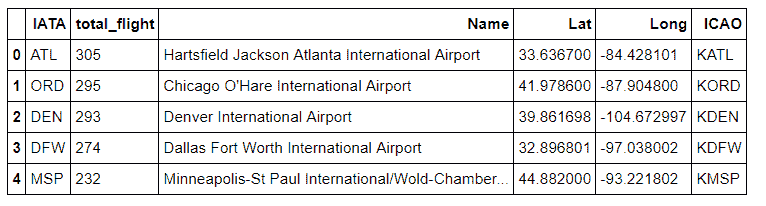
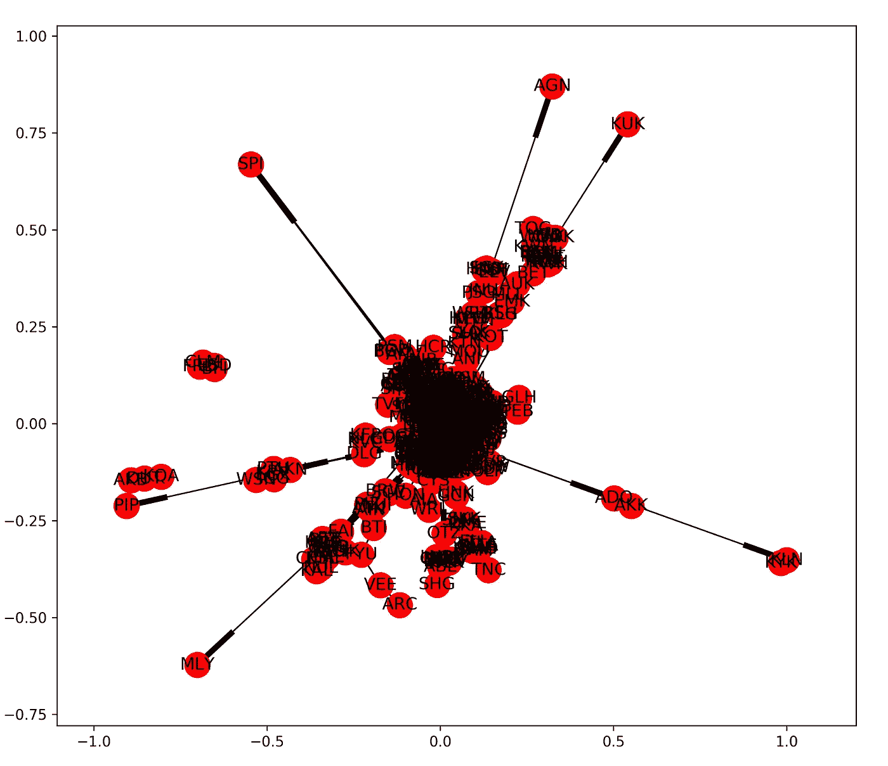
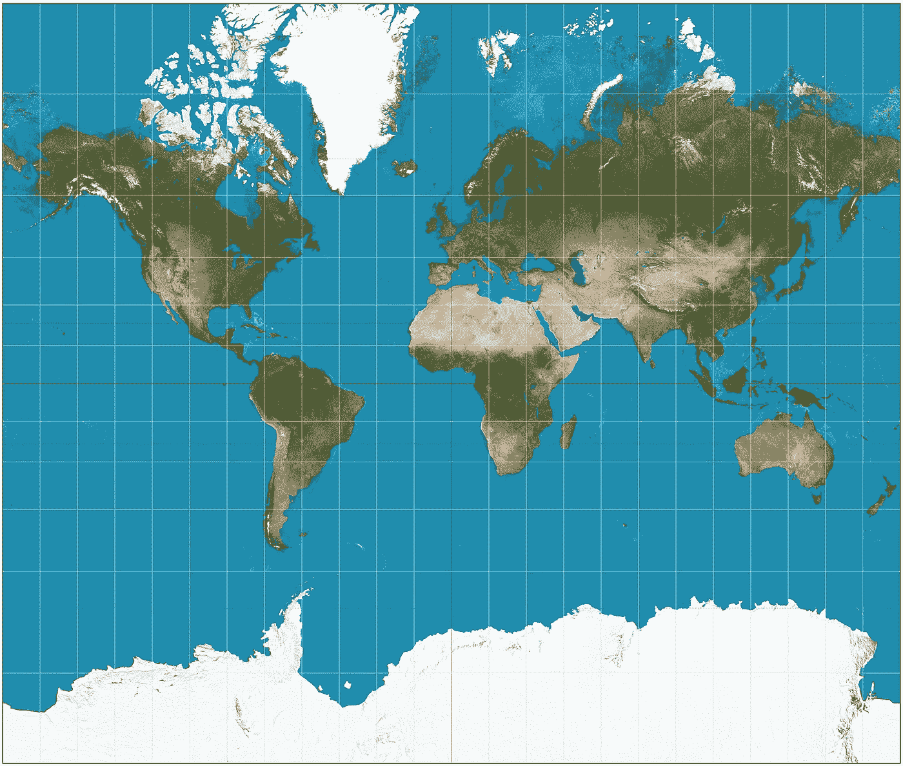
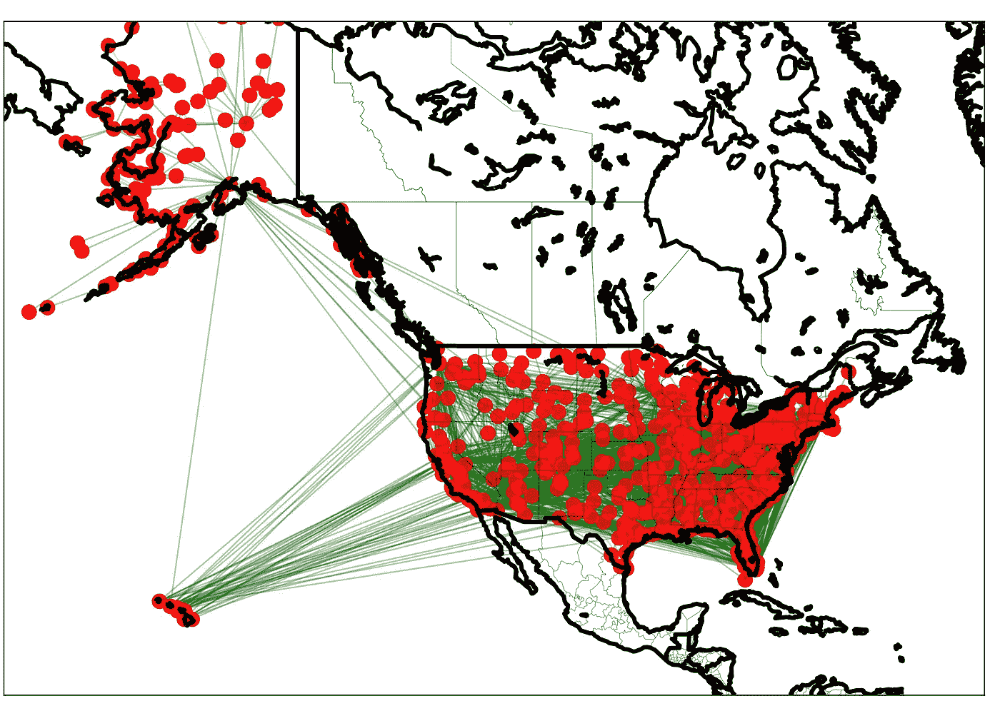
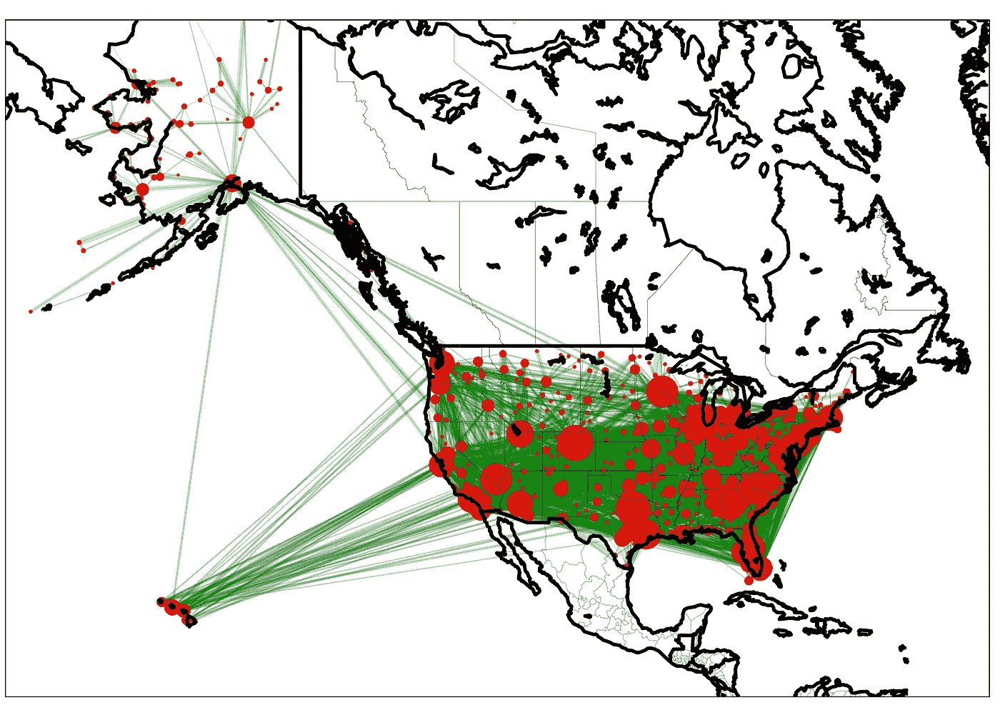
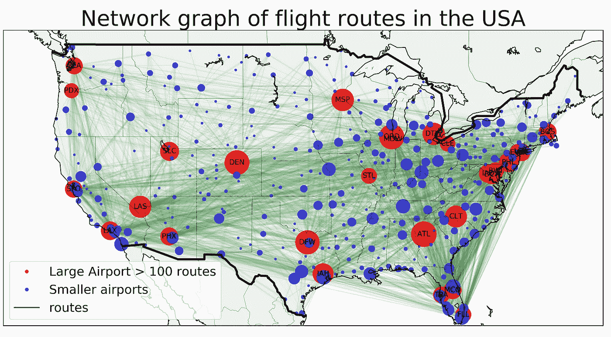

# 搭乘航班:使用 Networkx 和底图可视化社交网络

> 原文：<https://towardsdatascience.com/catching-that-flight-visualizing-social-network-with-networkx-and-basemap-ce4a0d2eaea6?source=collection_archive---------2----------------------->


Image source: Pixabay

> “如果你把这些数字制成图表，就会出现一些模式。自然界到处都有模式。”

麦克斯·科恩(在达伦·阿罗诺夫斯基的电影《少年派》中由肖恩·格莱特饰演)

今天，我将介绍非常强大的网络可视化工具——Networkx 和 Basemap。许多有趣的问题自然来自或启发某种形式的图模型——顶点(或节点)和连接这些顶点的边之间的关系。例如:网站的外部链接和内部链接结构可以由有向图表示，其中顶点表示网页，有向边表示从一个页面到另一个页面的链接。再比如朋友圈，顶点代表不同的人，边代表关系的类型。

当涉及到复杂的网络时，如病毒爆发、国家间的现金流动或 2005 年地震的地震波，直观、描述性和有效地说明网络的属性仍然是一个挑战。我们希望观众能够快速掌握网络的地理环境。Networkx 和 base map(matplotlib 包的工具包)提供了一个“端到端”的解决方案。前者创建网络图并计算各种度量，而后者能够呈现直观且信息丰富的简洁可视化。

在本例中，我们来看一下美国各机场之间的航班航线网络。目标是表示顶点(机场)和边(飞行路线),并保持不同顶点之间的地理关系(例如:我们想看着图，并告诉这个顶点是 JFK 或洛根机场或什么)


By the end of this tutorial, you shall be able to construct visualization of flight network such as this

首先，我们加载相关的包:

```
**import** pandas **as** pd**import** networkx **as** nx**import** matplotlib.pyplot **as** plt**from** mpl_toolkits.basemap **import** Basemap **as** Basemap
```

matplotlib 底图工具包是一个用于在 Python 中的地图上绘制 2D 数据的库。Networkx 是一个研究网络结构的综合库。

# 读取机场数据:

第一步是获取数据并进行处理。在这里，我使用 [OpenFlight](https://openflights.org/data.html) 数据库来获取关于机场和路线的信息。他们有非常全面的数据。不幸的是，路由数据库不是最新的。它目前包含全球 531 家航空公司的 3，209 个机场之间的 59，036 条航线。直到今天，世界上有多达 17678 个商业机场。然而，当前的数据集对于我们今天的演示来说已经足够好了。

有两个相关的数据集:

*   ***airport.dat*** 数据集包含所有列出的机场的地理信息



Table 1: a quick peek at what the *airport.dat* dataset looks like

*   ***routes.dat*** 数据集包含所有列出的机场的地理信息



Table 2: the *routes.dat* dataset

# 处理机场和路线数据集:

Networkx 无法读取原始形式的数据，因此我们的首要工作是处理数据，以获得 Networkx 可以读取的干净的路由数据帧。这里，我们使用 ***熊猫*** 将 Excel 文件解析成数据帧，提取并处理信息。请注意这两个数据集是如何通过机场代码(三个字母的 IATA 代码)连接起来的。你可以在我的源代码[这里](https://github.com/tuangauss/Various-projects/blob/master/Python/flights_networkx.py)找到处理数据的完整代码。

我们数据处理步骤的目的是获取以下两个 Panda 数据帧:

*   一个压缩的 ***routes_us*** 数据框，其中每一行代表一条唯一的航线以及在该航线上运营的航空公司总数(例如，有 3 家航空公司运营从利哈伊谷机场(ABE)到亚特兰大国际机场(ATL)的航班)。



Table 3: a condensed and cleaned routes dataframe. This dataframe is used by Networkx to construct the graph network with nodes and edges

*   一个压缩的 ***位置*** 数据框架，其中每行代表每个美国机场，带有 IATA 代码，更重要的是经度和纬度细节



Table 4: a condensed and cleaned position of airport dataset. This dataframe is used by Basemap to plot the nodes (airports) correctly on a USA map

有了前面的数据框架，我们就可以画出飞行网络的第一张草图了。

首先，我们将数据帧转换成一个图表。请注意，我们的图是一个有向图，也就是说，一个图有一组由边连接的顶点，这些边有与之相关的方向。这意味着在我们的图中，两条路由 JFK-ATL 和 ATL-JFK 是不同的，因为即使它们连接相同的 2 个节点，这两条路由具有不同的(相反的)方向。

我们使用 Networkx 的 **from_panda_dataframe()** 函数来快速导入我们的图表。在这里，我们从我们的数据帧 ***routes_us*** 创建一个图，其中源是“源机场”列，目标是“目的地机场”列，使用有向图模型。edge_attr 意味着我们可以向图的边添加信息。我添加了在一条路线上运营的航空公司的数量作为边属性

```
graph = nx.from_pandas_dataframe(routes_us, source = 'Source Airport', target = 'Dest Airport', edge_attr = 'number of flights',create_using = nx.DiGraph())
```

Networkx 确实有一个图形工具，我们可以用它来绘制我们的网络。

```
plt.figure(figsize = (10,9))nx.draw_networkx(graph)plt.savefig("./images/map_0.png", format = "png", dpi = 300)plt.show()
```



Graph drawn by Networkx’s default draw network function

这种粗略网络的问题在于，我们真的无法分辨哪个机场是哪个机场，以及各条航线之间是如何关联的。也许在美国地图上准确地标出机场的地理位置是个更好的主意。我们该怎么做？啊哈，底图！！！

# 使用底图绘制网络:

现在，我们需要帮助底图定义美国的边界线。让我们定义一个相对较大的地图，包括阿拉斯加和波多黎各。需要注意的一点是，我们有很多方法可以将一个大的区域，比如一个大陆，映射到一个 2-D 表面上。例如，我们可以选择等距圆柱投影，这是一种简单的投影，它将地球分成大小相等的矩形。更熟悉的方法是墨卡托投影，这是一种圆柱形的保形投影，在高纬度有很大的失真。是的，这是每个教室里被误导的地图，阿拉斯加和非洲大陆的面积一样大



a Mercator projection of the Earth (Image source: [wikipedia](https://en.wikipedia.org/wiki/Mercator_projection#/media/File:Mercator_projection_Square.JPG))

我也选择熟悉的墨卡托投影。这

```
plt.figure(figsize = (10,9))m = Basemap(projection='merc',llcrnrlon=-180,llcrnrlat=10,urcrnrlon=-50,urcrnrlat=70, lat_ts=0, resolution='l',suppress_ticks=**True**)
```

现在，我们需要定义我们的机场在底图上的位置。到目前为止，我们只有它们的经度和纬度信息。我们需要找到它们在底图表面上的实际投影。注意我是如何调用我们的 ***位置*** 数据集，获取经度和纬度数据，并将它们投影到底图表面上的

```
mx, my = m(pos_data['Long'].values, pos_data['Lat'].values)pos = {}**for** count, elem **in** enumerate (pos_data['IATA']): pos[elem] = (mx[count], my[count])
```

下一步是要求 Networkx 将节点、边及其属性添加到底图中。这可以通过以下方式完成:

```
nx.draw_networkx_nodes(G = graph, pos = pos, node_list = graph.nodes(),node_color = 'r', alpha = 0.8, node_size = 100)nx.draw_networkx_edges(G = graph, pos = pos, edge_color='g', alpha=0.2, arrows = **False**)
```

最后一步是画出国家、海岸线和国境线。

```
m.drawcountries(linewidth = 3)m.drawstates(linewidth = 0.2)m.drawcoastlines(linewidth=3)plt.tight_layout()plt.savefig("./images/map_1.png", format = "png", dpi = 300)plt.show()
```



Basic graph drawn by Networkx and Basemap

嗯，这块地非常不符合气候。看起来不错，但不是很好。除了地图看起来很丑这一事实之外，我们无法从图表中看出任何东西。例如，我们希望看到更多信息，如:

*   哪些机场很忙？
*   哪些航线比较突出？

要回答这些问题，也许将每个机场的进出航班总数合并起来，并绘制成机场的大小是一个好主意。例如，有很多进出航班的机场会有一个更大的尺寸，在地图上看起来更明显。

为此，我们重复相同的代码，并做了一点小小的调整:

```
nx.draw_networkx_nodes(G = graph, pos = pos, node_list = graph.nodes(), node_color = 'r', alpha = 0.8, node_size = [counts['total_flight'][s]*3 **for** s **in** graph.nodes()])
```



Graph drawn by Networkx and Basemap, where the node size represents the relative amount of flights in and out the airports

这就好多了，一旦您更熟悉使用 Networkx 和底图，您就可以根据您的使用情况开始使用个性化地图。例如，在这里，我将我的地图限制在大陆机场，并对地图的样式稍作不同



Graph drawn by Networkx and Basemap, where nodes are label and split into groups of large and small airports.

我们可以开始进行各种有趣的观察:例如，许多大型机场大多位于沿海地区(以及拉斯维加斯、丹佛、达拉斯/沃斯堡、休斯顿和亚特兰大)。我们可以开始看到，与其他地理位置相比，西海岸地区的国内航线尤其密集。有趣的是，像 DEN(丹佛国际机场)这样的机场似乎起着枢纽的作用，也就是说，它是将乘客送到最终目的地的中转(或中途停留)点。在以后的文章中，我将介绍 Networkx 工具，使用 Networkx 分析这样一个网络中的边分布和节点特征

如果你喜欢这篇文章，你可能也会喜欢我的另一篇文章《体育可视化》:

*   [使用 Python、Matplotlib 和 Seaborn 实现高级体育可视化](/advanced-sports-visualization-with-pandas-matplotlib-and-seaborn-9c16df80a81b)

关于其他有趣的统计事实和经验法则的深入分析:

*   [优化生活的统计法则:呼唤效应](/a-statistical-rule-to-optimize-your-life-the-lindys-effect-96d2c75b080d)
*   [规则三:计算尚未发生事件的概率](/the-rule-of-three-calculating-the-probability-of-events-that-have-not-yet-occurred-106144dc2c39)
*   [利用数据驱动的体育博彩策略赚大钱](/making-big-bucks-with-a-data-driven-sports-betting-strategy-6c21a6869171)

本文的完整 Python 脚本可以在我的 [Github 页面找到。](https://github.com/tuangauss/Various-projects/blob/master/Python/flights_networkx.py)

*数据来源:OpenFlight。机场、航空公司、航线数据 2017*[*https://openflights.org/data.html*](https://openflights.org/data.html)