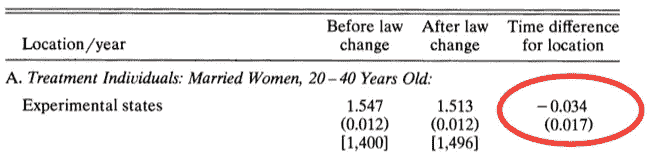
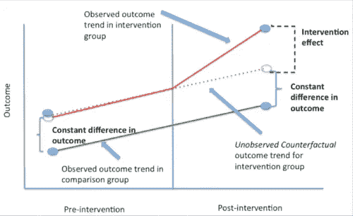
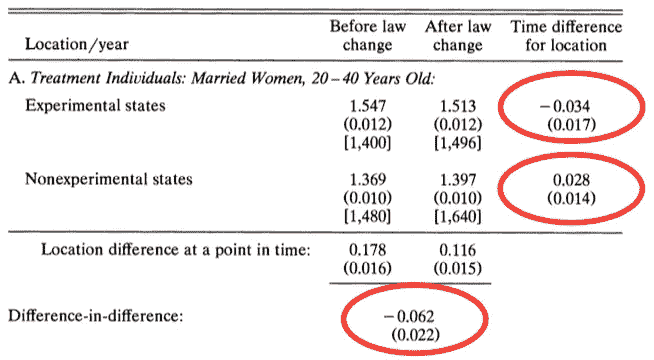
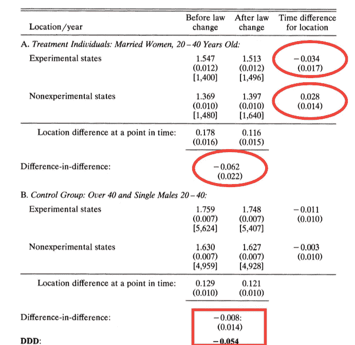
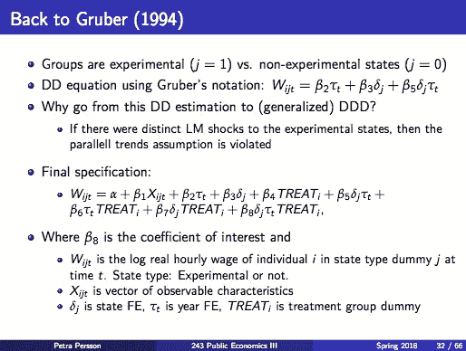

# 因果推理 101:差异中的差异

> 原文：<https://towardsdatascience.com/causal-inference-101-difference-in-differences-1fbbb0f55e85?source=collection_archive---------3----------------------->

案例研究:谁为强制分娩保险买单？

在今天的公共财政 III 讲座@斯坦福上，Petra 教授介绍了一种最广泛使用的因果推理技术:差异中的差异(diff-in-diff)。为了让我们的讨论不那么枯燥，她在强制福利的背景下激发了对这种酷技术的需求。

# **问题**

当政府强制雇主提供福利时，谁真正买单？是雇主吗？还是员工以降薪的形式间接买单？

在这次演讲中，佩尔松教授定量地回答了这个问题，使用了一种叫做“T2”的酷技术。

为了使我们的讨论更容易理解，我们把重点放在一个案例研究上:分娩的强制医疗保险。这项分析是由 T4 的乔纳森·格鲁伯于 1994 年首次进行的，他是麻省理工学院的教授，同时也是 NBER 国家经济研究局医疗保健项目的负责人。迄今为止， [*强制性福利的发生率*](https://economics.mit.edu/files/6484) 仍然是医疗保健经济学中最有影响力的论文之一。截至 2018 年 4 月 24 日，被其他 1148 篇学术论文引用。

# 时间表:强制性分娩保健覆盖面

理解时间线对于确定因果关系非常重要:

*   1978 年以前:分娩的医疗保险有限。
*   **1975–1979:**一些州通过了法律，强制规定分娩的医疗保险。
*   **从 1978 年开始:**联邦立法要求所有州的分娩医疗保险覆盖范围。

# 询问数据:女性是否通过减薪间接为福利买单？

# 第一次尝试

**第一步是比较年轻已婚女性的工资，任务前后:**

Numbers in cells: log hourly wages. Numbers in parenthesis: standard deviation

我们看到，强制令颁布后，女性的实际工资下降了 3.4%。这种影响在统计学上是显著的。

我们能否得出结论，女性通过减薪 3.4%间接支付了薪酬？

还没有！为了让 3.4%成为真实的影响，我们需要假设，在此期间，强制令是唯一可能影响工资的因素。但事实可能并非如此。

# 第二次尝试

如果在这一转变过程中，整个国家陷入衰退，那该怎么办？那么无论如何，所有年轻已婚女性的实际工资都会被削减。

为了解决这个问题，我们来看看居住在尚未通过该法案的州的年轻已婚女性的变化。关键假设是:尚未通过授权的州提供了一个很好的反事实。这有助于我们理解，如果他们的州没有通过这项法令，年轻已婚女性的工资会发生什么。在学术术语中，这被称为“**平行趋势假设**”。你无法测试这一假设，但你可以通过绘制预趋势图来看看它有多大可能成立——年轻已婚女性的实际工资在有和没有强制规定的州是否平行变化。

Source: Columbia University Population Health Methods, and Gruber (1994)

在还没有通过这项法令的州，年轻已婚女性的实际工资实际上增长了 2.8%！所以在那些通过了强制令的州，年轻、已婚女性的实际工资变化是-3.4% -2.8% = -6.2%。**这个-6.2%的估计是“不同中的不同”估计。**

但是我们还没有结束。

# 第三次是一种魅力

但是如果平行趋势假设不成立呢？例如，可以想象，有一些 X 因素与分娩保险的强制规定在同一时期生效。那么实际工资的 6.2%的变化可能归因于这个 X 因素，而不是分娩保险的强制规定！

Source: Quick Meme

这似乎是一个不可能解决的批评。但我们并没有完蛋。

# **Triple-diff 来救援！**

为了检验这种可能性，让我们对未受分娩保险影响的人群——男性——重复差异中的差异分析。

这个想法是说，在这段时间里，上述 X 因素会影响到每个人；但是分娩保险的要求只会影响年轻的已婚妇女。如果男性的 diff-in-diff 估计值为-6.2%，那么我们应该把实际工资的所有变化都归因于这些 X 因素，而不是生育指令。

幸运的是，男性的差异-差异估计值为-0.8%，在统计上微不足道。但是为了完整起见，我们仍然会计算三重差异估计值= (-6.2%) - (-0.8%) =-5.4%！

# 总结和总结课

*   平均而言，年轻已婚妇女的实际工资下降了 5.4%，以应对分娩保险的要求。
*   这到底是不是一个有益的改变？只有个人能对此负责。对一些人来说，这可能不是一个大的下降。但是如果你是一个不打算要很多孩子的年轻女性，你可能不会那么高兴。
*   这个结果防弹吗？当然不是。但是任何替代解释的门槛现在都非常高。任何其他解释都需要找出一个 X 因素，这个因素使得年轻已婚女性的工资在一个州的分娩令通过后立即下降 5.4%，但在任何其他时间段或任何其他人群中都没有。
*   **外卖教训:**当试图确定一个事件的因果关系时，仅仅比较前后是不够的。通过巧妙的去意。你可以保护自己不被低估或高估因果关系。记住，关联！=因果关系！

# **附录:回归规范**

如果您想自己实现这种回归，下面是回归规范。如果你发现我的推理有任何错误，请不要犹豫给我留言！

直到下次:)