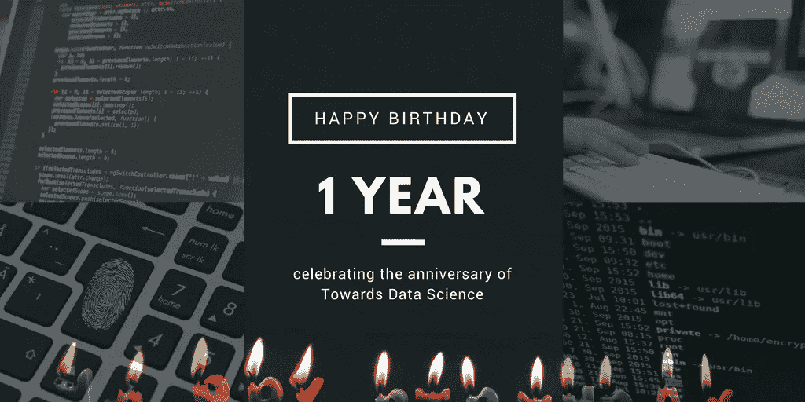
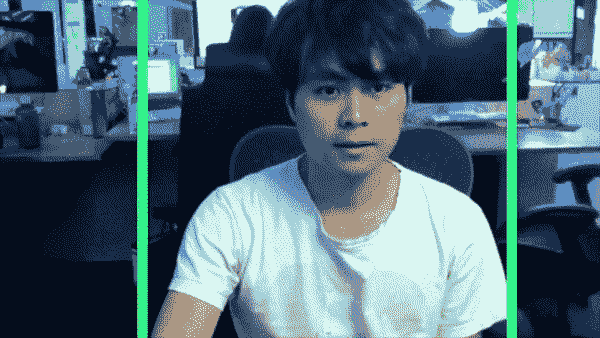
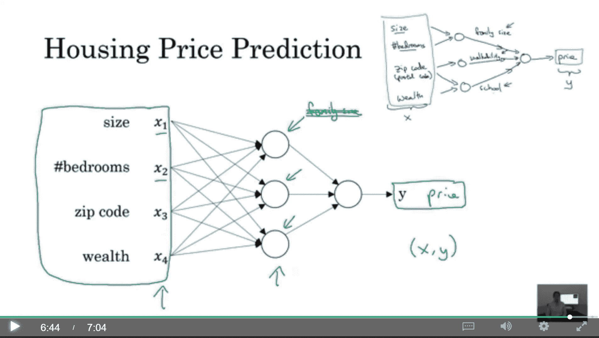
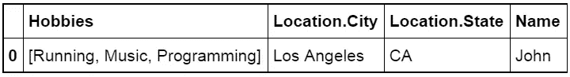
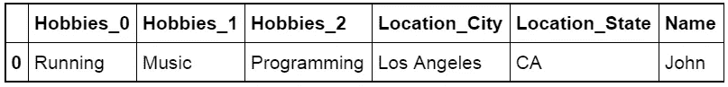
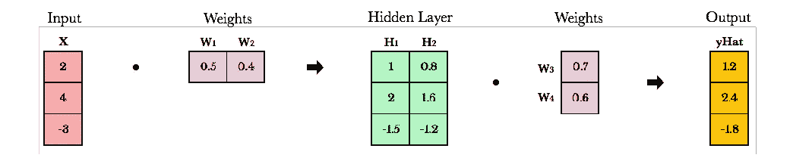
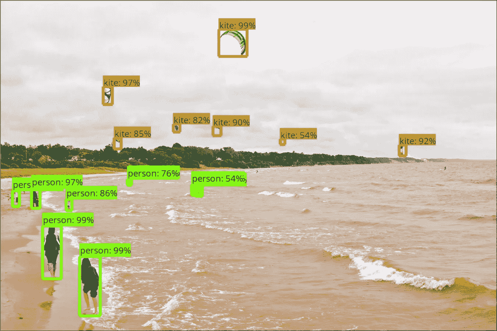
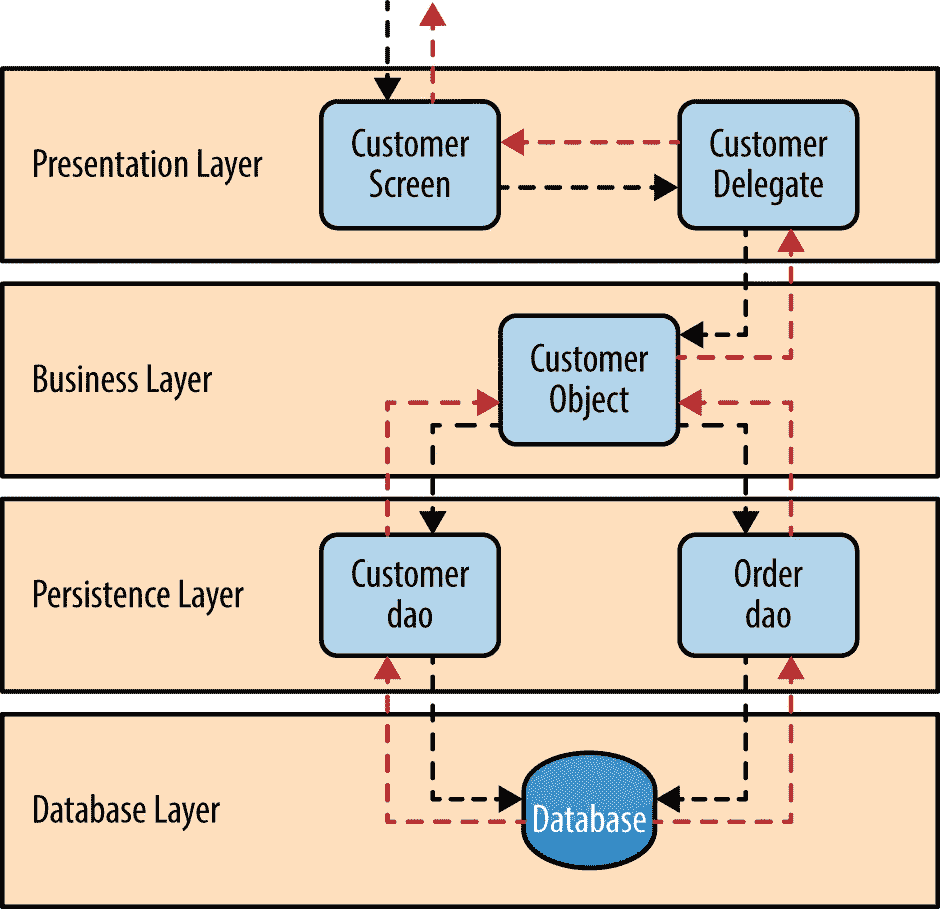
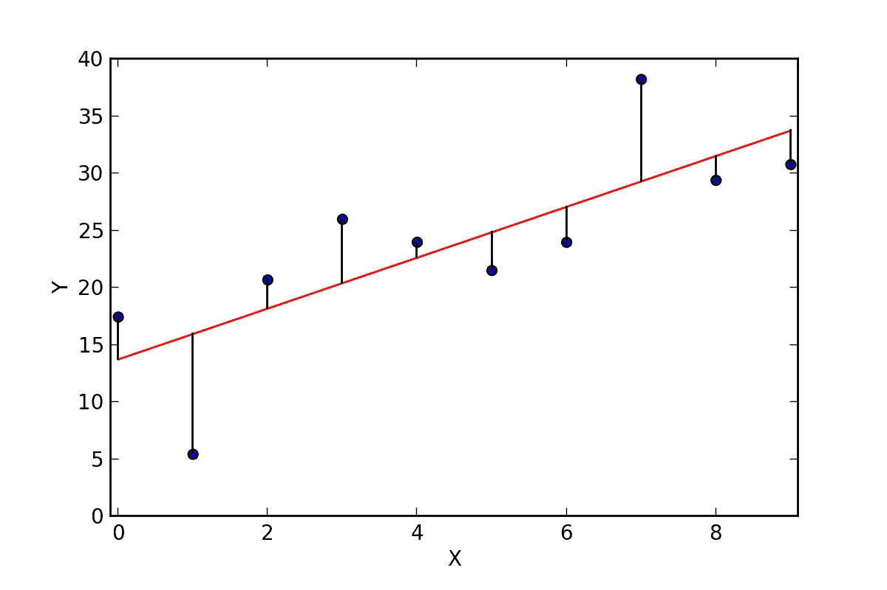

# 庆祝迈向数据科学一周年

> 原文：<https://towardsdatascience.com/celebrating-1-year-of-towards-data-science-ca13cf65481?source=collection_archive---------6----------------------->

迈向数据科学始于一年前的 2016 年 10 月 21 日。

我们现在已经成长为一个在 Medium 上拥有超过 3 万名粉丝的社区，并在[脸书](https://www.facebook.com/towardsdatascience/)、[推特](https://twitter.com/tdatascience?lang=en)、 [LinkedIn](https://www.linkedin.com/in/towards-data-science-online-publication-41b94a135/) 和 [Instagram](https://www.instagram.com/towardsdatascience/) 上出现。

请回顾一下我们历史上阅读量最大的文章。看起来 Tensorflow 是去年的热门话题——在接下来的一年里，一定要跟上我们，看看接下来会发生什么！

感谢我们伟大的作家们的所有贡献。

# [**1。言情小说，由人工智能生成**](https://medium.com/towards-data-science/romance-novels-generated-by-artificial-intelligence-1b31d9c872b2)

这篇关于由神经网络生成的爱情小说标题的文章获得了超过 37，000 次阅读，感谢 [Elle O'Brien](https://medium.com/u/5f5ca6c5e456?source=post_page-----ca13cf65481--------------------------------) 分享你的作品。

有一天在你附近的书店寻找*不可能的婴儿、伯爵的藏罐人、*或*便利夫人*！

# **2。** [**用 Tensorflow 和 Opencv**](https://medium.com/towards-data-science/building-a-real-time-object-recognition-app-with-tensorflow-and-opencv-b7a2b4ebdc32) 构建实时物体识别 App

Dat Tran 开发了一个很棒的物体识别应用程序，并分享了超过 35，000 次阅读的结果。

# **3。参加 Deeplearning.ai 课程后的感想**

感谢 Arvind N 向超过 33，000 名读者分享他关于参加 Deeplearning.ai 课程的想法！

# **4。** [**LSTM 举例使用张量流**](https://medium.com/towards-data-science/lstm-by-example-using-tensorflow-feb0c1968537)

长短期记忆，以 Tensorflow 为例，由罗威尔·阿蒂恩萨撰写，拥有 25000 名读者。

# **5。** [**在 Python 中展平 JSON 对象**](https://medium.com/towards-data-science/flattening-json-objects-in-python-f5343c794b10)

19300 名读者从 [Amir Ziai](https://medium.com/u/19c5ca300df1?source=post_page-----ca13cf65481--------------------------------) 那里学习了如何使用 Python 展平 JSON 对象。

Embedded arrays pose a problem for json_normalize

Use pip install flatten_json to fix it

# [**6。如何用 TensorFlow 的物体检测器 API**](https://medium.com/towards-data-science/how-to-train-your-own-object-detector-with-tensorflows-object-detector-api-bec72ecfe1d9) 训练自己的物体检测器

TensorFlow 是今年的热门话题，有 17，100 人收听学习如何从 [Dat Tran](https://medium.com/u/4ff6d2f67626?source=post_page-----ca13cf65481--------------------------------) 训练他们自己的物体探测器——祝贺你两次进入十大名单！

# [7。深度学习的线性代数小抄](https://medium.com/towards-data-science/linear-algebra-cheat-sheet-for-deep-learning-cd67aba4526c)

Brendan Fortuner 分享了他的小抄，16200 人欣然接受了帮助。

# 8。Google Tensorflow 物体检测 API 是实现图像识别最简单的方法吗？

Priya Dwivedi 的 Tensorflow 对象检测 API 获得了 15，900 次阅读。

# 9。软件架构模式

Anuradha Wickramarachchi 教我们软件架构模式和分层架构，阅读量超过 14000 次。

# 10。Python 中的简单和多元线性回归

前十名中最后但同样重要的是 [Adi Bronshtein](https://medium.com/u/c82c464daf80?source=post_page-----ca13cf65481--------------------------------) 向超过 13，000 名读者解释如何用 Python 进行简单和多元线性回归。

感谢我们的作者推动我们走向数据科学！