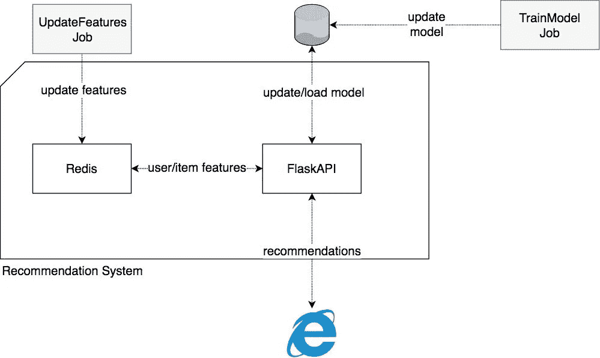
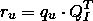
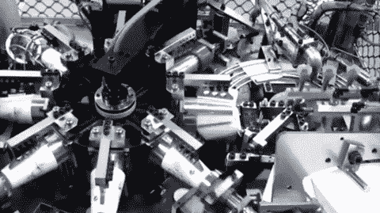
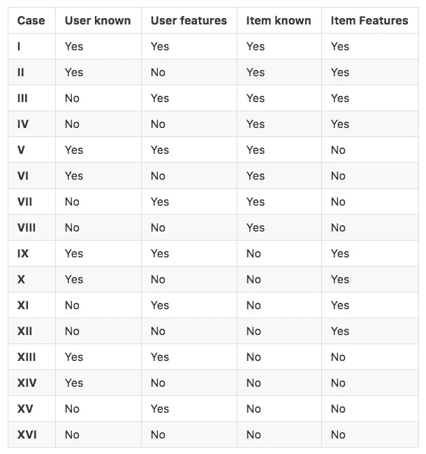

# 产品推荐系统面临的挑战和解决方案

> 原文：<https://towardsdatascience.com/challenges-solutions-for-production-recommendation-systems-d656024bbdca?source=collection_archive---------10----------------------->

有很多关于培训和评估推荐者的文章，但很少有人解释如何克服建立全面系统所涉及的挑战。

大多数库不支持现成的可伸缩生产系统。挑战通常是:

*   **动态预测** —当你有一个非常大的用户/项目维度时，预先计算所有的推荐可能是非常低效的，或者是不可能的。
*   **优化响应时间** —当您动态创建预测时，您需要检索它们的时间非常重要。
*   **频繁更新模型** —当系统需要整合新数据时，频繁更新模型至关重要。
*   **基于看不见的数据进行预测** —这意味着处理看不见的用户或项目，并不断改变功能。

这篇文章将告诉你如何修改一个模型来扩展它在一个完整的生产环境中的功能。

# 混合推荐模型能更好地应对现实世界的挑战

我们使用一个 [LightFM](https://lyst.github.io/lightfm/docs/home.html) 模型，这是一个非常流行的 python 推荐库，它实现了一个混合模型。它最适合中小型推荐项目，在这种情况下，您不需要分布式培训。

## 不同推荐方法的简短回顾

有两种基本的推荐方法:

[**协作**](https://www.youtube.com/watch?v=YW2b8La2ICo) 模型仅使用协作信息——用户与项目的隐式或显式交互(如观看、评级或喜欢的电影)。他们不使用任何关于实际项目的信息(如电影类别、流派等)。).

协作模型可以用很少的数据达到**高精度，但是无法处理*未知的用户或项目* ( **冷启动问题**)。**

[**基于内容的**](https://www.youtube.com/watch?v=9siFuMMHNIA) 模型纯粹对关于物品或用户的可用数据**起作用——完全忽略用户和物品之间的*交互*。—所以他们对待建议的方式**与协作模型**非常不同。**

基于内容的模型通常:

*   需要**更多的训练数据**(你需要有几乎每个用户/项目组合的可用用户/项目示例)，以及
*   **比**更难调整吗？

但是他们可以对看不见的项目做出**预测，并且与合作模型相比，通常有更好的*覆盖率，合作模型倾向于给予流行项目更多的关注。***

*混合推荐器——像 light FM——结合了两种方法，克服了每种方法的许多挑战。*

*他们可以**处理新物品或新用户**:*

*当您将协作模型部署到生产中时，您经常会遇到需要为看不见的用户或项目进行预测的问题，比如当新用户注册或访问您的网站时，或者您的内容团队发布了一篇新文章时。*

*通常你必须至少等到下一个训练周期，或者直到用户与某个项目交互，才能为这些用户做推荐。*

*但是混合模型**即使在这种情况下也能做出预测**:它将简单地使用部分可用的特性来计算推荐。*

*混合动力车型还可以**处理缺失的功能**:*

*有时，某些用户和项目的特性会丢失(仅仅是因为您还不能收集它们)，如果您依赖于基于内容的模型，这将是一个问题。*

*混合推荐器适用于老用户(那些通过培训认识的用户)以及新用户/项目，只要你有他们的特征。这对于项目尤其有用，对于新用户也是如此(当用户第一次访问你的网站时，你可以问他们对什么感兴趣)。*

# *系统组件*

**该系统假设项目比用户少得多，因为它总是检索所有项目的预测。但是它可以作为更复杂的推荐器的基础*。*

**

*系统的核心是一个 **flask app** ，它接收一个用户 ID 并返回该用户的相关项目。它将(重新)加载 LightFM 模型，并在 Redis 实例中查询条目和/或用户特性。*

*我们将假设用户和项目特征被存储和序列化在 Redis 数据库中，并且可以由 flask 应用程序随时检索。*

*所有应用程序都将通过 docker 容器部署为微服务。*

# *LightFM 如何进行预测*

**

*但是它是如何工作的呢？*

*LightFM 的论文对于学术读者来说信息量很大，但是对于不太熟悉这个领域的人来说可能有点简短。我将在下面更简单地概述 LightFM 模型预测过程。*

**公式解释*:*

*   *小写字母指向量，大写字母指矩阵。*
*   *下标 *u* 指单个用户， *U* 指所有用户的完整集合。项目以同样的方式引用。(下标由 Medium 支持，因此您可以看到它们由下划线分隔)*

*这里的大部分命名与 LightFM 论文一致。*

## *模型组件*

*因此，LightFM 结合了协作和基于内容的方法的优点。你可能会说它为两种方法中的每一种建模一个组件。这两者对于我们从推荐者那里得到我们想要的属性都是必要的。*

## *协作组件*

*协作组件允许您在没有任何功能的情况下依靠协作过滤算法——或者这些功能不提供信息。*

*最先进的协同过滤算法是通过[矩阵分解](https://en.wikipedia.org/wiki/Matrix_decomposition)实现的。他们估计了两个[潜在的](https://en.wikipedia.org/wiki/Latent_variable)(未观察到的)矩阵表示，当它们彼此相乘时，将重现模型在训练期间看到的每个项目和用户的交互矩阵。当然，有一个误差项可以考虑噪声并避免过度拟合。*

*一个简单的类比:尝试因式分解 12。我们可以用 2 和 6，3 和 4，1 和 12 等等来做这个。矩阵也是如此。*

*我们称这些矩阵为潜在代表，因为它们是我们交互数据的压缩形式。*

## *基于内容的组件*

*基于内容的组件允许您获得预测，即使您没有交互数据。*

*LightFM 通过将特征与潜在表示相关联来合并用户和项目特征。假设特征和潜在表征是线性相关的。所以在矢量形式中:*

**q_u* 是潜在用户表示， *f_u* 是单个用户的特征行向量， *E_u* 是估计的项目嵌入， *b_u* 是用户嵌入的偏差。(为了简单起见，我们从现在开始将它们省去。)*

*看起来和线性回归差不多吧？只不过 *E_U* 是一个矩阵，而*和*相反，后者通常是一个向量。事实上，这实际上执行了多重回归:每个模型组件一个。同样，对于物品来说也是类似的。*

*在训练期间，借助于[梯度下降算法](http://ruder.io/optimizing-gradient-descent/)来估计用户嵌入和项目嵌入。对于每个特征，嵌入矩阵将有一行。嵌入矩阵的列称为分量。组件的数量被设置为模型超参数，从现在开始我们称之为 d。*

**

*上图概括了所有用户和所有项目的流程。因此，在**步骤 I** 中，我们有形状为*N _ 用户 x N _ 用户 _ 特征*的用户特征矩阵与形状为*N _ 用户 _ 特征* x d 的嵌入矩阵的矩阵乘法。这同样分别适用于项目特征与项目嵌入的第二次乘法。来自**步骤 I** 的结果分别是形状为 *N_users x d* 和 *N_items x d* 的两个矩阵。因此，每个用户/项目被表示为大小为 *d* 的潜在向量。*

*在最后一步中，这两个矩阵相乘，得到每个用户和形状为 *N_users x N_items* 的项目的最终得分。*

*现在，您可以使用以下术语轻松获得单个用户的所有表示:*

**

**q_u* 是用户潜在表征的行向量， *Q_I* 是所有项目潜在表征的矩阵。*

## *使用指标矩阵支持退回到协作模式*

*LightFM 可以从纯协作信息中生成模型。*

*它使用了一个非常有效的技巧:如果根本没有使用用户或项目特征，该模型将接受一个大小分别为 *N_users* 或 *N_items* 的单位矩阵。这非常有效，因为它会学习组件——每个用户一个。这样，模型总是可以依靠最佳的纯协作方法。您可以将这些组件视为模型在训练过程中已经看到的用户和项目的记忆。*

**您还可以强制模型退回到协作模式——即使您确实有特征:*您可以通过**向特征矩阵添加一个单位矩阵来修改它**。有时候你需要这个来让你的模型收敛。但是，这通常意味着您的要素噪音太大，或者没有携带足够的信息，因此模型无法自行收敛到最小值。*

*最后，使用这种技巧会增加将模型投入生产所需的工作量:在训练期间，用户的索引用于检索相应特征/身份矩阵的正确行，而这些信息在生产环境中可能不再可用；另外，LightFM 模型将这个责任交给了用户。*

## *有趣的事实*

*仅使用指示器特征可以获得的相似项目/用户(在协作信息方面)的**潜在** **表示**将在欧氏空间中**接近。该模型基于协作信息来估计它们。所以你可以用这些来找到你的物品或用户之间的相似之处。***

# *动态重新创建指示器和功能*

**

*现在让我们实现一个模型，它可以依赖于协作模式，跟踪 IDs，从而能够重建正确的特性和指标。*

*我们将专注于实现一个完整的方法。这是相当复杂的，因为同时，它应该能够在大多数情况下给出预测。我们将创建 LightFM 类的子类，并添加一个特殊的`predict_online`方法，该方法将在生产过程中使用。*

*这样，我们仍然可以使用 LightFM 的 cythonised 预测功能，避免分别处理用户和项目 id 映射。*

*它应满足以下要求:*

1.  *如果在训练期间看到用户/项目，则重建指示器特征；*
2.  *无论某个用户有什么数据，都可以进行在线预测；*
3.  *尽快做出这些预测。*

# *ID 映射*

*为了达到第一个要求，你也必须在训练中使用同样的课程。您还需要调整您的子类，以便它在训练期间只接受[稀疏度](https://github.com/datarevenue-berlin/sparsity)稀疏帧对象，并因此创建和保存 ID 映射。*

# *重构特征*

*为了达到第二个要求，您需要在每次收到请求时检查可用的数据。你要处理 16 个案子:*

**

*在情况 **IV** 、 **VIII** 和 **XII** 中，我们简单地返回我们的基线预测。对于案例 **XIII** 到 **XVI** ，我们无法给出任何预测，因为我们对条目的了解还不够。*

***总结:**我们基本上想要创建一个包含用户特征的行向量，如果它们可用的话。否则在各自的索引处都是零。如果在训练期间看到用户，它还将包含设置在正确索引处的用户指示器特征。*

*项目特性类似于用户特性，除了我们希望它们能够很容易地适应内存以允许缓存。您可以根据您的用例考虑使用不同的缓存策略(比如 TTLCache ),或者根本不缓存。*

*我们还希望支持**而不是**添加指示器，或者只将它们添加到用户或项目特性中，这可能会使实现稍微复杂一些。尽管如此，我们还是尽量保持简单。*

*您将在这里找到上述方法的示例实现[。该实施应能正确处理所有情况，直至 *VIII* 。但是有可能不是所有的条目都被实现了，因为我们的应用程序不需要它。因此，预测没有项目特征的已知项目是不可能的，但应该很容易添加。](https://gist.github.com/kayibal/16340660d1d85b9ea1872a5d9be0f383)*

# *履行*

*[查看示例实现](https://gist.github.com/kayibal/16340660d1d85b9ea1872a5d9be0f383)*

*请随时寻求帮助或添加任何意见。我很乐意回来回答他们。*

# *观点*

*本文的第二部分使用这个类，将它连接到 Redis 数据库，并使用 flask 动态地为它提供预测。我们还将向您展示如何使用从 flask 应用程序内部启动的后台线程在不停机的情况下更新模型。*

**最初发表于*[T5【www.datarevenue.com】](https://www.datarevenue.com/en/blog/building-a-production-ready-recommendation-system)*。**