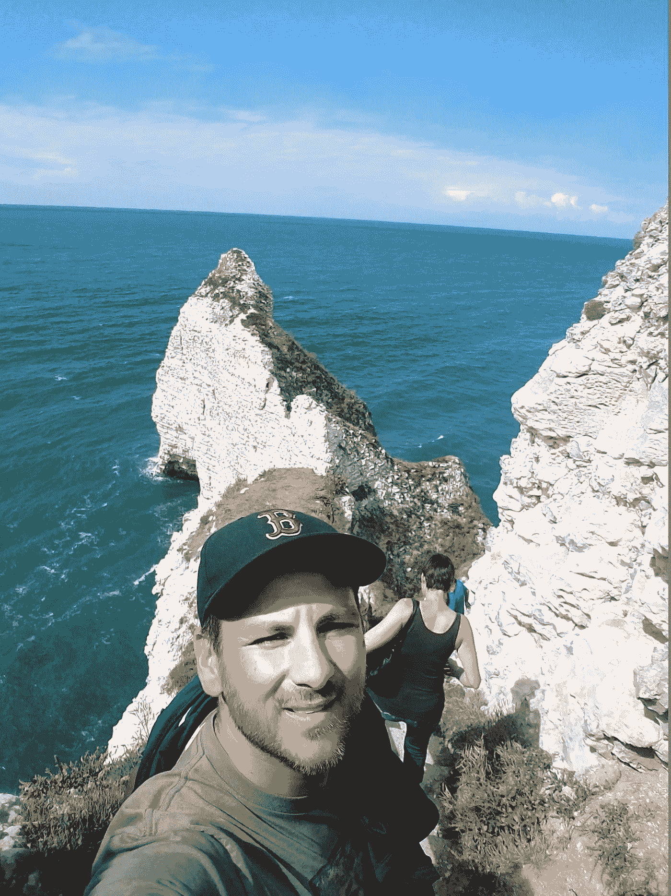

# 有目的的改变:为什么我决定加入 Neva

> 原文：<https://towardsdatascience.com/change-with-purpose-why-i-decided-to-join-neva-8b80d9c1950a?source=collection_archive---------10----------------------->

# 新的道路，同样的使命

在加入 Neva 之前，我是 IDC 客户端虚拟化和 IT 服务管理软件研究实践的首席分析师。在这个职位上，我有机会也有特权与一些世界上最大的企业以及中小型企业的无数 IT 领导进行磋商。基于这些合作，我能够为广泛的 IT 管理软件供应商和解决方案提供商提供战略市场和产品方向，帮助他们为客户提供解决具有挑战性的技术导向计划所需的工具。

在担任行业分析师之前，我花了 12 年多的时间领导多个 IT 服务管理组织。作为美国空军和公司企业的 IT 从业者以及市场研究员，我在 ITSM 行业工作了近二十年，见证了许多技术和工作场所的变革。不祥之兆是，云计算和移动计算等领域的持续进步只会加快工作场所技术和文化的变革速度。此外，快速获取和利用先进技术的能力将对每个企业当前和未来的成功产生深远的影响。

在我的分析师职业生涯中，我有幸与 Neva 的联合创始人兼首席产品官 Dan Turchin 共事并结识了他。Dan 胸怀大志，致力于推动技术创新，帮助组织实现其业务目标。这些年来，我们已经进行了许多前瞻性的对话，这些对话与授权 IT 组织推动业务价值有关。

去年 12 月，在波士顿地区的一家小咖啡店里，Dan 和我就人工智能(AI)和机器学习(ML)技术在企业中的价值进行了一次特别有趣的讨论。正是在这次会议上，我第一次了解到 Neva 以及该公司的战略重点和将人工智能和人工智能能力应用于企业服务管理的技术方法。Dan 和我都对转变企业服务的机会充满热情。

Dan 和 Neva 的 boarder 领导团队在建立交付优秀产品的优秀团队方面有着良好的记录。同样，Neva 现在雇佣了一些世界上最受尊敬的数据科学家和本体学家。因此，当有机会加入 Neva 时，我既谦卑又兴奋地成为团队和使命的一部分。

# 让技术驱动的企业走向成功

虽然 it 交付和支持的服务类型必须不断跟上不断发展的工作场所和技术趋势，但 IT 始终通过智能技术投资创造业务价值是至关重要的。随着 IT 组织努力扩展技术服务和支持以满足当今始终在线和始终保持联系的工作人员的需求，实现这一价值主张变得越来越困难。

ITSM 社区由充满激情的个人组成，他们不仅对自己的角色感到非常自豪，而且乐于接受持续改进。保持这些属性对于支撑一个肯定会持续动荡的环境至关重要。然而，在当今日益分散和混合的技术环境中，利用手动、繁琐的流程作为服务交付渠道根本无法扩展，甚至会极大地阻碍最敬业的支持团队。

我加入 Neva 是为了成为团队的一员，该团队的使命是提供基于人工智能和人工智能的解决方案，使组织能够实现服务自动化，并提供更加个性化和及时的支持体验。

# 推进目标

缺乏与业务用户的一致和可靠的合作，使得 it 组织几乎不可能正确地衡量其服务的有效性。IT 部门的跟不上是助长影子 IT 等趋势的原因，影子 IT 往往会影响生产力、安全性和业务连续性。

幸运的是，服务管理平台供应商并没有忽视这些挑战。例如，ITSM 解决方案在用户界面设计、服务目录和自助服务功能方面取得了显著进步。这些创新使得 ITSM 产品和最佳实践得到了更广泛的采用，使 IT 部门能够从技术消费和需求方面积累大量有关最终用户偏好、优先事项和实践的数据。此外，ITSM 平台越来越多地被开发和用于支持 IT 部门以外的业务部门，如人力资源、设施、客户服务等。

因此，IT 和商业领袖都在密切关注人工智能和人工智能技术，因为它迅速发展到这样一种状态，即自主代理可以有效地利用服务管理平台以及其他记录系统中的数据来维持与客户的信息丰富、互动、智能的对话。此外，AI 和 ML 驱动的自动化支持服务组织增加其支持功能的规模，提高服务质量，同时降低运营成本。

# 有目的地拥抱变化

“用提议改变”始于保持对核心原则的坚定承诺，同时继续保持足够的灵感和好奇心来拥抱确保目标实现的新方法。

是什么促使我决定加入 Neva？首先也是最重要的，我认为这一举动是继续做有意义的工作，实现我长期以来帮助服务和支持组织向客户提供一流体验的热情。知道 Neva 的愿景与这一目标一致是我决定的关键部分。

虽然基于人工智能和机器学习的服务管理可能看起来大胆而有远见，但我相信这是未来十年推动创新的方式。因此，加入一家正在定义企业服务未来并让组织能够提供吸引人和令人愉快的客户体验的公司，我感到无比兴奋。