# 第四章:Azure Batch HPC，20 秒学习 2000 万收视率

> 原文：<https://towardsdatascience.com/chapter-4-azure-batch-hpc-learning-20-million-ratings-in-20-seconds-980a7fa50d51?source=collection_archive---------8----------------------->

*这个故事是系列“* [*你真正需要什么来设计一个真正的推荐引擎(与 Azure)*](https://medium.com/@Herger/designing-a-new-community-based-recommender-engine-with-azure-f17baa8f03af)*的一部分*

****

> *“随着 NVIDIA GRID 软件和 NVIDIA Tesla M60 在 Azure 上运行，微软正在提供基于云的 RDSH 虚拟应用和桌面的优势，以在云中实现大规模图形加速虚拟化，满足任何企业的需求”**NVIDIA GRID 副总裁 John Fanelli***

# *领先的微软和英伟达合作伙伴关系*

*自去年第四季度以来，图形处理单元(GPU)开始在微软的云上普遍可用，并逐渐在亚马逊和谷歌等并发提供商的平台上可用。数字市场上机器学习(ML)需求的显著增长和游戏行业广泛加速的 GPU 快速民主化，有利于实际领导者 Nvidia 和主要云参与者之间的排他性合作伙伴关系。推动基于按使用付费模式提出硬件而不是实际获得高性能代码(HPC)基础设施硬件的成功战略，微软向一个新市场开放，从 3D 建模、远程游戏到科学研究应用。如今，这一领域的活动如此频繁，以至于供应商有时甚至很难满足客户的需求。随着新的最快的 GPU 以越来越快的速度上市，这种情况注定会升级。*

*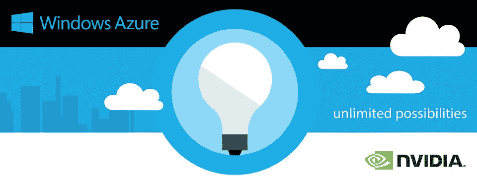*

*随着这些内容的编写，微软提出了 [NC 系列](https://azure.microsoft.com/en-us/pricing/details/virtual-machines/linux/)专用虚拟机，旨在通过单个或多个 GPU 进行繁重的图形渲染和视频编辑。后者采用 NVIDIA Tesla 加速平台和 NVIDIA GRID 2.0 技术，提供当今云中可用的最高端图形支持。*

*有了这样唾手可得的能力，不尝试一下并采用推荐引擎(RE)领域中计算量特别大的著名算法是不合理的。*

# *基于协同过滤的推荐器*

*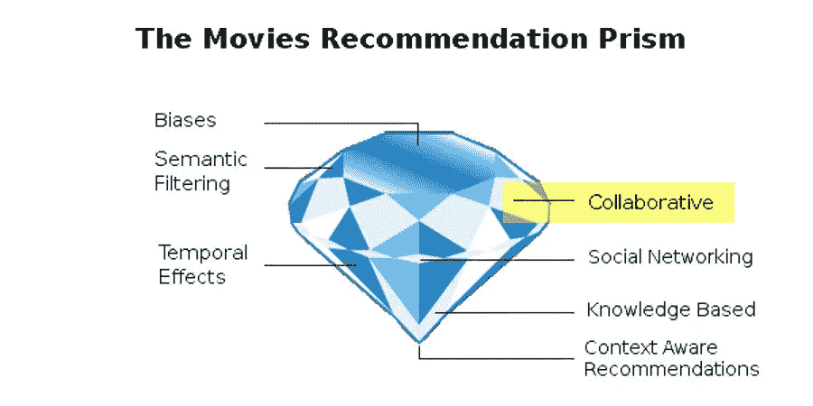*

*在广泛的 RE 领域中，协同过滤(CF)是一个特定的领域，其中通过在大量人群中发现用户的行为模式来预测评级。主要原则依赖于找到具有相似评级习惯的用户，并推荐彼此集合中仍然缺少的项目。虽然不像社交网络过滤(SNF)那样容易受到恶意攻击，但 CF 的主要警告在于，在产生任何好的推荐之前，许多用户必须已经提供了他们的评级。这个问题严重限制了 CF 在系统刚刚启动的场景中的实用性。*

*主要是因为这个原因，现代 RE 提出了不同的混合方法，旨在缓解被称为冷启动效应的相关问题、长尾非平凡推荐、提高的准确性以及提供为什么推荐一个项目的清楚解释。另一方面，CF 有很大的优势，可以给推荐带来惊喜，并向主题打开用户档案，这是基于语义过滤(SF)的推荐器所没有的。*

# *一种强有力的方法:奇异值分解*

*虽然仅仅依靠 CF 来设计 RE 是不明智的，但是一些方法，例如奇异值分解(SVD ),在自动发现没有被项目或用户明确定义的潜在特征方面提供了特别有效的好处。在适当的条件下，仅这个属性就可以产生基于抽象概念的优秀推荐，这些抽象概念不能从它们的特征直接清楚地解释，但是从数学的角度来看是完全有效的。因此，有可能发现令人惊讶的用户群共享一些概念，例如特定的电影氛围、其隐含的目标观众、政治方面或者仅仅是任何语义描述中可能不包含的类型。*

*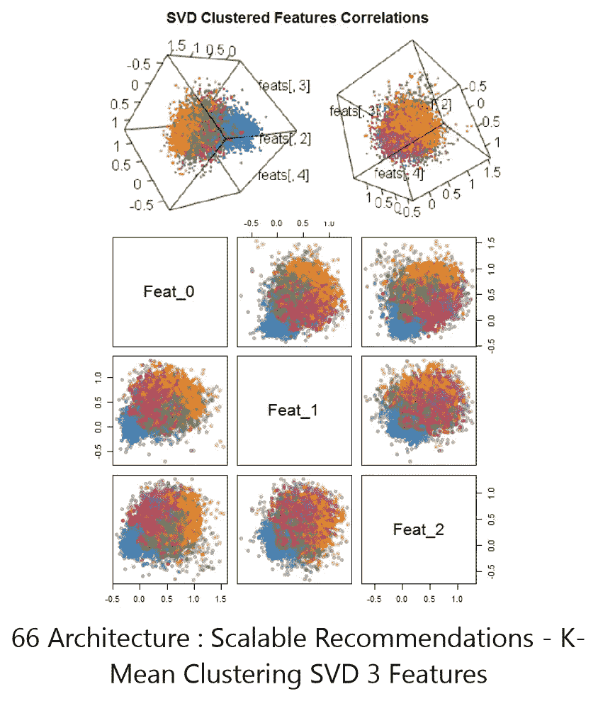*

*SVD 背后的线性代数旨在通过仅提取最重要的特征值同时最小化相关损失函数来找到矩阵的低秩表示。它作为一种破坏性的图像压缩方法，在图像处理中得到广泛应用。在 CF 的情况下，这是通过分别包含用户特征向量、特征值和电影特征向量的三个矩阵的因式分解来实现的。*

*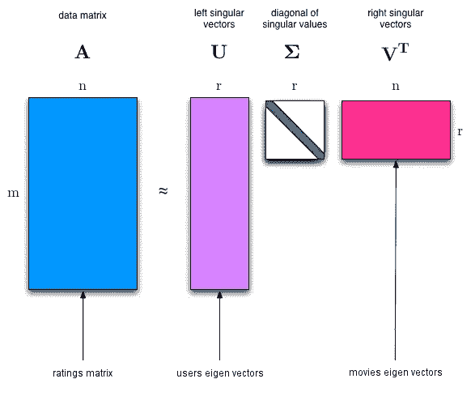*

# *一个有用的案例研究:预测电影收视率*

> *因为人人都爱电影……[芝加哥国际电影节](https://www.youtube.com/channel/UCO6FwCQuDGyjFK4drZKUfWw)*

*在 [MovieLens 20M 四联数据集](https://grouplens.org/datasets/movielens/20m/)的情况下，评级矩阵提出了极其稀疏的额外挑战，因为每个用户只对所有可能项目中的一小部分进行评级。有 27，000 部电影和 138，000 个用户，尽管已经产生的数据集仅占整个矩阵的 0.53%。*

*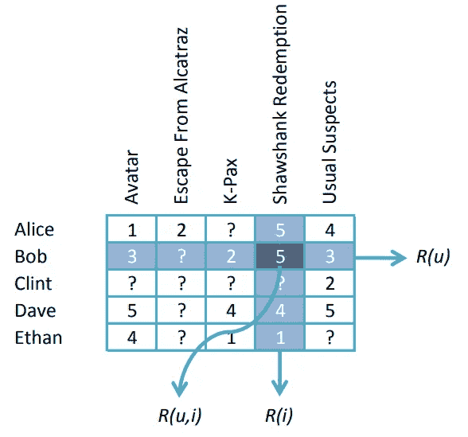*

*使用[R]进行的快速分析还揭示了总体评分的偏态正态分布(全球平均值为 3.423)以及学术门户网站活动期间的用户评分趋势。*

**

# *编写 SVD 的第一个串行版本*

*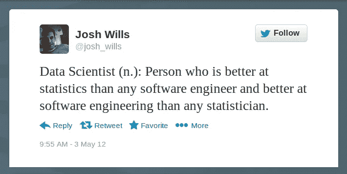*

*虽然本文的目标是探索设计现代可扩展的基于 Azure 的 re 的真正解决方案，而不是一门关于机器学习或统计学的课程，但准确地说，下面介绍的所有实验都基于完全相同的设置仍然是有用的。首先，总体平均值、用户平均值、电影平均值、方差、标准偏差和收视率统计，使用以下在线算法进行增量计算:*

*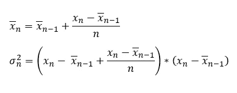*

*第二，通过随机选择 20%的用户简档评级作为“维持”交叉验证测试集，将数据集一分为二，剩余的 80%保留用于模型的训练。*

*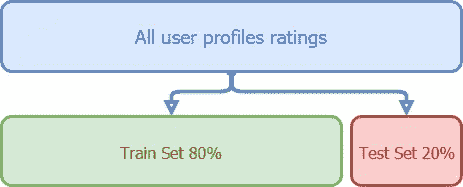*

*令人惊讶的是，现在仍然很少找到用于 re 的 SVD 的良好实现，据我所知，Spark 或其他可扩展的生态系统都没有提出任何可直接使用的预先编写的模型。此外，让我们诚实地说，在设计新系统时，对算法实际上是如何工作的，它可能的实现和含义有一个完美的理解通常是一个更好的想法。特别是 SVD 是一个广泛的模型，有许多不同的版本，尤其是在可伸缩性和并行性有问题的时候。此外，在 RE 的情况下，通常不使用实 SVD，而是使用一种称为最大间隔矩阵分解(MMMF)的变体，其最简单的表达式如下:*

*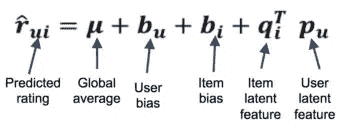*

*因此，本文中使用的初始版本是用 C#从头开始编写的，并通过 MMMF 的双凸属性优化了模型，其中用户和电影功能是同时学习的。*

# *为可扩展性而设计*

> *休斯顿，我们有一个问题…，**阿波罗 13 号，1995***

*当谈到并行化诸如 SVD 之类的算法以便能够吸收近乎无限的增长时，有几种可能的方法。第一种方法旨在通过将整个矩阵分割成更小的块并独立学习它们来减少工作量。虽然理论上是正确的，但是这种依赖于创建子时期和权重同步的“分而治之”策略不太适合 RE 的情况，并且可能仅与几个太字节和更密集矩阵的巨大数据集相关。*

*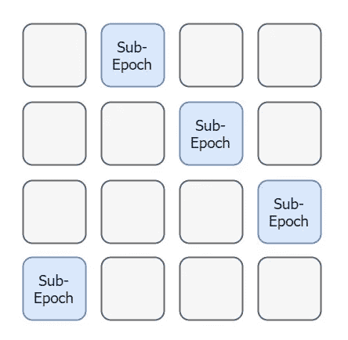*

*尽管具有良好的可扩展性，但传输数据所花费的时间大大超过了计算收益，并且因为块不是随机采样的，所以评级明显较低的块比其他块计算得更快，最终导致几个节点无所事事，等待其同系物完成。*

*另一种策略是简单地在多核机器上执行计算，从而摆脱数据传输瓶颈。不幸的是，即使在摩尔定律的帮助下，将单台计算机的性能提升到期望的水平仍然很少或不可能。在最好的情况下，商用硬件可以达到 8 或 16 个内核，然后有义务将部分工作委托给另一个节点，并再次陷入数据传输的复杂性。尽管如此，对这样一个解决方案进行基准测试，以便了解它与其他选项相比的最大性能，仍然很有意思。为此，我们编写了一个并行但不可伸缩的 SVD C #版本，并在后面章节中进一步介绍的基准测试中使用。*

# *利用大规模并行架构*

> *《钢铁侠 2008》托尼·斯塔克*

*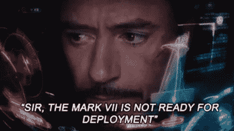*

*正如本文标题所暗示的，GPU 和大规模并行架构很可能为我们的可伸缩性和并行化问题提供解决方案。首先，GPU 可以通过其单指令/多数据(SIMD)架构提议数千个内核来处理庞大的数据集。其次，它们的高速内存在一个齿轮上可以达到十分之几 GiB，最好的超级计算机可以并行安装多个互通卡。因此，毫无疑问，在 GPU 上部署 RE 的 SVD 等算法的潜在结果可以极大地受益于这些质量，并立即解决上述所有问题。尤其是因为在最好的情况下，用户和电影数量不太可能超过几十亿…*

# *QuantAlea GPU:瑞士领导者*

*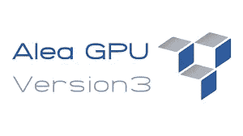*

*因为好消息很少是单独出现的，最近在著名的[微软 9 频道电视](https://channel9.msdn.com/Blogs/Seth-Juarez/Radically-Simplified-GPU-Programming-with-C)上运行的技术情报报告说，位于苏黎世的一家瑞士公司正在提供一个框架，该框架能够从任何地方透明地编译所需的 CUDA 代码。网语。据我所知，QuantAlea 是唯一的专业人士。Net 框架提议直接访问所有的 NVIDIA GPU 功能。知道了用繁琐的 Boost 库和 CUDA 开发工具包创建 C++项目的开销，这种新的可能性是一种不可否认的生产率提高，并且只要使用非企业 GPU 就可以免费使用。*

# *大规模并行化 SVD 算法*

> *“权力越大，责任越大。”蜘蛛侠 2002*

*为了获得令人满意的结果，很好地理解在图形处理单元(GPGPU)上提供通用处理的大规模并行架构非常重要。用 QuantAlea 框架直接转换现有代码会产生欺骗性的结果，并导致错误的结论，即只能获得最小的速度增益。下图简洁地描述了如何利用可支配的能力，并可能给出一两个想法，为什么这种实现仍然不是这种架构的最佳可能情况。*

*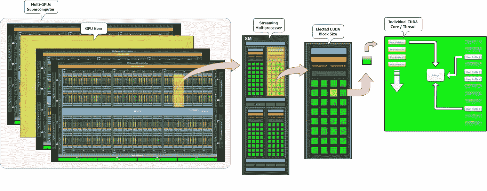*

*其他算法，如人工神经网络，更适合于非常技术性的方面，如共享内存。然而，在 GPU 上如何学习 SVD 模型的随机性质具有间接的好处，可以更好地模拟其理论属性，并避免在第一个用户配置文件上过度拟合，因为在单线程版本上就是这种情况。*

# *试驾和结果*

**

*由于本文作者尚未拥有能够在速度方面展示最佳可能结果的超级计算机，因此使用了具有以下规格的高端戴尔外星人笔记本电脑作为上述所有版本的基准。*

*   *处理器:英特尔酷睿 i7–6700 HQ CPU，2.60GHz，8 个逻辑内核*
*   *内存:16 GiB*
*   *GPU:NVIDIA GeForce GTX 1060–1280 CUDA 内核— 6 GiB GDDR5*

*下面的图表显示了训练一个唯一 SVD 历元需要多少秒。有了现成的硬件，GPU 版本比原始版本快 12 倍，比多核版本快近 4 倍。*

*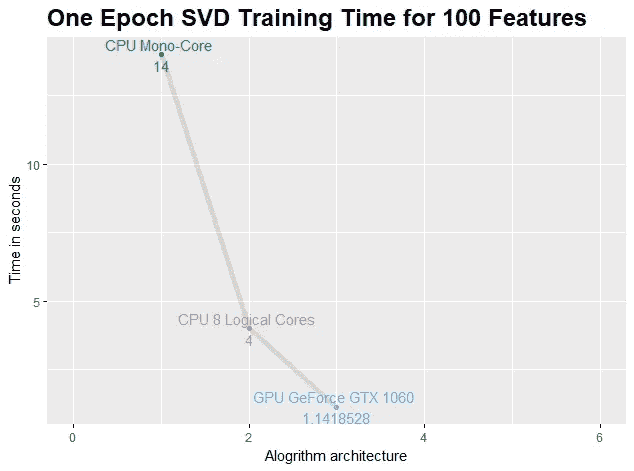*

*对于 SVD 的整个训练，可以注意到 GPU 实现比其并发运行更多的时期，尽管具有完全相同的参数。这实际上是一件好事，符合上面讨论的统计特性。训练一个 SVD 是一个随机的过程，最终只能用大规模分布式架构来正确模拟。即使有更多的迭代，总的训练时间仍然远远低于具有更好准确性的原始最佳版本。*

*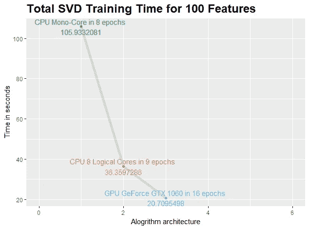*

# *但是 Azure 产品怎么样呢？*

> *“医学博士？分子脱离装置。我们叫她‘小博士’。”**2013 年《安德的游戏》***

**

*在 today Azure 产品上运行相同的实验将允许使用不少于 4992 个内核的 Tesla K80。但新的特斯拉 P100 已经宣布上市，并将推动任何 HPC 应用程序的理论上的 2tb 全局内存的极限。从用户的角度来看，一张约 10，000 美元的卡肯定会受益于按使用付费计划…*

# *使用 Azure Batch 运行 HPC SVD 算法*

**

*在上一篇文章“[Azure Machine Learning:Not Your 平常的回归](https://medium.com/@Herger/chapter-3-azure-machine-learning-not-your-usual-regression-44fcde63c56a)”中，Azure Machine Learning 满足了大多数基础设施需求。在当前情况下，SVD 算法比用于拟合独立用户简档的弹性网络回归大得多。因此，我们需要一个更复杂的架构基础设施，使用 Azure Batch 来训练模型，使用独立可扩展的 Azure WebApp 来提供个性化预测。此外，必须建立排队机制，以要求推荐者安全地处理所需的工作流步骤。同样重要的是要注意，没有提到当对他们的评级进行改变时，如何递增地重新训练简档。这种操作通常被称为“折叠”,超出了本文的范围。*

*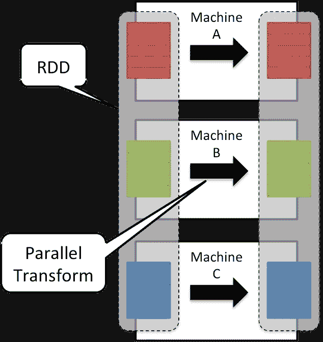*

*另一个非常重要的点是将已经相当可观的 2000 万收视率数据集传输到计算集群所需的时间。在现实世界中，从磁盘数据存储器中一个等级接一个等级地重复执行这种操作通常是不切实际的。后者需要大规模扩展，才能达到与 Event Hub 相当的性能，后者是该领域最快的解决方案。因此，不是沿着这条路走下去，而是将包含所有评级的映射文件上传到单个 blob，并由集群的每个节点直接下载。第一个数据集可以被看作是一个种子，最终可以存储在分布式内存服务中，比如 Redis Cache。因此，相对于云架构提供了最大可能的速度。唯一的另一种选择是使用 Spark 弹性分布式数据集(RDD)，但由于不需要所有的转换机制，这个解决方案暂时被搁置一边。*

*最后，人们可以想象每天从内存中非常快速地重新计算整个数据集，或者创建一个新版本的算法，允许稳定的增量学习，非常像第一章中介绍的与在线计算均值和方差相关的简单方程。*

# *设置 Azure Batch HPC 集群*

*依我拙见，Azure Batch 是 Azure 的一个很好的未被充分利用的服务，直接经历了 Hadoop MapReduce 当前的流行，没有特别的技术原因。Azure Batch API 易于使用，并通过 C#代码或简单的 Powershell 命令实现自动化。该门户还提供了大多数功能，但应该仅用于实际监控已部署的虚拟机和正在运行的作业，因为它缺乏任何可编程的可操作性。*

*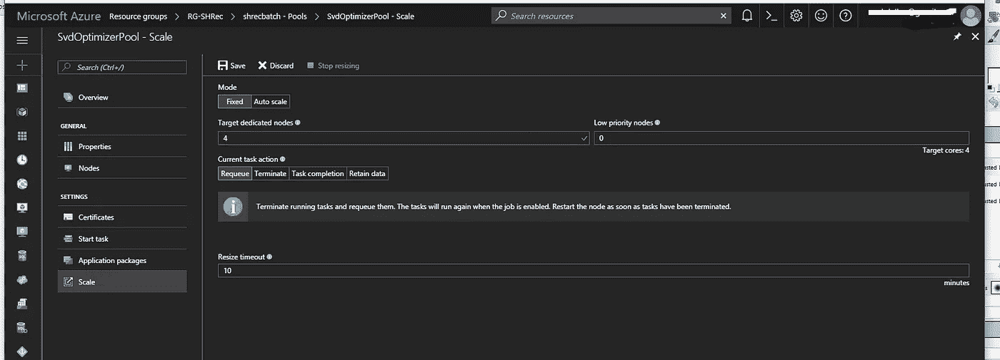*

*出于演示目的，部署了一个包含四个虚拟机(VM)的简单集群，采用标准计划。这些节点中的每一个都被要求用特定的参数训练一个版本的 SVD，以便快速找到满意的组合。推进这一方面将导致实现完全并行的遗传算法(GA ),以达到接近最优的解决方案。当参数的数量变得很重要时，手工处理这项任务变得很困难。*

# *创造有意义的工作*

*Azure Batch 的众多出色特性之一在于可以在作业中定义任务依赖关系，从而提供了等待一组操作完成后再继续的能力。每次任务启动时，它都会下载一个应用程序包和评级数据集。下图显示了为实验选择的实际树:*

*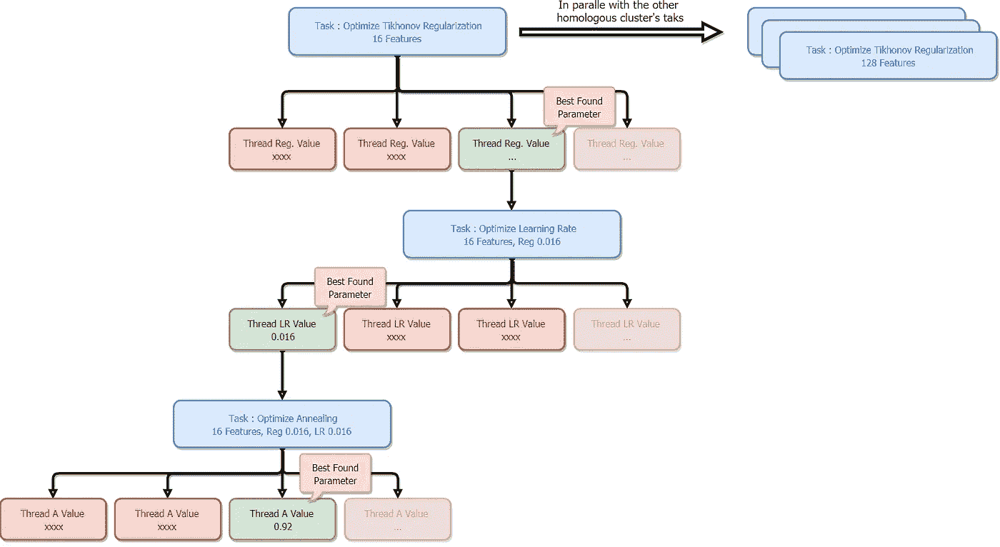*

*集群中总共有 4 个节点同时运行一个多线程任务。每当一个任务完成时，它将获得的最佳 RMSE 和相应的参数存储在一个 blob 中，允许下一个任务从获得的结果开始并进一步优化。*

*出于实际原因，最终使用了 SVD 算法的多核版本。QuantAlea GPU 在企业级 GPU 上使用他们的框架每年收费 2000 美元，显然超出了目前的概念验证预算。*

# *监控培训*

*同样，Azure 的用户体验非常好。可以在门户上直接监控不同节点的活动。*

*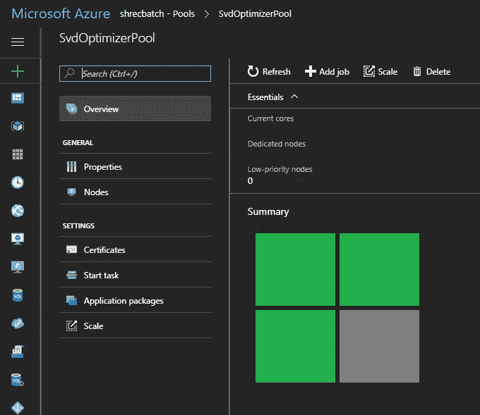*

*此外，Azure Batch blade 允许探索每个节点，并最终使用远程桌面会话主机(RDSH)直接登录相应的虚拟机，以调查最终的问题或获得更精确的遥测数据。*

*最后，通过观察下面显示的高偏差/高方差指标，获得了最佳 RMSE，从而成功地结束了这一真实场景。*

*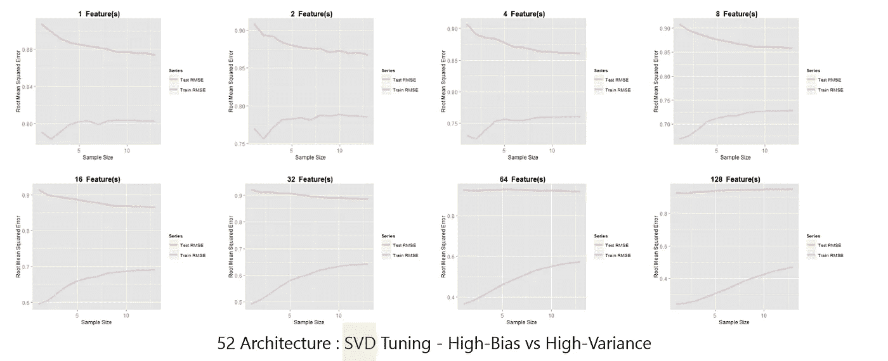*

# *结论和进一步的思考*

*从微软文化的角度来看，很高兴看到 Azure 在可伸缩应用领域的良好竞争力，这个领域主要由 Apache Unix / Java 项目主导。尽管如此，人们还是可以从这家企业的产品中看到更多的创新。为了实现这一目标，MS 技术必须找到一种在相关领域中被更广泛采用和欢迎的方法。如果提出了好的解决方案，没有理由不这样做，因为部署在生产中的系统从今天的 ms 技术中获得了真正的生产力提升。*

*Azure Batch 是一个很好的服务，肯定会从更好地向公众展示中受益。在人工智能非常中介和有用的时期，一个关于在 Cortana 智能诉讼中拥有相当于火花 RDD 的可能性的解决方案将是非常诱人的。同样，来自金融行业的 QuantAlea GPU 等计划无疑正朝着正确的方向发展，以缓解该领域对 MS 的接受。*

*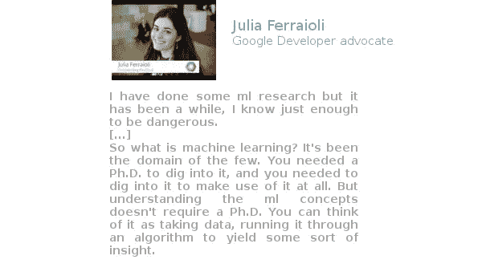*

*现在众所周知，许多企业和云供应商正在他们的产品中提出机器学习功能。通常的营销信息表明，每个应用程序都可以很容易地集成 ML 功能。但这一格言往往不符合所涉及的实际理论和技术复杂性、可能性的多样性和技术的快速发展，特别是对于最先进的情况。操作数据科学很难，如果从错误的角度着手，很容易适得其反。*

*关于 RE 领域，构建甚至正确使用推荐器仍然是一项具有挑战性的工作。所需的经验和洞察力最终形成了一个共同的文化背景，整个社区自然地聚集在一起，就像在 Netflix 奖挑战赛期间创造的一样。虽然有些学科确实被缩小到特定的科学领域，但它们对大多数人来说是有用的、广泛的、现代的、受欢迎的和与商业相关的，并且无疑将在未来的几十年里继续逐步融入我们的日常生活。*

*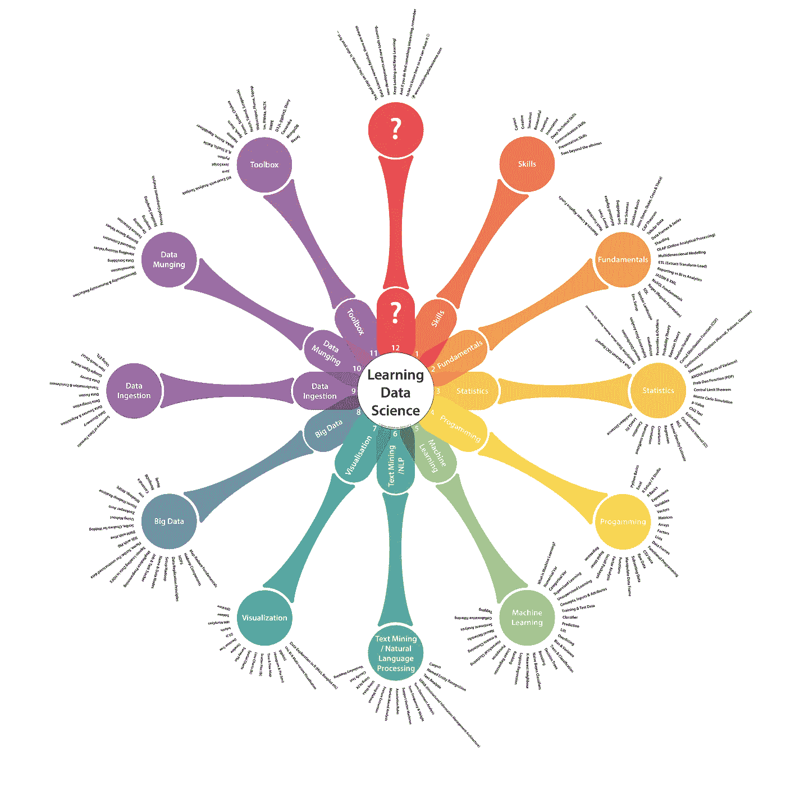*

# *来源*

*   *[https://blogs . TechNet . Microsoft . com/machine learning/2016/08/23/what-is-your-data-science-super-power/](https://blogs.technet.microsoft.com/machinelearning/2016/08/23/what-is-your-data-science-super-power/)*
*   *[https://blogs . NVIDIA . com/blog/2016/11/15/微软-GPU-虚拟机-azure-cloud-go-public/](https://blogs.nvidia.com/blog/2016/11/15/microsoft-gpu-virtual-machines-azure-cloud-go-public/)*
*   *[https://www . the register . co . uk/2017/05/22/cloud _ providers _ ai _ researchers/](https://www.theregister.co.uk/2017/05/22/cloud_providers_ai_researchers/)*
*   *[https://azure . Microsoft . com/en-us/blog/more-GPU-more-power-more-intell](https://azure.microsoft.com/en-us/blog/more-gpus-more-power-more-intell)*
*   *[https://www.youtube.com/watch?v=Ja2hxBAwG_0](https://www.youtube.com/watch?v=Ja2hxBAwG_0)*
*   *[http://www.quantalea.com/](http://www.quantalea.com/)*
*   *https://grouplens.org/datasets/movielens/20m/*
*   *【http://people.csail.mit.edu/jrennie/papers/phd-thesis.pdf *

**

*   *[https://db . in . tum . de/hosted/scalable analytics/presentations/ge mulla . pdf](https://db.in.tum.de/hosted/scalableanalytics/presentations/gemulla.pdf)*
*   *[https://azure . Microsoft . com/en-us/documentation/learning-paths/batch/](https://azure.microsoft.com/en-us/documentation/learning-paths/batch/)*
*   *[http://www . eweek . com/cloud/Microsoft-expanding-azure-s-GPU-processing-options-for-ai-workloads](http://www.eweek.com/cloud/microsoft-expanding-azure-s-gpu-processing-options-for-ai-workloads)*
*   *[https://en.wikipedia.org/wiki/Apache_Spark](https://en.wikipedia.org/wiki/Apache_Spark)*