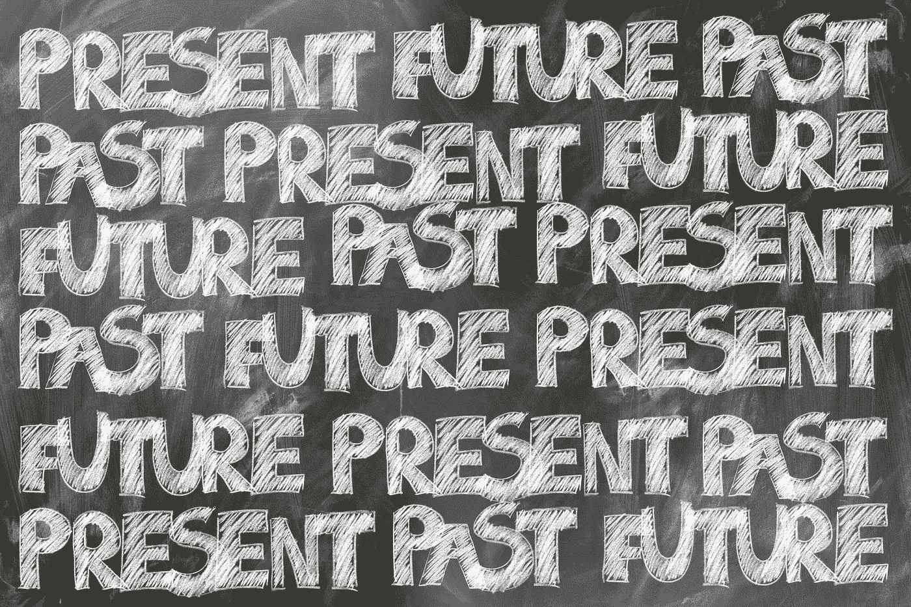
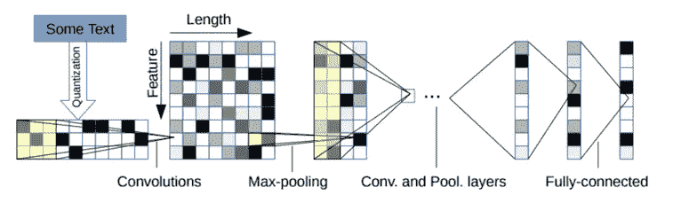
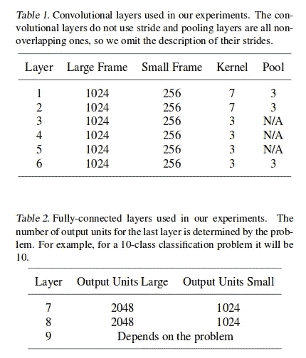
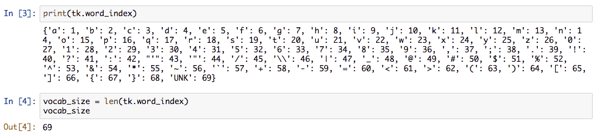
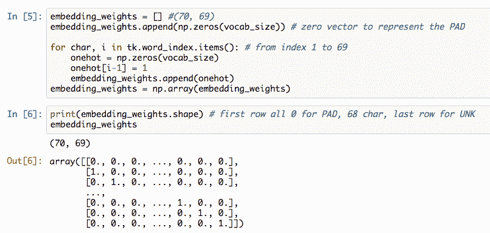
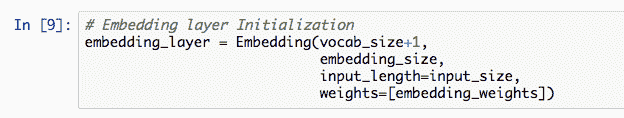
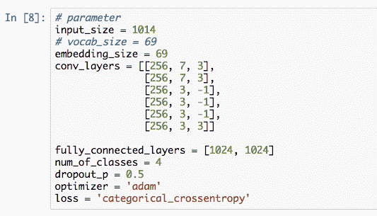
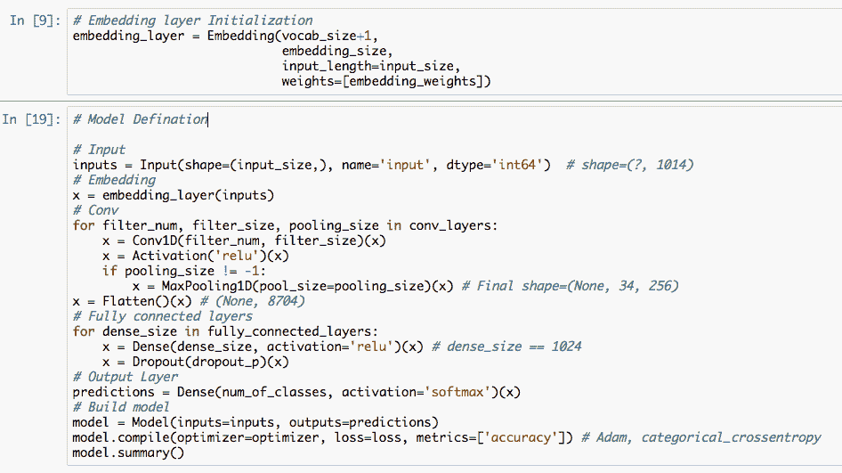
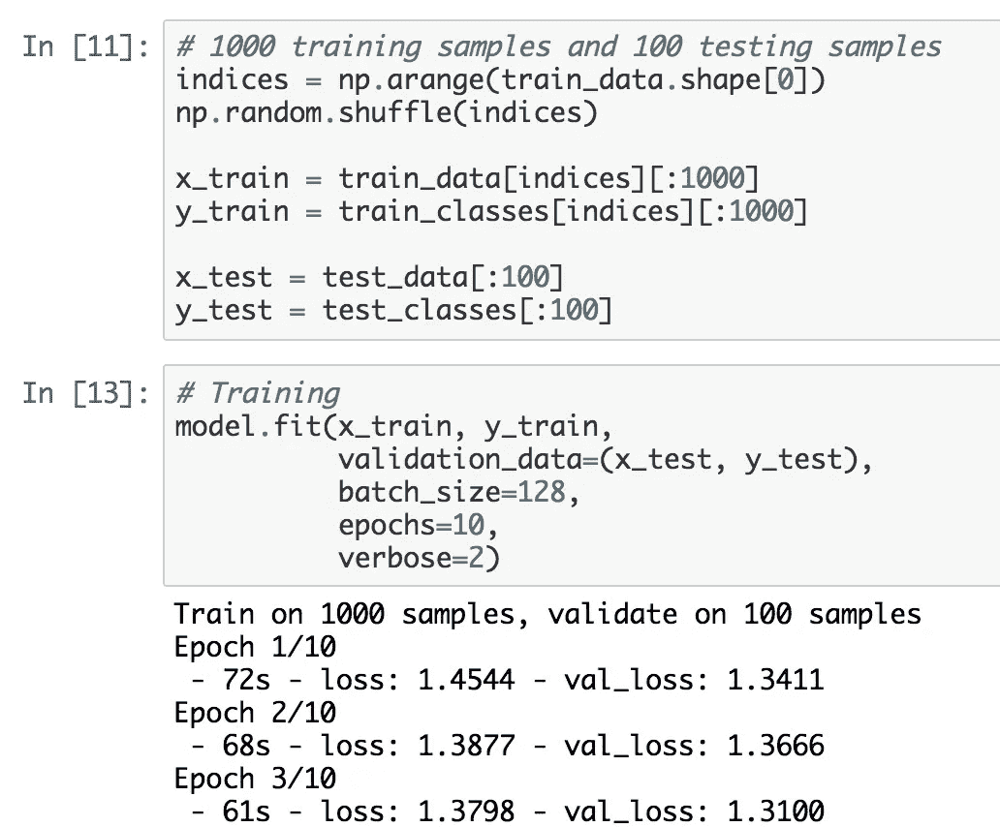

# 带 Keras 的字符级 CNN

> 原文：<https://towardsdatascience.com/character-level-cnn-with-keras-50391c3adf33?source=collection_archive---------4----------------------->

在这本笔记本中，我们将使用 Keras 构建一个角色级别的 CNN 模型。可以在本文中找到模型细节:[用于文本分类的字符级卷积网络](http://arxiv.org/abs/1509.01626)。

文章的其余部分组织如下。

*   模型介绍
*   为什么是这种模式？
*   预处理
*   负载嵌入重量
*   模型构建
*   培养

## 车型**简介**

模型结构:

这个图表可能看起来很难理解。这是模型设置。

如果你想看这个模型的细节，请移动到这个[笔记本](https://github.com/BrambleXu/nlp-beginner-guide-keras/blob/master/char-level-cnn/notebooks/char_cnn_zhang.ipynb)

我们选择小帧，卷积层 256 个滤波器，密集层 1024 个输出单元。

*   嵌入层
*   6 个卷积层，3 个卷积层，然后是最大池层
*   两个完全连接的层(keras 中的致密层)，神经元单位是 1024 个。
*   输出层(密集层)，神经元单位取决于类。在这个任务中，我们将它设置为 4。

## 为什么是这种模式？

在 Kim 提出用于句子分类的[卷积神经网络](https://arxiv.org/abs/1408.5882)之后，我们知道 CNN 可以在 NLP 任务中有很好的表现。我也实现了这个模型，如果你有一些兴趣，你可以在这里找到细节: [cnn-text-classification](https://github.com/BrambleXu/nlp-beginner-guide-keras/tree/master/cnn-text-classification) 。但是在这个模型中，它是从词的层面来取句子特征的，这就造成了 [**无词汇**(**)**](http://www.festvox.org/bsv/x1407.html)**的问题。**

**为了处理 OOV 问题，人们提出了许多方法。这个人物级别的 CNN 模型就是其中之一。顾名思义，这个模型在字符层次上处理句子。通过这种方式，可以在很大程度上减少未登录词，使 CNN 能够提取模式特征，提高文本分类性能。**

# **预处理**

**这里为了简单起见，我将所有预处理代码写在一起。如果你对预处理步骤中发生的事情感兴趣，请移至这里:[如何用 Keras 预处理字符级文本](https://medium.com/@zhuixiyou/how-to-preprocess-character-level-text-with-keras-349065121089)**

# **负载嵌入重量**

**为了理解如何给嵌入层分配嵌入权重，这里我们手动初始化嵌入权重，而不是随机初始化。**

**首先，我们要确认我们的词汇量有多少。**

****

**我们可以看到，除了 68 个字符之外，我们还有一个`UNK`(未知令牌)来表示词汇中的稀有字符。**

**然后我们用一热向量来表示这 69 个单词，也就是说每个字符有 69 个维度。因为 Keras 使用 0 表示填充，所以我们添加一个零向量来表示填充。**

****

**现在，这个句子由索引来表示。例如，`I love NLP`被表示为`[9, 12, 15, 22, 5, 14, 12, 16]`。第一个索引`9`对应的是`embedding_weights[9]`，它是字符`I`的向量。**

**在我们得到这个嵌入权重之后，我们应该通过它来初始化嵌入层。**

****

# ****模型构建****

**首先，我们给出了参数设置。**

****

**然后，我们按照设置所说的那样构建模型。**

****

**`model.summary()`的输出**

# **培养**

**我们的目标是学习如何构造模型，所以这里我只是用 CPU 来运行模型，只用 1000 个样本进行训练，100 个样本进行测试。由于数据集较小，该模型容易过拟合。**

****

**将所有代码汇总在一起。**

***这篇文章的笔记本这里是***，整个剧本这里是***。预处理条是* [*这里是*](https://medium.com/@zhuixiyou/how-to-preprocess-character-level-text-with-keras-349065121089)****

****我创建了一个存储库来存放我作为初学者学习 NLP 时的工作。如果你觉得有用，请启动这个项目。我很高兴听到反馈或建议。
[**NLP-初学者-指南-keras**](https://github.com/BrambleXu/nlp-beginner-guide-keras)****

> *******查看我的其他帖子*** [***中***](https://medium.com/@bramblexu) ***同*** [***一个分类查看***](https://bramblexu.com/posts/eb7bd472/) ***！
> GitHub:***[***bramble Xu***](https://github.com/BrambleXu) ***LinkedIn:***[***徐亮***](https://www.linkedin.com/in/xu-liang-99356891/) ***博客:***[***bramble Xu***](https://bramblexu.com)****