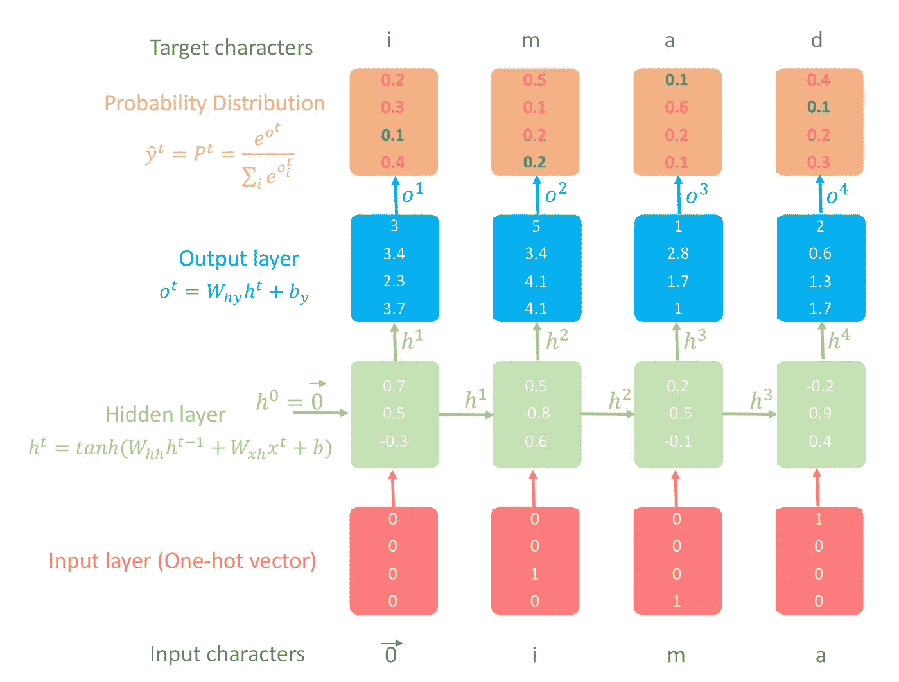
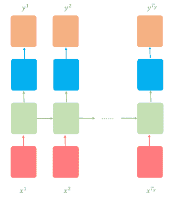
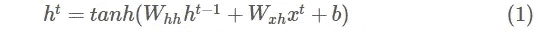
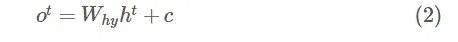
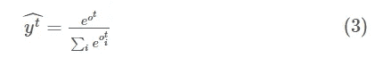
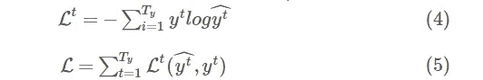
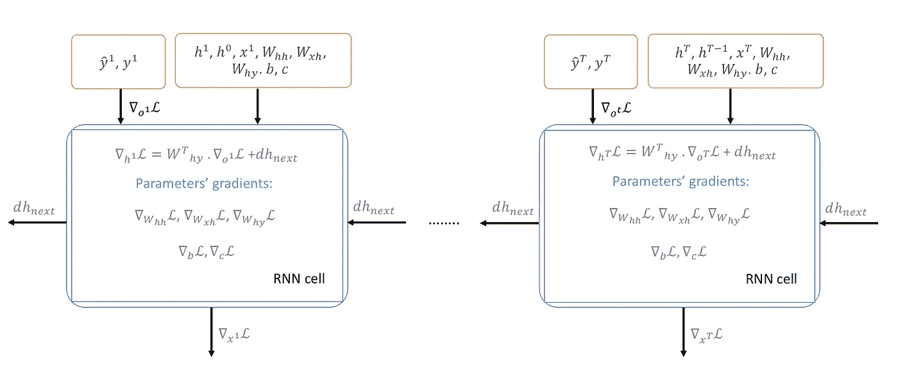
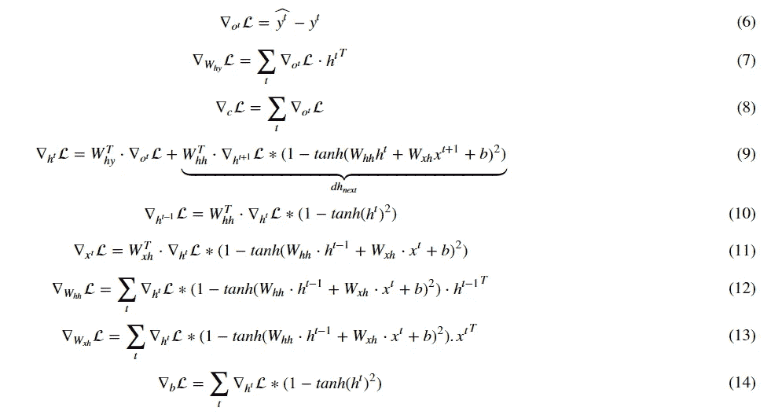
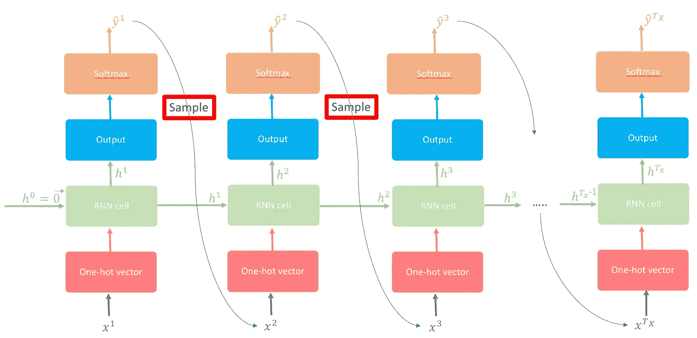
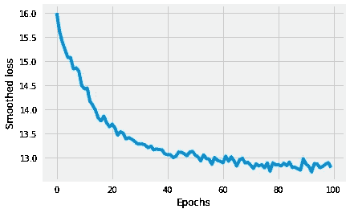

# 字符级语言模型

> 原文：<https://towardsdatascience.com/character-level-language-model-1439f5dd87fe?source=collection_archive---------1----------------------->


Iphone’s text suggestion

# **简介**

你有没有想过 Gmail 自动回复是如何工作的？或者你的手机在发短信时如何提示下一个单词？或者甚至神经网络是如何生成音符的？生成文本序列的一般方法是训练一个模型，在给定所有先前单词/字符的情况下预测下一个单词/字符。这样的模型被称为**统计语言模型**。什么是统计语言模型？统计语言模型试图捕捉它所训练的训练文本的统计结构(潜在空间)。通常使用**递归神经网络(RNN)** 模型族来训练模型，因为它们非常强大且具有表现力，通过它们的高维隐藏状态单元来记忆和处理过去的信息。任何语言模型的主要目标都是学习训练文本中字符/单词序列的联合概率分布，即试图学习联合概率函数。例如，如果我们试图预测一个由 *T* 个单词组成的序列，我们试图得到尽可能大的联合概率 *P(w_1，w_2，…，w_T)* ，它等于所有条件概率∏ *P(w_t/w_{t-1})* 在所有时间步(T)的乘积。

在这篇文章中，我们将讨论**字符级语言模型**，其中几乎所有的概念都适用于任何其他语言模型，比如单词语言模型。字符级语言模型的主要任务是在给定数据序列中所有先前字符的情况下预测下一个字符，即逐字符生成文本。更正式地说，给定一个训练序列(x，…，x^T)，RNN 使用其输出向量(o，…，o^T)的序列来获得预测分布序列*p(x^t/x^{t-1})**= softmax(o^t)*。

让我们以我的名字(“imad”)为例来说明字符级语言模型是如何工作的(这个例子的所有细节见图 1)。

1.  我们首先构建一个词汇字典，使用语料库中名称的所有唯一字母作为关键字，每个字母的索引从零开始(因为 Python 是一种零索引语言)以升序排列。对于我们的例子，词汇字典应该是:{"a": 0，" d": 1，" i": 2，" m": 3}。因此，“imad”将成为以下整数的列表:[2，3，0，1]。
2.  使用词汇字典将输入和输出字符转换成整数列表。在这篇文章中，我们假设所有的例子都是 x = \vec{0}。因此， *y = "imad"* 和 x = \vec{0}\ + *"ima"* 。换句话说， *x^{t + 1} = y^t* 这就给了我们: *y = [2，3，0，1]* 和 *x = [\vec{0}，2，3，0]* 。
3.  对于输入中的每个字符:
4.  将输入字符转换成一键向量。注意第一个字符是:零矢量
5.  计算隐藏状态层。
6.  计算输出图层，然后将其通过 softmax 以概率形式获得结果。
7.  将时间步(t)的目标字符作为时间步 *(t + 1)* 的输入字符。
8.  回到步骤 A 并重复，直到我们完成名称中的所有字母。

目标是在概率分布层中使绿色数字尽可能大，红色数字尽可能小。原因是，通过使其尽可能接近 1，真实指数应该具有最高的概率。这样做的方法是使用交叉熵来测量损失，然后计算损失相对于所有参数的梯度，以在梯度方向的相反方向上更新它们。多次重复该过程，其中每次我们基于梯度方向调整参数–>模型将能够使用训练文本中的所有名称，在给定所有先前字符的情况下，正确地预测接下来的字符。请注意，隐藏状态$h⁴$有所有字符的所有过去的信息。



**Figure 1:** Illustrative example of character-level language model using RNN

*注*:为了缩短帖子的长度，我删除了所有 python 函数的 docstrings，也没有包括一些我认为对理解主要概念没有必要的函数。创建这个帖子的笔记本和脚本可以在[这里](https://nbviewer.jupyter.org/github/ImadDabbura/blog-posts/blob/master/notebooks/Character-LeveL-Language-Model.ipynb)和[这里](https://github.com/ImadDabbura/blog-posts/blob/master/scripts/character_level_language_model.py)找到。

# 培养

我们将使用的[数据集](http://deron.meranda.us/data/census-derived-all-first.txt)有 5163 个名字:4275 个男性名字，1219 个女性名字，331 个既可以是女性名字也可以是男性名字。我们将用来训练字符级语言模型的 RNN 架构被称为**多对多**，其中输入的时间步长 *T_x* =输出的时间步长 *T_y* 。换句话说，输入和输出的序列是同步的(见图 2)。



**Figure 2:** RNN architecture: many to many

字符级语言模型将在名字上进行训练；这意味着在我们训练完模型之后，我们将能够生成一些有趣的名字:)。

在这一部分，我们将讨论四个主要部分:

1.  正向传播。
2.  反向传播。
3.  取样。
4.  拟合模型。

# 正向传播

我们将使用随机梯度下降法(SGD ),其中每批只包含一个样本。换句话说，RNN 模型将分别从每个示例(名称)中学习，即，对每个示例运行向前和向后传递，并相应地更新参数。以下是向前传球所需的所有步骤:

*   使用唯一的小写字母创建一个词汇词典。
*   创建一个字符索引字典，将每个字符按升序映射到其对应的索引。例如，“a”的索引为 1(因为 python 是一种零索引语言，我们将为 EOS“\ n”保留 0 索引)，而“z”的索引为 26。我们将使用这个字典将名字转换成整数列表，其中每个字母将被表示为一个 hot vector。
*   创建将索引映射到字符的字符索引字典。该字典将用于将 RNN 模型的输出转换成字符，这些字符将被翻译成名称。
*   初始化参数:权重将被初始化为来自标准正态分布的小随机数，以打破对称性，并确保不同的隐藏单元学习不同的东西。另一方面，偏差将被初始化为零。
*   *W_hh* :连接先前隐藏状态 *h^{t — 1}* 到当前隐藏状态 *h^t* 的权重矩阵。
*   *W_xh* :连接输入 *x^t* 到隐藏状态 *h^t* 的权重矩阵。
*   *b* :隐藏状态偏置向量。
*   *W_hy* :连接隐藏状态 *h^t* 到输出 *o^t* 的权重矩阵。
*   *c* :输出偏置矢量。
*   将输入 *x^t* 和输出 *y^t* 各转换成一个热点向量。独热向量的维数是 vocab_size x 1。除了字母在(t)处的索引是 1 之外，其他都是 0。在我们的例子中， *x^t* 将与 *y^t* 一样向左移动，其中 x = \ vec { 0 }；然而，从*开始 t = 2* ， *x^{t + 1} = y^t* 。比如我们用“imad”作为输入，那么 y = [3，4，1，2，0]而 x = [\vec{0}，3，4，1，2]。请注意，x = \vec{0}而不是索引 0。此外，我们使用“\n”作为每个名字的 EOS(句尾/名字),这样 RNN 就可以像学习其他字符一样学习“\n”。这将有助于网络了解何时停止生成字符。因此，所有名称的最后一个目标字符将是代表名称结尾的“\n”。
*   使用以下公式计算隐藏状态:



注意，我们使用双曲正切作为非线性函数。双曲正切函数的主要优点之一是它类似于恒等函数。

*   使用以下公式计算输出图层:



*   通过 softmax 层传递输出，以标准化输出，使我们能够将其表示为概率，即所有输出将介于 0 和 1 之间，总和为 1。下面是 softmax 公式:



softmax 层与输出层具有相同的维度，即 vocab_size x 1。结果， *y^t[i]* 是索引 *i* 在时间步(t)成为下一个字符的概率。

*   如前所述，字符级语言模型的目标是最小化训练序列的负对数似然性。因此，时间步长(t)的损失函数和所有时间步长的总损失为:



由于我们将使用 SGD，损失将是嘈杂的，有许多振荡，因此使用指数加权平均平滑损失是一个好的做法。

*   将目标角色 *y^t* 作为下一个输入 *x^{t + 1}* 传递，直到我们完成序列。

# 反向传播

对于基于 RNN 的模型，将使用的基于梯度的技术被称为通过时间的**反向传播(BPTT)** 。我们从最后一个时间步$T$开始，对所有时间步的所有参数进行反向传播损失函数，并将它们相加(见图 3)。



**Figure 3:** Backpropagation Through Time (BPTT)

此外，由于已知 rnn 具有陡峭的悬崖(在 *L* 中突然急剧下降),梯度可能会超过最小值，并取消许多已完成的工作，即使我们使用 RMSProp 等自适应学习方法。原因是因为梯度是损失函数的线性近似，并且可能不会捕获比其评估点更远的信息，例如损失曲线的曲率。因此，通常的做法是将渐变裁剪到区间[-maxValue，maxValue]内。在这个练习中，我们将把渐变剪辑到区间[-5，5]内。这意味着如果坡度是> 5 或< -5，它将分别被修剪为 5 和-5。以下是计算所有时间步长下所有参数的梯度所需的所有公式。



请注意，在最后一个时间步骤 *T* ，我们将把 *dh_next* 初始化为零，因为我们无法从未来获取值。由于 SGD 可能有如此多的振荡，为了稳定每个时间步的更新，我们将使用一个自适应学习方法优化器。更具体地说，我们将使用[均方根传播(RMSProp)](https://nbviewer.jupyter.org/github/ImadDabbura/Deep-Learning/blob/master/notebooks/Optimization-Algorithms.ipynb) ，它往往具有可接受的性能。

# 抽样

采样使得 RNN 在每个时间步生成的文本成为有趣/有创意的文本。在每一个时间步(t)上，RNN 输出给定所有前面字符的下一个字符的条件概率分布，即 *P(c_t/c_1，c_2，…，c_{t-1})* 。让我们假设我们在时间步 *t = 3* 并且我们试图预测第三个字符，条件概率分布是:*P(C3/C1，C2)=(0.2，0.3，0.4，0.1)* 。我们会有两个极端:

1.  最大熵:使用均匀概率分布随机挑选角色；这意味着词汇词典中的所有字符都有相同的可能性。因此，我们在选择下一个字符时会以最大的随机性结束，生成的文本将没有意义或听起来不真实。
2.  最小熵:条件概率最高的字符将在每个时间步被选中。这意味着下一个字符将是模型根据训练文本和学习参数估计的正确字符。因此，生成的名称既有意义又听起来真实。然而，它也将是重复的并且不那么有趣，因为所有的参数都被优化以学习预测下一个字符的联合概率分布。

随着我们增加随机性，文本将失去局部结构；然而，随着我们降低随机性，生成的文本听起来会更真实，并开始保留其局部结构。在这个练习中，我们将从模型生成的分布中取样，这可以被视为最大和最小熵之间的中间随机水平(见图 4)。对上述分布使用这种抽样策略，指数 0 有 *20%* 的概率被选中，而指数 2 有 *40%* 的概率被选中。



**Figure 4:** Sampling: An example of predicting next character using character-level language model

因此，将在测试时使用采样来逐字符生成名称。

# 拟合模型

在涵盖了字符级语言模型背后的所有概念/直觉之后，现在我们准备好拟合模型了。我们将使用 RMSProp 的超参数的默认设置，并运行模型 100 次迭代。在每次迭代中，我们将打印出一个采样的名称和平滑的损失，以查看随着更多的迭代，生成的名称如何开始变得更有趣，以及损失将开始减少。完成模型拟合后，我们将绘制损失函数并生成一些名称。

下面是培训期间生成的一些输出:

```
There are 36121 characters and 27 unique characters.

Epoch 0
=======
Sampled name: Nijqikkgzst
Smoothed loss: 23.0709Epoch 10
=======
Sampled name: Milton
Smoothed loss: 14.7446Epoch 30
=======
Sampled name: Dangelyn
Smoothed loss: 13.8179Epoch 70
=======
Sampled name: Lacira
Smoothed loss: 13.3782Epoch 99
=======
Sampled name: Cathranda
Smoothed loss: 13.3380
```



Figure 6: Smoothed loss

15 个时代后，产生的名字开始变得更有趣。我没有包括所有时代的结果来缩短帖子；但是，你可以在与这篇文章相关的[笔记本](https://nbviewer.jupyter.org/github/ImadDabbura/blog-posts/blob/master/notebooks/Character-LeveL-Language-Model.ipynb)中查看结果。其中一个有趣的名字是“Yasira”，这是一个阿拉伯名字:)。

# 结论

统计语言模型在语音识别和机器翻译等自然语言处理中至关重要。在这篇文章中，我们使用字符级语言模型展示了统计语言模型背后的主要概念。该模型的任务是使用从包含 5，163 个姓名的人口普查数据中获得的姓名来逐字符生成姓名。以下是主要要点:

*   如果我们有更多的数据，更大的模型，训练更长的时间，我们可能会得到更有趣的结果。然而，为了得到一个非常有趣的结果，我们应该转而使用**长短期记忆(LSTM)** 模型，具有一层以上的深度。人们已经使用了 3 层深度 LSTM 模型，当应用于烹饪书和莎士比亚诗歌时，能够产生非常有趣的结果。LSTM 模型优于简单 RNN，因为它能够捕捉更长的时间相关性。
*   对于我们使用的采样技术，不要期望 RNN 生成有意义的字符序列(名称)。
*   我们在这篇文章中使用每个名字作为它自己的序列；但是，如果增加批量，我们也许可以加快学习速度，获得更好的结果；假设从一个名字到 50 个字符的序列。
*   我们可以使用采样策略来控制随机性水平。在这里，我们在模型认为它是正确的角色和随机性水平之间进行了平衡。

*原载于 2018 年 2 月 22 日*[*imaddabbura . github . io*](https://imaddabbura.github.io/posts/character-language-model/Character-LeveL-Language-Model.html)*。*