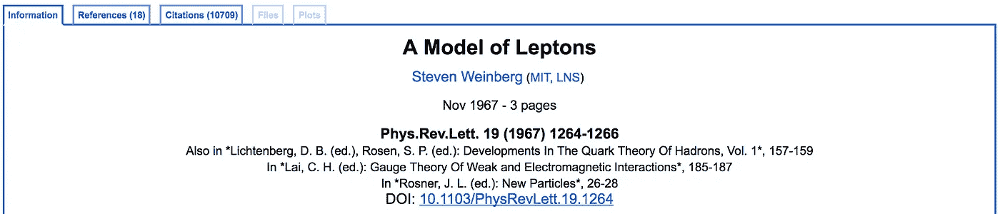
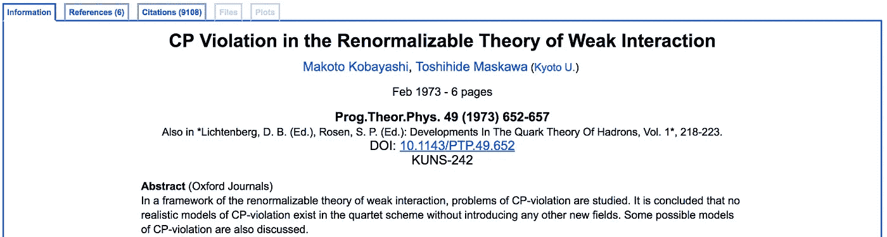
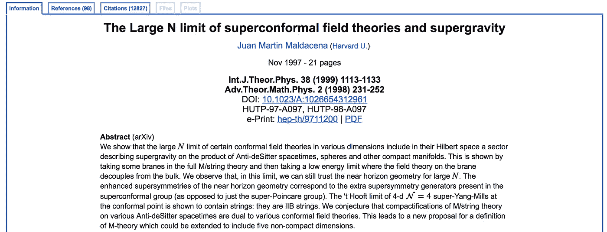
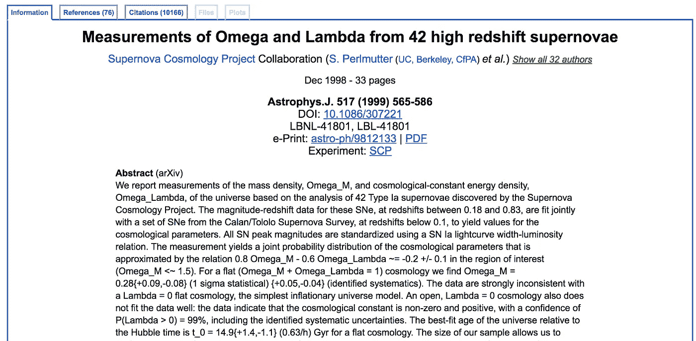

# 用 PageRank 描述科学影响——第一部分

> 原文：<https://towardsdatascience.com/characterizing-scientific-impact-with-pagerank-part-i-1ac8e000c466?source=collection_archive---------5----------------------->

人们常说，学术的生死系于引用之剑。我目前在学术界，我想说在我的学科中这是真的。在这篇博客中，我将分享我从事的一个附带项目的一些结果，通过使用替代性的度量标准来衡量科学影响，从而了解网络。特别是，通过 page rank——谷歌搜索引擎最初基于的算法——而不是通常的指标，如引用总数，来评估出版物的影响和作者的累积影响。

在继续之前，让我对我的学科做一些概述。我在粒子物理领域(又名“高能物理”)。我认为这个领域包括大约 10，000 名物理学家，分为两类:理论家和实验家。我属于前者。领域相对开放，学院化，这是一件很棒的事情。

我们(最终)在同行评议的期刊上发表我们的结果，虽然被评议的论文肯定仍然是一个重要的指标——特别是对于晋升、实验者的重大发现等——但几乎每个人都在 a [rXiv](https://arxiv.org/) 上看论文，论文的预印版本在那里发表。由于声誉是科学界的主要货币，只有在预印版本经过社区的非正式同行评审后，它才会被提交给期刊。

HEP 的另一个很好的资源是 [InspireHEP](http://inspirehep.net/?ln=en) ，这是一个强大的数据库，你可以在其中搜索发表在同行评审期刊或 arXiv(或两者兼有)上的论文，也可以搜索作者等。InspireHEP 允许你查找任何作者的科学统计数据。例如，诺贝尔物理学奖获得者史蒂芬·温伯格的累积数据可以在[这里](http://inspirehep.net/author/profile/S.Weinberg.1)找到:

Citation statistics summary for Steven Weinberg, Nobel Prize in Physics in 1979 for the formulation of the Standard Model of Particle Physics (along with Glashow and Salam!).

现在，史蒂芬·温伯格有多达 70，487 次的引用，所以如果你假设一篇论文的科学影响力与它的引用成正比，这在这种情况下肯定是正确的。然而，这篇论文并不是粒子物理学中被引用最多的论文，在这篇论文中，温伯格提出了粒子物理学的标准模型，并使他与格拉肖和萨拉姆一起获得了 1979 年的诺贝尔奖。

这就引出了一个问题:科学的影响力是通过引用的数量来衡量的吗？引用被赋予了很大的权重，尤其是在聘用教员或博士后研究人员时。问题是你可以想出几个系统被玩的方法(不一定是故意的)，比如:

*   X 引用 Y，Y 引用 X 作为回报；或者
*   每当 X 写一篇新论文时，X 就引用 X 的每一篇旧论文；或者
*   X 主要写关于统计侥幸的论文，这让很多其他人兴奋，所以 X 通过成为第一个**发表关于侥幸可能是什么的解释(在侥幸最终消失之前)的**从那些其他容易兴奋的人那里收集了很多引用；诸如此类。

似乎今天的论文有更多的参考文献，所以有可能新的论文比过去的论文被引用的次数更多。

因此，有了这样的背景，这里是一个附带项目的初步结果，我用谷歌的 PageRank 量化了 HEP 的论文和作者的影响。

*注:在做这个项目作为学习网络的有趣方式时，我偶然发现了这篇* [*论文*](https://arxiv.org/pdf/physics/0604130.pdf) *。据我所知，他们是第一个使用谷歌搜索算法来评估科学论文的人。他们集中研究了 1893-2003 年左右发表在《物理评论》杂志上的论文。除此之外，接下来的结果是我自己的。*

为了清楚起见，让我通过一个简单的例子简单回顾一下 PageRank (PR)是如何工作的。假设你有 3 个网站，A，B，c。我们最初假设总公关等于 1，并平均分配给所有网站，因为每个网站都同样重要。所以，首先，A，B，C，都有 1/3 的 PR。现在，如果例如 B 在它的站点上有到 A 和 C 的链接，A 或 C 的 PR 是:PR(A 或 C) = *1/N + PR(B)/L(B)，*其中 N 是站点的总数，L(B)是 B 链接的站点的总数。所以现在站点 A 和 C 同等重要，并且比 B 更重要。在实践中，你迭代几次直到每个站点的 PR 收敛到一个稳定的值。我不会写 N 个网站的通用表达式，但本质上，每个网站都将其 PR 平等地赋予它链接的网站。这个算法向我们展示的是*被其他人认可的站点，这些站点本身被许多其他人认可，比没有被其他人认可的站点更重要*。一个技术问题:该算法还有另一个称为“阻尼因子”的参数，它大致对应于随机用户点击当前网站链接的概率。人们选择的典型值是阻尼因子= 0.85，据我所知，这是从社会实验中获得的(见[维基百科](https://en.wikipedia.org/wiki/PageRank)文章)。我将在以后评论阻尼因子的不同选择。现在，这里我将连接网站→发表，应用 PR 算法找到“重要”的论文。好了，现在来看结果。

# 一些程序细节

对于这项研究，我从 InspireHEP 下载了整个数据库，可以在这里找到。它有几种格式，JSON 格式很方便，所以它对 Python 非常友好。它包含了从 1962 年以来的每一篇论文的元数据，并包括迄今为止大约 120 万篇出版物。它为我们提供的每个记录 id(纸张)的相关信息是:

1.  作者；
2.  论文中的参考文献；
3.  论文的引用；和
4.  出版日期。

现在，这意味着我们可以为每篇论文 *i* 创建一个“边缘” *(i，j)* ，其中 *j* 是我 *i* 引用的论文。类似地，我们可以创建形式为 *(k，i)* 的边，其中 *k* 是引用 *i* 的论文。因此，边的集合允许我们形成一个(有向)网络。

你可以在我的 GitHub [这里](https://github.com/ieder1357/InspireHEP-Network-Analysis)找到我为这个项目编写和使用的代码。

# 评估论文的影响

因此，现在专注于描述论文，你可能会问 InspireHEP 上 PR 最高的论文是什么。前三名是:

1.  史蒂芬·温伯格的轻子纸模型。正是这篇论文让他获得了诺贝尔奖。迄今为止，它被引用了 10，709 次，但它不是 HEP 上被引用最多的论文。

2.第二，我们有肯·威尔逊关于夸克禁闭的论文。迄今为止，它“仅仅”被引用了 4483 次，但是它的重要性怎么强调都不过分。顺便说一下，威尔逊是另一个诺贝尔奖获得者，尽管他并不是因为这篇论文而获奖。

3.最后，在第三位，我们有 Kobayashi 和 Maskawa 关于电荷宇称破坏的论文。又一篇获得诺贝尔奖的论文。

为了完整起见，如果你要按照论文被引用的次数来排列，前三名应该是:

1.  胡安·马尔达西那关于广告的论文/CFT。它基本上开创了一个全新的领域。它被引用了将近 13000 次。

Maldacena’s paper on AdS/CFT. The top-cited paper on HEP.

2.温伯格关于“轻子模型”的论文。

3.超新星宇宙学项目合作论文，他们在论文中确立了宇宙正在膨胀。这为佩尔穆特赢得了 2011 年的诺贝尔奖(与施密特和里斯一起)。

The third most cited paper on HEP.

好了，论文到此为止。有趣的是，虽然被引用次数最多的论文肯定是有影响力的，但基于公关的影响力衡量指标确实捕捉到了一些不同于仅仅依赖引用的东西。特别是，威尔逊的论文似乎是一个巨大的离群值。在下一篇文章中，我会看到这一点，并更详细地量化 PR 与引用的关系以及量化作者的影响。