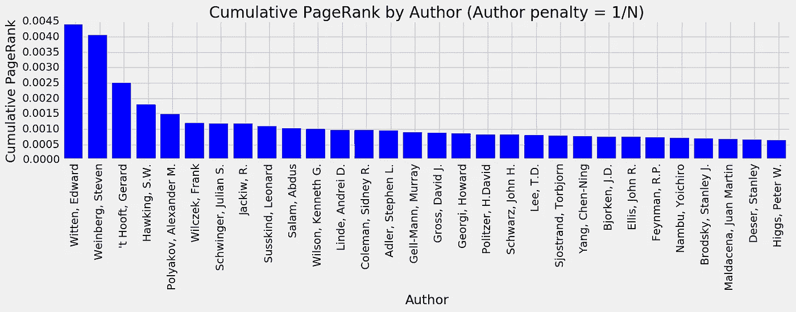
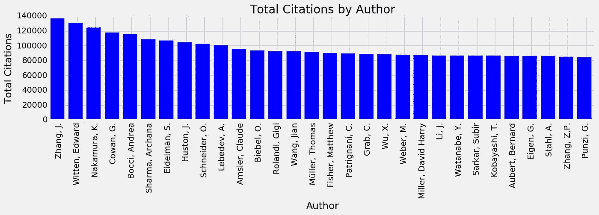
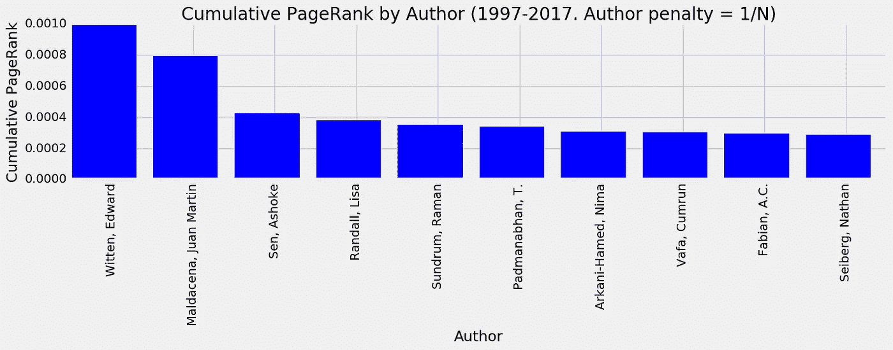

# 用 PageRank 描述科学影响——第二部分

> 原文：<https://towardsdatascience.com/characterizing-scientific-impact-with-pagerank-part-ii-2c1830bba9c3?source=collection_archive---------5----------------------->

**或者说，如何鉴别一个诺贝尔奖获得者**

这是我写的一系列博客中的第二篇，记录了一个描述科学影响的附带项目(你可以在这里找到第一部分)。特别是网络和图，我觉得很有意思。因此，作为一个有趣的练习，我使用 PageRank (PR)，谷歌用于在其搜索引擎中对网站进行排名的算法，来量化论文和个人作者在高能物理(HEP)中的科学影响。在前一篇文章中，我主要关注论文。在这里，我会告诉你更多关于衡量个人作者的重要性，以及公关和更多标准指标之间的关系，如引用总数。

# 评估作者的影响

现在让我们关注作者。我们必须回答的第一个问题是如何将论文的 PR 分配给作者。你可以选择把论文的 PR 奖给每一个作者。虽然我在这里没有选择这种方法，但为了完整起见，我使用这一指标计算了作者的影响，发现 PR 权重最高的作者大多属于大型实验合作项目，如大型强子对撞机、ATLAS 和 CMS 的通用实验。这些合作有数千名物理学家参与，他们发表了许多(非常好的)物理分析，这些分析依次被引用多次。一般来说，*每个合作成员都会在实验发表的每篇论文上写下自己的名字。所以也许这个结果并不太令人惊讶。*

相反，我要做的是把一篇论文的 PR 看作一个奖项，所以它应该在这篇论文的作者之间平均分配。因此，如果一篇论文有 N 个作者，那么每个作者都会从这篇论文中获得 PR/N。因此，对于 HEP 中的每一位作者，我们可以简单地以这种方式将他们的论文总 PR 相加。这些是使用整个 HEP 数据库信息的 PR 最高的物理学家(你可以在本系列的第一篇文章中阅读数据集):

The authors in High Energy Physics (HEP) with the highest PageRank (PR) as awarded by the PR of the papers that they have (co-)authored. If a publication has N authors, its PR is divided equally amongst the scientists. There are 14 authors in the top 30 who have earned a Nobel Prize in Physics.

所以，我们有它。名单是由一些有影响力的人组成的。特别是，前 30 名作者中约有一半是诺贝尔奖获得者。另一半由一些非常有名的人组成(没有指名道姓，许多人认为这个名单中没有诺贝尔奖的少数人应该获得一个)。将此与我们使用引用总数作为衡量标准时的类似分布进行比较:

The authors in High Energy Physics (HEP) with the highest citation count.

上面的大部分作者都属于大型实验合作，如上所述，我在这个名单中没有认出任何诺贝尔奖获得者。我想说的是，公关的确捕捉到了一些不同于总引用的东西。你可能会问这样一种情况，我们不是给一篇论文的每个作者分配引用总数，而是做一些类似于我正在使用的 PR 分配方法的事情，我们根据作者的数量进行处罚。我也尝试了这种方法，发现前 30 名作者中只有大约 20%是诺贝尔奖获得者。

# PageRank 和引文相关性

那么，PR 和引用次数有关联吗？让我们量化一下**作者**的情况。从现在开始，让我们选择一个更窄的日期范围。特别是，让我们关注从 1997 年 1 月 1 日至今发表的论文所构建的网络边缘，我们通过在出版物的作者之间平均分配来奖励 PR。

Scatter plot of the number of citations vs the PR of authors in HEP for papers published from 1997–2017.

显然存在正相关，但正如之前的结果所暗示的那样，似乎存在巨大的差异。为了完整起见，让我们将数据拟合为一条直线，以确定关于 *PR 与引用次数 N 成比例的假设的一些最大异常值是什么:PR(N) = a + bN，*其中 a 和 b 是我们通过线性回归*找到的系数。*

我们发现，线性假设下最大的异常值确实是具有最大 PR 的作者。以下是 10 大异常值(同样针对过去 20 年发表的论文)。

The top 10 authors with the highest PR for papers published in HEP in the last 20 years. They are also the biggest outliers under the hypothesis that PR is proportional to the author’s total number of citations.

总之，我们已经看到，通过使用 PR 来量化论文和作者的影响，我们能够挑选出与依赖总引用量时不同的特征。有趣的是，当我们研究 InspireHEP 上的全部文章时，通过选择 PR 值最高的作者，我们可以很好地识别谁是诺贝尔奖获得者。

暂时就这样了。在不久的将来，我想把重点放在这种评估重要性/影响的方法的潜在应用上:

1.  到目前为止，我们已经对一个跨越几十年时间的数据集进行了非常粗略的描述。现在，如果我们能把这种方法用作推荐系统，那将会很有趣。例如，假设 X 大学正在招聘一名新教师。到目前为止，有机会在这样一个委员会任职的人，除了推荐信之外，倾向于非常依赖引用。因此，作为下一步，让我们看看我们是否可以在这样一个假设的搜索中使用 PR 作为衡量标准，而不是引用来推荐谁是最佳候选人。在下一篇文章中，我将通过一个简单的例子来探讨这个问题。
2.  除了公关和网络之外，我们能在出版物出版时识别出有影响力的出版物吗？也许作为第 0 步，我们可以以类似于构建垃圾邮件过滤器的方式进行，我们可以在由有影响力的论文文本组成的训练样本上构建我们的模型。