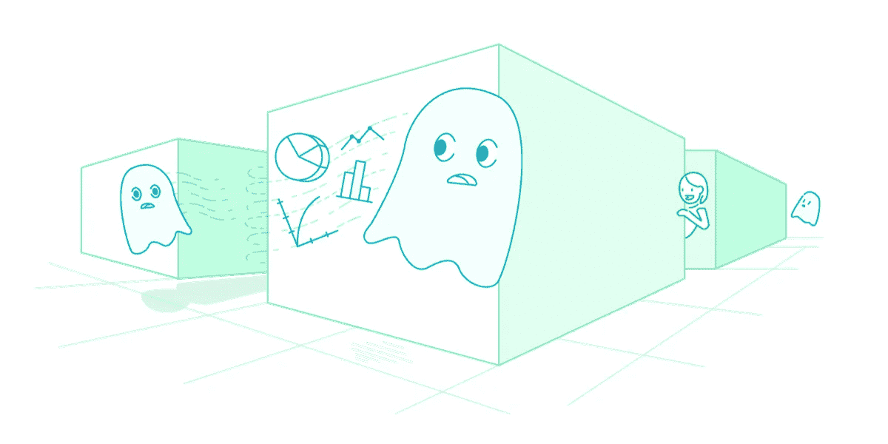

# 在实验中追逐统计幽灵

> 原文：<https://towardsdatascience.com/chasing-statistical-ghosts-in-experimentation-3f393323a1c1?source=collection_archive---------8----------------------->

科林·麦克法兰，汤姆·奥利弗和利兹·埃德里

实验都是关于因果关系的，但是正确的因果关系很容易出错！在这一系列的博客文章中，根据对 Skyscanner 的大规模实验工作的观察，我们将强调一些通过实验得出错误结论的反直觉方法。

让我们从一些定义开始，以确保我们都在同一页上。运行实验或 A/B 测试是我们用来确定我们对产品或服务所做的更改是否会产生我们应该做出反应的信号或我们应该保持不确定的噪音的程序。我们使用一种频率主义方法，特别是零假设显著性检验，来进行这些因果推断。

因果推断本身涉及真实效应(数据中的真实差异来自治疗表现的真实差异)、假阳性(数据中的虚假差异，而不存在真实效应)、假阴性(当真实效应可能存在于具有更高统计功效的样本中时，明显未能检测到数据中的差异)和机会(框架并不完美，因此总会有一个被设置为显著性水平的测量误差分配)。

当实验分析宣称*真效应*或*无效应*而假阳性或假阴性在实验过程中被低估时，我们称之为*统计幽灵*。这些是实验从业者中常见的误解，导致比现实更多的*赢家*和比可能发现的更多的*失手*。

这是一个正在进行的系列的一部分。看看这些:

👻[实验的第一个幽灵:要么有意义，要么有噪音](https://medium.com/@SkyscannerCodevoyagers/ghost-1-its-either-significant-or-noise-b897e3058655)。
👻[实验的第二个幽灵:基于会话的度量标准的谬误](https://medium.com/@SkyscannerEng/the-second-ghost-of-experimentation-the-fallacy-of-session-based-metrics-fb65006d30ff)👻[实验的第三个幽灵:多重比较](/the-third-ghost-of-experimentation-multiple-comparisons-65af360169a1)

*鸣谢 Ronny Kohavi、Ben Dressler、Lukas Vermeer、Aleksander Fabijan、和 Duan。建筑原作出自* [*草席*](https://blog.booking.com/is-your-ab-testing-effort-just-chasing-statistical-ghosts.html) *。*

# 与我们合作

我们在 Skyscanner 以不同的方式做事，我们正在全球办事处寻找更多的工程团队成员。看看我们的 [Skyscanner 工作岗位](https://www.skyscanner.net/jobs/)寻找更多空缺。

Team in action