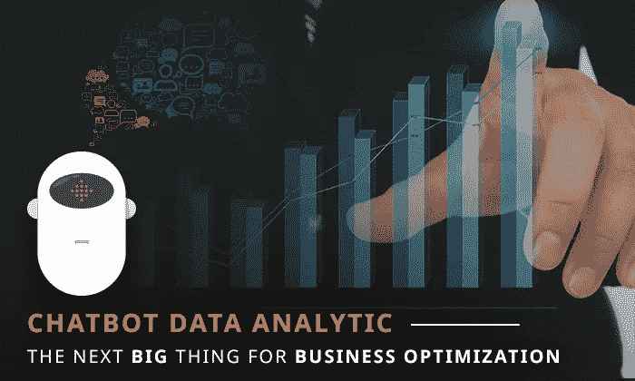
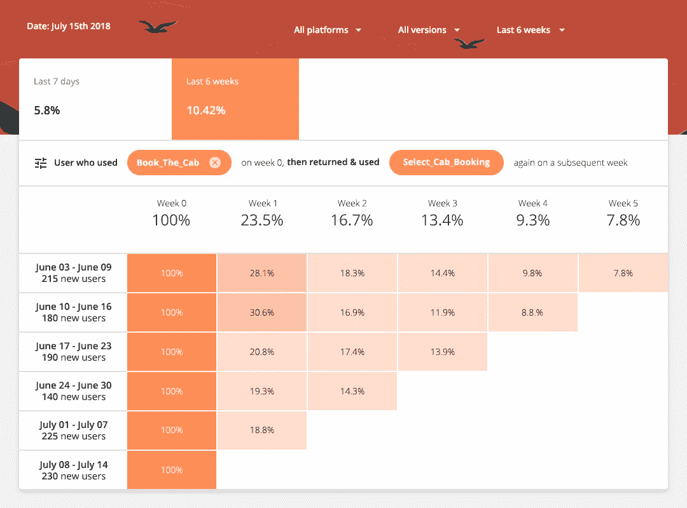
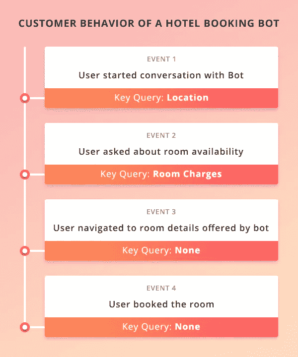

# 聊天机器人数据分析——业务优化的下一件大事

> 原文：<https://towardsdatascience.com/chatbot-data-analytic-the-next-big-thing-for-business-optimization-da43d686e5f3?source=collection_archive---------4----------------------->

从技术上来说，聊天机器人是为了理解人类的行为实践而开发的。作为自学过程的一部分，他们可以系统地记录数据、指标、偏好和趋势，最终帮助他们监控用户交互，相应地调整相关性和响应。幸运的是，这一特性使 Chabot 也能够在数据分析领域发挥重要作用，Chabot 开发公司试图利用最佳策略、工具和技术来实现这一点。

***聊天机器人和当前数据爆发场景***

在这个时代，聊天机器人的活力更加重要，而数据爆发不断走向更高的点。例如，根据 IDC Digital Universe 的一项研究，到 2020 年，每年创建的数字数据量将为 35 吉字节。此外，考虑到人工智能和物联网因素，该数字被提升至 40 ZB，然后又被提升至 44ZB。在另一项研究中，IDC 估计，到 2020 年，通过互联网进行的商业交易(包括 B2B 和 B2C)将达到每天 4500 亿次(它们也将产生大量数据)。

技术和商业世界都在探索分析这些数据的最佳机会，以产生有意义和可操作的见解，从而做出战略性商业决策。作为这些交易或互动的一部分，机器人在分析领域的扩展功能使它们更加引人注目。

***聊天机器人和数据值***

Chabot 在数据和分析方面的第一个业务领域是，用户利用机器人的接口直接与数据本身进行交互。因此，结合了数据分析能力的高效 bot 架构通过提供运营体验、客户体验和分析来提供卓越的商业价值。

第二个领域是自动化数据收集。在对话期间，机器人会询问更多信息，以澄清用户的倾向和偏好。甚至包括银行在内的一些金融机构也使用机器人来实现数据查询的自动化。这个属性也可以扩展到信息收集，用于不同的目的。可以根据需要对收集的数据进行处理和分析。

***聊天机器人——客户体验背景下的成熟阶段***

一些公司使用聊天机器人互动来了解客户的偏好或选择。他们使用算法来问几个问题，并根据答案来感知客户的选择。这样他们就很容易推荐产品了。然而，许多公司使用机器人来增加用户参与度，从而增加客户获取量，并通过自动化流程来实现总体经济高效的货币化。根据行动的目的，聊天机器人在客户体验方面有三个成熟阶段。

1.  **信息交互:**

这些机器人理解自然语言，并回答提出的问题。它们提供较少的交互式客户体验，但适合 FAQ 回复或类似类型的对话。

**2。个性化互动:**

与后端的相关系统或应用程序连接，这些机器人可以生成用户特定的响应。他们也会问一些简单的问题来识别用户的意图。这里的互动听起来更像人类，在这种情况下有可能提供令人惊叹的客户体验。

**3。交易交互:**

这些智能机器人旨在通过一系列指令或交互来帮助用户完成特定的任务、动作或活动。与相关后端系统连接，还可以集成客户数据。点对点的简化说明，让用户快速而有趣，是提供卓越客户体验的关键。

***聊天机器人分析和数据交互***

在这个互联的世界中，B2B 或 B2C 客户互动格局正在发生巨大的变化，而且变化速度非常快。此外，聊天机器人已经成为改造的相当一部分。由于 Bot 执行与最终用户的直接交互，它在培养新的和不断增长的数据集(其中也包括业务关键数据)方面有更大的责任要履行。

随着人工智能和机器学习的不断发展，聊天机器人的范围不再局限于对话代理或虚拟助理。企业已经开始思考 Bot 战略的类型，在这种战略中，他们可以以最佳方式将他们的 Bot 与客户体验和数据技术栈结合起来。下面是一个出租车预订聊天机器人应用程序的示例分析报告，帮助组织了解他们的用户行为。

Consistently decreasing ratio of returning user informs the company about service improvements and requirement of loyalty programs.

***聊天机器人和预测分析***

总的来说，预测分析就是观察和分析正在进行的以及先前的基于数据的事实，并预测未来。即使是对聊天机器人数据的简单观察也可以解决业务查询，例如在客户行为的上下文中发生了什么？此外，分析可以帮助找出为什么会发生，接下来会发生什么？

预测分析依赖于各种统计技术，如数据挖掘、预测建模、模式匹配以及最终的机器学习。对机器人相关技术和算法的有效使用，使得获得不仅可以优化客户体验，而且可以优化业务几乎所有方面的洞察力变得容易。

***高级行为分析***

聊天机器人使企业能够更深入、更广泛地进行数据分析。将先进的行为分析技术集成到聊天机器人中是目前流行的做法。可以作为独立软件或内置功能，甚至机器人流程自动化功能也很好，并为客户体验分析提供量身定制的解决方案。因此，公司可以定义客户体验的新高度，以将其作为竞争优势因素。

下面是一个基本报告，显示了用户旅程的“关键查询”指标，随着时间的推移，这些指标导致了显著的用户偏好洞察。

当然，作为进化过程的一部分，当前的机器人将在不久的将来经历几次强化。例如，提高准确性，机器学习之外的工具和技术，以及在循环中为人类个体提供正确和高产的角色。因此，bot 技术将能够在更有目的的规模上自我定位。

***结论:***

机器人分析使我们能够了解客户行为，是什么驱使他们做出相关决策，是什么让他们失望，是什么让他们更容易留住他们等等。因此，毫不夸张地说，在未来，机器人和聊天机器人开发战略都将在增强甚至重构业务流程方面发挥作用。