# 聊天机器人很酷！使用 Python 的框架

> 原文：<https://towardsdatascience.com/chatbots-are-cool-a-framework-using-python-part-1-overview-7c69af7a7439?source=collection_archive---------3----------------------->

Kelly — Movie Bot

你喜欢你在凯利电影机器人视频上看到的吗？如果答案是“是”，并且你想实现一个聊天机器人，你可以开始阅读这篇文章。这篇文章很详细。我把整篇文章分成几部分。所以，坐好，放松！我们将详细介绍每一部分，最后在文章的结尾，您应该已经在 Slack 中部署了一个聊天机器人。

1.  [第 1 部分:概述](#6f04)
2.  [第二部分:数据](#4c84)
3.  [第三部:松弛](#0a5d)
4.  第 4 部分:使用 IBM Watson 的 NLP
5.  [第 5 部分:定制 NLP 解决方案](#6e78)
6.  [第 6 部分:日志](#d7f3)
7.  [第 7 部分:最终注释](#77b8)

**本文的受众:**我设计了一个通用的聊天机器人框架，并在本文中讨论了如何覆盖广泛的受众。任何对 Python、Jupyter 笔记本有基本了解并且能够执行 pip 安装的人都应该能够完成这个系列并看到结果。

## 你对这个系列有什么期待？

bot 框架是模块化的，这为读者设计和实现他们自己的功能提供了一系列机会。集成可以在框架中轻松完成。此外，因为它被设计为即插即用，所以失败的可能性是最小的。

*初学者:*对如何为这个特定项目开发和使用框架的总体想法。您应该能够从 Github 下载代码并成功完成安装。这包括软件包安装、slack 和 IBM Watson 帐户创建和设置、运行一次性文件以生成链接和电影推荐。您可以在 IBM Watson 中添加额外的技能(比如生成静态响应的闲聊),并在 slack 环境中查看结果。

中级:你应该能够使用这个框架作为模板来设计你自己的聊天机器人，它可以部署在不同的领域。此外，您可以通过添加新的数据源来扩展聊天机器人的知识库，包括编写代码来连接不同的数据库(弹性搜索、SQL 数据库、Excel 等)..).此外，您可以向 bot 添加额外的 NLP 特性，并在 slack 环境中查看结果。

*专家:*你应该能够通过集成 Slack/NLP 的 API 连接来添加/扩展 bot 特性。我使用 IBM Watson 来识别问题类别并生成静态响应。您可以通过设计自己的 NLP 功能来取代框架中的 IBM Watson。此外，您可以为不同的平台(Web、Skype 等)扩展 bot 集成..)

# 第 1 部分:概述


Credit: [Pixabay](https://pixabay.com/en/waterfall-rainbow-spray-water-flow-828948/)

## 什么是聊天机器人？

聊天机器人是一个检索信息和产生类似人类对话的工具。它主要是一个旨在解决/服务于特定目的的对话系统。根据设计的不同，聊天机器人通常分为 4 类。

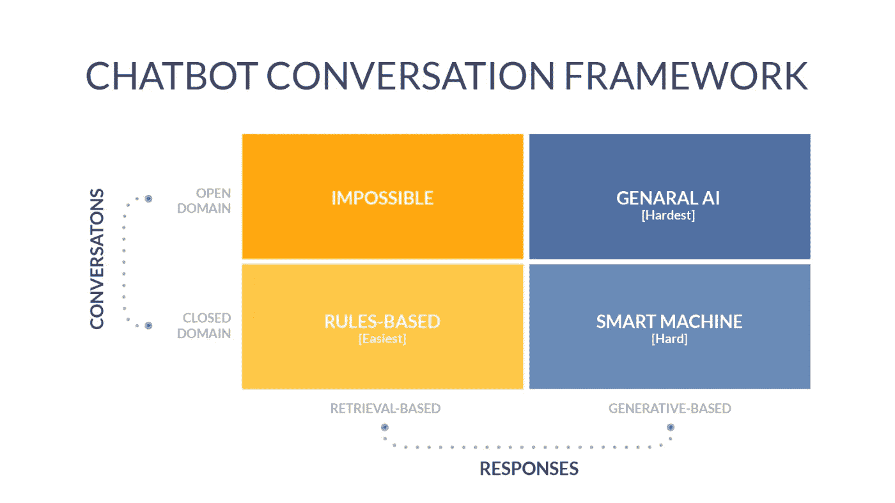

[Credit — Types of Chatbot.](https://www.datasciencecentral.com/profiles/blogs/a-comparative-analysis-of-chatbots-apis)

> 开放域

开放域机器人也称为通才机器人。今天我们使用的 Alexa、Google Home、Siri、Cortana 都属于这一类(开放领域/基于生成的)。这些机器人试图模仿类似人类的对话。同样，它回答了大多数人提出的问题(比如 FAQ)。然而，他们不能回答基于特定领域的问题。比如:我公司销售部门上个季度表现如何？这就是基于开放域/检索的机器人无法构建的原因之一。

> 闭域

封闭域机器人也称为专业机器人。根据类型的不同，它可以很容易(基于检索)或很难(基于生成)开发。本文中讨论的 bot 是一个专家 bot，它属于封闭域/基于检索的类别。这一类别中的其他机器人包括——订购披萨、预订航班/餐厅/酒店/约会。另一方面，生成型机器人包括客户服务聊天机器人，它们在回答客户问题时试图像代理一样模仿。这些机器人很难构建，因为它们试图让客户相信它们正在与一个真实的人交谈。

## 聊天机器人是如何工作的？

聊天机器人需要理解以下内容来回答用户的问题。

1.  用户在说什么？(意图)
2.  用户提到什么具体的东西了吗？(实体)
3.  为了从用户那里获得更多的细节，机器人应该问什么？(对话/维护上下文)
4.  如何满足用户的要求？(回应/履行)

让我们用一个下面显示的飞行机器人例子来详细理解每一个部分。用户说“我想为两个人预订一张从纽约到西雅图的机票，9 月 15 日出发，9 月 19 日返回”。


Credit: [Flight Bot](https://blog.markgrowth.com/how-chat-bots-can-help-you-increase-conversion-6561ba0b8ab0)

> 目的

用户的意图是预订航班。

> 实体

实体也称为关键字或槽。这里有多个实体。

出发地-纽约

去西雅图

出发日期-9 月 15 日

返回日期-9 月 19 日

#人- 2

> 对话/维护上下文

对话是机器人和用户之间的来回交流。上下文让机器人知道机器人当前处于什么状态。有三种状态——以前、现在和将来。当用户启动对话时，机器人重复用户的旅程，然后与用户核对“这个信息是正确的吗？”。这里，先前状态为空白，当前状态为“用户验证”，未来状态为“基于用户验证提供响应”。当用户回答“是”时，则机器人状态分别变为“用户验证”、“基于用户验证提供响应”和“预订航班”的先前、现在和未来状态。如果不维护上下文，机器人就无法建立来回通信。在飞行机器人的例子中，如果没有维护上下文，机器人会问“这个信息是正确的吗？”每次直到用户放弃。

> 回应/履行

满足用户请求是机器人对话的最后一步。在这里，机器人以链接“查看所有结果”的形式提供结果。因此，当用户点击链接时，他们将能够看到航班并进行预订。

基于生成的机器人使用人工智能和机器学习来生成用户响应。所以他们不需要理解意图和实体来响应用户。

我找到了这篇文章，它涵盖了我们到目前为止讨论过的许多主题，以及可以用来构建聊天机器人的机器人框架。这是一本好书。

[](https://www.datasciencecentral.com/profiles/blogs/a-comparative-analysis-of-chatbots-apis) [## 聊天机器人 API 的比较分析

### 人工智能正在崛起！不是作为遥远未来对人类创造者的机器反抗，而是作为…

www.datasciencecentral.com](https://www.datasciencecentral.com/profiles/blogs/a-comparative-analysis-of-chatbots-apis) 

## 让我们开始工作吧

好了，现在是时候部署凯利电影机器人了。它是一个简单的机器人，可以回答关于电影的问题。用户可以询问评级、电影投票人数、流派、电影概述、类似电影、 [imdb](https://www.imdb.com/) 和 [tmdb](https://www.themoviedb.org/?language=en-US) 链接、预算、收入和成人内容。本练习的数据集取自 [Kaggle — movies_metadata](https://www.kaggle.com/rounakbanik/movie-recommender-systems/data) 。这个项目的完整代码可以在 Github 中找到。

[](https://github.com/Sundar0989/Movie_Bot) [## sundar 0989/电影 _ 机器人

### https://youtu.be/7hQhPMPNY6A.在 GitHub 上创建一个帐户，为 Sundar0989/Movie_Bot 开发做贡献。

github.com](https://github.com/Sundar0989/Movie_Bot) 

## 凯利设计

这种设计需要注意的一点是，数据和处理都在本地系统中处理。尽管我们使用 IBM，但它被用作 API 服务，没有任何内部数据被发送到 IBM。这样，整个设计可以在您的工作场所实现，而不必担心数据传输。

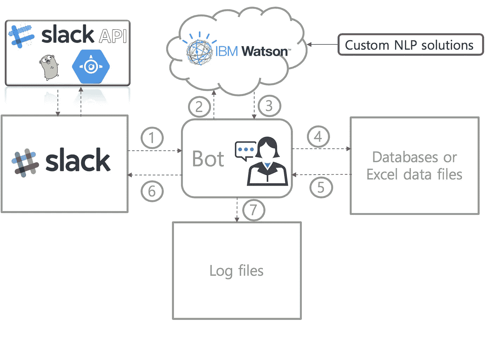

Kelly Design

> 步骤 1(用户提问):

用户可以通过 Slack 与 Kelly 互动。一旦用户发布了一个问题，它将被传递到后端系统进行分析。

> 步骤 2 和 3 (NLP 处理并返回 NLP 结果):

所有的自然语言处理都发生在第二步。这包括 IBM Watson 处理、相似性搜索、基于协同过滤的推荐。NLP 处理完成后，我们有三个输出

1.  意图——用户想问或询问什么？
2.  实体—他们正在寻找的确切字段或列是什么？
3.  对话/交互—为用户问题提供适当的请求/响应。

> 步骤 4 和 5(查询数据):

目前，数据保存在 excel 文件中。但是，如果需要，您可以添加多个数据库/excel 文件来访问不同的源。基于步骤 3 的结果，查询适当的数据库/excel 文件并返回结果。

> 第 6 步(向用户发布结果):

从后端获得的结果通过 Slack 发布给用户

> 第 7 步(日志维护):

用户之间的交互被记录并存储在文本文件中。此外，如果机器人无法识别用户的问题，它会将这些问题添加到后续文件中。

## Main.py

> 包装进口

像往常一样，我们通过导入包来定义程序。请注意，这里写着“slack.slack_commands”和“nlp.nlp_commands”。这将分别从 slack 和 nlp 文件夹导入 python 程序 slack_commands 和 nlp_commands。此外，还导入了配置文件中的几个函数。

> 变量初始化

用户上下文在“上下文”变量中维护。一旦聊天开始，IBM Watson 生成的上下文变量如下所示，

```
{'conversation_id': '76e59c57-8257-4390-ae15-ba75e7576476',
 'system': {'_node_output_map': {'node_2_1541443578896': [0]},
  'branch_exited': True,
  'branch_exited_reason': 'completed',
  'dialog_request_counter': 1,
  'dialog_stack': [{'dialog_node': 'root'}],
  'dialog_turn_counter': 1,
  'initialized': True}}
```

它有一个“conversation_id ”,用于跟踪会话流的状态(以前/现在和将来的状态)。在对话开始时，它被赋予一个空的字典值。

除了保持对话，我们还应该让机器人知道何时停止对话。这是通过“current_action”变量实现的。结束对话的示例如下所示。

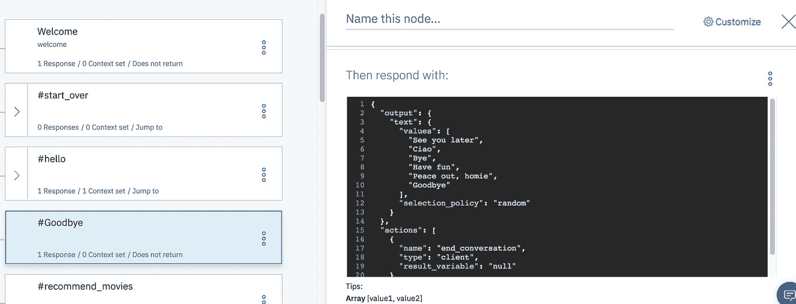

每当用户调用“再见”意图时，机器人将“end_conversation”分配给“current_action”变量。稍后在 main.py 程序中，将对该变量进行评估，以重新分配上下文、current_action 和 session_df 变量，如下所示。

另一个关键变量是“会话 _df”数据帧。当用户开始与机器人对话时，会创建一个会话。这确保了用户和机器人之间的上下文是基于每个用户来处理的。当同一用户在多个通道中与机器人对话时，它们被作为不同的会话来处理。因此，机器人和用户之间的对话没有重叠。

当用户提出机器人无法处理的随机问题时，它会触发“follow_ind”将问题写入后续文本文件。在对话开始时，它被分配给 0。最后两个变量“bot_id”和“RTM_READ_DELAY”对应于 slack。当 bot 被调用时，会分配 bot_id。RTM 代表实时信息。该变量将等待一秒钟，然后从用户那里读取下一条输入消息。

> 调用代码

最后，程序的其余部分确保机器人持续运行并寻找来自用户的输入消息。下面提到的一些函数——parse _ bot _ commands、handle_command 和 output_command 将在后面的部分详细讨论。

就是这样。我们启动了凯利机器人。我们的下一步是理解用于本练习的数据。

# 第二部分:数据


Credit: [Pixabay](https://pixabay.com/en/binary-code-privacy-policy-woman-1327493/)

这个练习的数据来自下面的 Kaggle 链接。数据集的名称为“movies_metadata.csv”。

 [## 电影推荐系统| Kaggle

### 编辑描述

www.kaggle.com](https://www.kaggle.com/rounakbanik/movie-recommender-systems/data) 

数据集包含大量与电影相关的信息，用户只需较少的预处理。我们使用 Pandas 导入数据集，然后准备我们的数据。

```
<class 'pandas.core.frame.DataFrame'>
RangeIndex: 45466 entries, 0 to 45465
Data columns (total 24 columns):
adult                    45466 non-null object
belongs_to_collection    4494 non-null object
budget                   45466 non-null object
genres                   45466 non-null object
homepage                 7782 non-null object
id                       45466 non-null object
imdb_id                  45449 non-null object
original_language        45455 non-null object
original_title           45466 non-null object
overview                 44512 non-null object
popularity               45461 non-null object
poster_path              45080 non-null object
production_companies     45463 non-null object
production_countries     45463 non-null object
release_date             45379 non-null object
revenue                  45460 non-null float64
runtime                  45203 non-null float64
spoken_languages         45460 non-null object
status                   45379 non-null object
tagline                  20412 non-null object
title                    45460 non-null object
video                    45460 non-null object
vote_average             45460 non-null float64
vote_count               45460 non-null float64
dtypes: float64(4), object(20)
memory usage: 8.3+ MB
```

```
adult                        0
belongs_to_collection    40972
budget                       0
genres                       0
homepage                 37684
id                           0
imdb_id                     17
original_language           11
original_title               0
overview                   954
popularity                   5
poster_path                386
production_companies         3
production_countries         3
release_date                87
revenue                      6
runtime                    263
spoken_languages             6
status                      87
tagline                  25054
title                        6
video                        6
vote_average                 6
vote_count                   6
dtype: int64
```

结果发现数据中有很多缺失值。所以我们去掉了丢失值百分比高的变量。此外，我删除了一些其他变量，以保持数据简单。下面的代码用于从数据集中移除变量。

“imdb_id”和“poster_path”变量中缺少值。我必须使用下面的代码删除这些变量中缺少值的观察值。

现在，让我们看看数据集中的流派变量。

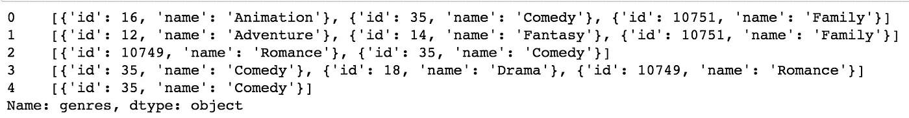

流派名称以词典列表格式存储。为了使它成为一个干净的格式，我们需要在下面应用一个准备代码。

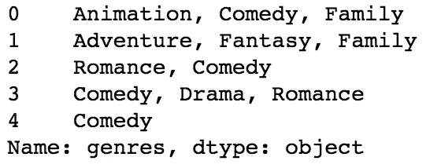

格式很好，对吧。现在让我们移动到我们的最后一步，创建 IMDB，TMDB 和图像 url 链接。

瞧。我们完成了数据准备，最后使用下面的代码导出准备好的数据集。

```
metadata.to_csv('metadata_prep.csv')
```

下面的笔记本中提供了完整的数据准备代码。

[](https://github.com/Sundar0989/Movie_Bot/blob/master/data/Data_Preparation.ipynb) [## sundar 0989/电影 _ 机器人

### https://youtu.be/7hQhPMPNY6A.在 GitHub 上创建一个帐户，为 Sundar0989/Movie_Bot 开发做贡献。

github.com](https://github.com/Sundar0989/Movie_Bot/blob/master/data/Data_Preparation.ipynb) 

就是这样。数据准备过程到此结束。我们的下一步是理解松弛过程。

# 第三部分:松弛

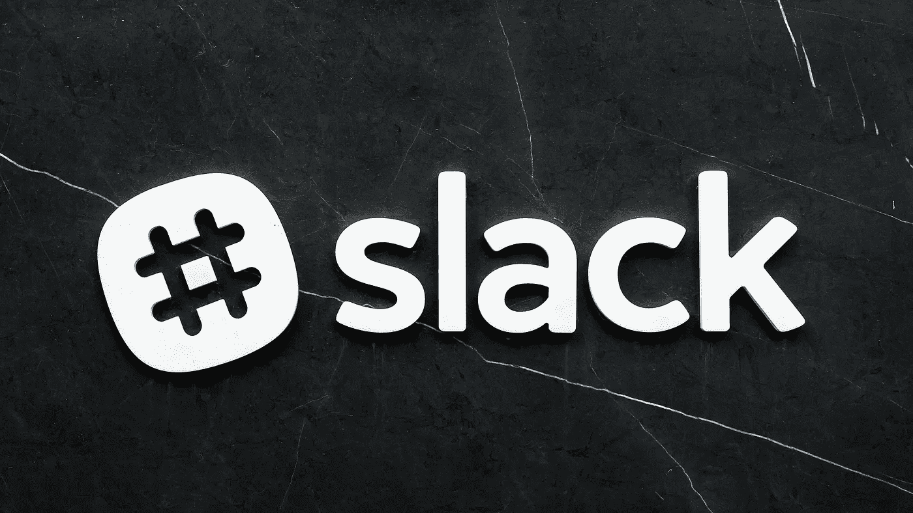

Credit: [Pixabay](https://pixabay.com/en/logo-sign-symbol-slack-2563719/)

好了，现在是时候理解松弛过程以及它在框架中是如何处理的了。第一步是创建一个 slack bot 并将其安装在工作区中。下面的链接将指导您创建 slack 应用程序。在配置文件中，您需要编辑 Slack Bot 令牌和 Slack 验证令牌。这就是 slack 所需的全部设置。

[](https://github.com/Sundar0989/Movie_Bot/blob/master/slack/Create_slack_app.ipynb) [## sundar 0989/电影 _ 机器人

### https://youtu.be/7hQhPMPNY6A.在 GitHub 上创建一个帐户，为 Sundar0989/Movie_Bot 开发做贡献。

github.com](https://github.com/Sundar0989/Movie_Bot/blob/master/slack/Create_slack_app.ipynb) 

有 6 个为 Kelly bot 编写的 slack 函数。

1.  解析机器人命令
2.  解析 _ 直接 _ 提及
3.  输出命令
4.  文件 _ 上传
5.  松弛 _ 平铺
6.  消息 _ 按钮

让我们详细研究一下每个功能。

> 解析机器人命令

当用户在 slack 中键入消息时，parse_bot_commands 函数被调用。在 slack 中，实时消息(RTM)事件(slack_events)存储关于特定用户对话的所有信息。这包括谁在问这个问题(message_user)，他们使用哪个团队和渠道(team，channel)，来自用户的消息或问题是什么(message)以及他们是在和其他人还是机器人说话(user_id)。因为，在 slack 中，用户可以通过调用用户名前面的@符号与不同的用户对话。例如—“@ person 1 给我看电影《玩具总动员》”和“@Kelly 给我看电影《玩具总动员》”是不同的。第一个指向人员 1，第二个指向 Kelly bot。这里，只有当“user_id”与“bot_id”匹配时，机器人才会处理用户消息或问题。

> 解析 _ 直接 _ 提及

这是 parse_bot_commands 的一个子功能。来自用户“@Kelly 给我看看电影《玩具总动员》”的问题有两部分。第一部分是 bot 用户名“@Kelly”，第二部分是来自用户“给我看看电影《玩具总动员》”的问题。该函数从 slack 事件(message_text)中提取文本，并将用户问题与 bot 用户名分开。

> 输出命令

output 命令用于将响应发送回 slack。这个函数只支持文本输出(slack_output)。“渠道”变量用于标识用户发布问题的松散渠道，并使用相同的渠道来引导响应。

在 Kelly bot 中，output 命令函数产生的 slack 输出如下所示。

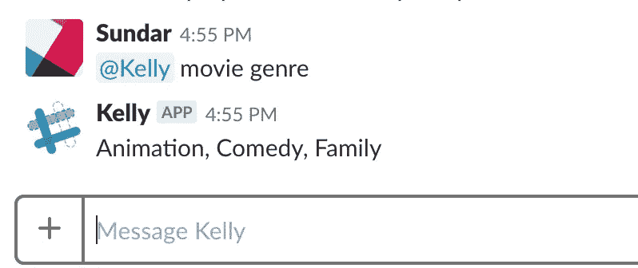

> 文件 _ 上传

文件上传可以用来上传文件到 slack。文件上传功能支持多种文档类型。其中包括 PDF、Word、Excel、gif、png 等。支持的文件类型的完整列表可以在下面的链接中看到。

 [## 文件类型|时差

### editable 属性指示文件以可编辑模式存储。is_external 属性指示…

api.slack.com](https://api.slack.com/types/file#file_types) 

凯利机器人不使用该功能。但是，它在这里是作为附加功能提供的。

> 松弛 _ 平铺

松弛平铺是在松弛状态下向用户显示输出的另一种方式。我用这个函数来显示电影推荐。该函数的输出如下所示。

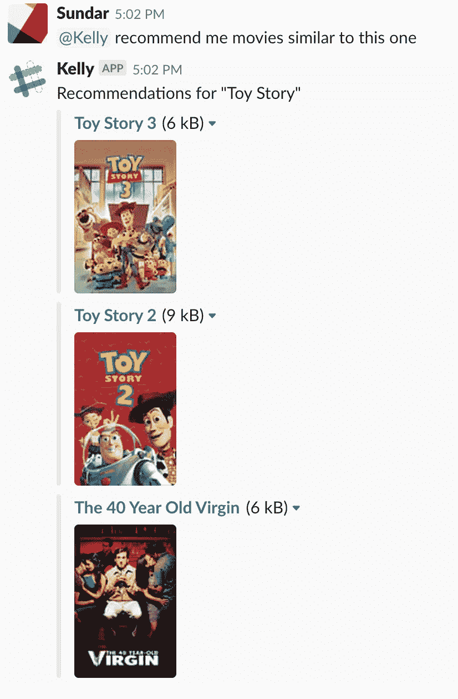

很酷吧。图像使用平铺显示，这样可以立即吸引用户的注意力。当你仔细看时，电影的名字有超链接。因此，当你点击电影名称时，它会将你重定向到 IMDB 电影页面。同样，这是在 slack 中显示输出的一种简单而优雅的方式。

该函数有 5 个输入。

1.  前面讨论的“channel”变量用于发布到用户提问的相应频道。
2.  “search_term”变量的值为“玩具总动员”。因为我用问题“给我看电影《玩具总动员》”开始了我的机器人对话，所以电影名称被自动存储在 search_term 中，并且每次用户提问时上下文被维护，直到用户重新开始。由于保留了上下文，当我问问题“给我推荐类似这部的电影”时，它在第一行回答说“推荐玩具总动员”。
3.  “title”变量具有电影标题推荐。基于在协作过滤方法中获得的最高分数(这将在后面的[第五部分:定制 NLP 解决方案](#29c1)中讨论)，它选择标题并将它们存储在 python 列表中。然后在函数中处理这个列表，同时显示输出。
4.  “标题 url”具有对应于电影推荐的 IMDB 链接
5.  “image_url”具有用于电影推荐的相应的 TMDB 图像链接。

> 消息 _ 按钮

消息按钮也是 Slack 中显示输出的一种不同风格。这类似于松弛平铺，除了它没有图像显示。相反，输出包含与 IMDB 链接相关的按钮。当用户试图搜索一部电影时，此功能在开始时使用。我不记得我头顶上看过的所有电影名字。所以，我使用基于关键字的电影搜索，这个功能也是以同样的方式实现的。处理基于关键字的搜索(相似性搜索)的 NLP 程序将在[第五部分:定制 NLP 解决方案](#3887)中讨论。然而，我想展示这是如何与消息按钮一起工作的。

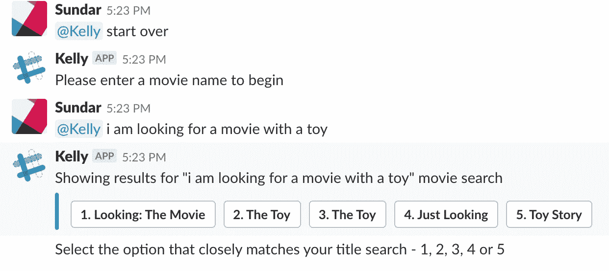

在这里，当我开始搜索电影时，我没有提到“玩具总动员”，而是以“我正在寻找一部带玩具的电影”开始对话，它给了我“玩具总动员”作为我的第五个选项。这种类型的搜索称为相似性搜索。现在，用户可以点击按钮，以确保他们正在寻找的电影是相同的，然后继续下一步。按钮名称存储在“button”变量中，相应的 IMDB 链接存储在“url”变量中。

就是这样。松弛过程到此结束。我们的下一步是使用 IBM Watson 理解自然语言处理。

# 第四部分:IBM 沃森

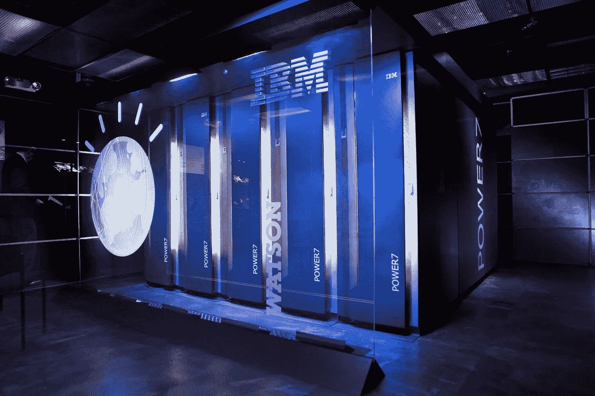

Credit: [Time](http://time.com/4281476/ibm-artificial-intelligence-watson-2016/)

## 聊天机器人框架

开发聊天机器人的一个快速简单的方法是使用框架。市场上有很多框架，可以帮助我们构建机器人。其中有几个包括— [IBM Watson](https://www.ibm.com/watson/) 、 [Luis](https://www.luis.ai/home) 、 [Wit](https://wit.ai/) 、 [Dialogflow](https://dialogflow.com/) 、[拉莎·NLU](https://rasa.com/docs/nlu/)、 [Botkit](https://botkit.ai/) 、[微软 Bot 框架](https://dev.botframework.com/)等等。你可以选择任何一个框架来构建你的机器人。同样，编码的复杂性可能会因您选择的框架而异。对于这个练习，我使用了 IBM Watson 框架。下面的链接将帮助您创建一个 Watson 用户帐户，并开始 IBM Watson 对话。

[](https://github.com/Sundar0989/Movie_Bot/blob/master/nlp/IBM_Watson_Conversation_setup.ipynb) [## sundar 0989/电影 _ 机器人

### https://youtu.be/7hQhPMPNY6A.在 GitHub 上创建一个帐户，为 Sundar0989/Movie_Bot 开发做贡献。

github.com](https://github.com/Sundar0989/Movie_Bot/blob/master/nlp/IBM_Watson_Conversation_setup.ipynb) 

IBM Watson framework 被用作 API 服务来执行自然语言处理。Kelly bot 的构建方式是没有任何信息存储在 IBM Watson 中。所有的信息处理都发生在你的本地系统中。IBM Watson 服务只处理来自用户的问题，以提供意图、实体、对话和响应。除此之外，没有任何信息存储在 IBM Watson 中。

这些快速课程可以让你开始构建意图、实体和对话。

[](https://www.coursera.org/lecture/how-to-build-your-own-chatbot-without-coding/dialog-Cupqp) [## 对话—沃森助手介绍| Coursera

### IBM 为课程“如何不用编码构建聊天机器人”制作的视频。在线学习并获得有价值的证书…

www.coursera.org](https://www.coursera.org/lecture/how-to-build-your-own-chatbot-without-coding/dialog-Cupqp) [](https://developer.ibm.com/courses/change-intents-entities-dialog/) [## 改变意图、实体和对话——IBM 开发人员课程

### 步骤 3:创建意图意图代表用户输入的目的。你可以把意图想象成你…

developer.ibm.com](https://developer.ibm.com/courses/change-intents-entities-dialog/) 

## 凯利-电影机器人沃森对话

对于本练习，您可以上传 Github 中的代码附带的“bot.json”文件，并将其导入到您的 IBM Watson 对话帐户中，以便开始使用。导入 json 文件后，页面应该如下所示。

> 意图

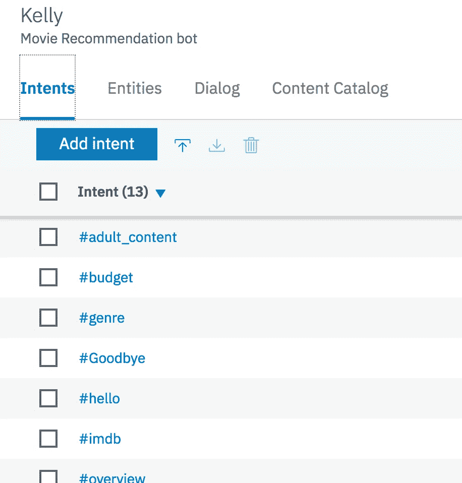

> 实体

我想谈一些关于如何在 Watson、Slack 和你的 python 代码之间建立联系的事情。所以，让我们先看看实体。

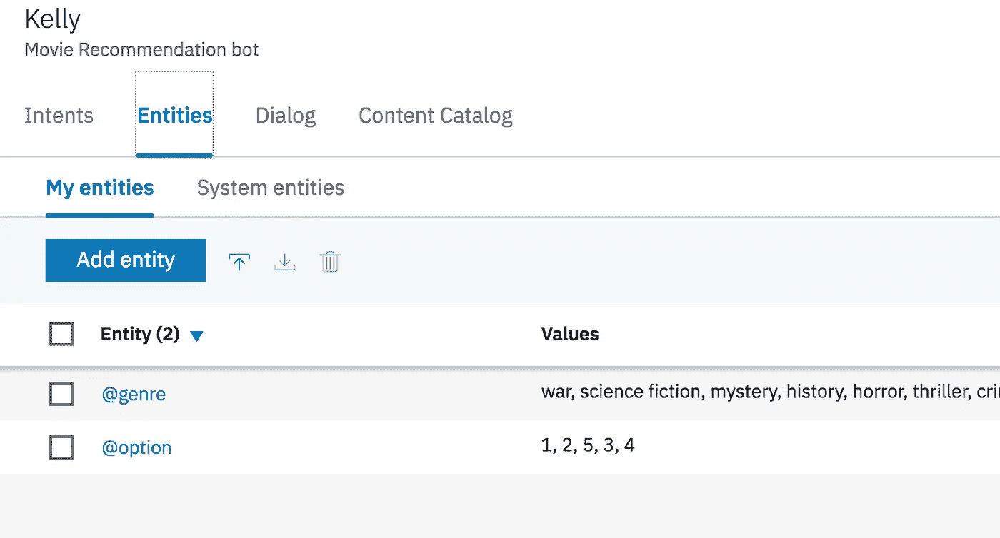

这里，看期权实体。它只能取 5 个可能的值。如果您还记得在 slack 流程中，我们使用消息按钮从用户那里获得电影名称选项。


> 对话

比方说，如果用户选择 6 而不是 5。机器人会回应说“请提供一个有效的选项——1、2、3、4 或 5”。这是使用 IBM Watson 中的对话框特性建立的。那么让我们来看看这个特性。对话框页面应该如下所示。

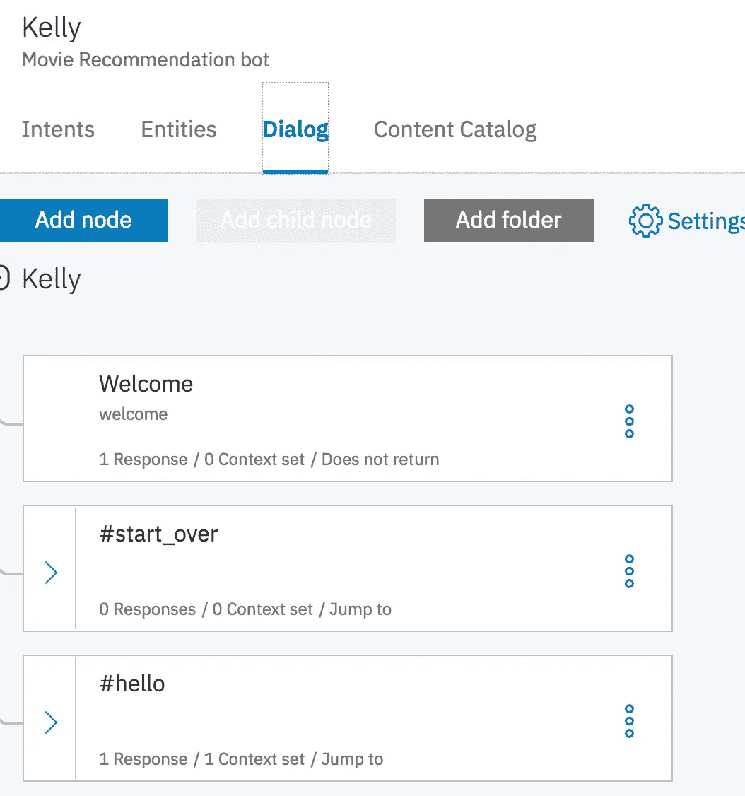

我们以说“你好”开始谈话。Watson 会将其识别为“hello”意图，将值“hello”赋给上下文变量“currentIntent”。此外，它将响应发送回 python 代码“请输入电影名称以开始”，然后跳转到评估电影名称条件。

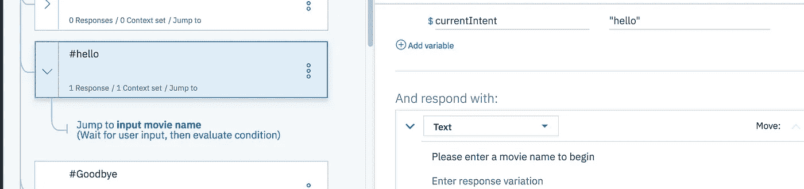

在电影名称条件评估中，我有两个子节点，如下所示。

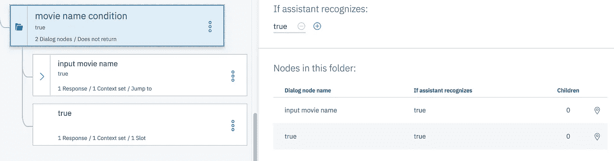

第一个子节点评估用户是否提供了响应。在 IBM Watson 中，这是使用“”选项捕获的。然后机器人响应用户选择电影选项，如下所示。

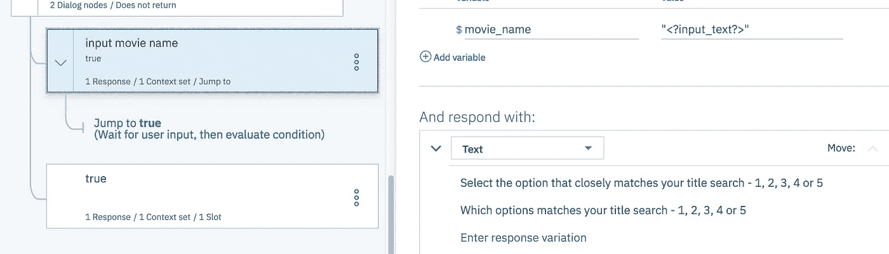

最后，根据用户选项，它评估该选项是否有效。如果没有，它会要求用户提供一个有效的选项。

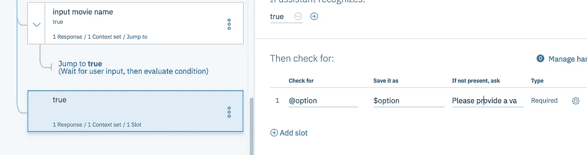

这个 Watson 对话设置对应的 slack 接口交互如下所示。

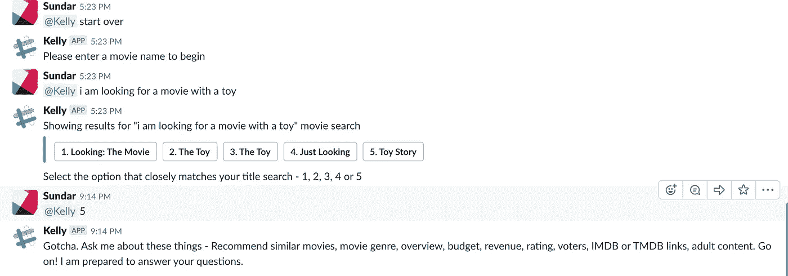

> Python 后端

在 python 端，这是通过如下所示的 handle_command 函数建立的。

当使用 IBM Watson API 服务时，它返回一个在“response”变量中捕获的响应。注意，我们每次都将上下文变量传递给 Watson 服务。这用于维护机器人响应的上下文。此外，使用响应变量，我们提取上下文、实体和机器人响应，并将它们分别分配给“上下文”、“搜索关键字”和“松弛输出”。“search_term”变量包含对应于用户选择的电影名称。现在，我希望这能给出 IBM Watson 前端和后端 python 代码之间的交互情况。

就是这样。这部分到此结束——使用 IBM Watson 的 NLP。我们的下一步是理解为 Kelly bot 编写的自定义 NLP 解决方案。

# 第 5 部分:自定义 NLP 解决方案


Credit: [Pixabay](https://pixabay.com/en/artificial-intelligence-robot-ai-ki-2167835/)

很多时候，我们需要添加额外的 NLP 功能来增强机器人的技能。好吧，现在是你变得更有创造力并开始添加定制解决方案的时候了。我为 Kelly Bot 添加了两个自定义解决方案。(位于 nlp/nlp_solutions 文件夹中)。

1.  基于元数据的协同过滤电影推荐
2.  用于识别电影标题的余弦相似搜索

这两个函数的代码驻留在“nlplearn.py”和“onetime _ run _ file.py”中。所以让我们开始吧。

> 一次性运行文件

这个函数有一些代码，我们需要在启动 Kelly bot 之前运行一次。这种一次性设置在数据不断变化并且机器人需要快速适应这些数据变化的情况下更加容易。我们需要做的就是在需要的时候运行这个文件，而不需要改变机器人的任何内部功能。很酷吧。当文件运行完成时，它会生成一个“one time . txt”pickle 文件，该文件将在 bot 启动时使用。

现在，我们来讨论一下“nlplearn.py”中可用的函数。它有 5 个功能，

1.  文本 _ 准备
2.  tfidf_fit(余弦相似性搜索)
3.  相似性搜索(余弦相似性搜索)
4.  元数据过滤(基于元数据的协同过滤)
5.  获取推荐(基于元数据的协同过滤)

> 文本 _ 准备

这个函数接受一个单独的文档(“演示？电影标题“类似于玩具总动员#####”)并通过移除空格和不良字符来准备文本。此外，它还从文本中删除停用词。处理后的文本看起来有点像这个“显示电影标题类似玩具总动员”。

> tfidf_fit

该函数获取步骤 1 中准备好的文本，并创建一个 tfidf 拟合。“tf”表示术语频率，“Idf”表示反向文档频率。你可以在[这里](http://www.tfidf.com/)的链接中阅读关于 tdidf 的内容。拟合完成后，拟合和矩阵存储在 pickle 文件中，以供将来处理。这是通过“一次性运行文件. py”中的代码完成的。

> 相似性 _ 搜索

该函数计算用户查询和存储在由 tfidf_fit 函数创建的 tfidf_matrix 中的电影标题之间的余弦相似性。首先，它对用户查询执行 tfidf_fit，然后计算 fit 和 tfidf_matrix 中的元素之间的余弦距离。具有最高余弦相似性分数的前 5 个元素被选择并发送回 slack 接口。这用于我们之前讨论过的 Slack 中的消息按钮。

> 元数据 _ 过滤

该功能执行用于电影推荐的基于元数据的协同过滤。你可以在[这里](https://www.datacamp.com/community/tutorials/recommender-systems-python)的链接中读到这个功能。最终的“余弦 _sim”函数存储在 pickle 文件中，以供将来处理。同样，这也是通过“onetime _ run _ file.py”中的代码完成的。

> 获取 _ 推荐

该功能用于根据用户搜索获得电影推荐。它返回 3 部相似的电影并发送回 slack 接口。这个结果用于我们之前讨论过的松弛瓦片。

现在，让我们看看这些定制的 NLP 解决方案在 Slack 中是什么样子的。

## 基于元数据的协同过滤

参考:[https://www . data camp . com/community/tutorials/recommender-systems-python](https://www.datacamp.com/community/tutorials/recommender-systems-python)

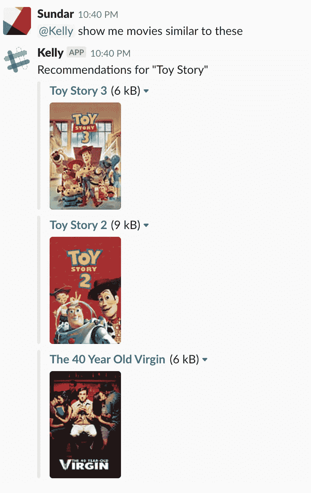

## 余弦相似性搜索

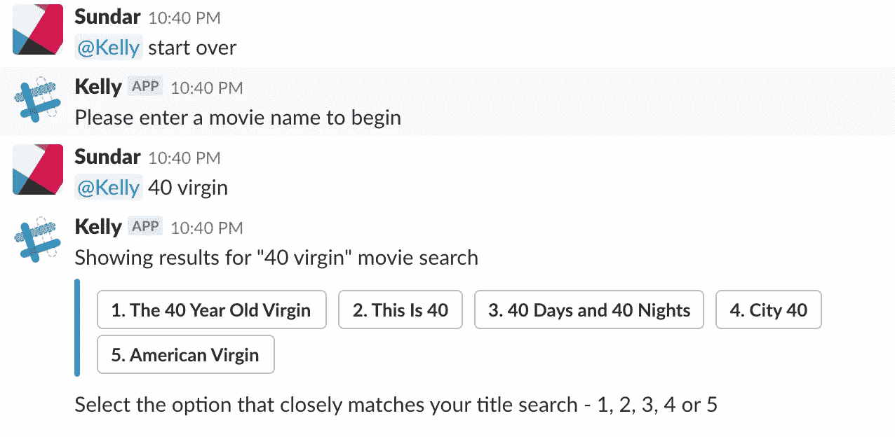

就是这样。定制 NLP 解决方案部分到此结束。我们的下一步是理解日志处理。

# 第六部分:日志


Credit: [Pixabay](https://pixabay.com/en/analytics-information-innovation-3088958/)

到目前为止，我们已经实现了运行 bot 所需的所有特性。那么我们为什么需要讨论日志呢？日志文件给 bot 框架带来了什么重要性？

## 背景

让我们看一个例子来说明它的重要性。假设我们有一个“反馈”意图，并且意图中的示例用户查询包括“我对你的服务满意”、“我不喜欢你的服务”、“你很棒”、“你是一场灾难”等等。当我们发展这种意图时，我们只提供几个例子。将来，假设一个用户说“嘘”。我们知道这应该被归类为“反馈”意图。然而，我们的机器人没有受过这方面的训练。因此，它会显示为导致糟糕用户体验的其他意图。此外，这些类型的用户响应是随机出现的，我们需要一种方法来识别和捕捉它们。

收集用户查询最简单的方法是通过日志。因此，在未来，如果用户提出一个与我们定义意图的方式不同的问题，我们可以捕捉这些响应，并将它们包含在意图模型训练中。通过这种方式，我们改善了整体客户体验。

在这个 bot 框架中，我们有两种类型的日志处理

1.  日志文件
2.  跟进文件

> 日志文件

输出日志文件如下所示。

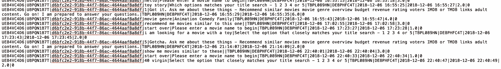

正如我们在这里看到的，所有信息都被捕获，这使得将来的用户查询处理更容易。此外，它还包括日志文件中的处理时间(倒数第二列)。使用这些输入，我们可以优化需要更多时间处理的查询，从而提高机器人的效率。

> 跟进文件

后续文件也作为日志文件处理的一部分生成。如果机器人不能向用户查询分配任何意图(“任何其他”意图)，则调用“follow_ind”。这将把用户查询写入一个名为“followup_file”的新文件中。' TXT '如下图所示。


这个文件稍后可以使用下面的代码通过电子邮件发送给 bot 开发人员。

就是这样。这就结束了这一部分—日志处理。

# 第七部分:期末笔记

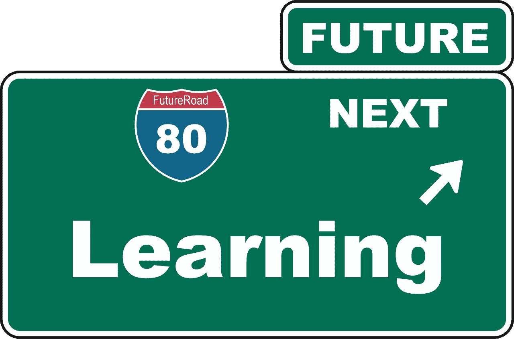

Credit: [Pixabay](https://pixabay.com/en/learn-forward-note-sign-directory-2004897/)

我假设如果你还在读这篇文章，你已经成功地完成了这个练习。干得好！好吧，那下一步是什么？

正如我之前所说，我们可以通过添加新的 bot 功能、扩展 NLP 功能以及在其他消息传递平台中实现 bot 来进行试验。这个框架的中心思想是——如果您需要更换平台，并且为了方便添加/扩展技能，所有完成的工作都可以重用。也就是说，我不能涵盖所有可能的选项，因为机器人的应用程序可以根据用户的需求而变化。因此，探索和实现它们取决于您。祝你好运！

如果你正在寻找建立一些基于人工智能/机器学习的聊天机器人，那么请参考下面的链接。

 [## bAbI 任务的 DMN+

### 编辑描述

ethancaballero.pythonanywhere.com](https://ethancaballero.pythonanywhere.com/) [](https://chatbotsmagazine.com/contextual-chat-bots-with-tensorflow-4391749d0077) [## 使用 Tensorflow 的上下文聊天机器人

### 在对话中，语境是王道！我们将使用 Tensorflow 构建一个聊天机器人框架，并添加一些上下文处理来…

chatbotsmagazine.com](https://chatbotsmagazine.com/contextual-chat-bots-with-tensorflow-4391749d0077) [](https://github.com/llSourcell/tensorflow_chatbot) [## llSourcell/tensorflow_chatbot

### Youtube 上@Sirajology 的 Tensorflow 聊天机器人演示。为 llsourcel/tensor flow _ chatbot 开发做出贡献，创建…

github.com](https://github.com/llSourcell/tensorflow_chatbot) 

就是这样。最后一部分到此结束。如果您需要讨论任何特别的事情，或者您对任何模块有反馈，请留下评论或通过 [LinkedIn](http://www.linkedin.com/in/sundarkrishnan1) 或 [Twitter](https://twitter.com/MSundarKrishnan) 联系我。

玩得开心！