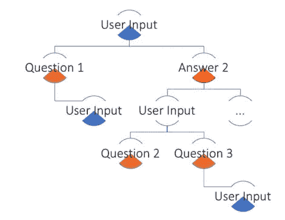
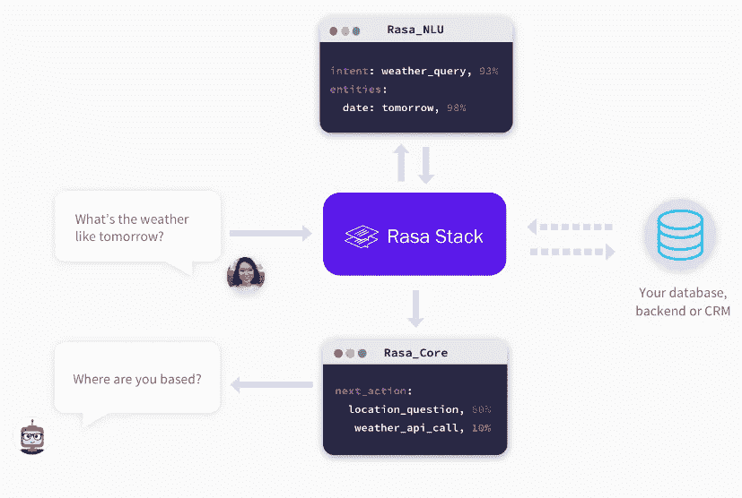

# 聊天机器人与现实:如何建立一个有效的聊天机器人，明智地使用自然语言处理

> 原文：<https://towardsdatascience.com/chatbots-vs-reality-how-to-build-an-efficient-chatbot-with-wise-usage-of-nlp-77f41949bf08?source=collection_archive---------4----------------------->

## 第 1 部分:聊天机器人范例

本文是“聊天机器人的自然语言处理”系列的一部分:

1.  聊天机器人范式(本帖)
2.  如何建立一个聊天机器人使用拉沙 NLU
3.  如何使用 Rasa 核心构建和改进聊天机器人
4.  更深入:向 Rasa NLU 添加组件

> 我开始独立写这篇文章，但是很快它就失去了控制…所以:这是 4 篇文章系列的第 1 部分。它将讨论设计聊天机器人的常见范例。第 2、3 和 4 部分将展示构建这样一个 bot 的实际例子。

# 介绍

在研究了机器学习为聊天机器人提供的可能性一段时间后，我最近开始用 [Interactbot](https://interactbot.com/) 开发一个大型聊天机器人项目。因此，我决定写一系列的帖子，讨论和展示聊天机器人中 NLP 的一些能力和局限性。

在我看来，和图像问题一起，文本理解是现在机器学习的两大顶级任务之一(top 有点模糊……也许是从牵引力、努力度和兴趣度来说)。因此，对我来说，认真解决一个更有趣且未解决的问题是很有趣的。

然而，虽然图像任务令人印象深刻地一个接一个地解决了，但文本任务有点落后:开发一个合适的聊天机器人所需的真正好的对话技能甚至还没有接近解决。

> Y 你可以在这篇[文章](https://arxiv.org/abs/1708.02709)中读到一些选定的 NLP 问题的(有些不成熟的)状态，这将在后面的帖子中讨论

所以你可能会想:“如果 NLP 有这么多挑战，为什么有人要投资聊天机器人？”在某种程度上，你可能是对的。甚至像苹果、亚马逊和谷歌这样的机器学习巨头也经常在对话界面上遭遇惨败(见下面的例子)。似乎机器学习还没有解决这类问题的答案。那么，为什么有人会因为商业原因而费心去开发聊天机器人呢？


A well-known example to Siri, a chatbot by Apple, common type of fail

原因是，就像在大多数基于机器学习的产品中一样:虽然你不能完美地做每件事，但你可以做**一些有帮助的事情**。例如，你不能建造一个聊天机器人来讨论生命的意义，或一个机器人来帮助解决一些复杂的问题，但你肯定可以建造一个聊天机器人来回答基本的互联网提供商支持问题，并通过明智的产品设计，将节省大量时间花在令人厌倦的电话菜单上。

因此，在这篇文章中，我将讨论聊天机器人的一些功能，以及我们试图缩小机器学习研究和生产之间差距的一些方法。

# 聊天机器人的能力和问题:瞄准哪里？

如前所述，机器学习的完整对话技能离我们很远，机器人仍然有用。想想 Siri、Google Home 和 Alexa，这是几个非常受欢迎的聊天机器人平台:尽管并不完美，但它们被许多人认为是非常好的产品。您可以使用它们来执行以下操作:[(以及其他操作:](https://medium.com/the-mission/11-best-uses-of-chatbots-right-now-1c27764b7e62):

*   安排会议
*   点餐
*   叫辆出租车


聊天机器人对于简单的对话任务也非常有用，比如(基本的)客户支持、内容发现，或者作为更智能的搜索引擎和[更多的](https://chatbotsmagazine.com/11-examples-of-conversational-commerce-57bb8783d332)。

现在想想你最后一次与支持代表交谈，第 1000 次向他解释你的问题，得到的回答是他重复了 10K 时间。

有许多单调的任务可以被一种基本的对话技巧所取代，包括几十/几百个指定的答案。

缺乏解决“对话技能”问题的能力，要求聊天机器人的构建者具有创造性，并设计一个任务流水线，当与一些业务规则和搜索启发相结合时，可能会产生一些有用的聊天机器人。

# 意图-实体范式

希望你能看到聊天机器人的潜力，尽管可能存在缺陷。现在让我们讨论如何建立一个。

## 聊天机器人和自然语言处理

虽然我没有明确地说，聊天机器人不一定有 NLP。如果在聊天机器人规模的一端有“**完全对话**机器人，它具有类似人类的对话技能，另一方面有**确定性**机器人，它具有基于许多 if-else 语句的预定义对话树(通常 3-4 层深)和“类似% x %”SQL 查询



An example for a conversation tree in **Deterministic** bot

从这个基本机制出发，NLP 可能在以下部分有用:

*   用户输入/问题分类
*   更好的单词/实体识别
*   状态识别(我们在树中的什么位置)
*   答案生成

## 解释了意图-实体范式

在做了一些研究之后，我发现一个很好的方法是**意图-实体范例**，正如它的名字所暗示的，它通过两个步骤工作:意图分类和实体识别。

我们假设我们知道我们在对话流中的位置，并忽略**状态、内存**和**答案生成**，其中一些将在接下来的帖子中讨论。

这种范式有利于机器人的设计和培训工作，但不利于技术人员，并被大多数知名聊天机器人接口使用: [wit.ai](https://wit.ai/) 、 [api.ai](https://dialogflow.com/) 、 [recast.ai](https://recast.ai) 等。

这个概念可能不被认为是自然语言处理任务本身，而是自然语言处理任务的流水线。意图分类与**文本分类**相关，启动条件不同，实体识别与**命名实体识别**任务并行，这里也适用不同的条件。

让我们看一个例子。一个**餐馆搜索机器人**的例子，它松散地基于这里的基本[例子](https://rasa-nlu.readthedocs.io/en/latest/tutorial.html#section-tutorial)。该机器人将具有以下可能的能力:

*   **餐馆搜索** —这意味着用户寻找特定的或一系列的餐馆。
*   **餐桌订单** —用户想在某家餐馆订购一张餐桌。
*   **一般查询** —用户有一个关于餐馆的特定查询，例如，它是否是素食友好的，或者它是否是犹太的。

此外，我们希望在用户查询中找到以下对象，如果提到的话:

*   **美食** —将代表美食类型，例如意大利、亚洲等。
*   **位置** —所需餐厅的位置。
*   **属性** —餐厅的属性，例如纯素食、犹太食品、准入

## **意图分类**

在这个范例中，意图意味着用户查询的一般目的，例如，搜索一家企业或一个地方，安排一次会议，等等。

机器人应该对你的查询进行分类，并采取相应的行动(搜索一个地方，获得尽可能多的细节。用于安排会议、请求会议细节、出席者等。)所以很容易看出这是一个普通的**文本分类**挑战。

文本分类是一项经过充分研究的机器学习任务，然而，很大一部分研究是在宽松的问题设置上进行的，如**情感分析**。在现实世界中的机器人，你几乎从来没有少于 5 个可能的意图。

在不太具体的情况下，这种模型的精度取决于各种参数:

*   **意向计数** —一个应用的平均意向数量应为 5-10 个。意图越少越简单，而意图越多越不利于准确性。
*   **数据量** **和质量** —我们都知道，在任何机器学习任务中，我们拥有的数据越多，越接近推理查询，我们就会有更好的结果
*   **转移学习的可能性—** 转移学习，或者换句话说，如果可行的话，使用一个预先训练好的模型来解决类似的问题可能会非常有帮助
*   **推理输入大小**——用户在查询我们的机器人时并不倾向于简洁。因此，文本汇总工具，其中包括提示用户简明扼要，将有助于我们的应用程序有更好的准确性

如果我们能够“优化”上述超级参数，我们通常能够在不太费力的情况下达到大约 80%的准确度，并将开始努力达到 90%的准确度，这是一个挑战，但可以轻松地认为是生产就绪。低于 80%的结果将导致令人沮丧的产品。

## **实体识别**

文本中的实体可以是企业、位置、人名、时间等。一个在查询中有意义并且在 bot 逻辑中有进一步意义的对象。

实体识别本身也是一个众所周知的自然语言处理问题，这也是令人烦恼的问题之一:它非常强烈地依赖于数据集和试探法(例如，大写字母，问号)。

有很多解决这个任务的库，例如我最喜欢的 [spacy](https://spacy.io/usage/linguistic-features) ，它做得非常好。

[在这里](https://www.youtube.com/watch?v=sqDHBH9IjRU&t=1753s)你可以看到 spacy 的一位创作者深入讨论了他们的 NER。

# 拉萨·NLU

前面提到过，Rasa NLU 是一个很好的开源库，可以用来查找文本中的意图和实体。



Rasa NLU illustration

当第一次在一个组织中处理机器学习问题时，使用现成的**开源**工具，然后围绕它构建一个良好的基础设施是一个很好的实践。

拉莎·NLU 声称会给你付费/黑盒图书馆(前面提到的)给你的东西，甚至更多。我必须承认，我只进行了一些基本的比较，但正如你将看到的，拉沙 NLU 的结果客观上是相当不错的。

此外，开源允许您查看代码，了解正在使用的方法(当您看到模型的简单性时，可能会有点失望)，然后自己开发额外的组件(这个选项是可能的，但在 Rasa 中没有记录)

此外，组织看到了内部系统的高价值，开源的 rasa-NLU 提供了以此为基础，并在此基础上开发更多功能的能力。

起初，拉沙 NLU 看起来有点像一个黑匣子:用特定格式的小数据集训练模型，然后推断出意图和实体。

我必须承认，Rasa 的文档有时可能相当混乱，但几个小时的彻底检查代码将揭示它的大部分“秘密”。

## 数据

Rasa NLU 收到了大量的查询，并以以下格式标记了意图和实体:

```
{
  "text": "show me chinese restaurants",
  "intent": "restaurant_search",
  "entities": [
    {
      "start": 8,
      "end": 15,
      "value": "chinese",
      "entity": "cuisine"
    }
  ]
}
```

与所有机器学习问题一样，数据越多，得到的模型越好。然而，Rasa 的一些组件可能非常慢，并且在训练示例方面非常有限。另一方面，即使有几百个例子，合理的结果也开始出现。

## 基础模型

一般来说，Rasa 使用两种可互换的“语言模型”，即 [MITie](https://github.com/mit-nlp/MITIE) 和 [Spacy](https://spacy.io/) ，此外还有无处不在的 sklearn。

Mitie 和 Spacy 是彼此非常不同的库:第一个库使用更多的通用语言模型，因此训练非常慢，而 Spacy 使用更多的特定任务模型，训练非常快。

在 Interactbot 中，我们最初因为技术原因开始使用 MITie，但由于它的训练速度很快就转移到了 Spacy。两个软件包的结果非常相似。

## 管道

如前所述，RASA 基于 NLP 任务流水线。流水线不一定是线性的，不同的组件输出不同的东西。在这里可以找到[(相当欠缺的)文档。](http://rasa-nlu.readthedocs.io/en/latest/pipeline.html)

正如您在文档中看到的，可以手动装配管道，但建议从一个**预定义的**管道开始。让我们检查一下 **Spacy-SKlearn 管道**:

`["nlp_spacy", "tokenizer_spacy", "intent_entity_featurizer_regex", "intent_featurizer_spacy", "ner_crf", "ner_synonyms", "intent_classifier_sklearn"]`

这条管道有点杂乱，但重要的组件是***intent _ classifier _ sk learn****，它使用句子特征上的 SVM(基于 word2vec)以及预测实体的 ***ner_crf*** *和****ner _ synonyms****。将在下一篇文章中进一步讨论。**

**上述组件由“intent _ entity _ featurezer _ regex”(regex 特征)和“intent _ featurezer _ spacy”(word 2 vec 特征)提供特征。**

## **结果**

**在文本上运行 Rasa 模型的输出将是下面的预测，应该进一步滚动到业务逻辑和数据库查询，以便为用户提供正确的答案:**

```
**{
    "text": "I am looking for Chinese food",
    "entities": [
        {"start": 8, "end": 15, "value": "chinese", "entity": "cuisine", "extractor": "ner_crf"}
    ],
    "intent": {"confidence": 0.6485910906220309, "name": "restaurant_search"},
    "intent_ranking": [
        {"confidence": 0.6485910906220309, "name": "restaurant_search"},
        {"confidence": 0.1416153159565678, "name": "affirm"}
    ]
}**
```

# **摘要**

**在这篇文章中，这是该系列的第一部分，我们已经讨论了聊天机器人的意图-实体范式。我们熟悉了拉莎·NLU 的产品包，以及其中的一些模型。**

**在下面的帖子中，我们将学习如何用拉莎·NLU 和其他工具构建一个对话界面。我们还将讨论对所用模型的评价和改进。**

**在上一篇文章中，我们将集成新的包— Rasa Core，它将允许我们添加新的功能，如内存、图形推理和更多很酷的功能。**

**希望你喜欢这篇文章！如果是这样，请随时关注我这里或那里: [Twitter](https://twitter.com/shgidi) ， [LinkedIn](https://www.linkedin.com/in/gidi-shperber-9623a916/)**

***特别感谢* [*哈利·霍恩里奇*](https://medium.com/@harryhorn) *以及* [*互动机器人*](https://interactbot.com/) 中的所有伙计们**