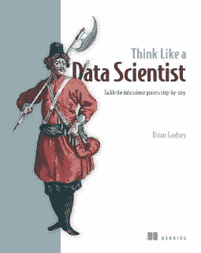
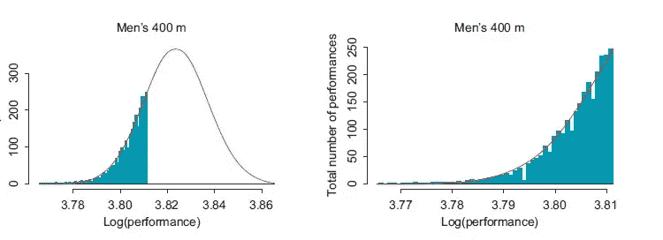

# 检查您对数据的假设

> 原文：<https://towardsdatascience.com/check-your-assumptions-about-your-data-20be250c143?source=collection_archive---------2----------------------->

## 没有人喜欢糟糕的假设

The book (now in print!) has an awesome picture on the cover.

在这本书的节选中，我讨论了识别和检查你对正在处理的数据的任何假设的重要性。

*节省 37 折* [*像数据科学家*](https://manning.com/books/think-like-a-data-scientist?a_aid=thinklikeadatascientist&a_bid=eb49dc22) *用代码****fccgodsey****。*

不管我们愿不愿意承认，我们都会对数据集做出假设。我们可以假设我们的数据包含在特定的时间段内。或者，我们可以假设包含电子邮件的文件夹的名称是这些电子邮件的主题或分类的适当描述符。这些关于数据的假设可以是预期或希望，有意识的或潜意识的。

# ***关于数据内容的假设***

让我们考虑一下安然数据例子中的时间因素。当我开始查看这些数据时，我当然认为这些电子邮件会跨越从 20 世纪 90 年代末电子邮件出现到 21 世纪初公司倒闭的几年时间。由于日期格式中潜在的错误或损坏，我可能弄错了。实际上，我看到的日期远远超出了我假设的范围，还有其他一些有问题的日期。我对日期范围的假设当然需要验证。

如果我们想使用电子邮件帐户中的文件夹名称来通知我们其中的电子邮件内容，则有一个隐含的假设，即这些文件夹名称是信息性的。我们希望检查这一点，这可能需要大量的人工工作，例如阅读一堆电子邮件，并使用您的最佳判断来判断文件夹名称是否描述了电子邮件中的内容。

需要特别注意的一点是缺失数据或占位符值。我们倾向于假设——或者至少希望——数据中的所有字段都包含有用的值。但是，电子邮件通常没有主题，或者在“发件人”字段中缺少名称，或者在 CSV 数据中可能有“NA”、“NaN”或应该是数字的空格。检查这样的占位符值是否经常出现并导致问题总是一个好主意。

# ***关于数据分布的假设***

除了数据的内容和范围，我们可能对其分布有进一步的假设。老实说，我知道很多统计学家对这一部分的标题感到兴奋，但对其内容感到失望。统计学家*喜欢*检查分布假设的适当性。试试谷歌“常态测试”或者直接去*维基百科*页面，你就会明白我的意思。似乎有一百万种方法可以检验你的数据是否是正态分布的，这是**的一种**统计分布。

我可能会因为写这篇文章而被禁止参加所有未来的统计会议，但是:我通常没有那么严谨。一般来说，使用直方图或散点图来绘制数据可以告诉您想要做出的假设是否合理。例如，图 1 中的插图来自我的一篇研究论文，其中我分析了田径运动中的表现。图中是有史以来最好的男子 400 米成绩的直方图(取对数后)，叠加的是正态分布曲线。顶级表现符合正态分布的尾部，这是我研究的关键假设之一，我需要证明这个假设。我没有使用任何正态性的统计测试，部分原因是因为我处理的是分布的尾部——只是最好的表现，而不是历史上的所有表现——还因为我打算使用正态分布，除非它明显不适合数据。对我来说，直观地比较直方图和正态分布图就足以证明这个假设。对于我的目的来说，直方图与钟形曲线足够相似。

**Figure 1** The logarithms of the best men’s 400 m performances of all time seem to fit the tail of a normal distribution.

虽然我可能对田径数据的分布不太严格，但我不想轻视检查数据分布的价值。如果你认为你有正态分布的数据，而你没有，那么糟糕的事情就会发生。假设正态分布的统计模型不能很好地处理异常值，大多数流行的统计模型都假设正态性。这包括最常见的线性回归和 t 检验。当你的数据甚至不接近时假设正态性会使你的结果看起来很重要，而事实上它们是无关紧要的或错误的。

这最后一个陈述对任何统计分布都有效，不仅仅是正态分布。您可能认为分类数据是均匀分布的，但实际上某些类别出现的频率远远高于其他类别。社交网络统计数据，比如我从安然公司的数据集中计算出来的那种——电子邮件集的数量，一天内联系的人数，等等。众所周知是不正常的。它们通常呈指数或几何分布，这两种分布我都会在假设之前核对数据。

总而言之，跳过检查您的数据是否符合分布的统计测试是可以的，但是要小心，确保您的数据与任何假设的分布相匹配，至少大致匹配。跳过这一步对结果可能是灾难性的。

# *揭穿你假设的妙招*

*如果你觉得你没有假设，或者你不确定你的假设是什么，或者即使你认为你知道你的假设，试试这个:*

> *向朋友描述您的数据和项目——数据集中有什么以及您将如何处理它——并写下您的描述。然后，剖析你的描述，寻找假设。*

*例如，我最初的项目涉及安然公司的数据，我可以描述为:*

> *我的数据集是一堆电子邮件，我将使用社交网络分析的技术，通过人们的网络建立整个组织的行为模式。我想对员工的反应以及在层级“上”的沟通(即与老板的沟通)做出结论。*

*在剖析这种描述时，我首先识别短语，然后思考在它们下面可能隐藏着什么假设，例如:*

*   *“我的数据集是一堆电子邮件”——这可能是真的，但它可能值得检查一下，看看是否可能有其他非电子邮件数据类型，如聊天消息或通话记录。*
*   *“组织范围”——什么是组织？我们是假设它被明确定义了，还是有模糊的边界？它可能有助于运行一些关于组织边界的描述性统计，可能是具有特定电子邮件地址域的人，或者是写了超过一定数量的邮件的人。*
*   *“行为模式”——你对什么构成“行为模式”有什么假设？是否每个人都需要从事相同的行为才能被宣布为“模式”，或者我们是否有一组模式，可以与单个示例进行比较，以找到与这些模式匹配的模式？*
*   *“人际网络”——网络中的每个人都需要被连接起来吗？会有没有联系的人吗？我们是否计划从社会网络分析文献中假设某种统计模型；它需要某些假设吗？*
*   *“响应性”——我们假设这个术语是什么意思？我们能否用统计学的方法定义它，并通过使用基本定义和一些描述性统计来验证数据是否支持这样的定义？*
*   *“层级”——我们是否假设我们对组织的层级有完整的了解？我们假设它是刚性的，还是变化的？*

*意识到我们在做假设的时候——通过剖析我们的项目描述，然后问这样的问题——可以帮助避免以后的许多问题。我不想在完成分析，发现奇怪的结果，然后回去调查之后才发现一个关键假设是错误的。更重要的是，我不希望一个关键的假设是错误的，却从来没有注意到它。*

**要了解更多信息，请下载免费的第一章* [*像数据科学家*](https://manning.com/books/think-like-a-data-scientist?a_aid=thinklikeadatascientist&a_bid=eb49dc22) *一样思考，并查看此* [*幻灯片演示文稿*](http://www.slideshare.net/ManningBooks/think-like-a-data-scientist) *了解更多信息和折扣代码。**

**Brian Godsey 博士是一名数学家、企业家、投资者和数据科学家，他的著作* [*像数据科学家一样思考*](https://manning.com/books/think-like-a-data-scientist?a_aid=thinklikeadatascientist&a_bid=eb49dc22) *现已有印刷版和电子书。——【briangodsey.com】**

**如果你喜欢这个，请点击💚下面。**

 **[## 通过问好问题来设定目标

### 数据科学和入门艺术

medium.com](https://medium.com/@briangodsey/setting-goals-by-asking-good-questions-2fdce0c91423)**