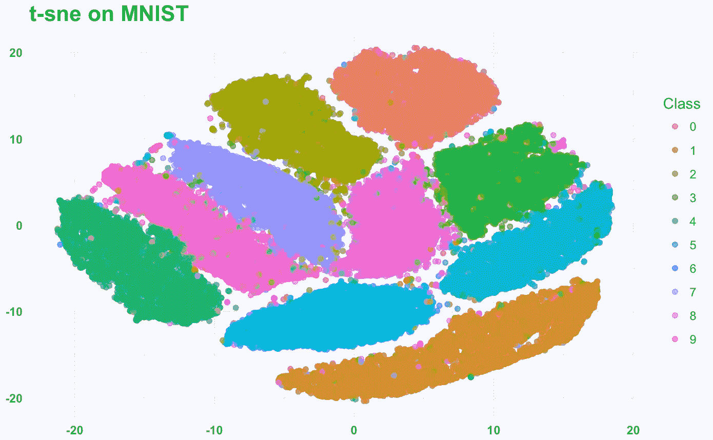
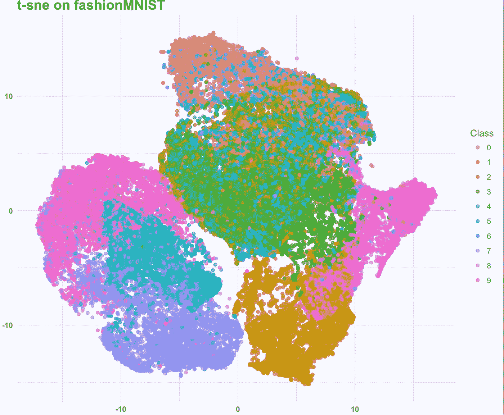
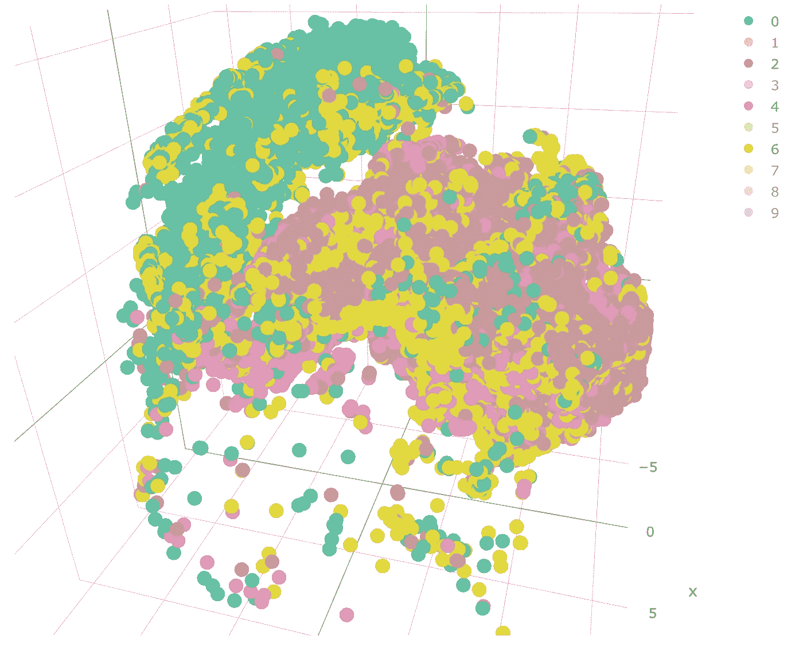

# 用 t-SNE 检验降维

> 原文：<https://towardsdatascience.com/checking-out-dimensionality-reduction-with-t-sne-78309b2ca67d?source=collection_archive---------7----------------------->

今天我探索了在两个高维数据集上应用 t-SNE:经典的 MNIST 和新时尚主义者。

你可以在这里阅读所有关于 fashionMNIST [的内容](https://github.com/zalandoresearch/fashion-mnist/blob/master/README.md)，它被设定为复杂程度更高的 MNIST。

MNIST 包含从 0 到 9 的手写数字，而 fashionMNIST 包含从 t 恤到裙子到裤子的 10 种不同的服装。

我在 MNIST 的整个原始训练集上运行了 t-SNE，这是相当好的分离，并与 fashionMNIST 进行了比较。

MNIST in 2D

并在 fashionMNIST 中观察到一些重叠。

fashionMNIST in 3D

我们可以在 plotly 中进一步旋转它，并删除明显分开的类，以识别重叠的类:t 恤，衬衫和外套。

这是我关于数据科学和视觉故事的[# 100 日项目](https://medium.com/@yanhann10)的第 53 天。我的 [github](https://github.com/yanhann10/machine_learning/tree/master/mnist) 上的全部代码。感谢阅读。欢迎新主题的建议和反馈。