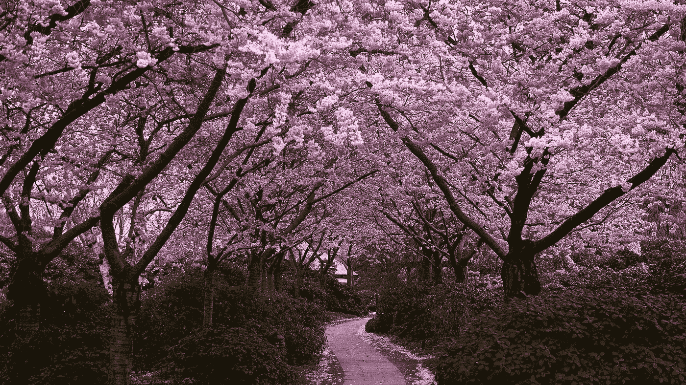
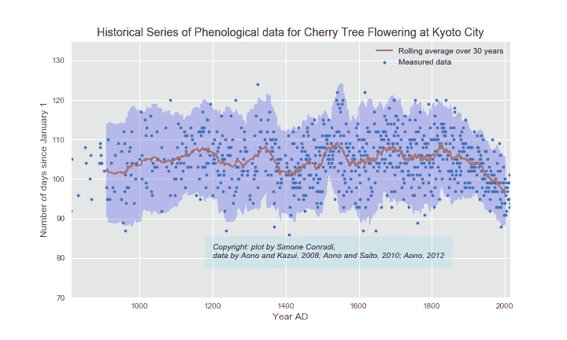
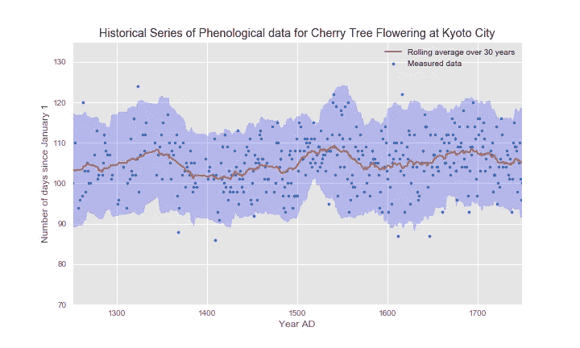

# 樱桃树和全球变暖:开花还是不开花？

> 原文：<https://towardsdatascience.com/cherry-tree-and-global-warming-to-bloom-or-not-to-bloom-23176eba32eb?source=collection_archive---------3----------------------->

T 他的回答似乎是“*要开花”*，请让我再加上“*越来越早”*。在京都，一个美丽的日本城市，也因春天盛开的樱花而闻名，几乎是一个真实的事实，春天每年都开始得越来越早。

由于 Aono，Kazui 和 Saito 的精心工作，京都樱花开花的历史系列物候数据可以通过上面的链接提供给每个人。据我所知，这个物候数据集在世界上是无与伦比的，因为它跨越了 1000 多年的时间！

> “我从历史时期京都的皇帝、贵族、统治者和僧侣写的许多日记和编年史中搜索和收集了樱桃树(樱花)完全开花日期的物候数据。举行樱花观赏会或观察到樱花盛开的日期是从旧文献中收集来的。在[这一页](http://atmenv.envi.osakafu-u.ac.jp/aono/kyophenotemp4/)，你可以看到自 9 世纪以来京都樱花盛开的一长串物候数据。”青野康之。

数据科学的激情与对自然的热爱混合在一起，加上几行 Python 代码，产生了下面的情节。x 轴代表公元年，从公元 812 年开始。y 轴计算自每年 1 月 1 日以来经过的天数。对于有物候数据的每一年，开花日期用一个蓝点表示。正如你所看到的，波动性很大，但是取一个滚动的平均值来说明开花日期的趋势:这是红色曲线。浅蓝色区域代表平均值周围的+/- 1.96 标准偏差范围。红色曲线越低，樱桃树开花越早，反之亦然。

Plot of the whole Historical Series of Phenological data for Cherry Tree Flowering at Kyoto City

从公元 1825 年前后开始，滚动平均值显示出明显的下降趋势:平均而言，樱花每年开花越来越早。这是因为全球变暖还是仅仅因为当地天气或气候的影响？

在公元 1250 年至 1750 年之间缩放，显示出平均开花相对较晚的三个时期:它们或多或少以公元 1350 年、公元 1540 年和公元 1680 年为中心。它们与分别开始于公元 1315 年、公元 1550 年和公元 1650 年的欧洲小冰期有密切关系吗？也许是的…

Zooming between 1250 AD and 1750 AD. Are peaks related to the Little Ice Ages?

## 参考

> Aono 和 Kazui，2008；Aono 和 Saito，2010 年
> 
> Aono 和 Kazui，2008；Aono 和 Saito，2010 年
> 
> 2012 Aono(2012；全球环境，17，21–29)
> 
> [http://atmenv.envi.osakafu-u.ac.jp/aono/kyophenotemp4/](http://atmenv.envi.osakafu-u.ac.jp/aono/kyophenotemp4/)