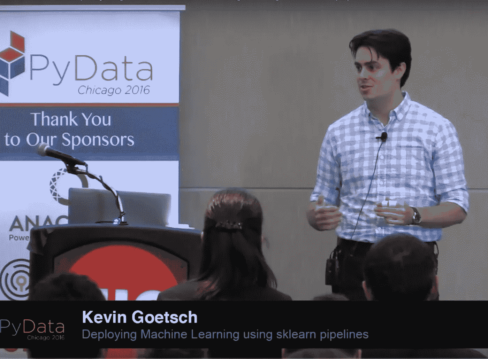
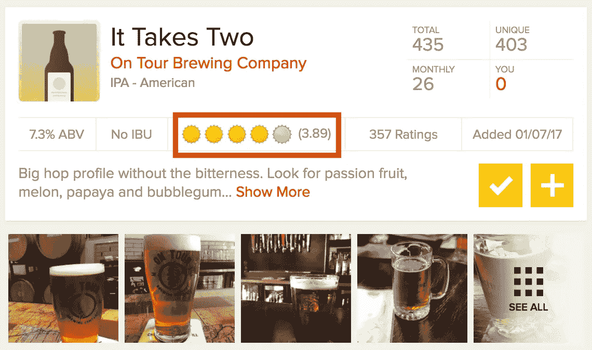
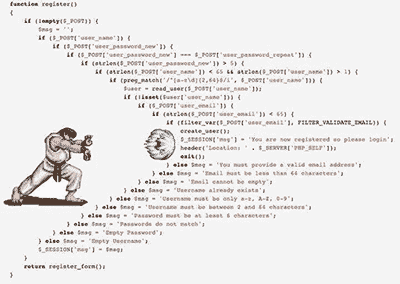

# ChiPy 数据科学导师，pt。一

> 原文：<https://towardsdatascience.com/chipy-data-science-mentorship-pt-1-aa4972f8148e?source=collection_archive---------6----------------------->

这篇文章是关于我作为数据科学项目 [ChiPy 导师项目](https://chipymentor.org/)的学员经历的三部分系列文章的第一部分。ChiPy 是[芝加哥 Python 用户组](http://www.chipy.org/)的简称，是一个由才华横溢、热情洋溢的个人组成的社区，他们因对编程语言 Python 的欣赏而聚集在一起。这个小组的热情和兴奋是更大的 Python 社区的缩影，也是我发现 Python 如此吸引人的部分原因。

我是在参加[大会的数据科学沉浸式](https://generalassemb.ly/education/data-science-immersive)项目时接触到 ChiPy 的，在这个项目中，我们使用 Python 编写大部分代码。在我的第一次 ChiPy meetup 上，我了解了导师计划，并急切地申请了学习更多 Python 知识和融入社区的机会。鉴于我相对来说还是一个编程新手，我很感激有机会在社区环境中继续学习。

# **我的导师**

当我得知 GrubHub 的高级数据科学家 Kevin Goetsch 被指定为我的导师时，我激动万分。我已经有机会与 Kevin 会面，因为他和我的 GA 导师以前是 Braintree 的同事，并且看过他的 [PyData 关于使用 Scikit Learn 进行流水线操作的演讲](https://www.youtube.com/watch?v=URdnFlZnlaE)。谈到编程，我真的很欣赏 Kevin 的精神:他是工具不可知论者，相信一个好的、工作的模型比一个永远不会被使用的完美模型更好，并且专注于产品如何被清洁地生产。实际上，蒂姆·古恩“让它工作”的编程方法。

# **项目**

我的项目的指导问题是:我们能否在一款啤酒投入生产之前预测它在 Untappd(一个致力于啤酒的有影响力的社交媒体平台)上的评级？第二个问题是——这切中了数据科学的核心——我们为什么要在乎？

我们必须先回答后一个问题，以便为前者制定一个进攻计划。如果原因的答案是“因为我想知道哪些 IPA 最受欢迎”，那么我们可以进行一些数据分析，并将我们的数据科学工具箱放在棚子里。如果答案是，“因为我希望我生产的啤酒在 10 次评级后被评为 4 星或更高”，那么在我们的模型中包括 100，000 次评级的啤酒可能没有意义。

为了这个项目，我们将假设原因如下:

我们希望能够为不同的啤酒厂提供关于他们即将推出的啤酒的建议，并就他们如何在 Untappd 上获得更高的评级提出建议。

Sample Untappd beer entry; target variable in red

为了做到这一点，我们需要建立一个模型，可以准确预测啤酒的评级。这个问题可以分成四个不同的部分:

1.  从未开发的目标变量(啤酒等级)和潜在特征中获取数据
2.  数据清理和探索性数据分析
3.  迭代模型测试和持续特征工程
4.  将训练好的模型嵌入到 webapp 中，以按需提供预测

# 目标

在本次导师计划结束时，我希望完成以下工作:

Trying to avoid this

*   打造我的 Python 流畅性！更加熟悉不同的结构，写更多的*文章*
*   通过带有请求和漂亮汤的网络抓取来获取数据
*   用我以前没用过的库可视化我的结果
*   成功实施尖端的机器学习技术，如神经网络和极端梯度推进，并将其功效与行业标准进行比较
*   通过将我的模型构建到一个 Scikit-Learn 管道对象中并对其进行酸洗，从而将它生产化
*   通过构建一个 Flask 应用程序来提供预测，我尝试了一下 web 开发

## **关于我**

我最近从 DC 的华盛顿州搬到了芝加哥。在此之前，我在北卡罗来纳州的戴维森学院获得了比较文学学位。我对数据科学感兴趣，因为它是一种发现的手段和一种讲故事的方式(我肯定这里面有一个很好的中间笑话)。我生在丹佛，长在丹佛，现在仍然对人们认为它有多酷感到惊讶。不出所料，我喜欢啤酒。

请继续关注第 2 部分！