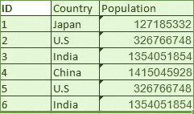
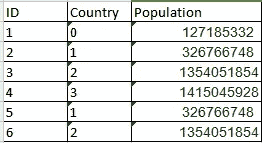
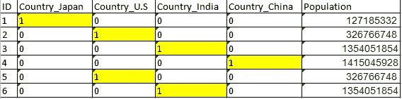

# 选择正确的编码方法——标签与 OneHot 编码器

> 原文：<https://towardsdatascience.com/choosing-the-right-encoding-method-label-vs-onehot-encoder-a4434493149b?source=collection_archive---------1----------------------->

## 您选择的编码如何在您的预测模型中发挥重要作用


Gateway Of India- Mumbai, India Pic by Rahil Hussain Shaikh

在最大似然模型中，我们经常需要将分类的，即文本特征转换成数字表示。两种最常见的方法是使用标签编码器或 OneHot 编码器。然而，大多数 ML 新手并不熟悉编码的选择对他们的模型的影响，通过在正确的场景中使用正确的编码，模型的准确性可能会有很大的变化。

## 在这篇文章中，我们将一步一步来

1.  了解标签和 OneHot 编码。
2.  Python 中使用标注和一次热编码对预测准确性影响的实际示例。

## 了解标签和 OneHot 编码。

让我们了解 Label 和一个 hot 编码器的工作原理，并进一步了解如何在 python 中使用这些编码器，以及它们对预测的影响

## 标签编码器:

使用 Sklearn 库可以实现 Python 中的标签编码。Sklearn 提供了一个非常有效的工具，用于将分类特征的级别编码成数值。用 0 和 n_classes-1 之间的值对标签进行编码，其中 n 是不同标签的数量。如果某个标签重复，它会将之前分配的相同值分配给。

考虑下面的例子:



如果我们必须将这些数据传递给模型，我们需要使用 Label Encoder 将 Country 列编码成它的数字表示。应用标签编码器后，我们将得到如下结果



The categorical values have been converted into numeric values.

这就是标签编码的全部内容。但是取决于数据，标签编码引入了新的问题。例如，我们将一组国家名称编码成数字数据。这实际上是分类数据，行与行之间没有任何关系。

这里的问题是，由于同一列中有不同的数字，模型会将数据误解为某种顺序，即 0 < 1 <2。

该模型可能会得出一种相关性，如随着国家数量的增加，人口也会增加，但这显然可能不是其他一些数据或预测集中的情况。为了克服这个问题，我们使用一个热编码器。

## 一个热编码器:

现在，正如我们已经讨论过的，根据我们拥有的数据，我们可能会遇到这样的情况，在标签编码后，我们可能会混淆我们的模型，认为某一列具有某种顺序或层次结构的数据，而我们显然没有它。为了避免这种情况，我们对该专栏进行了“一个酒店编码”。

一种热编码的做法是，获取一个包含分类数据的列，该列已经过标签编码，然后将该列拆分为多个列。数字由 1 和 0 代替，这取决于哪一列有什么值。在我们的示例中，我们将得到四个新列，每个国家一列—日本、美国、印度和中国。

对于第一列值为日本的行,“日本”列将为“1 ”,其他三列为“0”。同样，对于第一列值为美国的行,“美国”列为“1 ”,其他三列为“0 ”,依此类推。



OneHot encoded country values.

## 关于使用标注和一个热编码对预测的影响的 Python 实例。

我们将使用医疗成本个人数据集来预测基于各种特征的汽车医疗费用，您可以从[这里](https://www.kaggle.com/mirichoi0218/insurance/home)下载数据集。本博客使用的数据只是一个样本数据，但通过均方根误差评估预测结果，可以清楚地看到预测结果的差异，rmse 越接近 0，模型预测越好。

我们将运行 xgboost 回归算法模型(您可以使用您选择的任何回归算法),并使用标签编码器预测价格，然后使用一个热编码器并比较结果。

我从 insurance.csv 文件中取出了最后 37 条记录，并创建了一个新的文件 insuranceTest.csv，以预测对看不见的数据的收费。

**代码片段:**

```
import pandas as pd
import numpy as np
import xgboost
from sklearn.model_selection import train_test_split
from sklearn.preprocessing import LabelEncoder
from math import sqrt
from sklearn.metrics import mean_squared_errordata = pd.read_csv('D://Blogs//insurance.csv')testdata = pd.read_csv('D://Blogs//insuranceTest.csv')mergedata = data.append(testdata)
testcount = len(testdata)
count = len(mergedata)-testcount
X_cat = mergedata.copy()
X_cat = mergedata.select_dtypes(include=['object'])
X_enc = X_cat.copy()#ONEHOT ENCODING BLOCK#X_enc = pd.get_dummies(X_enc, columns=['sex','region','smoker'])

#mergedata = mergedata.drop(['sex','region','smoker'],axis=1)#END ENCODING BLOCK# =============================================================================
# #LABEL ENCODING BLOCK
# 
X_enc = X_enc.apply(LabelEncoder().fit_transform) #
mergedata = mergedata.drop(X_cat.columns, axis=1)
# #END LABEL ENCODING BLOCK
# 
# =============================================================================FinalData = pd.concat([mergedata,X_enc], axis=1)
train = FinalData[:count]
test = FinalData[count:]
trainy = train['charges'].astype('int')
trainx = train.drop(['charges'], axis=1)test = test.drop(['charges'], axis=1)
X_train,X_test, y_train,y_test = train_test_split(trainx, trainy, test_size=0.3)clf = xgboost.XGBRegressor()
clf.fit(X_train,y_train)
y_testpred= clf.predict(X_test)
y_pred = clf.predict(test)dftestpred = pd.DataFrame(y_testpred)
dfpred = pd.DataFrame(y_pred)rms = sqrt(mean_squared_error(y_test, y_testpred))print("RMSE:", rms)
```

RMSE 的产量:RMSE:18960 . 688888886867

现在，让我们取消注释代码片段中的一个热编码器块，注释标签编码器块见 RMSE

```
import pandas as pd
import numpy as np
import xgboost
from sklearn.model_selection import train_test_split
from sklearn.metrics import accuracy_score, confusion_matrix
from sklearn.preprocessing import LabelEncoder
from math import sqrt
from sklearn.metrics import mean_squared_errordata = pd.read_csv('D://Blogs//insurance.csv')testdata = pd.read_csv('D://Blogs//insuranceTest.csv')mergedata = data.append(testdata)
testcount = len(testdata)
count = len(mergedata)-testcount
X_cat = mergedata.copy()
X_cat = mergedata.select_dtypes(include=['object'])
X_enc = X_cat.copy()#ONEHOT ENCODING BLOCKX_enc = pd.get_dummies(X_enc, columns=['sex','region','smoker'])mergedata = mergedata.drop(['sex','region','smoker'],axis=1)#END ENCODING BLOCK# =============================================================================
# #LABEL ENCODING BLOCK
# 
#X_enc = X_enc.apply(LabelEncoder().fit_transform) #
#mergedata = mergedata.drop(X_cat.columns, axis=1)
# #END LABEL ENCODING BLOCK
# 
# =============================================================================FinalData = pd.concat([mergedata,X_enc], axis=1)
train = FinalData[:count]
test = FinalData[count:]
trainy = train['charges'].astype('int')
trainx = train.drop(['charges'], axis=1)test = test.drop(['charges'], axis=1)
X_train,X_test, y_train,y_test = train_test_split(trainx, trainy, test_size=0.3)clf = xgboost.XGBRegressor()
clf.fit(X_train,y_train)
y_testpred= clf.predict(X_test)
y_pred = clf.predict(test)dftestpred = pd.DataFrame(y_testpred)
dfpred = pd.DataFrame(y_pred)rms = sqrt(mean_squared_error(y_test, y_testpred))print("RMSE:", rms)
```

RMSE 的产量:RMSE:18360 . 688888868617

一个热编码器的 RMSE 小于标签编码器，这意味着使用一个热编码器可以提供更好的精度，因为我们知道 RMSE 越接近 0，精度越好，同样不要担心这么大的 RMSE，因为我说过这只是一个样本数据，帮助我们了解标签和一个热编码器对我们模型的影响。

如果你觉得这篇文章有用，给它一个**掌声**和**与你的朋友分享**。

***谢谢***