# 度量标准有什么问题？

> 原文：<https://towardsdatascience.com/choosing-the-right-metric-is-a-huge-issue-99ccbe73de61?source=collection_archive---------3----------------------->

或者任何类型的机器学习问题，你**必须**知道你将如何评估你的结果，或者评估标准是什么。

在本帖中，我们将查看**最常见的指标**，并根据目标和我们试图解决的问题讨论每个指标的有用性。

# 分类指标

## 准确(性)

可能是分类器性能的最直接和直观的度量。它只是简单地计算我们在预测总数中预测正确类别的次数。

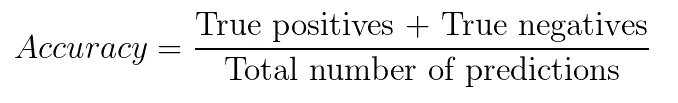

**当面对阶级不平衡的问题时，准确性显然是一个错误的衡量标准**。假设你有两个类:A 类是你的数据集的 99%，B 类是剩下的 1%。通过预测每个时间案例的 A 类，您可以达到 99%的准确率。这看起来是个好成绩，但事实并非如此。

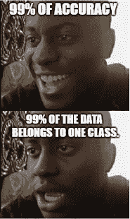

## 精确度和召回率

一般来说，在**召回**(被如此分类的真正肯定的实例的百分比)和**精度**(真正肯定的肯定分类的百分比)之间存在权衡。

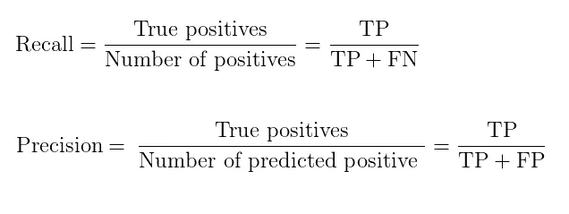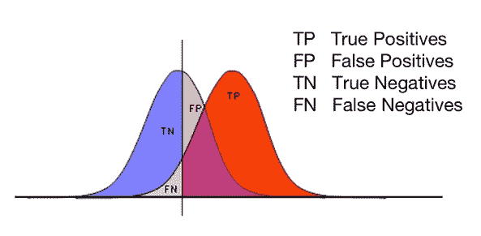

在您想要检测少数类的实例的情况下，您通常更关心召回率而不是精确度。正如在欺诈检测的情况下，错过正面实例通常比错误地标记负面实例代价更高。

## f-测度

我们都希望的理想场景是拥有高精度**和**高召回率！

但要选择你的最佳模式，你需要一个单一的数字性能总结。F1 得分是精确度和召回率的调和平均值:

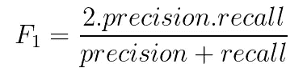

F1 分数**没有一个很好的直观解释**，它是一个被称为 F-Beta 分数的指标的特例，F-Beta 分数衡量的是用户对回忆的重视程度是对精确度的重视程度的β倍。

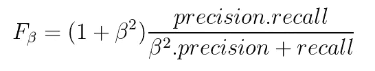

## 卡帕

**Kappa** 或 Cohen 的 Kappa 类似于分类准确性，只是它是在数据集的随机机会基线上进行标准化的:

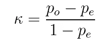

其中 po 是观察到的一致，pe 是预期的一致。

它基本上告诉你你的分类器(po)的性能比一个简单地根据每个类(pe)的频率随机猜测的分类器的性能好多少。

没有标准化的方法来解释它的值。[兰迪斯和科赫(1977)](https://www.ncbi.nlm.nih.gov/pubmed/843571) 提供了一种表征价值观的方法。根据他们的方案，a 值 0 表示不同意，0-0.20 表示轻微，0.21-0.40 表示一般，0.41-0.60 表示一般，0.61-0.80 表示基本同意，0.81-1 表示几乎完全同意。

## 罗马纪元

这是业内使用的流行指标之一。

AUC 代表曲线下面积。该曲线可以代表 ROC 曲线或 PR 曲线。

> PR 曲线说明了在不同阈值设置下**精度**和**召回**之间的权衡。
> 
> ROC 曲线是通过在不同的阈值设置下绘制 **TPR** (真阳性率)，也称为灵敏度，相对于 **FPR** (假阳性率)，也称为特异性而创建的。

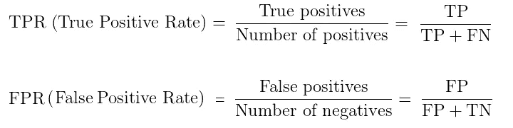

以下是 ROC 曲线绘制的可视化效果:

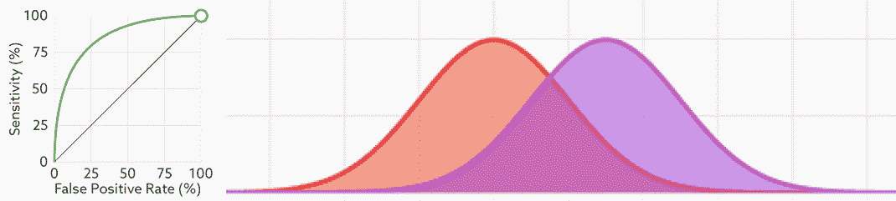

Each point on the ROC curve (left)represents a different cutoff value — The curves on the right represent the Class-Conditional Probabilities

让我们看看当重叠部分的百分比增加/减少时会发生什么:

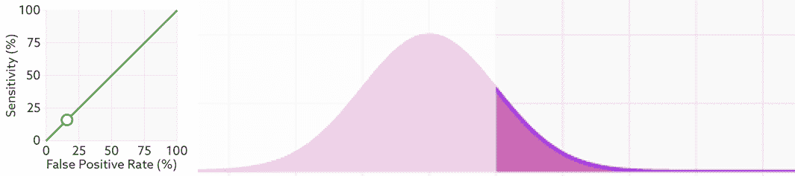

ROC curve (left) and Class-Conditional Probabilities (right) — varying the the percentage of overlapping for a fixed threshold

重叠越少，误差越小，ROC 曲线向上和向左移动得越远。所以，分班越好，AUC 就越高。

换句话说，AUC 不在乎绝对值，**只在乎排名**。你只需要很好地分开你的类，以获得高 AUC。

**ROC 和 PR 有什么区别？**

召回率=真阳性率(TPR)。所以区别在于精度和假阳性率。

这两种度量的主要区别在于，精度分母包含假阳性，而假阳性率分母包含真阴性。

> 精度衡量的是被分类为阳性的样本实际上是阳性的概率，而假阳性率衡量的是阴性样本中假阳性的比率。

**应该用哪个？**

对于任何度量标准来说，这完全取决于您打算如何处理数据。如果你的模型需要在正类和负类上表现的一样好。例如，为了对猫和狗之间的图像进行分类，您希望模型在猫和狗身上都表现良好。为此，您可以使用 ROC-AUC。另一方面，如果您对模型在负类上的表现并不真正感兴趣，而只是希望确保每个正预测都是正确的(精度)，并且您得到尽可能多的正预测(回忆)，那么您应该选择 PR-AUC。

简而言之:

> **使用 PR-AUC 关注小阳性类别**
> 
> **当两类检测同等重要时，使用 ROC-AUC**
> 
> **当阳性结果占多数时，使用 ROC-AUC，或者切换标签，使用 precision 和 recall**

**注意**:许多人倾向于坚持使用 ROC，因为在大多数情况下这是一个更容易解释的指标。除此之外，计算精确的 PR 曲线就不那么直接了。(查看此[链接](https://classeval.wordpress.com/introduction/introduction-to-the-precision-recall-plot/)了解更多详情)。

也就是说，AUC 也有其缺点:它可能会给出潜在的误导性结果…见下图！！

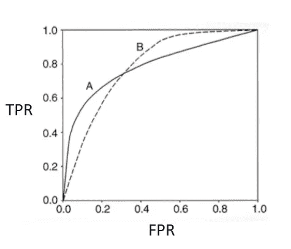

Both models A and B have an equal area under the ROC cure. However, in the high FPR range, model B is better than A, whereas in the low FPR range model A is better than B.

有些人不建议使用 AUC，原因如下:

> (1)它忽略了预测的概率值和模型的拟合优度
> 
> (2)它总结了在人们很少操作的曲线空间区域上的测试性能
> 
> (3)它同等重视遗漏和犯错误
> 
> (4)它没有给出关于模型误差的空间分布的信息
> 
> (5)模型执行的总程度高度影响良好预测的缺席率和 AUC 分数
> 
> 豪尔赫·洛沃、阿尔韦托·希门尼斯·瓦尔夫德和雷蒙多·雷亚尔

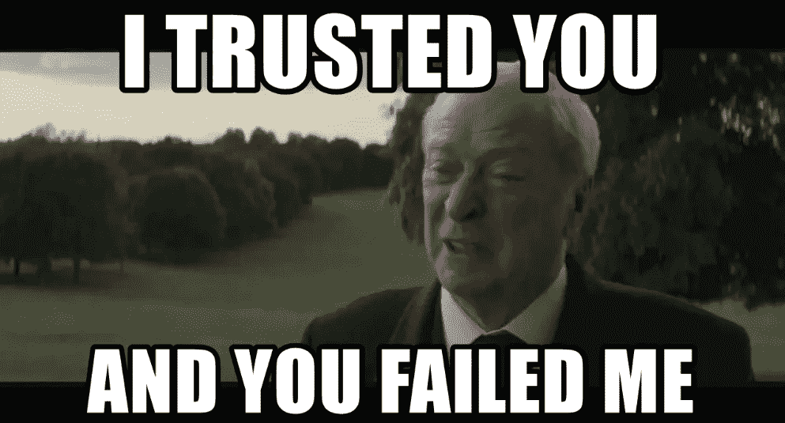

## 部分 AUC (pAUC)

部分 AUC 已被提议作为标准 AUC 的替代措施。当使用部分 AUC 时，只考虑 ROC 空间的特定区域。

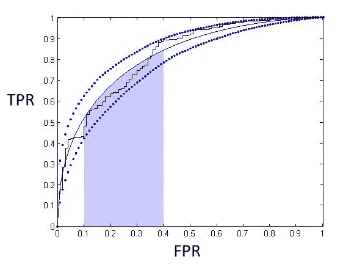

pAUC denotes the area of shaded region

## 双向 pAUC

双向 pAUC 不是只限制假阳性率(FPR)，而是关注曲线下的部分区域，同时具有水平和垂直限制。已经表明，pAUC 对真阳性率(TPR)的间接控制在概念上和实践上都是误导的。

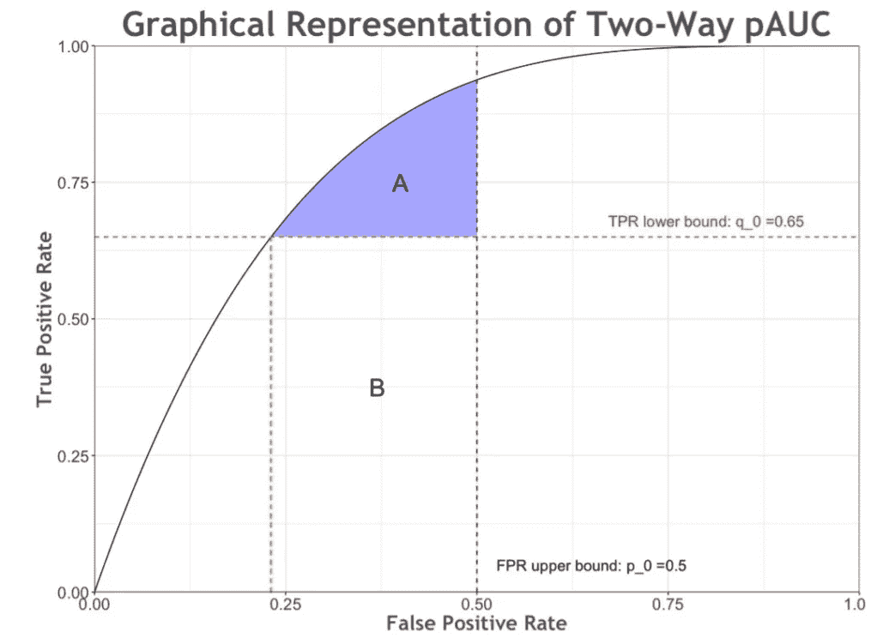

Two-way pAUC denotes the area of shaded region A. This shaded region is directly determined by explicit FPR upper bound p0 (= 0.5) and TPR lower bound q0 (= 0.65). In contrast, pAUC denotes the area of both region A and B. Its **indirect** FPR lower bound (green dotted line) is determined by the TPR lower bound q0

## 对数损失

对数损失是基于概率的最重要的分类度量**之一。**

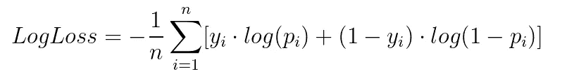

其中 yi 是真实标签，pi 是 yi = 1 的概率。

**这完全是关于信心**:如果对于一个特定的观察，分类器分配一个非常小的概率给正确的类，那么相应的对日志损失的贡献将会非常大。对数损失度量可以被视为精确度的“软”度量。

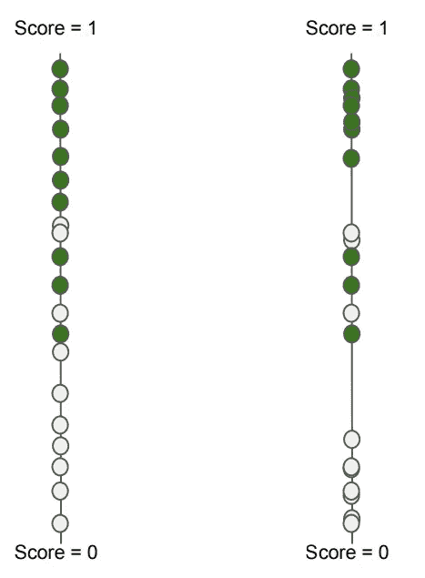

2 different models — same AUC but different LogLoss

这两个模型输出有**相同的排名，**因此**相同的 ROC-AUC，PR-AUC** ！

但是，根据 LogLoss 值，右边的模型比左边的要好。

这是显而易见的，因为 Logloss **包含了概率置信度的概念。**

这个指标的一个缺点是多数阶级可以支配损失！！

# 学习对指标进行排序

现在让我们来看看如何评估一个搜索引擎、一个推荐系统或者任何输出商品列表的系统。

在研究文献中，排序“项目”被称为学习排序。

Example of ranked urls for a given query

两个最流行的排名指标是地图@k 和 NDCG@k。让我们看看他们是如何工作的…

符号:

> **rel(i)** 是指示函数，如果等级 I 处的项目是相关的，则等于 1，否则等于 0。
> 
> **P(i)** 是 top-i 集合中相关的返回项目的比例。
> 
> **n** 是系统做出的预测次数。
> 
> **m** 是项目全空间中相关项目的个数。
> 
> **Q** 是查询总数。

为了解释 MAP@k 做什么，我们需要从 AP@k 开始……

## 美联社@k

这个度量关心第 k 项的平均精度

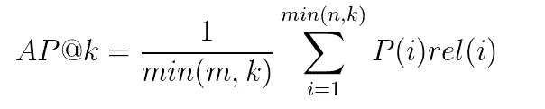

当推荐的数量不可能捕获所有正确的推荐时，所使用的标准化因子防止 AP@k 分数被不公平地抑制。

……不要担心，这里有一个简单的例子可以更好地理解公式:

考虑一下，对于一个给定的查询，您必须预测一个包含多达 10 个项目的有序列表。并且只有 **4** 个可能的正确预测(地面真相)。

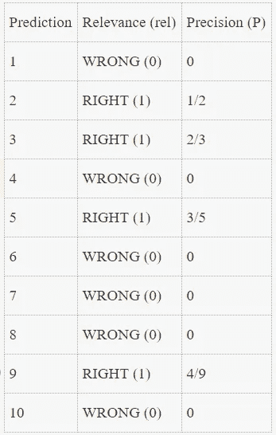

对于每一个预测，你都需要检查它是否正确。如果不是，你的预测就没有分数。如果它是正确的，你得到的点数等于正确预测的点数，包括这一个。

你除以的数就是可能的点数。换句话说，这是 10 个(你最多能预测的)和 4 个实际正确答案中的较小者。

因此:AP@10 = (1/2 + 2/3 + 3/5 + 4/9 ) / 4 = 0.55

## 地图@k

MAP@k 计算所有查询的平均精度(AP@k) **的平均值。对，一个平均一个平均！！**

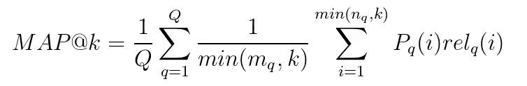

AP@k 是一个度量，它接受前 k 个项目的排序列表，并将其与给定查询的真实“相关”项目集的列表进行比较。AP@k 奖励你在你的列表中有很多相关的条目，并且把最可能正确的条目放在最上面。因此，**顺序** **对于**计算 AP@k 分数很重要。MAP@k 只是计算 AP@k 在所有查询中的平均值。

现在，让我们解释另一个流行的排名质量指标…

## NDCG@k

该指标声明了以下内容:

1.  非常相关的结果>稍微相关的结果>不相关的结果(**C**u 累计 **G** ain)。
2.  当相关结果出现在结果集的前面时，它们会更有用( **D** iscounting)。
3.  排序的结果应该与所执行的查询无关( **N** 规范化)。

***【CG】***是检索到的候选项的相关性得分的总和。它被计算为前 k 个相关性分数的总和:

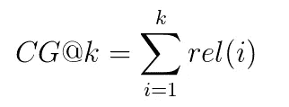

***贴现 CG (DCG)*** ，基本上根据项目的位置来惩罚相关性分数。使用对数衰减:

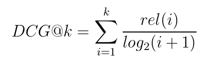

提出了一个替代方案以更加强调检索相关项目:

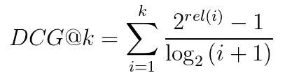

名词（noun 的缩写）b:当相关值为二进制时， **DCG@k** 的这两个公式是相同的。

然而，这个分数没有固定的上限，因为它取决于查询返回的结果的数量，因此为了比较不同查询的 DCG，我们必须 ***将它们*** 归一化。为了实现这一点，我们将 DCG 值除以最佳可能( ***【理想】*** )排名，得到*，一个介于 0 和 1 之间的值。*

*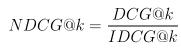*

***地图@k vs NDCG@k:主要区别？***

*顺序对 MAP@k 和 NDCG@k 都很重要。但主要区别是 MAP@k 假设二元相关性(一个项目是感兴趣的还是不感兴趣的)，而 NDCG@k 允许实数形式的相关性分数。*

*连续变量的度量呢？*

# *回归度量*

*当谈到回归性能指标时，MAE 和 RMSE 是两个最流行的指标。*

## *绝对平均误差*

*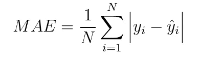*

## *均方根误差*

*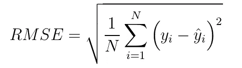*

*梅与 RMSE:应该使用哪一个？*

*以下几点可能有助于你做出决定:*

> *当误差分布预期为高斯分布时，RMSE 比 MAE 更适合表示模型性能。*
> 
> *MAE 适用于描述均匀分布的误差。*
> 
> *MAE 对异常值更稳健:最小化平方误差导致找到它的平均值，最小化绝对误差导致找到它的中值。我们都知道中位数比简单平均数对异常值更稳健。*
> 
> *RMSE 避免使用绝对值，这在许多数学计算中是非常不可取的。例如，可能很难计算 MAEs 相对于某些模型参数的梯度。*

*….那 **R 呢？***

# *r 平方*

*R 平方的定义相当直接:它是用线性模型解释的响应变量变化的百分比。*

*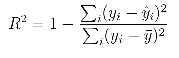*

***误解:** R 不在 0 和 1 之间。R 的最大值是 1，但也可能是负值。*

*R 有什么问题吗？*

*是啊！！！当增加新的预测值时，r 总是增加，不管它们是否有用:*

> **每当您向模型中添加一个变量时，其估计系数的值可以为零，在这种情况下，解释方差的比例保持不变，也可以采用非零值* ***，因为它提高了拟合的质量*** *。通过构造，你的* R *不能在增加一个变量后变小-* [*Maxime Phillot 在 Quora*](https://www.quora.com/Why-when-the-number-of-variables-increases-does-the-R-square-also-increase-in-linear-regression) 上的响应*

**

*我们如何克服这个问题？*

## ***调整后的 R***

*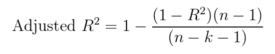*

*其中 n 是观察值的总数，k 是预测值的数量。*

*如果添加有用的术语，该指标将会增加，如果添加不太有用的预测值，该指标将会减少。*

# *更多指标！！！！*

## ***NLP/NLG 指标:BLEU 和 ROUGE***

*这两个指标是互补的，主要用于评估文本的自动摘要和机器翻译。*

**

## *双语评估替补演员*

## ***胭脂(面向回忆的吉斯丁评价替角)***

*胭脂只基于回忆。*

*基于用于计算召回的特征，胭脂可以有许多类型:*

*   ***ROUGE-N** 基于一元、二元、三元或更高阶的 **N** -gram 重叠。*
*   ***ROUGE-L/W/S** 分别基于 **L** ongest 公共子序列(LCS)、 **W** eighted LCS 和 **S** kip-bigram 共现统计。*

*有关这些指标的更多信息，您可以参考林的论文。*

## ***语音识别指标:WER(单词错误率)***

**

*WER 是用于评估 ASR(自动语音识别)系统的常用指标。这里有一个简单的方法来理解 WER 是如何计算的:*

*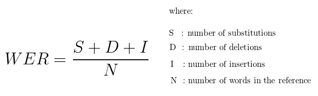*

> *删除:*
> 
> ***语音输入:**我昨天连接了
> **ASR 结果:**我昨天连接了*
> 
> *插入:*
> 
> ***语音输入:**昨天连接了
> **ASR 结果:**昨天连接了*
> 
> *替代:*
> 
> ***语音输入:**昨天连接了
> **ASR 结果:**连接了是*

# ***奖金！***

*走到最后是你应得的。*

*以下是您可以在网上找到的挑战列表，这些挑战使用我们提供的一个指标来评估参与者模型的性能。*

# ***结论***

*没有硬性规定可以找到一个理想的指标来说明在所有情况下应该最小化/最大化什么！这完全取决于业务需求和您试图解决的问题的背景。主要的信息很简单，当定义一个问题时，度量应该被接受并扮演一个关键的角色。*

*请继续关注，如果你喜欢这篇文章，请留下👏！*

# ***参考文献***

*[1] [Jorge M. Lobo，A. Jiménez 和 R.Raimundo，AUC:对预测分布模型性能的误导性衡量，2007 年](https://www2.unil.ch/biomapper/Download/Lobo-GloEcoBioGeo-2007.pdf)*

*[1] [卢琨，双向部分 AUC 及其性质，2017](https://arxiv.org/abs/1508.00298)*

*[2] [斯坦福大学信息检索导论课程](https://web.stanford.edu/class/cs276/handouts/EvaluationNew-handout-6-per.pdf)*

*[2] [林金耀，胭脂:摘要自动评价软件包，2004](http://www.aclweb.org/anthology/W04-1013)*