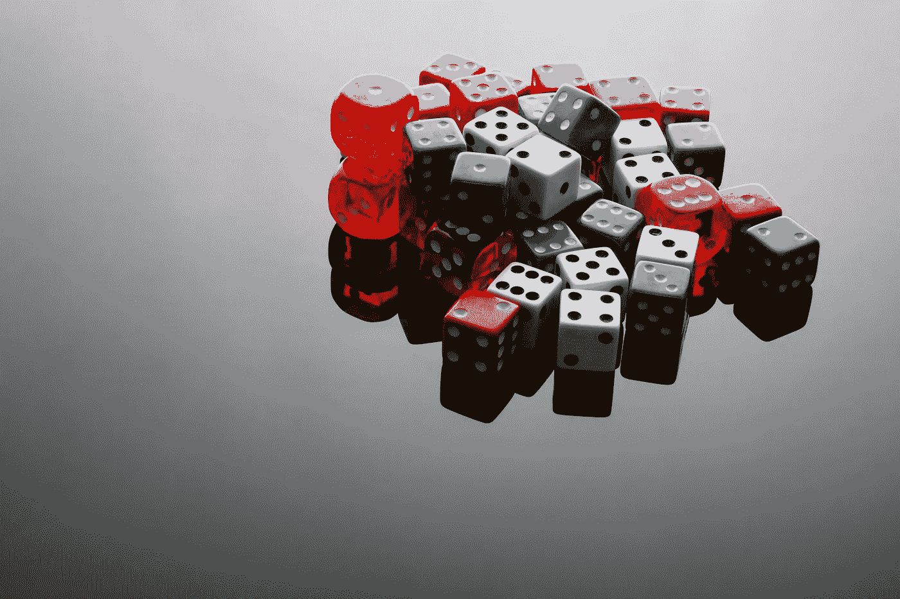
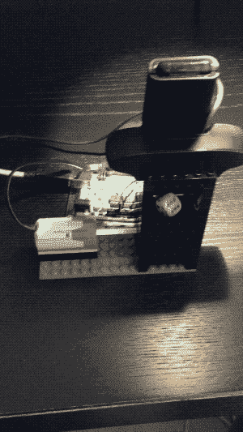
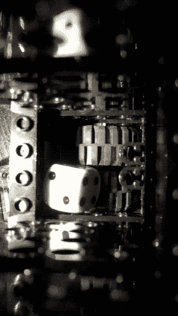
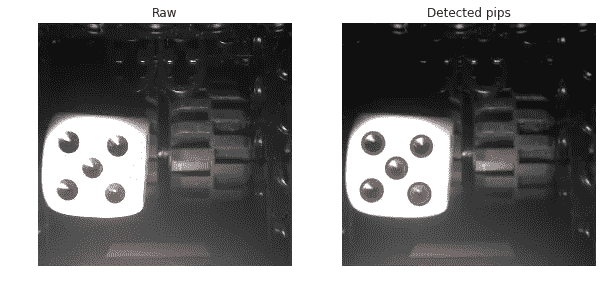
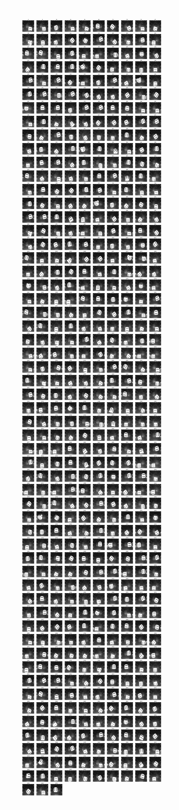
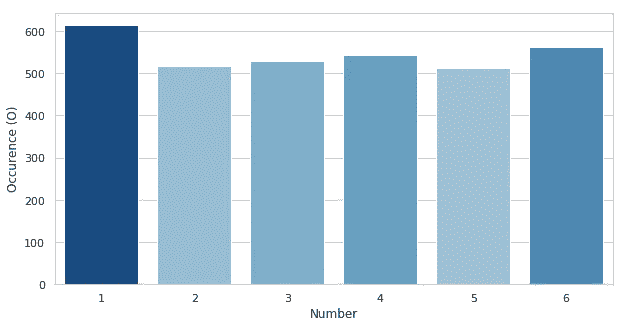
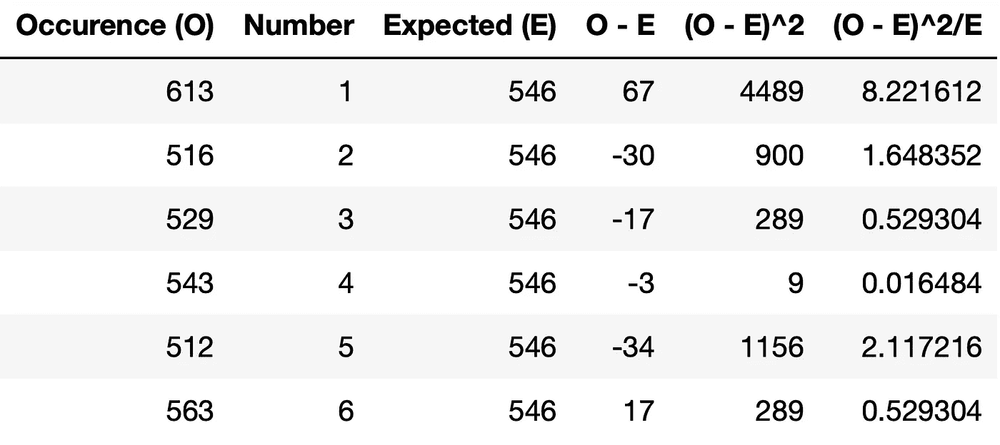

# 棋盘游戏:骰子有多随机？

> 原文：<https://towardsdatascience.com/christmas-games-how-random-are-dice-969f8a935b18?source=collection_archive---------12----------------------->

## 用 openCV 和假设检验分析骰子的随机性



*Image via* photodune.net *under license to mtstrauss*

虽然节日应该是快乐和幸福的源泉，但玩桌游可能是一种微妙的消遣。总有一些人似乎比预期的更有运气。一个典型的问题是骰子是公平的还是被操纵的。这里我们就通过反复掷骰子来分析骰子随机性。对于评估，我们将使用两种关键方法:圆检测来计算骰子图像上的点数，以及假设检验来对骰子的随机性进行定量说明。

由于 n 越大统计越好，一些爱好者甚至掷骰子 [10.000 次](http://www.awesomedice.com/blog/353/d20-dice-randomness-test-chessex-vs-gamescience/)来测试他们骰子的公平性。由于我不想手动掷骰子，我决定用一些乐高、Arduino 微控制器和网络摄像头来制作一个小型自动掷骰子器。基本上，骰子位于一个轮子上的一个小室中，轮子旋转，使骰子旋转。Arduino 转动滚轮 1.5 秒，再停 1.5 秒，然后网络摄像头拍摄结果，并重复该过程。在下面的 gif 图中可以看到机器运行和该机制的延时。



Dice Rolling Mechanism: An Arduino controls a LEGO® motor, which rotates wheels to rotate the die. A webcam captures the outcome.



Dice Rolling Mechanism Close Up Timelapse: The two rounded parts allow the die to flip around randomly.

由于轮子只在一个方向旋转，我在两个圆形部分的形式上增加了一点不对称，这样骰子也可以在垂直轴上旋转。我让机器运行了大约 2.5 小时，以创建一个大约 3000 次投掷的数据集。如果对 Arduino 代码或布线感兴趣，请随时联系我。

现在让我们进入分析部分。有几种方法可以计算点数，例如，我们可以使用形态学操作，通过应用二进制阈值并选择其凸包来掩盖骰子的朝上面(它明显比背景亮)。然后，可以通过对区域进行计数或者仅仅通过确定黑色像素与白色像素的比率来确定 pip 的数量。我尝试了几种方法，但最终决定使用 OpenCV 的 HoughCircles 函数，因为它需要最少的代码来实现。一般介绍可以在[这里](https://www.pyimagesearch.com/2014/07/21/detecting-circles-images-using-opencv-hough-circles/)找到。在试验了这些参数之后，人们能够很快在圆检测中获得不错的结果:



Webcam image of the die and the detected pips using OpenCV ‘s HoughCircles function

接下来，我们计算每个图像的点数。当检测不到圆时，将指定 0 值:

为了检查算法的结果，我们绘制了每个类别的图像:

由于人类的大脑在识别错误分类方面速度超快，我决定检查这些类并手动纠正它们。检查还让我意识到，实际上有许多投掷是不明确的，因为骰子是站在边缘上的(它们被分配到零类)。

注意，HoughCircles 函数在大约 90%的情况下做了正确的分类。由于手动校正，现在人们也有了训练集，并且可以花费更多的时间来构建更好的分类器(即，当增加 n 时)。让我知道，如果你想得到数据集，有兴趣玩一玩，并建立一个基于此数据的骰子分类器。

现在，我们可以珍惜一个正确分类的骰子汇编。在所有六个数据集的下面(如果你发现一个不属于那里的，请告诉我):



All sixes of the dataset.

现在我们已经对所有的图像进行了正确的分类，我们现在可以测试我们的骰子是否是公平的了。首先，我们将绘制每个数字的出现次数:



正如我们所观察到的，第一种情况发生得更频繁。现在我们如何发现这个偏差是否显著？我们可以使用的一个统计检验是[卡方检验](https://en.wikipedia.org/wiki/Chi-squared_test)。为了执行这个测试，我们计算预期结果的数量(E)，计算与预期发生的差异(O-E)，平方这个值((O-E))，然后通过预期值的数量将其归一化((O-E) /E)。卡方检验统计量是所有标准化值的总和。为了计算显著性水平，我们将检验统计量与 5 度的卡方分布(6–1)进行比较。



The results data frame

要使用卡方检验，我们不需要总是计算表(虽然这样便于理解检验)，但是也可以使用 stats 库直接计算值。

```
from scipy.stats import chisquare1 - chisquare(counts).pvalue
```

最终，测试显示骰子在 97%的显著性水平上有偏差，因此这是不公平的。从上表判断，这种情况比正常情况多出现了 12%。毕竟，我现在找到了一个合理的解释，来解释为什么我用这个骰子输掉了过去的游戏。

# 讨论

这里，我们使用 OpenCV 的 HoughCircles 函数来计算骰子图像上的点数。使用卡方检验，我们能够在 97%的显著性水平上检验我们的假设，即骰子是不公平的。
然而，另一个问题是为什么死得不公平。我会假设它源于制造问题，所以质心错位，一些边缘比其他边缘更圆。在浏览专业骰子时，我注意到很多骰子都有锋利的边缘。
可能的后续行动是调查其他几款骰子，并寻找最公平骰子的最佳制造商。此外，骰子投掷机可以通过嵌入平面来模拟更真实的投掷来改进。

当然，另一个主要的限制是掷骰子是否是随机的。给定有限数量的相互作用，人们可以认为最终位置是由起始条件决定的。

至于这个特定的骰子，请放心，它将被排除在下一个棋盘游戏会话之外，以拯救家庭和平。