# 张量流中的 CIFAR-10 影像分类

> 原文：<https://towardsdatascience.com/cifar-10-image-classification-in-tensorflow-5b501f7dc77c?source=collection_archive---------1----------------------->

Photo by [rawpixel](https://unsplash.com/@rawpixel?utm_source=medium&utm_medium=referral) on [Unsplash](https://unsplash.com?utm_source=medium&utm_medium=referral)

在这个故事中，我将对来自 [CIFAR-10 数据集](https://www.cs.toronto.edu/~kriz/cifar.html)的图像进行分类。这个故事包括预处理图像和训练/预测卷积神经网络模型。

这个笔记本的一些代码和描述是借用了[这个回购](https://github.com/udacity/deep-learning/tree/master/image-classification)由 [Udacity](http://www.udacity.com) 提供，但是这个故事提供了更丰富的描述。代码和 jupyter 笔记本可以在我的 github repo 里找到，[https://github . com/deep-diver/cifar 10-img-classification-tensor flow](https://github.com/deep-diver/CIFAR10-img-classification-tensorflow)。

我的深度学习背景是[uda city { Deep Learning N](https://www.udacity.com/course/deep-learning-nanodegree--nd101)D&[AI-nd](https://www.udacity.com/course/ai-artificial-intelligence-nanodegree--nd898)with contentrations([CV](https://www.udacity.com/course/computer-vision-nanodegree--nd891)， [NLP](https://www.udacity.com/course/natural-language-processing-nanodegree--nd892) ，VUI)}，[Coursera Deep Learning . AI Specialization](https://www.coursera.org/specializations/deep-learning)(AI-ND 被拆分成 4 个不同的部分，我是和之前版本的 ND 一起完成的)。还有，我目前正在服用 [Udacity 数据分析师 ND](https://www.udacity.com/course/data-analyst-nanodegree--nd002) ，已经 80%完成。

## 在跳进去之前…

*   理解原始数据和原始标签

## 实施预处理功能

*   规格化，一个热编码
*   培训/开发/测试集中的数据分割

## 建立网络

*   CNN 模型及其代价函数和优化器

## 训练神经网络

*   超参数
*   训练模型

## 测试模型(预测)

# 在跳进去之前…

## 文件列表

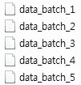

**Fig 1\. list of files of batch**

如图 1 所示，数据集被分成几批以**防止**你的机器运行**出内存**。CIFAR-10 数据集由 5 个批次组成，命名为`data_batch_1`、`data_batch_2`等。如[官方网站](https://www.cs.toronto.edu/~kriz/cifar.html)所述，**每个文件**使用 python 中的 **pickle** 模块打包数据。

## 了解原始影像数据集

原来的一个**批量数据**是用 numpy 数组表示的 **(10000 x 3072)矩阵**。**列数**，(10000)，表示**样本数据的数量**。如 [CIFAR-10/CIFAR-100 数据集](https://www.cs.toronto.edu/~kriz/cifar.html)中所述，**行向量**，(3072)代表一幅 32×32 像素的**彩色图像**。因为这个项目将使用 CNN 进行分类任务，所以原始的行向量是不合适的。为了将图像数据馈入 CNN 模型，输入张量的维数应该是**(宽度 x 高度 x 数量 _ 通道)**或**(数量 _ 通道 x 宽度 x 高度)**。这取决于你的选择(查看 [tensorflow conv2d](https://www.tensorflow.org/api_docs/python/tf/nn/conv2d) )。我要用第一种选择，因为 tensorflow 的 CNN 操作中默认选择是这样的。

## 如何重塑成这样的形态？

如果您计算 32*32*3 == 3072，则图像的行向量具有完全相同的元素数量。为了将行向量重新整形为(宽度 x 高度 x 数量 _ 通道)形式，需要两个步骤。**第一步**是使用`[**reshape**](https://docs.scipy.org/doc/numpy/reference/generated/numpy.reshape.html)`功能，**第二步**是使用 numpy 中的`[**transpose**](https://docs.scipy.org/doc/numpy/reference/generated/numpy.transpose.html)`功能。

根据 numpy 官方网站的定义，`[**reshape**](https://docs.scipy.org/doc/numpy/reference/generated/numpy.reshape.html)`将数组转换成新的形状，而不改变其数据。在这里，短语**不改变其数据**是一个重要的部分，因为你不想伤害数据。`[**reshape**](https://docs.scipy.org/doc/numpy/reference/generated/numpy.reshape.html)`运营应分三个更详细的步骤进行。下面的方向是用逻辑概念描述的。

1.  **将**行向量分成 **3 块**，每块代表一个颜色通道。
    -得到的数组有(3×1024)个矩阵，总共就有**(10000×3×1024)**个张量。
2.  **用 32** 将中的每 3 块进一步分割**。32 是图像的宽度和高度。
    -这导致(3×32×32)，这使得**(10000×3×32×32)**张量总计**

为了实现 numpy 中的逻辑概念，`[**reshape**](https://docs.scipy.org/doc/numpy/reference/generated/numpy.reshape.html)`应该用下面的自变量来调用，(10000，3，32，32)。正如您所注意到的，当提供第三个值(32，width)时，reshape 函数不会自动进一步分割。您需要明确指定最后一个值(32，height)

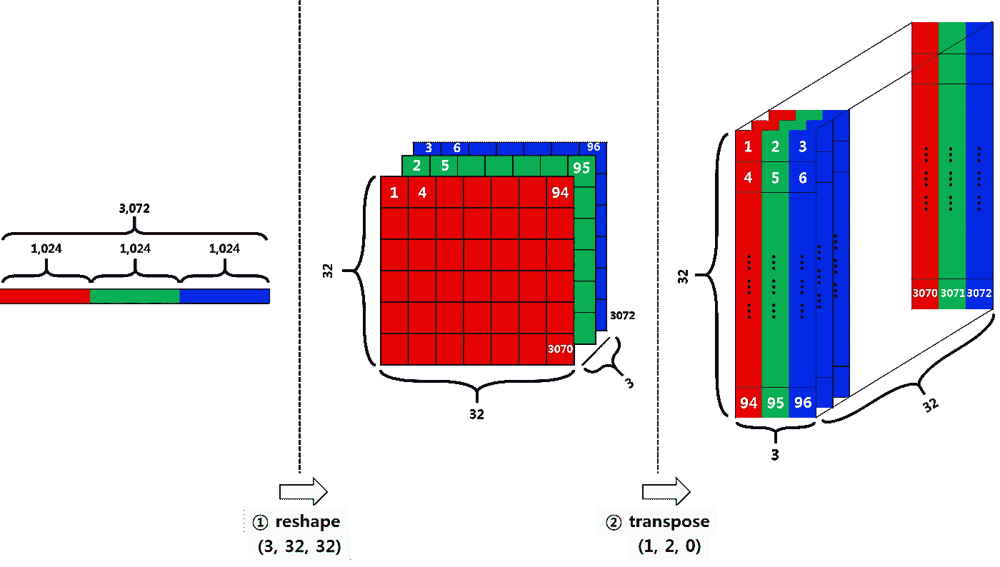

**Fig 2\. reshape and transpose**

故事还没有结束。现在，一个图像数据被表示为(num_channel，width，height)形式。然而，**这并不是 tensorflow 和 matplotlib 期待的形状**。他们期待不同的形状(宽度，高度，通道数)。你需要交换每个轴的顺序，这就是`[**transpose**](https://docs.scipy.org/doc/numpy/reference/generated/numpy.transpose.html)`的作用。

`[**transpose**](https://docs.scipy.org/doc/numpy/reference/generated/numpy.transpose.html)`可以接受一个轴列表，每个值指定它想要移动的维度的索引。例如，在(num_channel，width，height)的 numpy 数组中调用 transpose with argument (1，2，0)将返回(width，height，num_channel)的新 numpy 数组。

**Code 1\. reshape and transpose after loading**

## 了解原始标签

标签数据只是一个包含从 **0 到 9** 的 10000 个数字的**列表，对应 CIFAR-10** 中的 **10 个类中的每一个。**

*   飞机:0
*   汽车:1
*   小鸟:2
*   猫:3
*   鹿:4
*   狗:5
*   青蛙:6
*   马:7
*   船舶:8 艘
*   卡车:9 辆

**代码 1** 定义一个函数，返回一个方便的图像类别列表。该功能**将用于预测阶段**。因为预测的输出是一个数字，所以它应该被转换成字符串，以便人们能够阅读。

**Code 2\. label names**

## 探索数据

你可以在 [my github](https://github.com/deep-diver/CIFAR10-img-classification-tensorflow) 通过改变`batch_id`和`sample_id`来玩笔记本中的代码单元。`batch_id`是一个批次(1-5)的 id。`sample_id`是批次中图像和标签对的 id。

下面定义的 display_stats 回答了一些问题，比如在给定的一批数据中..

*   “所有可能的标签是什么？”
*   "图像数据的取值范围是什么？"
*   "标签是有序的还是随机的？"

**Code 3\. showing sample image in batch #3**

我已经尝试了第三批和第 7000 张图片。如图 3 中的结果所示，每个类别的图像数据的数量大致相同。

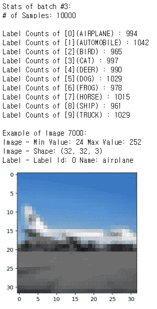

**Fig 3\. showing sample image in batch #3**

# 实现预处理功能

您可能会注意到，一些框架/库，如 TensorFlow、Numpy 或 Scikit-learn，提供了与我将要构建的类似的功能。这反映了我不太依赖框架或库的目的。我相信我可以把自己的模型做得更好，或者复制/试验论文中介绍的最先进的模型。对于这个故事，我将实现`**normalize**`和`**one-hot-encode**`函数。

## 使标准化

`**normalize**`函数获取数据`x`，并将其作为规范化的 Numpy 数组返回。`x`可以是任何东西，也可以是 N 维数组。在这个故事中，它将是一个图像的三维数组。 [**最小-最大归一化**](https://www.quora.com/What-is-the-meaning-of-min-max-normalization) **(** `**y = (x-min) / (max-min)**` **)** 技术被使用，但是也有其他选项。通过应用最小-最大归一化，**原始图像数据**将在 0 到 1 的范围内进行**变换。为什么应该执行规范化的一个简单答案与激活函数有些关系。**

**Code 4\. min-max normalize function**

例如， [**sigmoid**](https://en.wikipedia.org/wiki/Sigmoid_function) 激活函数接受一个输入值，**输出**一个新值，范围为**从 0 到 1** 。当输入值较大时，输出值很容易达到最大值 1。同样，当输入值稍小时，输出值很容易达到最大值 0。

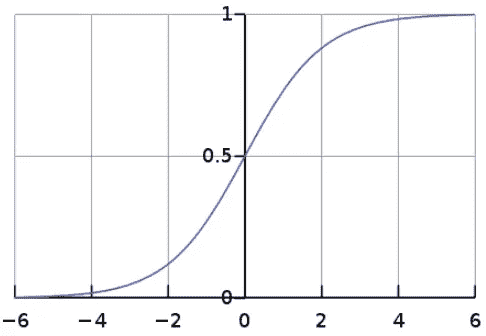

**Fig 4\. sigmoid function**

再比如， [**ReLU**](https://en.wikipedia.org/wiki/Rectifier_(neural_networks)) 激活函数取一个输入值，输出一个范围从 **0 到无穷大**的新值。当输入值稍大时，输出值线性增加。但是，当输入值稍小时，输出值很容易达到最大值 0。

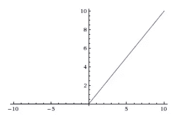

**Fig 5\. ReLU function**

现在，当您考虑图像数据时，所有值最初的范围是从 0 到 255。这听起来像是当它被传递给 [sigmoid](https://en.wikipedia.org/wiki/Sigmoid_function) 函数时，输出几乎总是 1，而当它被传递给 [ReLU](https://en.wikipedia.org/wiki/Rectifier_(neural_networks)) 函数时，输出可能非常巨大。当执行反向传播过程以优化网络时，这可能导致[爆炸/消失梯度问题](https://en.wikipedia.org/wiki/Vanishing_gradient_problem)。为了避免这个问题，最好让所有的值都在 0 和 1 之间。

## 独热编码

稍后，我将解释模型。目前，你需要知道的是模型的输出。它是基于模型预测结果的每类图像的一组概率。为了在代码中表示这些概率，需要一个具有与图像类别数量相同的元素数量的向量。例如，CIFAR-10 提供了 10 种不同的图像类别，因此您还需要一个大小为 10 的矢量。

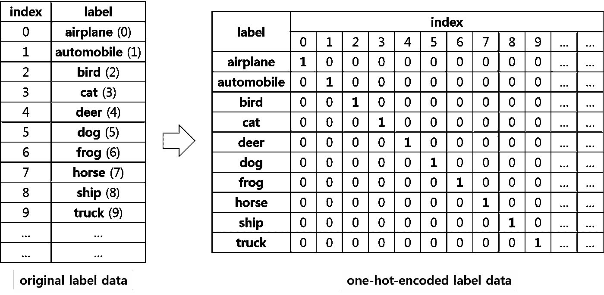

**Fig 6\. one-hot-encoding process**

此外，我们的模型应该能够比较预测与地面真相标签。这意味着标签数据的形状也应该转换成大小为 10 的向量。相反，因为 label 是基本事实，所以将值 1 设置为相应的元素。

`**one_hot_encode**`函数接受输入`**x**`，这是一个标签列表(基本事实)。列表中元素的总数是一个批次中样本的总数。`**one_hot_encode**`函数返回一个二维张量，其中行数是批量的大小，列数是图像类的数量。

**Code 5\. one hot encoding function**

## 预处理所有数据并保存

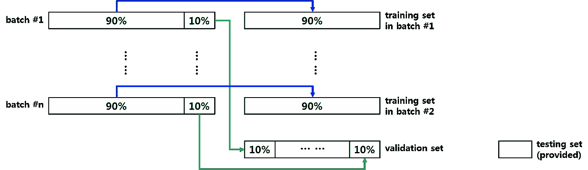

**Fig 7\. train/valid/test set**

下面的代码 6 使用之前实现的函数`**normalize**`和`**one-hot-encode**`来预处理给定的数据集。如图 7 所示，来自每个批次的 10%的数据将被合并以形成验证数据集。其余 90%的数据用作训练数据集。最后，有测试数据集已经提供。下面的代码单元将预处理所有的 CIFAR-10 数据，并将其保存到外部文件中。

**Code 6\. preprocessing**

# 张量流基础

在开始构建网络和训练过程之前，提醒自己 TensorFlow 是如何工作的以及有哪些包是很好的。

## TensorFlow 软件包

TensorFlow 附带一堆包。您甚至可以找到具有类似功能的模块。例如，tf.nn.conv2d 和 tf.layers.conv2d 都是二维卷积运算。以下是每个包的类别的用途。

`**tf.nn**` **:神经网络的低层 APIs】**

*   这个包中的每个 API 都有其唯一的用途
*   例如，为了在 conv2d 之后应用激活函数，您需要两个单独的 API 调用
*   你可能需要自己手动设置很多设置

`**tf.layers**` **:神经网络的高级 API**

*   这个包下的每个 API 可能都有简化的过程
*   例如，为了在 conv2d 之后应用激活函数，您不需要两次单独的 API 调用。此程序包下的 Intead，conv2d API 具有激活参数
*   这个包中的每个 API 在参数中都有很多默认设置

`**tf.contrib**` **:包含易变的或者实验性的 API**

*   就像文档解释的那样，这个包提供了实验代码
*   您可能会找到更方便的 API
*   当你在主包下找不到功能的时候，你可以去看看这个包
*   它意味着包含最终应该合并到核心 TensorFlow 中的特性和贡献，但是您可以将它们想象为正在构建中

我将在每个不同的包下使用 API，这样我可以熟悉不同的 API 用法。

## 张量流工作流

根据官方文档， **TensorFlow** 使用一个**数据流图**来根据各个操作之间的依赖关系来表示您的计算。这导致了一个低级编程模型，其中您首先**定义数据流图**，然后创建一个 TensorFlow **会话来跨一组本地和远程设备运行图**的一部分。

**数据流**是**并行计算**的通用编程模型。在数据流图中，节点代表计算单元，边代表计算消耗或产生的数据。例如，在 TensorFlow 图中，tf.matmul 操作将对应于具有两条传入边(要相乘的矩阵)和一条传出边(相乘的结果)的单个节点。

大多数 **TensorFlow** 程序**从数据流图构建阶段**开始。在这个阶段，您调用 TensorFlow API 函数来构造新的 tf。操作(节点)和 tf。张量(边缘)对象，并将它们添加到一个`**tf.Graph**`实例中。 **TensorFlow 提供了一个默认图**，它是同一上下文中所有 API 函数的一个**隐式参数。**

`**tf.Session.run**` **方法**是**运行** `**tf.Operation**` **或评估** `**tf.Tensor**`的主要机制。您可以将一个或多个`**tf.Operation**`或`**tf.Tensor**`对象传递给`**tf.Session.run**`，TensorFlow 将执行计算结果所需的操作。

**Fig 9\. TensorFlow dataflow graph**

# 建立网络

下面的图 8 简单地显示了模型将会是什么样子。

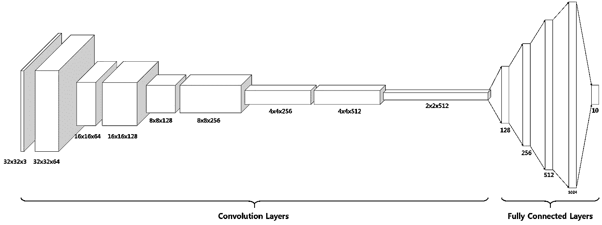

**Fig 8\. classification model**

## 为模型准备输入

为了训练模型，至少应该提供两种数据。应该将图像数据输入到模型中，以便模型可以学习并输出其预测。应该在模型的末尾提供标签数据，以便与预测输出进行比较。要提供的值有很多，但我只打算再包括一个。`**keep_prob**`是单个数字在什么概率下每层应该保留多少个单元。这就是所谓的[辍学技术](https://medium.com/@amarbudhiraja/https-medium-com-amarbudhiraja-learning-less-to-learn-better-dropout-in-deep-machine-learning-74334da4bfc5)。

无论**进给数据**应该放在模式的前面、中间还是最后，这些**进给数据**都称为**输入**。

**Code 7\. input tensors**

TensorFlow 中的`[**tf.placeholer**](https://www.tensorflow.org/api_docs/python/tf/placeholder)`创建一个**输入。**每个**输入**需要指定期望的数据类型及其维度形状。形状中无表示长度未定义，可以是任何长度。

## 创建模型

整个模型总共由 14 层组成。除了下面列出的层什么技术适用于建立模型。

1.  **与 64 个大小为(3x3)的不同滤波器卷积**
2.  **最大 2 池**
    - ReLU 激活功能
    -批量正常化
3.  **与 128 个大小为(3×3)的不同滤波器卷积**
4.  **最大池乘 2**
    - ReLU 激活功能
    -批量正常化
5.  **与 256 个大小为(3×3)的不同滤波器卷积**
6.  **最大 2 池**
    - ReLU 激活功能
    -批量正常化
7.  **与大小为(3x3)的 512 个不同滤波器卷积**
8.  **最大 2 池**
    - ReLU 激活功能
    -批量正常化
9.  **展平最后一次卷积操作的三维输出。**
10.  **全连通 128 层**
    -脱扣
    -批量正常化
11.  **256 单元全连接层**
    -脱扣
    -批量正常化
12.  **全连接 512 层**
    -漏接
    -批量归一化
13.  **1024 单元全连通层**
    -漏接
    -批量归一化
14.  **具有 10 个单元(图像类别数)的全连接层**

下图 9 描述了当您使用**【通道 x 宽度 x 高度】**张量格式时，概念卷积操作与 TensorFlow 实现的不同之处。

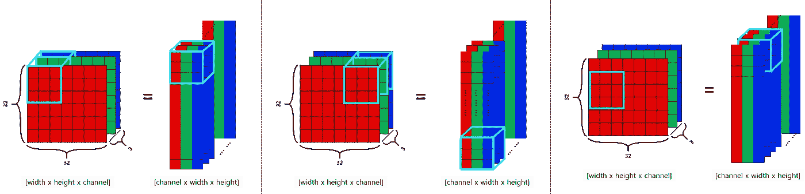

**Fig 9\. convolving operation in tensorflow with [NCWH] form of input**

下面的代码 8 展示了如何在 TensorFlow 中构建模型。我们先来看看卷积层。可以使用`[**tf.nn.conv2d**](https://www.tensorflow.org/api_docs/python/tf/nn/conv2d)`或`[**tf.layers.conv2d**](https://www.tensorflow.org/api_docs/python/tf/nn/conv2d)`创建卷积层。后一种更方便，因为它有更多可选参数。前一种选择创建了最基本的卷积层，您可能需要在`**tf.nn.conv2d**`之前或之后添加更多卷积层。比如激活函数可以在`**tf.layers.conv2d**`中直接指定为参数，但是在使用`**tf.nn.conv2d**`的时候要手动添加。

构建卷积层时，有三点需要考虑。这就是步幅、填充和过滤器。步长决定了滤波器的窗口在每个卷积步骤中应该移动多少，它是一个长度为 4 的一维张量。但是，从技术上来说，官方文件说*'必须有步幅[0] =步幅[3] = 1'* 。所以你只能控制步幅[1]和步幅[2]的值，但是把它们设置成相等的值是不是很常见。[1，1，1，1]和[1，2，2，1]是最常见的用例。我将使用[1，1，1，1],因为我想逐个像素地进行卷积。

当一个完整的卷积操作完成后，图像的输出尺寸变得小于输入尺寸。但是，您可以通过在图像周围应用额外的 0 值像素来强制保持不变。当填充设置为“相同”时，图像的输出大小将保持与输入图像相同。另一方面，当填充被设置为“有效”时，它会更小。我将使用“相同的”填充样式，因为它更容易管理每个卷积层中图像的大小。

可以用`[**tf.Variable**](https://www.tensorflow.org/api_docs/python/tf/Variable)`定义过滤器，因为它只是一堆权重值，并且随着时间的推移在训练网络时会发生变化。过滤器应该是形状为[过滤器 _ 高度，过滤器 _ 宽度，入口 _ 通道，出口 _ 通道]的 4-D 张量。in_channels 表示当前卷积运算所应用的通道数，out_channels 表示当前卷积运算将要产生的通道数。

**Code 8\. CNN model**

如前所述，`[**tf.nn.conv2d**](https://www.tensorflow.org/api_docs/python/tf/nn/conv2d)`没有将激活函数作为参数的选项(而`[**tf.layers.conv2d**](https://www.tensorflow.org/api_docs/python/tf/nn/conv2d)`有)，`[**tf.nn.relu**](https://www.tensorflow.org/api_docs/python/tf/nn/relu)`被明确地添加在`**tf.nn.conv2d**`操作之后。然后通过使用`[**tf.nn.max_pool**](https://www.tensorflow.org/api_docs/python/tf/nn/max_pool)`功能应用最大池化。max pooling 操作可以被视为一种特殊的 conv2d 操作，只是它没有权重。目的是通过保留最强的值来缩小图像。ksize=[1，2，2，1]和 stamps =[1，2，2，1]表示将图像缩小一半。

`[**tf.contrib.layers.flatten**](https://www.tensorflow.org/api_docs/python/tf/contrib/layers/flatten)`、`[**tf.contrib.layers.fully_connected**](https://www.tensorflow.org/api_docs/python/tf/contrib/layers/fully_connected)`、`[**tf.nn.dropout**](https://www.tensorflow.org/api_docs/python/tf/nn/dropout)`功能直观易懂，使用非常方便。只有一件重要的事情要记住，你不要在完全连接的层列表的末尾指定激活函数。这将在稍后定义成本函数时指定。

## 超参数

超参数是通过十几次实验选择的。需要注意的一点是，必须在定义优化器之前定义 learning_rate，因为这是您需要将 learning rate 作为构造函数参数的地方。

**Code 9\. hyper parameters**

## 成本函数和优化器

最后，您将定义成本、优化器和准确性。`[**tf.reduce_mean**](https://www.tensorflow.org/api_docs/python/tf/reduce_mean)`取一个输入张量进行约简，输入张量是预测结果和地面事实之间某些损失函数的结果。因为 CIFAR-10 必须测量 10 个等级的损耗，所以使用了`[**tf.nn.softmax_cross_entropy_with_logis**](https://www.tensorflow.org/api_docs/python/tf/nn/softmax_cross_entropy_with_logits)`函数。在训练网络时，您想要的是通过应用您选择的算法来最小化成本。可能是 [SGD](https://www.tensorflow.org/api_docs/python/tf/train/GradientDescentOptimizer) ， [AdamOptimizer](https://www.tensorflow.org/api_docs/python/tf/train/AdamOptimizer) ，[adagradmoptimizer](https://www.tensorflow.org/api_docs/python/tf/train/AdagradOptimizer)之类的。你必须研究每种算法是如何工作的，以选择使用什么，但是 AdamOptimizer 通常适用于大多数情况。

**Code 10\. cost function & optimizer & accuracy**

# 训练神经网络

您已经定义了成本、优化器和准确性，它们实际上是什么..

*   **成本
    -** reduce_mean = >约化后的**张量**
*   **优化器
    -** AdamOptimizer = >应用指定渐变的**操作**。
*   **精度
    -** 化简 _ 均值= >化简**张量**

tf。官方文档中的 Session.run 方法解释了它运行 TensorFlow 计算的一个“步骤”,通过运行必要的图形片段来执行每个操作，并在获取中评估每个张量，用`**feed_dict**`中的值替换相应的输入值。获取参数可以是单个图形元素，或者任意嵌套的列表、元组等。

这里真正的图元是`**tf.Tensor**`或`**tf.Operation**`。成本、优化和准确性就是其中之一。这意味着它们可以被指定为提取参数的一部分。然后，你可以在这个过程中加入一些变量。这是张量流的一个便利特性。一旦构建了图表，您需要做的就是将数据输入图表并指定要检索的结果。

## 单一优化

`**train_neural_network**`函数对给定的一批数据运行优化任务。它将在一个循环中使用，并在以后的多个时期和批次中使用。简单来说，`**session.run**`照顾工作。它将第一个参数作为要运行的内容，将第二个参数作为数据列表提供给网络，以便从第一个参数中检索结果。如前所述，您希望通过运行 optimizer 来最小化成本，因此这必须是第一个参数。

**Code 11\. single optimization task**

## 显示统计数据

`**print_stats**`显示当前训练步骤的成本和准确性。与`**train_neural_network**`功能类似的过程也适用于此。不是将优化器交付给`**session.run**`函数，而是给出成本和精度。请注意`**keep_prob**`被设置为 1。辍学率必须适用于培训阶段，否则必须根据论文设置为 1。

**Code 12\. showing stats**

## 分批训练模型

`**train_neural_network**`函数在给定批次上运行优化任务。因为 CIFAR-10 数据集有 5 个单独的批次，并且每个批次包含不同的图像数据，所以应该对每个批次运行 train_neural_network。这可以用简单的代码来完成，如代码 13 所示。代码 13 为每个批次运行 10 个时期的训练，图 10 显示了训练结果。

**Code 13\. train over batches**

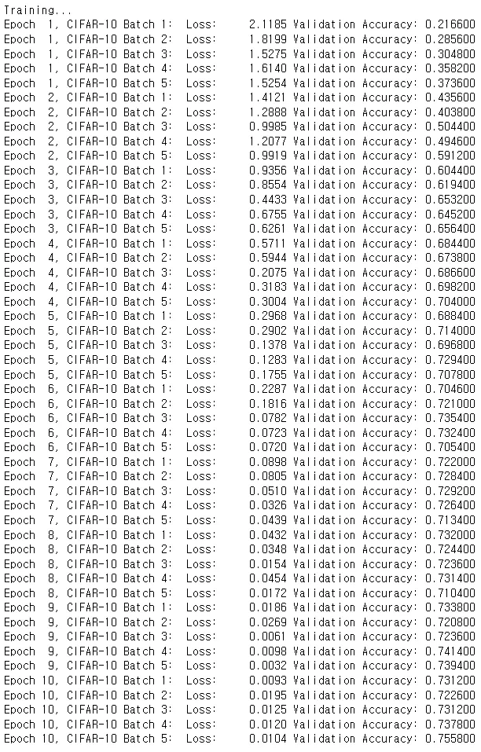

**Fig 10\. loss and accuracy**

# 测试模型

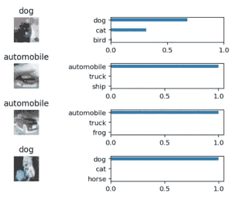

**Fig 11\. prediction result**

# 参考

*   CIFAR-10/CIFAR-100 数据
*   [蟒蛇泡菜](https://docs.python.org/3/library/pickle.html)
*   [数字整形](https://docs.scipy.org/doc/numpy/reference/generated/numpy.reshape.html)
*   [numpy 转置](https://docs.scipy.org/doc/numpy/reference/generated/numpy.transpose.html)
*   [numpy 转置轴说明列表](https://stackoverflow.com/questions/32034237/how-does-numpys-transpose-method-permute-the-axes-of-an-array)
*   [张量流 conv2d](https://www.tensorflow.org/api_docs/python/tf/nn/conv2d)
*   [行主要订单解释](https://en.wikipedia.org/wiki/Row-_and_column-major_order)
*   [最小-最大归一化](https://www.quora.com/What-is-the-meaning-of-min-max-normalization)
*   [观看“为什么要标准化输入”/ deeplearning.ai —吴恩达。](https://www.youtube.com/watch?v=FDCfw-YqWTE)
*   [爆炸，虚化梯度下降/深度学习. ai——吴恩达。](https://www.youtube.com/watch?v=qhXZsFVxGKo)
*   [一个热编码](https://www.quora.com/What-is-one-hot-encoding-and-when-is-it-used-in-data-science)
*   [张量流架构](https://www.tensorflow.org/extend/architecture)
*   [张量流图和时段](https://www.tensorflow.org/versions/r1.3/programmers_guide/graphs)
*   [张量流数据类型](https://www.tensorflow.org/api_docs/python/tf/DType)
*   [Tensorflow 占位符](https://www.tensorflow.org/api_docs/python/tf/placeholder)
*   [张量流变量](https://www.tensorflow.org/api_docs/python/tf/Variable)
*   【tf.nn 下的 Tensorflow Conv2D】
*   【tf.nn 下的 tensor flow ReLU
*   【tf.nn 下的 tensor flow Max Pooling
*   【tf.nn 下的张量流丢失
*   【tf.layers 下的张量流批量归一化
*   [张量流在 tf.contrib 下展平](https://www.tensorflow.org/api_docs/python/tf/contrib/layers/flatten)
*   [张量流在 tf.contrib 下全连接](https://www.tensorflow.org/api_docs/python/tf/contrib/layers/fully_connected)
*   [批量归一化(原纸)](https://arxiv.org/abs/1502.03167)
*   [批量定额为什么行得通？/ deeplearning.ai —吴恩达。](https://www.youtube.com/watch?v=NbGUU6ZYtus)
*   [退学(原论文)](https://www.cs.toronto.edu/~hinton/absps/JMLRdropout.pdf)
*   [了解辍学/deep learning . ai——吴恩达。](https://www.youtube.com/watch?v=ARq74QuavAo)
*   [(深度)机器学习中的辍学](https://medium.com/@amarbudhiraja/https-medium-com-amarbudhiraja-learning-less-to-learn-better-dropout-in-deep-machine-learning-74334da4bfc5)
*   [卷积神经网络中的展平步骤是什么意思？](https://www.quora.com/What-is-the-meaning-of-flattening-step-in-a-convolutional-neural-network)
*   [卷积神经网络(CNN/conv nets)—cs 231n](http://cs231n.github.io/convolutional-networks/)
*   [可视化和理解卷积网络](https://cs.nyu.edu/~fergus/papers/zeilerECCV2014.pdf)
*   [评估 CNN design choices 在 ImageNet-2012 上的表现](https://github.com/ducha-aiki/caffenet-benchmark)
*   [Tensorflow Softmax 与 Logits 的交叉熵](https://www.tensorflow.org/api_docs/python/tf/nn/softmax_cross_entropy_with_logits_v2)
*   [张量流减少平均](https://www.tensorflow.org/api_docs/python/tf/reduce_mean)
*   [张量流优化器](https://www.tensorflow.org/api_guides/python/train)
*   [张量流等于](https://www.tensorflow.org/api_docs/python/tf/equal)
*   [张量流投射](https://www.tensorflow.org/api_docs/python/tf/cast)
*   [梯度下降优化算法概述](http://ruder.io/optimizing-gradient-descent/)
*   [深度模型训练优化](http://www.deeplearningbook.org/contents/optimization.html)
*   [Tensorflow 会话运行功能](https://www.tensorflow.org/api_docs/python/tf/Session#run)
*   [张量流 tf.reduce_mean](https://www.tensorflow.org/api_docs/python/tf/reduce_mean)
*   [tensor flow TF . train . adamotimizer](https://www.tensorflow.org/api_docs/python/tf/train/AdamOptimizer)
*   [分类数据集结果—远高于 70%](http://rodrigob.github.io/are_we_there_yet/build/classification_datasets_results.html#43494641522d3130)