# 花旗自行车 2017 年分析

> 原文：<https://towardsdatascience.com/citi-bike-2017-analysis-efd298e6c22c?source=collection_archive---------5----------------------->

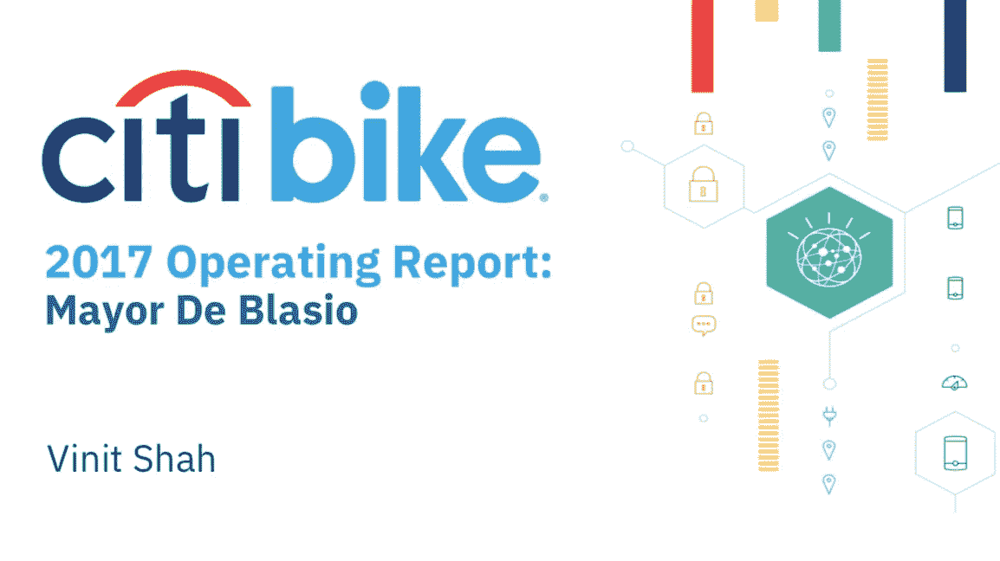

> 此分析的目标是创建 2017 年花旗自行车的运营报告。以下工作在不到五个工作日内完成。在每张图片下，我都加入了自己的想法，如果没有时间限制，我会考虑哪些内容。花旗自行车的分析是基于如下所示的模拟案例:

**概述:**您的客户，纽约市市长，需要更好地了解花旗自行车骑行的情况。他想要一份 2017 年的运营报告，在周末之前放在他的办公桌上。根据之前的约定，我们知道市长非常喜欢在图表中可视化数据。具体来说，市长希望看到各种数据可视化，以了解

*   开始次数最多的前 5 个电台(显示开始次数)
*   按用户类型划分的行程持续时间
*   基于始发站和停靠站的最受欢迎的行程)
*   基于平均行程距离(站到站)、中间速度(行程持续时间/行驶距离)的按性别和年龄划分的骑手表现
*   2017 年纽约最忙的自行车是什么？用了多少次？使用了多少分钟？

此外，市长有一个想法，他想推销给花旗自行车，并需要您的帮助来证明其可行性。他希望花旗自行车能给他们的自助服务终端增加一项新功能:“输入一个目的地，我们会告诉你行程需要多长时间”。我们需要你建立一个模型，在给定起点和目的地的情况下，预测一次旅行需要多长时间。

**客户:**比尔·白思豪纽约市市长
**目标:**通过创建 2017 年运营报告，帮助市长更好地了解花旗自行车骑行情况(仅限纽约市)。

**提问:**

1.  开始次数最多的前 5 个电台(显示开始次数)
2.  按用户类型划分的行程持续时间
3.  最受欢迎的行程(基于始发站和停靠站)
4.  基于平均值按性别和年龄划分的骑手表现。行程距离(站与站之间)、中间速度(行程持续时间/行驶距离)
5.  2017 年纽约最忙的自行车是什么？用了多少次？使用了多少分钟？
6.  一个模型，可以预测一次旅行需要多长时间，给定一个起点和目的地(不要使用谷歌地图 API)。

数据来源于花旗自行车的亚马逊服务器，可以在这里[访问](https://s3.amazonaws.com/tripdata/index.html)。本文使用的代码可以在[这里](https://github.com/vinit28/CitibikeAnalysis)找到。*

首先，让我们最小化来自服务器的数据集中的工作和负载。很明显，这些文件非常大，每个都有几百兆字节。

```
!curl -O "[https://s3.amazonaws.com/tripdata/2017[01-12]-citibike-tripdata.csv.zip](https://s3.amazonaws.com/tripdata/2017[01-12]-citibike-tripdata.csv.zip)"
!unzip '*.zip'
!rm *.zip
files = !ls *.csv #For Ipython only
df = concat([read_csv(f, header=None,low_memory=False) for f in files], keys=files) 
```

列名中有空格，出于工作目的，最好将其删除。如果我在一个团队或者一个长期项目中工作，我会稍微不同地配置列名，使它们更容易使用。然而，为了本文的目的，我保持了简单易懂的名称。

数据集非常庞大，大约有 1600 万行。大数据工具会有所帮助，但是，大多数需要您付费或拥有企业许可证或有限试用。此外，数据非常脏。不同的文件有不同的列名，需要考虑这一点。白思豪市长没有技术背景。这里的图表尽可能简单但信息丰富。我本可以做出更复杂的情节，但是，对市长来说，这些情节不会提供太多信息。这些图表是为用户设计的。

最后，我的分析尽量遵循下面概述的 crisp-dm 方法。

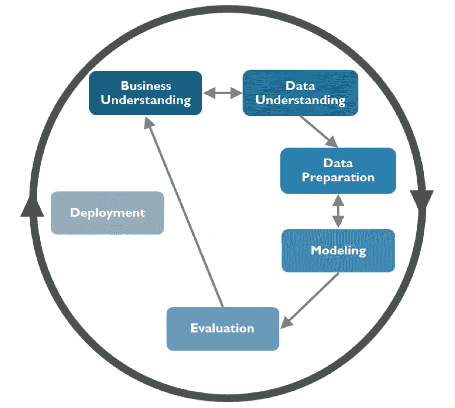

*Taken from SafariBooksOnline.com*

让我们来理解我们正在处理的数据，并简要概述每个特性代表或应该代表什么。

```
1\. Trip Duration (seconds) — How long a trip lasted
2\. Start Time and Date - Self explanatory
3\. Stop Time and Date - Self explanatory
4\. Start Station Name - Self explanatory
5\. End Station Name - Self explanatory
6\. Station ID - Unique identifier for each station
7\. Station Lat/Long - Coordinates
8\. Bike ID - unique identifier for each bike
9\. User Type (Customer = 24-hour pass or 3-day pass user;  Subscriber = Annual Member) - Customers are usually tourists, subscribers are usually NYC residents
10\. Gender (Zero=unknown; 1=male; 2=female) - Usually unknown for customers since they often sign up at a kiosk
11\. Year of Birth - Self entered, not validated by an ID.
```

# 第 1 部分:排名前五的电台

让我们检查一下在创建图表之前是否有任何干扰或需要清理的地方。

1.  有缺少的值吗？

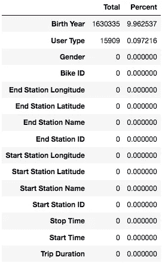

*   大多是出生年份
*   用户类型很少。
*   花旗自行车客户(一日通票或三日通票)通常是游客，可能不会匆忙或因其他原因填写出生年份
*   花旗自行车的用户往往是纽约市的居民，通过盲目删除缺少值的行，我们将丢失关键信息，并可能引入偏见。

2.让我们了解一下我们正在处理的数据:

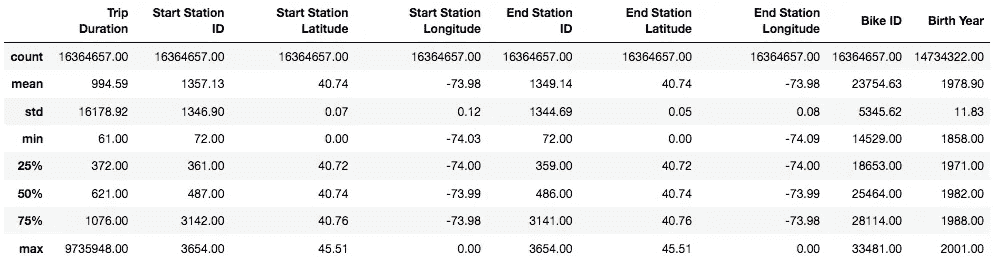

3.花旗自行车骑手经常会碰到坏掉的自行车。作为用户，我对这种困境相当熟悉。让我们删除任何行程持续时间少于 90 秒的行程**和**起点站==终点站。90 秒是一个任意的选择，基于骑车人意识到自行车工作不正常并回到车站归还自行车并换上新自行车所需的时间。另一个可以使用的度量是 372 秒(25%四分位数)。这是基于这样一个假设，如果某人正在进行一次往返旅行，它最有可能是执行一些快速的任务，这些任务离得不够近，不能步行到达，因此这次旅行应该至少比最短的旅行稍微长一点。如果是短途旅行，让我们添加额外的**和**条件，以确保起点和终点站名相同。

4.诸如盗窃和破损码头之类的异常情况对这个指标来说不重要，可以在以后处理。

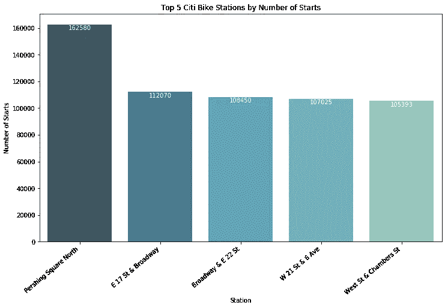

Considered a pie chart for this, however, these stations make up less than 5% of the total starts in this dataset

**下一步和业务用例:**在地图上可视化这些车站，看看它们彼此之间有多近，会很有趣。这可用于确定哪些区域需要额外的加油站或自行车。

# 第 2 部分:按用户类型划分的行程持续时间

就如何处理异常而言，这个问题有点不清楚，所以我将制作两个图表。一个有异常，一个没有。

*用户类型的数据集中有 NA 值，如上面缺失的表格图所示。因为它只占数据的 0.09%，所以可以安全地删除它。*

**根据花旗自行车的网站:**年度会员每次骑行的前 45 分钟包括在内，日卡用户每次骑行的前 30 分钟包括在内。如果你想把自行车放在外面更久，每多 15 分钟只需额外支付 4 美元。

可以肯定的是，没有人(或很少人)愿意租一辆超过 2 小时的自行车，尤其是一辆笨重的 citibike。如果他们这样做了，假设他们是年度用户，他们将额外花费 20 美元。对于他们来说，如果他们想锻炼身体，买辆自行车会更经济；如果他们想骑自行车游览和探索这座城市，他们可以在中央公园骑辆自行车。可能有一个更好的方法来选择一个最佳的截止日期，但是，时间是客户项目的关键。或者只是接受治疗，再买一辆自行车。自行车的实际成本是 24 小时累计的。

**异常**:任何超过 2 小时(7200 秒)的行程都可能表明自行车被盗、异常或自行车停靠不正确。作为一名狂热的花旗自行车用户，我亲身体会到一个人骑自行车超过一个小时是没有任何意义的！不过，我加了一个小时的缓冲以防万一。没有骑手会计划超过允许的最长 45 分钟。然而，为了建模的目的，我计划在将来把这个时间减少到一个小时。

1.  *前半段——数据集中出现异常*

*   每种用户类型的平均行程持续时间条形图。这是有帮助的，但最好是看到一个盒子情节或小提琴情节。在几分钟内会更容易解释。

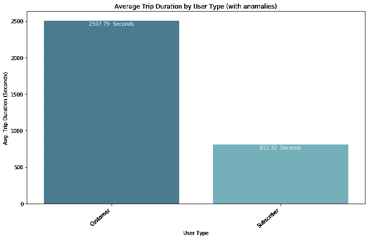

*   第二张图是一个基本的小提琴图，包括了一些异常现象。正如我们所见，噪声太大，这是没有用的。最好不要出现异常情况。

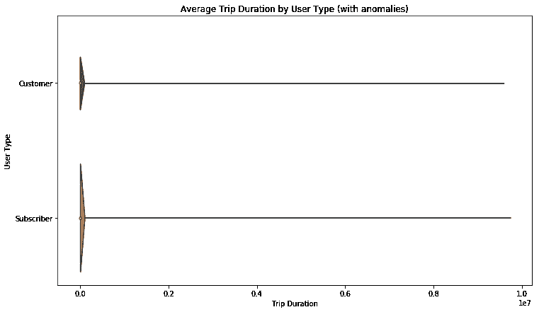

*2。后半部分—数据集中无异常*

*   基于用户类型的行程持续时间的信息量更大的图表，异常情况如上所述。“传单”已从下图中移除。

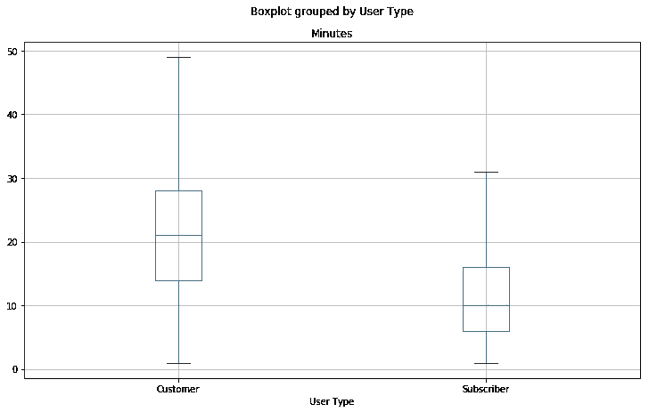

Note: User Type will most likely be a strong predictor of trip duration

*   基于用户类型突出显示每次旅行平均持续时间的条形图

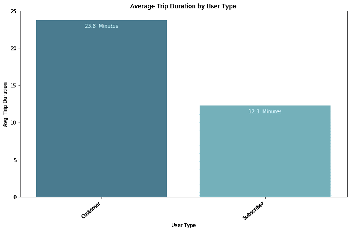

可以肯定地说，用户类型将是旅行持续时间的一个强有力的预测因素。这是目前需要注意的一点，我们可以稍后再回到这一点。

**后续步骤&业务用例:**客户每辆自行车允许 30 分钟，而用户每辆自行车允许 45 分钟。数据清楚地表明，消费者倾向于使用自行车的时间更长。如果主要关注的是在码头有自行车可用，那么目前的时间限制是有意义的。然而，如果花旗自行车希望以用户为中心，让客户每辆自行车有更多的时间是值得探索的。

# 第三部分:最受欢迎的旅行

要获得最受欢迎的旅行，最方便的方法是使用 pandas 中的 groupby 功能。它类似于数据透视表。

```
trips_df = df.groupby([‘Start Station Name’,’End Station Name’]).size().reset_index(name = ‘Number of Trips’)
```

groupby 功能使识别最受欢迎的旅行变得极其容易和方便。

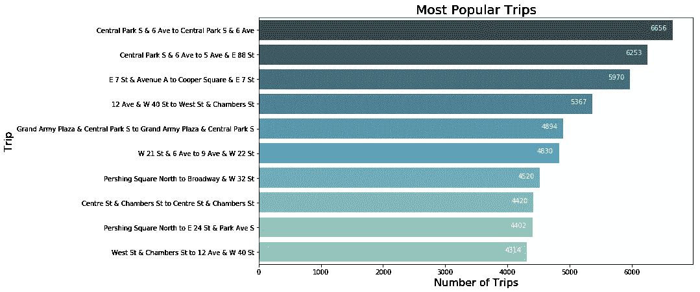

**下一步&业务用例:**在地图上看到这一点会很有意思，看看骑手是从北到南、从东到西等等。此外，根据一天中的时间来查看最受欢迎的旅行也不错。这可以帮助 Citi Bike 根据一天中的时间来确定在哪里存放自行车以及在哪里有码头。假设骑车人早上朝一个方向去上班，晚上朝相反的方向回家。

# 第 4 部分:按性别和年龄划分的骑手表现

**提问:**根据平均行程距离(站与站之间)、中间速度(行程持续时间/行驶距离)按性别和年龄划分的骑手表现

让我们确保我们在这里处理的数据是干净的。

1.  缺少性别和出生年份值？—检查上面的缺失表

*   性别不行。出生年份是
*   约 10%的人缺少出生年份。不是一大块数据。可以估算缺失值或删除它。由于它不到数据的 10%，可以安全地假设其余的 90%是数据的代表性样本，我们可以根据性别和起始站 ID 用中值替换出生年份。我选择这种方法是因为大多数同龄的人住在相似的社区(例如:年轻人住在东村，老年人住在上东区，等等。).这将在异常被消除和速度被计算之后进行。可能有更好的方法来估算这些数据，请在下面的评论部分分享你的想法。

```
df['Birth Year'] = df.groupby(['Gender','Start Station ID'])['Birth Year'].transform(lambda x: x.fillna(x.median()))
```

2.有异常吗？

*   至于出生年份，有些人出生在 1960 年之前。我可以相信一些 60 岁的老人可以骑自行车，这是一个延伸，然而，任何人“出生”之前骑花旗自行车是一个异常和虚假的数据。可能会有一些老年人骑自行车，但可能性不大。
*   我的方法是找出低于平均值的 2 岁标准差。计算出这个数字后，mean - 2stdev，我去掉了数据的尾端，1956 年之前的出生年份。

```
df = df.drop(df.index[(df['Birth Year'] < df['Birth Year'].mean()-(2*df['Birth Year'].std()))])
```

3.计算年龄栏，使视觉效果更容易理解:

```
df['Age'] = 2018 - df['Birth Year'];
df['Age'] = df['Age'].astype(int);
```

4.计算行程距离(英里)

*   没有可靠的方法来计算自行车路线，因为没有每辆自行车的 GPS 数据，我们无法知道骑车人走了什么路线。
*   可以使用谷歌地图，并使用纬度，长坐标找到自行车路线的距离。然而，这将需要超过 API 调用的每日限制。使用 geopy.distance 包，该包使用 Vincenty 距离，使用更精确的椭球体模型。这比哈弗辛公式更准确，但对我们的目的来说并不重要，因为地球的曲率对纽约市自行车出行的距离影响可以忽略不计。
*   将来，对于这种规模的数据集，如果速度更快，我会考虑使用哈弗辛公式来计算距离。下面的代码在这样大小的数据集上运行时间太长。

```
dist = []
for i in range(len(df)):
    dist.append(geopy.distance.vincenty(df.iloc[i]['Start Coordinates'],df.iloc[i]['End Coordinates']).miles)
    if (i%1000000==0):
        print(i)
```

5.计算速度(分钟/英里)和(英里/小时)

*   (分钟/英里):可以像短跑时间(这个人跑多快)一样使用

```
df['min_mile'] = round(df['Minutes']/df['Distance'], 2)
```

*   (英里/小时):常规方法。英里/小时是一个容易理解的度量单位，也是大多数人习惯看到的单位。因此视觉将基于这种理解而产生。

```
df['mile_hour'] = round(df['Distance']/(df['Minutes']/60),2)
```

6.处理“循环”旅行

*   循环旅行是在同一个车站开始和结束的旅行。这些行程的距离将为 0，然而，事实并非如此。这些点会扭曲数据和视觉效果。将删除它们以解决此问题。
*   对于模型来说，这个数据也是无关紧要的。因为如果有人要进行一次循环旅行，唯一知道旅行要花多长时间的人是骑手，假设她/他知道。因此，为模型删除这些数据是安全的。

```
df = df.drop(df.index[(df['Distance'] == 0)])
```

7.我们有一些起始坐标为(0.0，0.0)。这些旅行是为了修理或其他目的而被带走的。这些应该被放弃。如果保持的话，这些行程的距离是 5389 英里。由于这个原因，我放弃了任何距离大得惊人的点。此外，我们还缺少一些值。因为它是很小的一部分，所以让我们根据性别和起始位置来替换丢失的值。

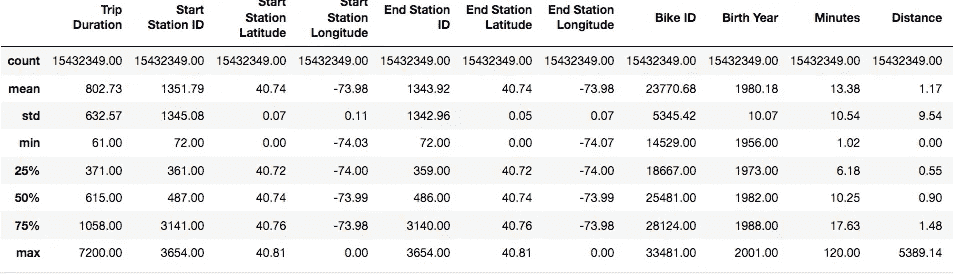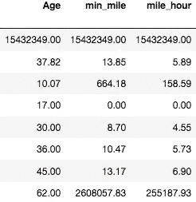

Apologies for separate images

*   在一些行程中，骑车人的速度超过每小时 200 英里。这可能是由于用于距离计算的公式或一些其他错误。有记录以来，世界上在平坦路面上骑自行车最快的人达到了每小时 82 英里。可以肯定的是，花旗的自行车手没有一个能达到这个速度。由于这一点以及骑自行车者平均速度为 10 英里/小时的事实，我决定删除所有以英里/小时为单位的速度大于 20 英里/小时且小于平均值 2 标准偏差的数据，因为这可能是骑自行车者发现码头已满并使用另一个码头代替的往返。

8.数据清理后按年龄和性别划分的骑手表现(英里/小时)

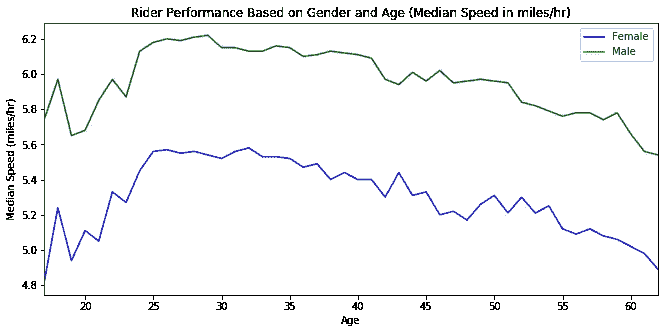

There’s a bit of a difference in speed, however, it doesn’t seem drastic enough to have a major impact. Surprising thing is that age doesn’t have a strong impact on speed either.

9.按年龄和性别划分的骑手平均里程表现

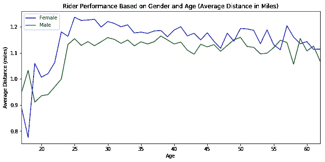

Barely a difference in distance travelled, age doesn’t seem to have an impact either except for folks aged 16–25

**下一步&业务用例:**值得探究基于性别和年龄的旅行次数。这有助于根据自行车使用情况创建不同的顾客购物篮。如果工作人员更频繁地使用花旗自行车，他们可能会被收取更高的费用。如果老年人使用花旗自行车，他们应该因为保持健康和活跃而受到奖励。这些信息可以传达给他们的保险公司，以奖励他们对健康的关注。

# 第 5 部分:按使用时间和分钟划分的最繁忙自行车

*提问:*

1.  2017 年纽约最忙的自行车是什么？
2.  用了多少次？
3.  使用了多少分钟？

*   最繁忙的自行车和计数可以通过 groupby 函数来识别。下面的功能还将识别自行车被使用的次数

```
bike_use_df = df.groupby(['Bike ID']).size().reset_index(name = 'Number of Times Used');
bike_use_df = bike_use_df.sort_values('Number of Times Used', ascending = False);
```

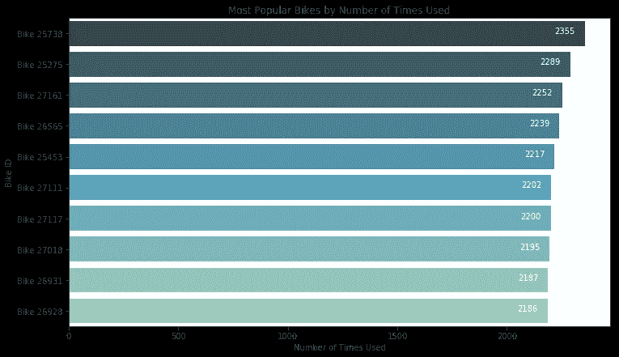

Most popular bike by number of times used: Bike 25738 (2355 times)

*   一个类似的 groupby 函数调用 sum on minutes，它可以识别自行车被使用的分钟数。

```
bike_min_df['Minutes Used'] = df.groupby('Bike ID')['Minutes'].sum()
bike_min_df = bike_min_df.sort_values('Minutes Used', ascending = False)
```

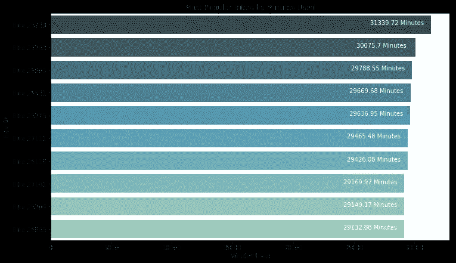

Most popular bike by number of minutes used: Bike 25738 (31,340 minutes)

**后续步骤&业务使用案例:**如果结合花旗自行车维护数据，这些信息可用于确定自行车何时需要维护和修理。这有助于减少坏自行车占用车站码头的问题，这是许多骑车人面临的问题。这些信息也可用于建立品牌和营销目的。拥有一辆“花旗年度自行车”会很不错，这是公开宣传的最常用的自行车，作为增加纽约市自行车使用的象征。

# 第 6.1 部分:预测模型—基线模型

提问:建立一个模型，在给定起点和目的地的情况下，该模型可以预测旅行需要多长时间。

***关于信息亭如何工作的假设:*** 让我们假设当用户输入起点和终点车站时，他们在输入起点和终点车站之前刷他们的密钥卡(如果他们是订户)并在信息亭上输入他们的信息(如果他们是“顾客”)。这意味着我们将知道他们的性别和年龄。因此，这些变量可用于建立模型。

第一步。

*   这个数据集非常庞大。差不多一千四百万行。在我们构建和评估模型时，让我们研究一个*随机*子样本。如果我试图在整个数据集上构建和评估一个模型，每次运行将花费我大约 10 多分钟，具体取决于模型。决定使用哪部分数据的一个好方法是使用学习曲线。然而，我的内核在试图创建学习曲线时不断崩溃。如果我们要处理多年的数据，我们需要重新考虑这种方法。然而，鉴于上述原因，让我们抽取 10%的数据。它仍然有大约 130 万行，应该是一个有代表性的样本，因为它是随机选择的。为了确保它是一个有代表性的样本，我们应该查看原始数据集和样本数据集的描述。最后，我们可以通过使上面的图像与随机样本相似来确保数据具有代表性。10%的数据通过了上述测试。
*   此外，花旗自行车旅行对订户的限制为 45 分钟，对客户的限制为 30 分钟(参见上文“根据花旗自行车网站”)。在这些各自的时间限制之后，骑手要付费。为了对我们的数据建模，包含持续时间超过规定的 45 分钟的行程是没有意义的。骑手不经常计划超过分配的时间，也没有明确的方法知道谁计划超过分配的时间。这是一个值得探讨的问题，然而，这些数据对于我们的模型来说是噪音。

```
df = df.drop(df.index[(df['Trip Duration'] > 2700)])
df_sample = df.sample(frac = 0.1, random_state = 0)
```

第二步。

*   让我们得到一个基线。如果我只是运行一个简单的多元线性回归，我的模型会是什么样的，它会有多精确？需要为多元回归准备数据

1.  删除不相关的列

*   旅行持续时间:我们有分钟列，这是目标变量
*   停止时间:在现实世界中，我们在预测行程持续时间时不会有这些信息。
*   起点桩号 ID:起点桩号名称捕获此信息
*   起点桩号纬度:起点桩号名称捕获此信息
*   起点桩号经度:起点桩号名称捕获此信息
*   起点坐标:起点桩号名称获取此信息
*   终点桩号 ID:终点桩号名称捕获此信息
*   终点桩号纬度:终点桩号名称捕获此信息
*   终点桩号经度:终点桩号名称捕获此信息
*   终点坐标:终点桩号名称获取此信息
*   自行车 Id:我们不知道用户最终会使用哪辆自行车
*   出生年份:年龄记录了这些信息
*   min_mile:当与距离结合时，实际上是与结束时间相同的信息。我们在现实世界中不会有这些信息。
*   mile_hour:当与距离结合时，实际上是与结束时间相同的信息。我们在现实世界中不会有这些信息。

```
(Speed * Distance = Trip Duration): Which is why speed is dropped
```

*   起点桩号名称和终点桩号名称:距离变量捕获相同的信息。对于该模型，如果用户输入起点和终点，我们可以构建一个简单的函数来计算距离，这将捕获相同的信息。有人可能会认为应该保留这些信息，因为这是将在信息亭提供的信息。然而，假设有超过 800 个站，如果我们保留这些信息，我们需要为任何回归算法对其进行编码。这将创建 800 个要素(约 1500 万行)，产生大量数据，但没有多少信息增益。
*   在上述清理之后，用于基线模型的最终预测因子是距离、用户类型和性别。从第四部分的图片中可以看出，年龄似乎没有影响。为了证实这一点，我运行了有年龄和无年龄的模型。年龄对模型几乎没有影响。

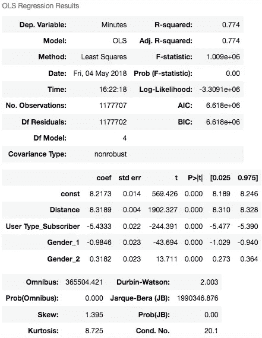

*   我选择进行线性回归。数据的规模和资源的限制使得运行更复杂的模型变得不那么有吸引力。集成算法已经过测试，但是运行时间太长。
*   这个模型对于一个 R 值为 0.774 的基线模型来说是相当好的。距离似乎对旅行持续时间有很大的影响，这是有道理的。

# 第 6.2 部分:预测模型—包括日期

*   进行改进的步骤:

1.按以下格式添加回溯时间

*   是在工作日还是周末乘车。工作日，大部分时间是上下班高峰期，可能是从家到单位。周末可能是一个更长，更休闲的旅程，并且有更高的可变性。
*   *中的乘车时间是上午、下午、晚上还是晚上。*准确的时间将基于基于一天中不同时间的旅行持续时间的差异。会在下面有图片。

2.现在是什么季节？

*   十二月—二月=冬天
*   三月—五月=春天
*   六月—八月=夏天
*   9 月—11 月=秋季

```
def get_date_info(df):
    df['d_week'] = df['Start Time'].dt.dayofweek
    df['m_yr'] = df['Start Time'].dt.month
    df['ToD'] = df['Start Time'].dt.hour df['d_week'] = (df['d_week']<5).astype(int) df['m_yr'] = df['m_yr'].replace(to_replace=[12,1,2], value = 0)
    df['m_yr'] = df['m_yr'].replace(to_replace=[3,4,5], value = 1)
    df['m_yr'] = df['m_yr'].replace(to_replace=[6,7,8], value = 2)
    df['m_yr'] = df['m_yr'].replace(to_replace=[9,10,11], value = 3)

    df['ToD'] = pd.cut(df['ToD'], bins=[-1, 5, 9, 14, 20, 25], labels=['Night','Morning','Afternoon','Evening','Night1'])
    df['ToD'] = df['ToD'].replace(to_replace='Night1', value = 'Night')
    df['ToD'] = df['ToD'].cat.remove_unused_categories()

    df['m_yr'] = df['m_yr'].astype('category')
    df['d_week'] = df['d_week'].astype('category')return(df)
```

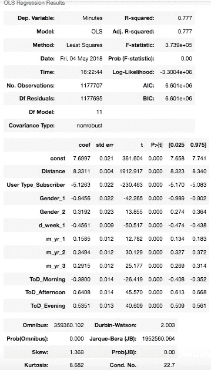

*   模型 1:R 中可忽略的改进:77.7%(取决于所使用的 random_state)
*   安全地假设我们可以放弃这些变量，因为它们没有重大影响。
*   有点令人惊讶的是，工作日变量几乎没有影响，因为人们最有可能在周末骑自行车休闲，而不是工作。这可以通过获得骑手的分类来解释。可能很多花旗单车用户都是大学生。
*   另一种可能性是，该特征的效果被这样的事实所扭曲，即在该数据集中既有客户又有订户，并且该特征对两个变量的效果是不同的。然而，现在还没有明确的解释。值得考虑为订阅者和客户建立一个单独的模型，因为他们的行为如第 2 部分所示有很大的不同。

# 第 6.3 部分:预测模型—改进模型 1

*   下一步将根据性别和行程考虑速度和距离。由于无法对始发站和终点站进行编码(由于点的数量太多)，我们正在丢失旅程本身的关键信息。我们需要另一种方法来替代这些措施。
*   我可以做的另一个改变是将 age 放入桶中。然而，数据表明年龄对旅行持续时间没有相关性或影响。这是反直觉的，然而，我没有很好的理由来反驳这些数据。

1.  包括基于行程(起点站+终点站)和用户类型的平均速度。

*   旅行原因:有些旅行是上山，有些是下山。根据直觉，有些路线，比如穿过时代广场的路线，交通会很拥挤。
*   用户类型的原因:根据数据，游客(客户)通常会比订户骑得更慢，并经常停车。

2.包括每次旅行的平均持续时间，基于:上述原因的旅行和用户类型

```
def get_speed_distance(df): df['Start Station Name'] = df['Start Station Name'].astype(str)
    df['End Station Name'] = df['End Station Name'].astype(str)
    df['Trip'] = df['Start Station Name'] + ' to ' + df['End Station Name']
    df['Trip'] = df['Trip'].astype('category')

    df['avg_speed'] = df.groupby(['Trip','User Type'])['mile_hour'].transform('mean')
    df['avg_duration'] = df.groupby(['Trip','User Type'])['Trip Duration'].transform('median')

    return df
```

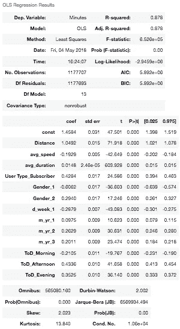

*   这个模型要好得多。但是还能更好吗？
*   对出行持续时间有重大影响的一个因素是交通。然而，由于我们不知道骑手走的是哪条路线，所以很难整合这些信息。最后，谷歌地图 API 有使用上限，所以我们不能用它来轻松识别交通模式。

# 第 6.4 部分:预测模型—改进模型 2

*   很多人认为天气是旅行持续时间的一个很好的预测因素。我个人不同意。天气影响用户是否会骑车，而不是他们会骑多长时间。如果下雪，我不会骑自行车去上班。如果天气好，我将骑自行车去上班。不管我的观点如何，我都要检验这个假设。如果天气不是一个强有力的指标，我将在下一个模型中删除它。
*   气象数据是从国家环境信息中心获得的。来自网站的数据是每日总结。属性包括:高温(华氏度)、低温(华氏度)和降水量(英寸)。

```
def get_weather(df):
    df['DATE'] = to_datetime(df['Start Time'].dt.date)
    df = df.merge(df_weather, on = 'DATE', how = 'left')
    return df
```

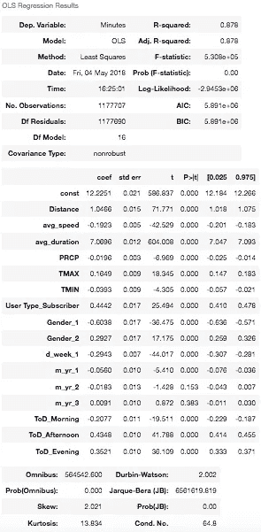

*   模型几乎没有改进。天气几乎没有影响。
*   avg_duration 的系数急剧上升。不知道为什么，但较高的系数是有意义的，因为持续时间是我们的目标变量，avg_duration 是一次旅行最可能花费多长时间的可靠代理(锚)。
*   让我们通过交叉验证来确认模型的有效性:

```
CV accuracy: 0.874 +/- 0.001
```

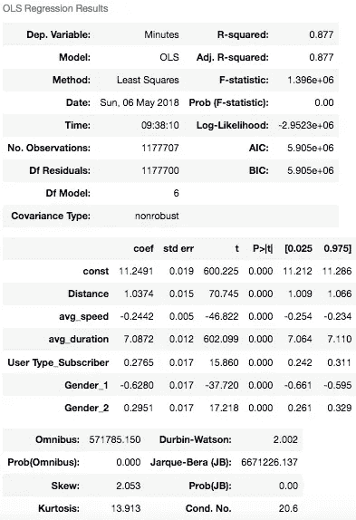

*   基于上面的一些观察，我在没有天气和日期信息作为预测的情况下运行了上面的相同模型。
*   正如我们所看到的，R 有非常小的下降。另一个有趣的观察是该数据对用户类型系数的影响，它几乎减半。
*   对随机样本的影响很小，但是，对于 10 倍的数据量，影响可能会稍大一些，因此对于最终模型，我们保留日期信息。
*   最后，我选择测试其他回归算法，比如随机森林，看看另一个回归变量是否表现得更好。出于运行时的考虑，我选择保持 n_estimators 较低。当此参数设置为 80 时，模型需要 10 分钟运行，R 与线性回归的 R 相同。通过优化其他参数(如 min_samples_leaf)来追踪随机森林可能是值得的。一种方法可能是查看行程持续时间的分布，以确定花费 5-6 分钟、6-7 分钟等的行程数量。这可以帮助识别 min_samples_leaf 参数。在现实世界中，我们不需要精确到精确到秒。只要我们能在一分钟内预测旅程需要多长时间，在我看来这就是一个可靠的结果。谷歌地图不会告诉你你的旅程需要多长时间，精确到秒，它会给你以分钟为单位的整数预测。

# 第 6.5 部分:预测模型—最终模型

*   我本来可以使用 XGboost 和其他高级算法，但是，对于这种规模的数据集，运行时间太长，而且即使有收益也不值得。
*   最终模型:线性回归(值得探索套索)
*   预测因素:基于行程和性别、用户类型和日期信息的距离、性别、平均持续时间和平均速度

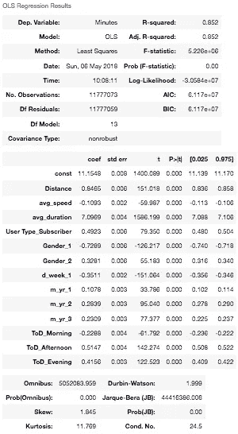

```
CV accuracy: 0.852 +/- 0.000
```

*代码是一项正在进行的工作，并且会根据您的反馈不断进行更改和改进。请在下面的评论区留下你的想法。