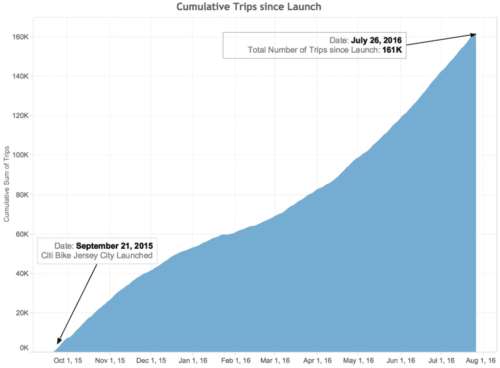
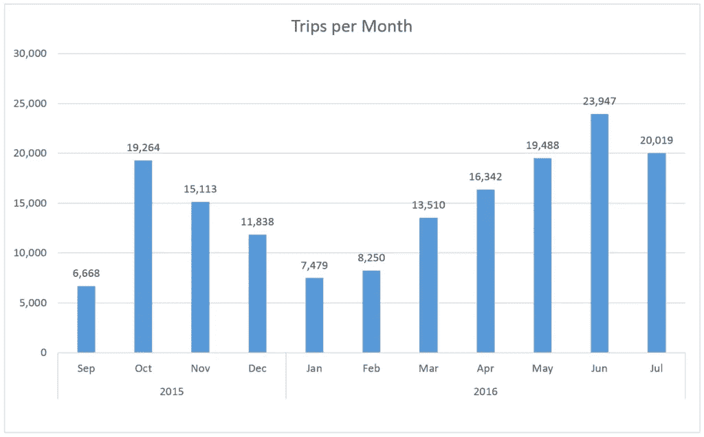
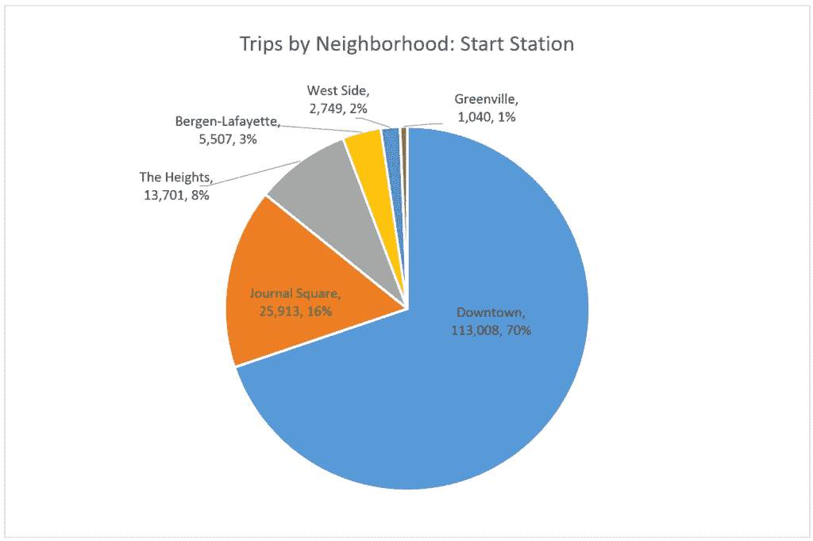
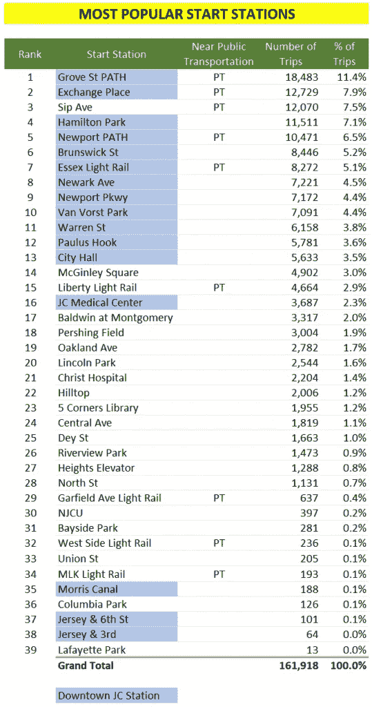
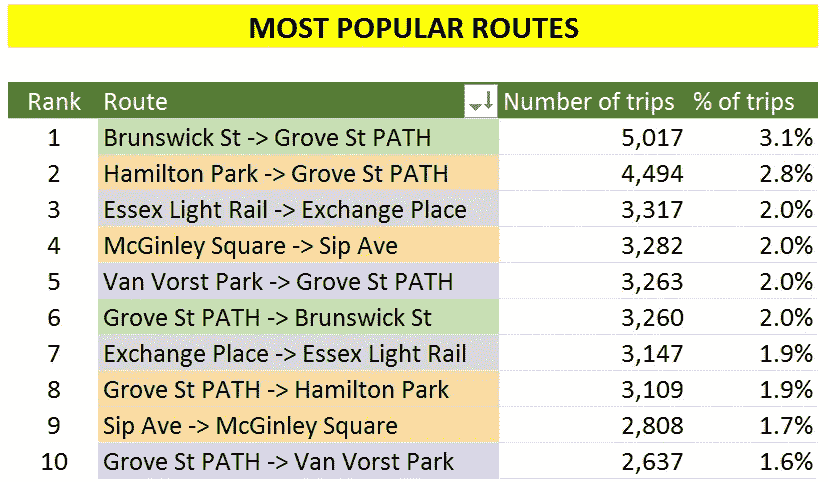

# 花旗自行车:泽西城加入了吗？

> 原文：<https://towardsdatascience.com/citi-bike-has-jersey-city-jumped-on-board-4c29e5017196?source=collection_archive---------18----------------------->

## 乘客使用情况、模式和城市最受欢迎的自行车站点

当我第一次听说花旗自行车将在泽西城推出时，我欣喜若狂。夏天的许多周末早晨，我会去林肯公园散步，感受微风，迈着轻快的步伐。我把花旗自行车看作是对我无忧无虑的童年时代的回归，在公园里骑自行车，外加有氧运动。赢赢！如果我喜欢它，我会在纽约的日常通勤中尝试一下，因为 JC 会员资格也允许在那里使用。

Citi Bike NYC 于 2013 年 5 月 23 日推出，拥有 332 个自行车站点和 6，000 辆自行车。**两年多后，花旗自行车新泽西城于 2015 年 9 月 21 日开业，共有 35 个站点和 350 辆自行车。**进展如何？其他人会像我一样兴奋地加入并把它用于娱乐或日常通勤吗？在泽西城骑花旗自行车的到底是谁？

**我把我的探索集中在两个最重要的问题上:**

*   花旗自行车泽西城用户的骑行模式有哪些？
*   [花旗自行车泽西城用户的人口构成是怎样的？](https://medium.com/@gracepaet/citi-bike-jersey-city-who-is-the-average-rider-a440f2d84d2)

**背线用法**
首先，全面概述一下花旗自行车 JC 的用法。

Figure A: Citi Bike Jersey City Cumulative Trips — September 21, 2015 (Launch) to July 26, 2016

**在 10 个月内进行了超过 161，000 次旅行(图 A)，平均每天 520 次旅行**。相比之下，纽约在 2015 年有 1000 万次旅行，大约每天 2.7 万次。

Figure B: Citi Bike Jersey City Trips per Month
Trips taken September 21, 2015 to July 26, 2016

每月乘客量如何？

月度细分(图 B)显示，随着 2016 年 5 月和 6 月这几个温暖的月份的到来，使用量有所增加。7 月份的数据不完整，但与 6 月份的趋势一致。

**乘客量模式**
我们对整个泽西城的乘客量进行了概述，但是所有泽西城的乘客量是否相等？我们先来看看泽西城所有的花旗自行车站。

截至 2016 年 7 月，泽西城共有 47 个车站。更多车站(Astor Place、Communipaw & Berry Lane、Brunswick & 6th 等。)已被添加。

下面的地图显示了 JC Citi 自行车站的使用情况，其中包括从一个 Citi 自行车 JC 站开始的所有行程。**前 10 个最活跃的车站中有 9 个位于 JC 市中心(从该车站出发的乘车总次数),唯一一个异常的 Sip 大道位于 Journal Square。**

** Citi Bike Jersey City trips taken September 21, 2015 to July 26, 2016

你还会注意到使用范围已经扩展到了泽西城以外，进入了曼哈顿，甚至布鲁克林。这是非常小的一部分，在 161，000 次旅行中只有 84 次，但仍然很有趣。2 个可能的解释:1)泽西城的骑车人把自行车带上轨道列车，或者骑着自行车穿过桥梁和隧道进入纽约市，或者 2)花旗自行车的员工发现废弃的自行车，并在纽约市的车站重新装上。我没有亲眼见过这两种情况，但我更倾向于相信第二种情况

大多数最活跃的电视台都位于市中心，你对此感到惊讶吗？花旗自行车可能只是吸引了一部分客户。事实上，****引用了 60%的花旗自行车用户居住在 07302 邮政编码，包括大部分市区。****

****

**Figure C: Citi Bike Jersey City Trips by Neighborhood, Start Station
Trips taken September 21, 2015 to July 26, 2016**

**如果我们直接观察邻近地区的出行(图 C)，70%的出行始于市中心的一个车站，Journal Square 位居第二，但在所有出行中占 16%。**

**市中心有什么吸引了这么多用户？它真的对普通市区居民有吸引力吗？也可能不是骑手的问题，更多的是车站的位置问题。这些车站是否位于交通便利的地点，靠近步行交通便利的泽西城商业区或其他公共交通枢纽？**

****

**Figure D: Citi Bike Jersey City Most Popular Start Stations
Trips taken September 21, 2015 to July 26, 2016**

**让我们来了解一下！以下是最受欢迎/最活跃的起点站(图 D)。**

****前 10 个车站中，有 5 个(Grove St PATH、Exchange Place、Sip Ave、Newport PATH、Essex Light Rail)距离其他形式的公共交通、PATH 站或轻轨非常近。在前 10 名中，Sip 大道甚至不在市中心。**Sip Avenue 站就在 Journal Square 交通枢纽的外面，乘客可以乘坐轨道列车进入泽西城、霍博肯、曼哈顿市中心区的其他地区，或者选择乘坐巴士环游泽西城或前往霍博肯、巴约纳或曼哈顿。**

****但是靠近交通枢纽并不是成功的立竿见影的方法。**Garfield Ave、West Side 和 MLK 轻轨 Citi 自行车站的使用率都在三分之一以下。然而，市中心可能是一个神奇的社区——前 20 个车站中有 13 个在市中心。注意:莫里斯运河、泽西第六街&和泽西第三街&的使用率确实很低，但这些站点是 2016 年 7 月才增加的，所以你最多只能看到 3 周的使用率。此外，这里没有列出的几个市区车站没有任何乘客，但几个月后我们就可以看到采用率是否上升。**

****

**Figure E: Citi Bike Jersey City Most Popular Routes
Trips taken September 21, 2015 to July 26, 2016**

**最后，让我们从另一个角度来看乘客量:最受欢迎的路线(图 E)。**

**到目前为止，我们并不惊讶地得知 10 条最受欢迎的路线中有 8 条的起点或终点都在市中心。但是看看 4 号，麦金莱广场- > Sip Ave。麦金莱广场甚至没有打破我们的十大起点站，但是作为骑手常规路线的一部分，它就在那里。因为我是泽西城的居民，所以我能猜到原因。麦金莱广场自行车站就在哈德逊天主教地区高中外面，是一个相当活跃的公交车站。学生们可以离开教室，跳上一辆花旗自行车去 Sip Ave(就在期刊广场)，然后换乘只有在 JSQ 站才有的 PATH 火车或公共汽车。**

**你有没有注意到**最受欢迎路线的下半部分正好是上半部分路线的反方向？**我乐在其中！这可能是一个迹象，表明**这些骑车人正在遵循一个日常或至少是规律的模式**:早上跳上一辆花旗自行车去上班，把它停靠在终点站(靠近另一个交通枢纽)，在一天结束时，如果他们选择，就把花旗自行车直接开回家。然而，因为反向旅行的数字并不完全反映对应的，有可能他们正在寻找另一条回家的路。当然也可以反过来，前 5 条路线实际上可以从骑手的工作场所开始。我需要将路线数据按时间分段来找出答案。我们将把这个分析留到下一天。**

****在我的** [**的下一篇文章**](https://medium.com/@gracepaet/citi-bike-jersey-city-who-is-the-average-rider-a440f2d84d2) **中，我们将看看工作日与周末的使用情况，以及花旗自行车新泽西城骑行者的人口构成。****

**— —**

***花旗自行车出行信息数据来自泽西城开放数据门户* [*此处*](https://data.jerseycitynj.gov/explore/dataset/portal-catalog0/table/?disjunctive.theme&disjunctive.type&disjunctive.year&disjunctive.keyword&sort=name&q=jc+citibike)
*花旗自行车站位置* [*此处*](https://member.citibikenyc.com/map/)**