# 城市级项目#2

> 原文：<https://towardsdatascience.com/cityclass-project-2-e08530dd0ccc?source=collection_archive---------7----------------------->

## 结论和进一步措施

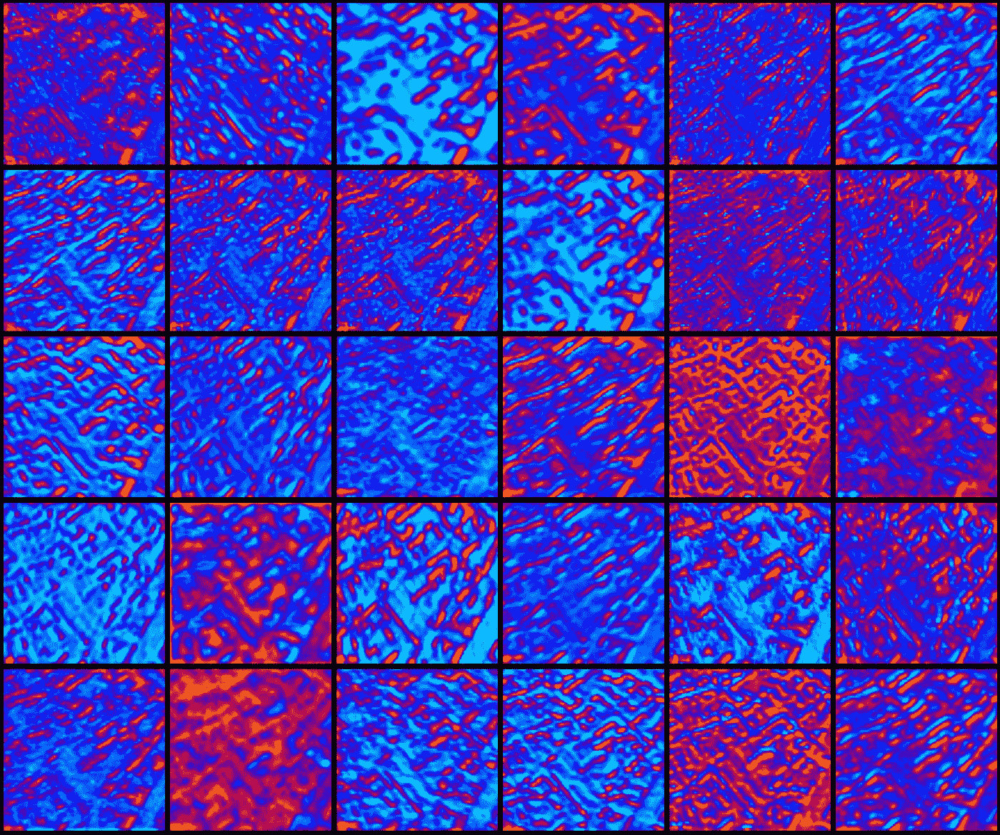

urban pattern convolution layer

## [城市级—第一部分](https://medium.com/towards-data-science/cityclass-project-eng-15bc5fcd8e1)

令我高兴的是， [**城市级**](http://aitecture.com) 项目受到了城市规划专家、城市规划专家和 IT 专家的广泛关注。幸运的是，我赶上了机器学习的潮流，它在不同的领域传播。特别是可以在莫斯科研究所 Strelka [“机器能看见”](http://strelka.com/en/magazine/2017/06/15/machines-can-see)的文章中读到。

我从双方那里得到了很多有意义的反馈。这表明所选择的活动方向比以往任何时候都更重要，而且有必要继续这项工作。最重要的事件是受邀参加 [Yandex Data &科学大会:城市](https://events.yandex.ru/events/ds/20-may-2017/)，在那里我做了详细的报告(Yandex——俄罗斯最大的搜索引擎和 IT 公司。视频记录，俄语，见页面底部)。为这次活动准备了额外的材料，我将在下面概述这些材料。

> 城市+数据科学=:)

## 结论和补充

也许最重要的结论是，对于那些人们已经学习了多年的特定知识，机器学习的可能性非常大，并且委托给神经网络来做专家在大多数时间里做的事情。机器学习的这种结果可以完全改变既定的方法和实践。本研究项目是对本论文的实践验证。

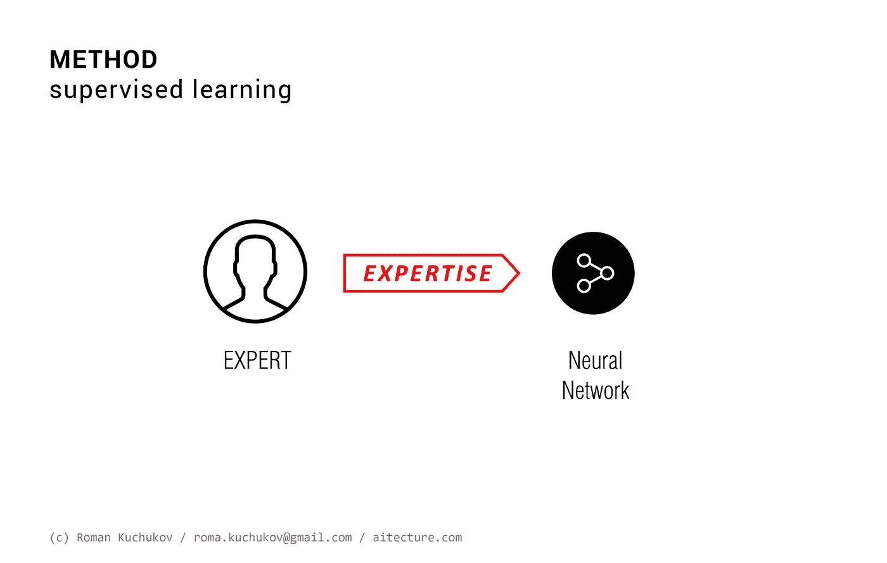

人们特别感兴趣的是观察深层神经网络内层的图像。我的神经网络包括如下 3 个卷积层(LeNet-like):

```
#Keras  CNN-model
model = Sequential()model.add(Convolution2D(32, 3, 3, input_shape=(3, 300, 300)))#1 conv
model.add(Activation('relu')) #2 activation
model.add(MaxPooling2D(pool_size=(2, 2)))#3 MaxPoolingmodel.add(Convolution2D(64, 3, 3)) #4 conv
model.add(Activation('relu')) #5 activation
model.add(MaxPooling2D(pool_size=(2, 2))) #6 MaxPoolingmodel.add(Convolution2D(64, 3, 3)) #7 conv
model.add(Activation('relu')) #8 activation
model.add(MaxPooling2D(pool_size=(2, 2))) #9 MaxPoolingmodel.add(Flatten()) 
model.add(Dense(128)) #all connected layers
model.add(Activation('relu'))
model.add(Dropout(0.5))
model.add(Dense(nb_classes)) #7 classes
model.add(Activation('softmax'))
```

由于下面的过程，使用 *theano 函数*，我们可以从所需的层中获得图像数组，然后将它们可视化。

```
LayerID = 0  # layer to viz (0..8)output_layer = model.layers[LayerID].output 
output_fn = theano.function([model.layers[0].input], output_layer) output_image = output_fn(input_image)
```

在直觉层面上，神经网络的图像处理可以描述如下:

*   在第一卷积层(1.conv ),网络感知输入图像，揭示其中的特征轮廓；
*   在随后的层(2-6)上，识别出单独的结构，在这种情况下是道路和房屋；
*   在最后一个卷积层(7.conv)上，将分离的结构组装成一些复合体，这些复合体是该类的特征，在此基础上图像被进一步分类。

> 分析中间图像，人们可以注意到隐藏的模式和启发，当考虑原始图像时并不总是清楚的。

俄罗斯城市的一些城市模式和内层可视化:

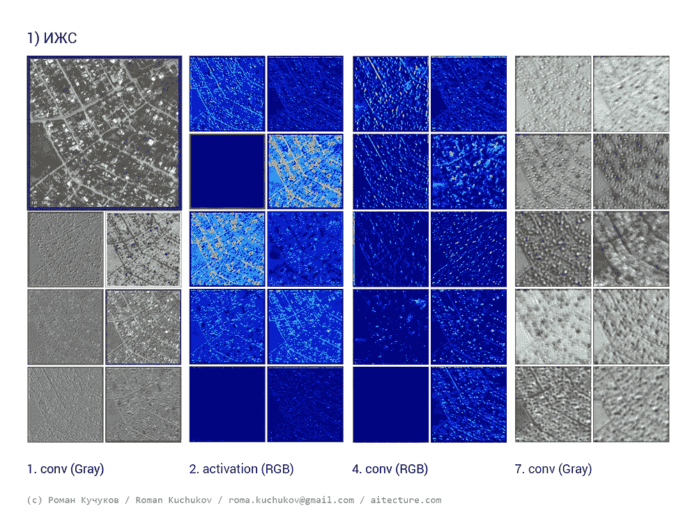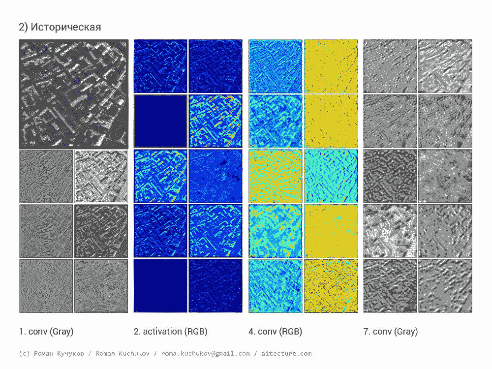

Private housing; Historic district

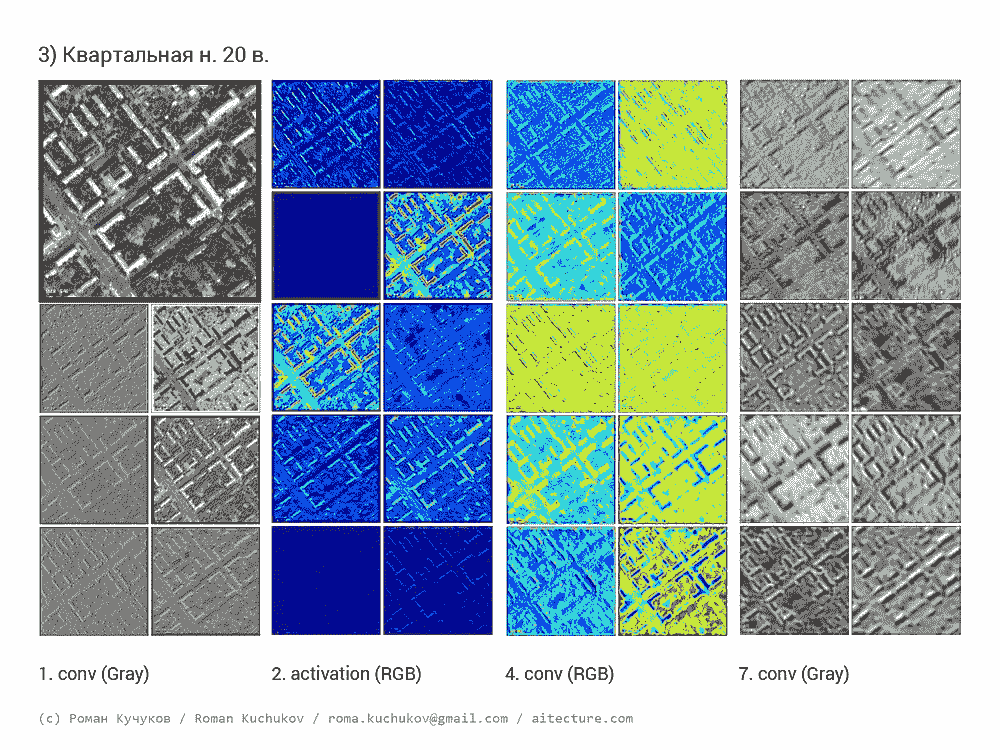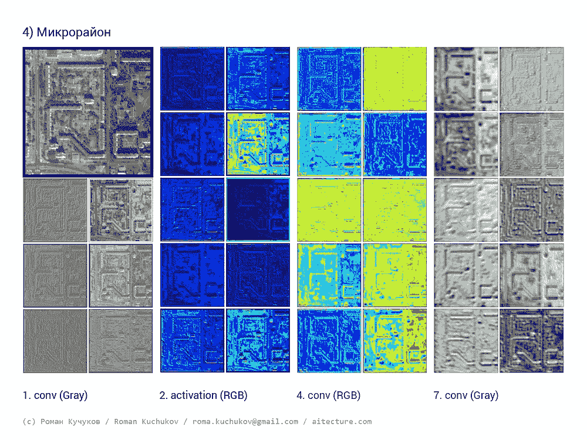

Urban blocks mid 20th; Microrayon

## 城市群分析和预测的新工具

基于在第一部分中获得的数据，可以获得所考虑城市的城市规划情况的概化方案。
需要强调的是，城市*的一个区域超出了*的行政边界。因此，机器学习是一种具有巨大潜力的工具，用于分析和修复发生在最大城市的聚集过程。今后，这些方案可用于制定总体规划和其他相关文件的方案。

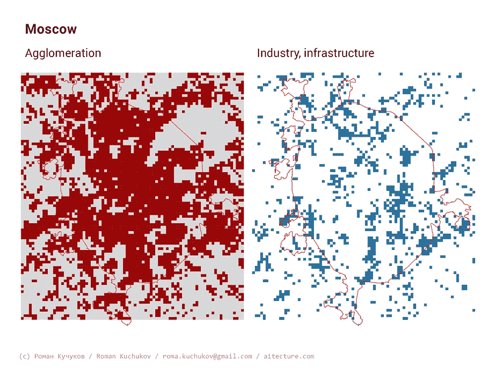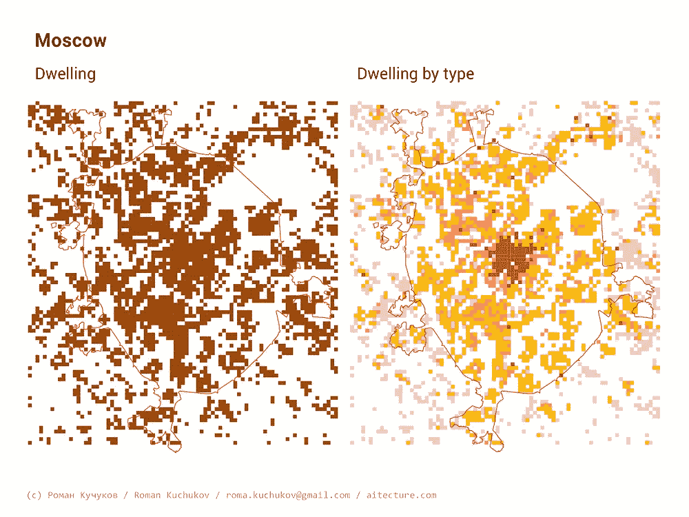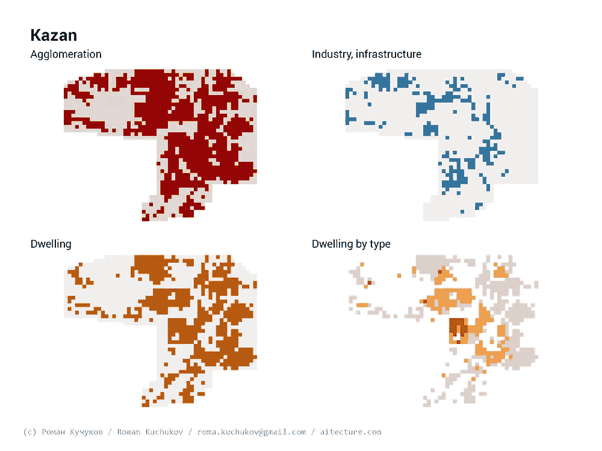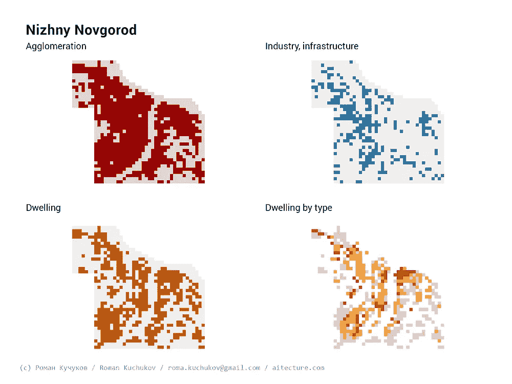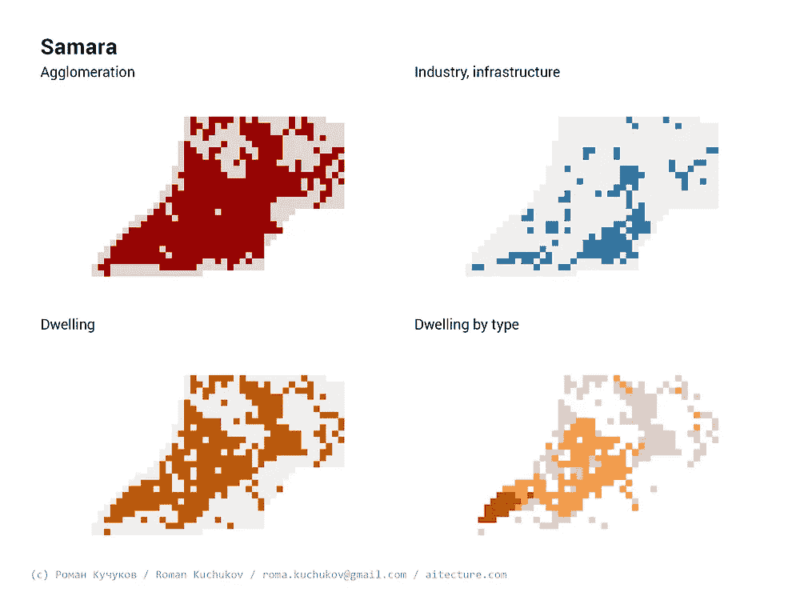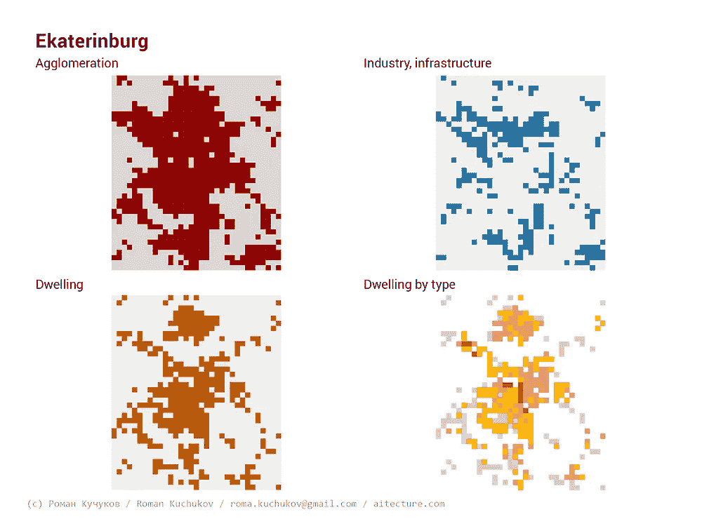

根据我的经验，我认为在项目设计和城镇规划中使用机器学习的可能场景如下:

*   总体规划方案
*   帮助决策
*   信息图表和商业分析
*   与 CAD 和 BIM 设计系统集成
*   描述和预测城市发展的新方法
*   见解！

## 未来计划

CityClass 项目显示了使用机器学习作为与城市和集聚区合作的新工具的巨大潜力。因此，我将沿着以下方向发展我的工作室 [**建筑**](http://aitecture.com) :

*   对世界其他城市的报道和分析
*   从细胞网格撤退，基于街道网络的分裂和区分
*   基于其他标准、类别的培训模型
*   对象检测和生成
*   过渡到张量流

## кучуков/罗曼·库丘科夫—

建筑师、城市规划者和城市研究者；
工作室的创始人 [**建筑**](http://aitecture.com)