# 市级项目

> 原文：<https://towardsdatascience.com/cityclass-project-eng-15bc5fcd8e1?source=collection_archive---------1----------------------->

## 基于神经网络的城市模式识别

*这是我长期项目*[*【aitecture.com】*的一部分](http://aitecture.com)

## [城市级—第二部分](https://medium.com/towards-data-science/cityclass-project-2-e08530dd0ccc)

人工智能技术现在已经渗透到经济的许多领域，建筑、设计和城市化也不例外。它们有巨大的潜力，直到完全修改已建立的方法和实践。我的研究是我们如何利用人工智能完成特定的任务——以俄罗斯城市为例识别城市模式。

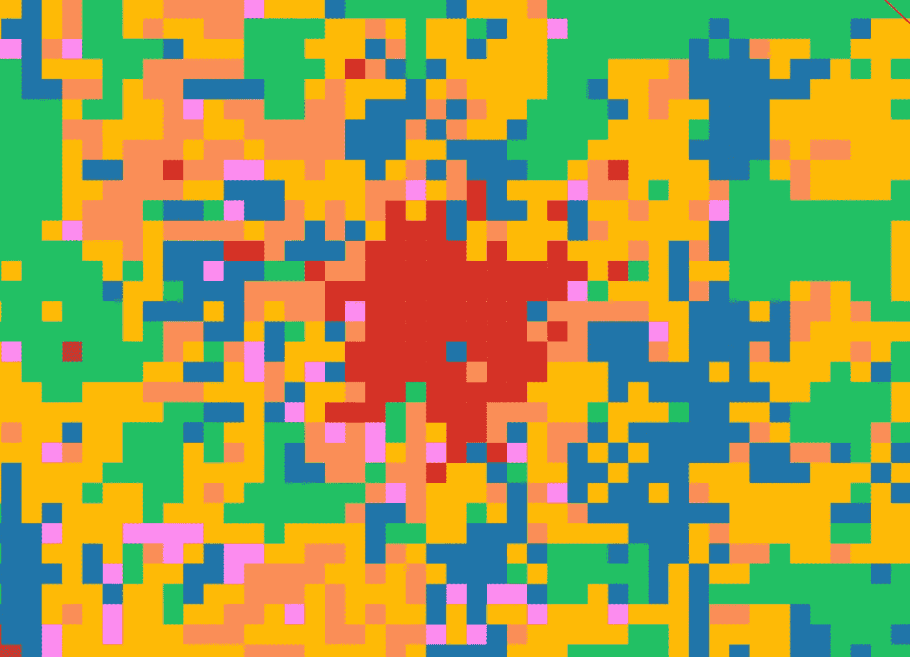

和一个城市打交道，无论是城市规划、概念还是研究，都要把握它的结构。地图服务的可用性并不能给出城市的总体概念。

这种方法*采用了神经网络*，它可以学习如何识别不同的城市模式，最终得到一个整体的画面。所以我们可以对这个城市和它的景观有一个新的认识。

如果一个人在看卫星地图时能够区分工业区和住宅区，那么计算机就能为我们做到这一点。任务是训练它，从而将知识从人转移到神经网络。

## 在我的研究中，我分析了五个人口超过 100 万的俄罗斯大城市:

## 莫斯科，下诺夫哥罗德，喀山，萨马拉，叶卡捷琳堡。

许多俄罗斯城市的特点是它们有共同的城市发展模式(形态类型)。例如，住宅区由典型的系列建筑组成，根据一个原理——这种类型或住宅区称为‘微住宅区’。因此，俄罗斯城市的地貌类型可以在单一模式集合的基础上进行分析。

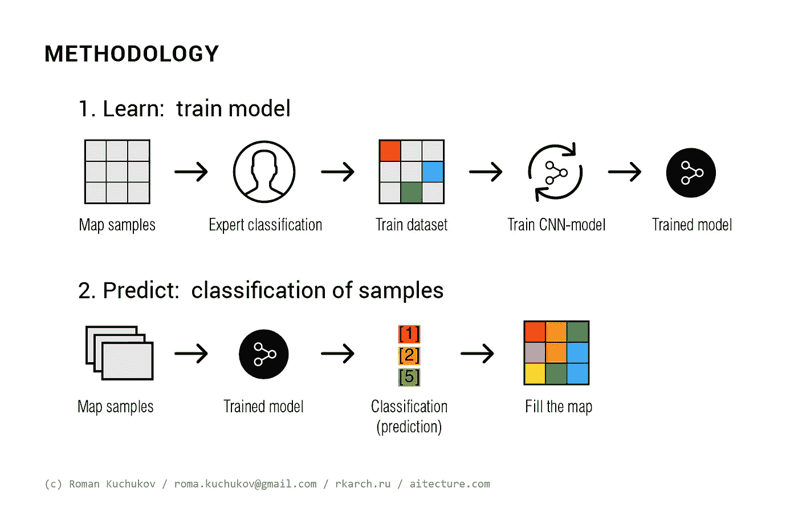

# 该方法包括两个阶段:

## 1)学习:培训模式

在这一阶段，获得足够数量的高质量训练数据集非常重要。为此，一个专家——一个可以对物体进行分类的人(在这种情况下——我自己),以随机的顺序，对数据库中的单个物体进行分类，例如总数的 10%。越大越好。然后，当训练数据集被收集时，就可以训练神经网络模型——分类器。

## 2)预测:样本分类

当模型被训练时，无限数量的样本可以通过它。输出是样本的预测类别。

> 我们训练了一台计算机，现在它为我们产生新的知识！

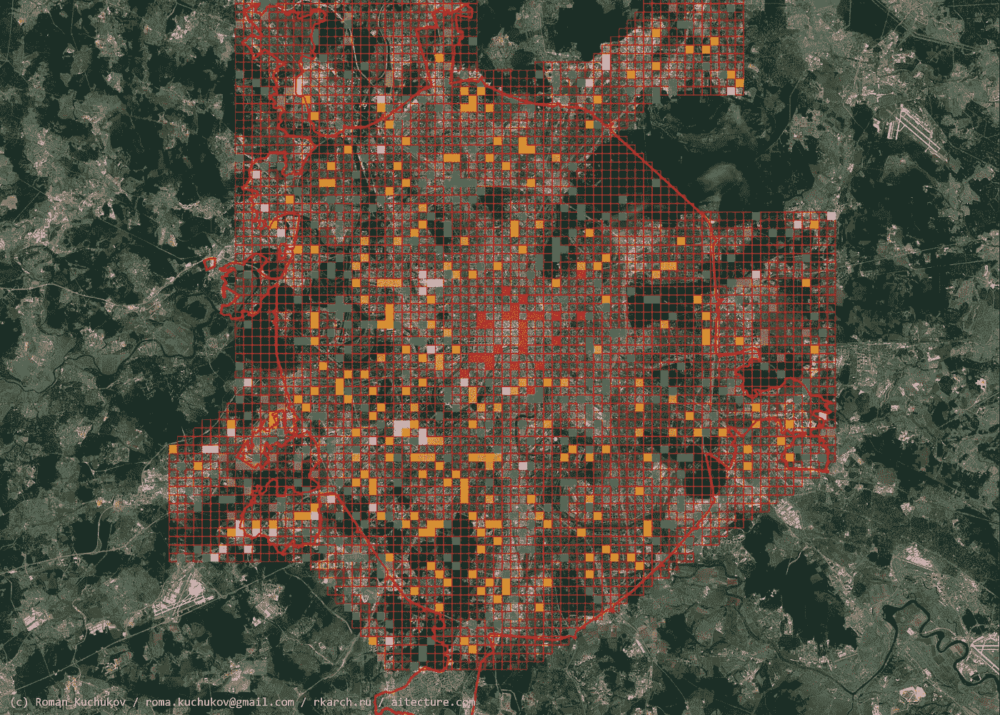

Preliminary (expert) classification

我用了一个工作流带:
- GIS 包 Qgis，带模块 Open Layers for Google maps，还有我自己的脚本用于样本的初步分类和导出；
-带有机器学习库的 Python 环境:Keras，Theano。

作为机器学习的模型，我使用了卷积神经网络(CNN)，它用于 [LeNet](http://yann.lecun.com/exdb/lenet/) 项目。

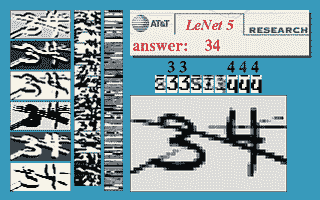

LeNet project —handwriting recognition

对于 CityClass 项目，选择并分类了 1686 个样本( *1267 训练/ 419 验证*)。有可能通过 70–75%的验证集实现分类的准确性，这对于小型数据库来说仅仅是一个很好的指标，并且考虑到不是所有的样本都可以明确确定。

# 模式的类别

所有城市被划分为一个网格，网格大小为 600 x 600 m，从中选择了 7 个典型的城市模式类别。根据样品中的主要成分，对整个样品进行了分类。

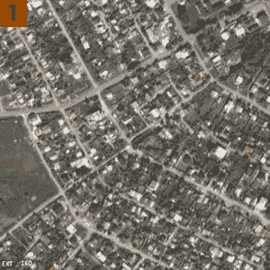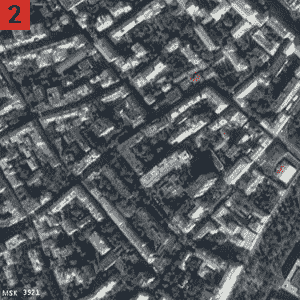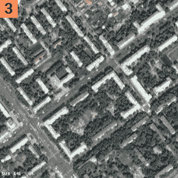

Classes: 1, 2, 3

*   **1** —私人住宅区；
*   **2** —历史街区，20 世纪初以前。；
*   **3** —拥有独立住宅建筑的城市街区，也就是所谓的“斯大林风格”，小写——20 世纪上半叶，1930-1960；

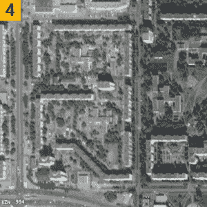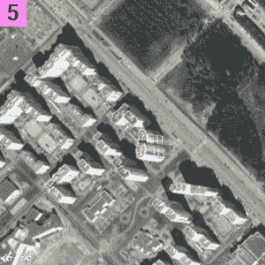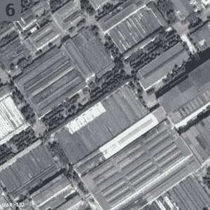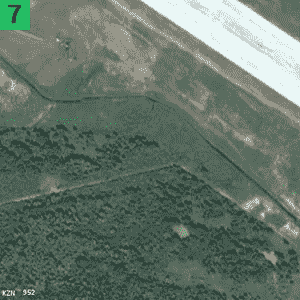

классы 4, 5, 6, 7

*   **4**——大众住宅公寓建筑— *微型住宅*，1960 年至 1990 年；
*   **5** —现代住宅开发，从 2000 年代开始；
*   **6**—工业和公共区域:工业区、火车站、购物中心、体育场、基础设施；
*   **7** —自然和混合区域。

# 结果

## 莫斯科

7636 个样本

Moscow

公认的大区域，由许多瓦片组成:莫斯科的历史中心，公园，莫斯科的河床，工业区，城市主要部分以外的低层居住区网络。

城市的放大片段:

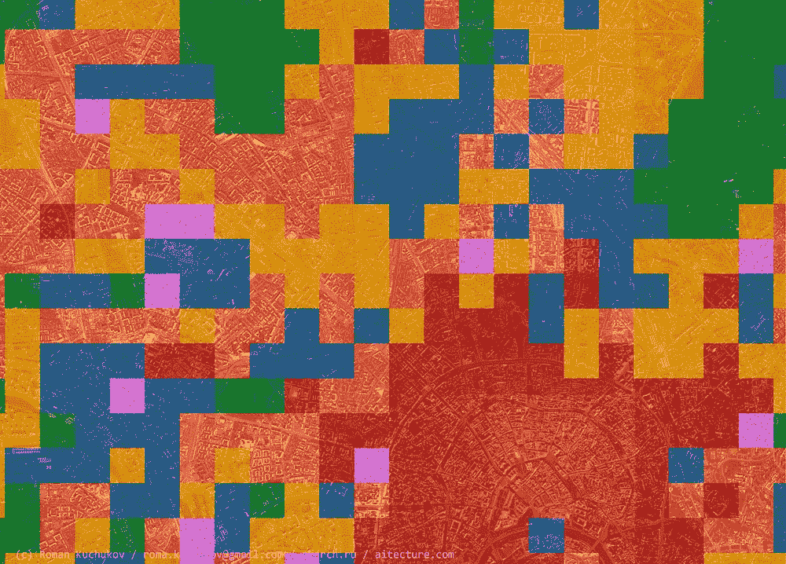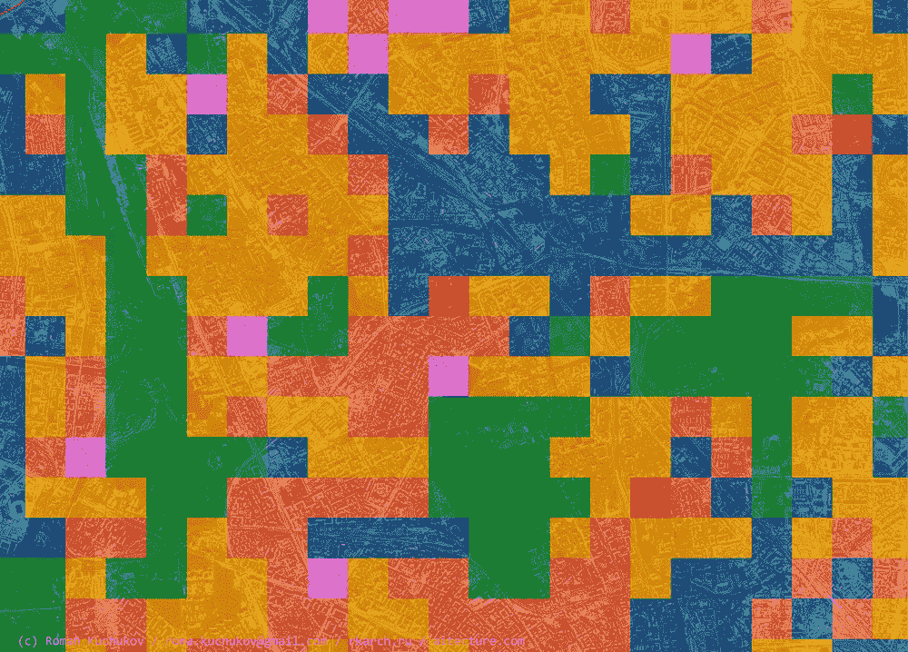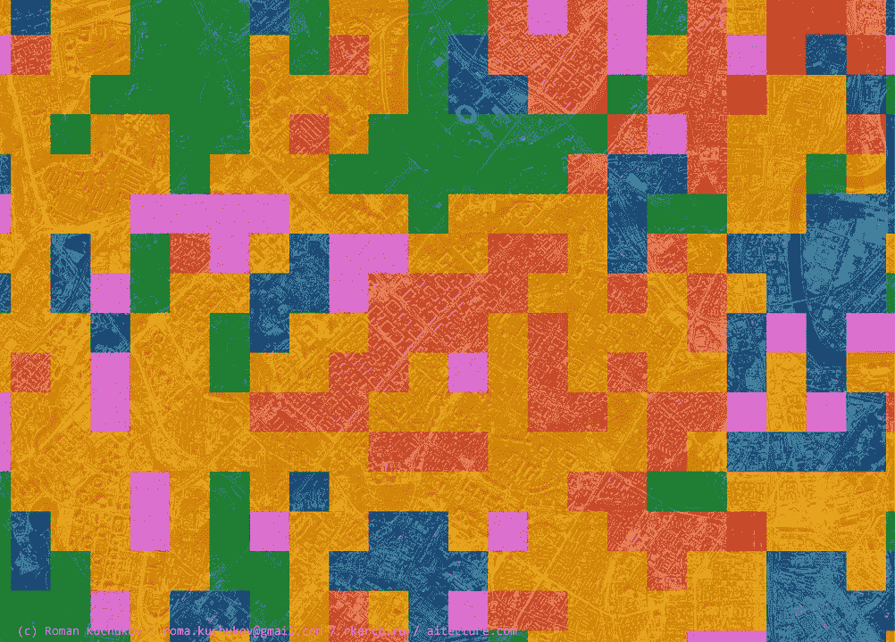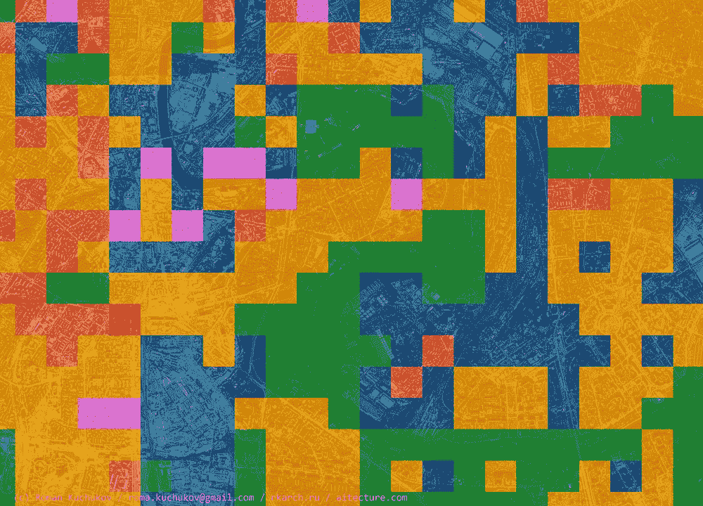

在放大的片段上，单个物体清晰可见，例如:列宁斯基前景(街道)、铁路基础设施、前 ZIL 工厂等。

## 其他城市也有类似的描述。

## 喀山

1389 个样本

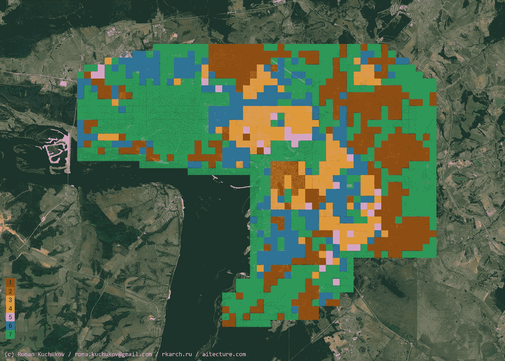

Kazan

## 下诺夫哥罗德

1188 个样本

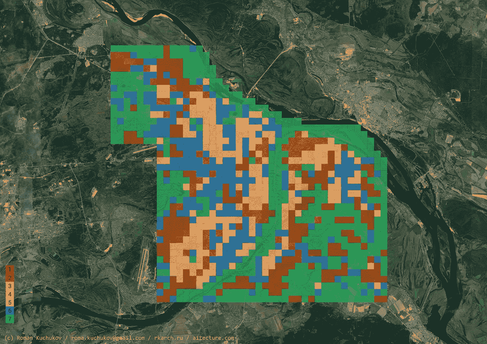

Nizhny Novgorod

## 翅果

691 个样本

Samara

## 叶卡捷琳堡

1254 个样本

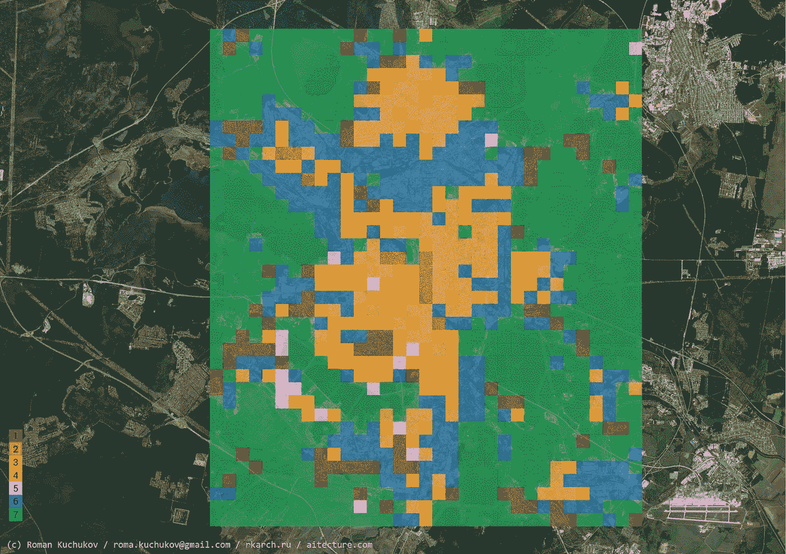

Yekaterinburg

# 结论

我很高兴我设法以我构想的形式实现了这项研究的想法，同时达到了 70%以上的分类准确率的计划水平。

这只是如何在城市/城市发展实践中使用深度机器学习技术的一个例子。例如，你可以训练一个神经网络来区分区域和公共空间，提取它们的具体特征以便以后使用。

通过同样的技术，我们可以分类其他城市，例如在欧洲或美国。

从神经网络的内层获取图像也是一个好主意。这将是下列职位之一。

> 结果，我们用电脑看待城市的方式来看待城市。