# 基于 R 的大规模噪声数据集的分类

> 原文：<https://towardsdatascience.com/classification-on-a-large-and-noisy-dataset-with-r-c10cf14cbae6?source=collection_archive---------6----------------------->

几天前，我写了一篇文章，描述了一个全面的监督学习工作流程，使用 caret 和 caretEnsemble 包进行多种建模。当时我提到我使用的是一种简单的*T4，在某种意义上，它是全数字的，完全填充的(没有一个缺失值)，没有分类特征，没有类别不平衡(当然，因为这是一个回归问题)，并且它是一个相当小的数据集，只有 8 个预测值。*

这感觉就像是作弊，但它确实帮助了我写的第一篇文章，也帮助我顺利地完成了整个工作流程，并最终使用`caretEnsemble.`做了一些多重建模

所以现在我决定把这个从*简单*难度提升到*普通*难度。

在这种意义上，我在我打算使用的 [UCI 机器学习库](https://archive.ics.uci.edu/ml/index.php)中遇到了[这个数据集](https://archive.ics.uci.edu/ml/datasets/APS+Failure+at+Scania+Trucks)。

我们在这个数据集上遇到的新困难是什么？我来总结一下:

1.  目标变量是分类二项式的，具有非常高的类别不平衡
2.  数据集的大小相当大。训练集是 60，000 x 171，测试集是 16，000 x 171
3.  巨大的价值缺失问题
4.  异常值和多重共线性的潜在存在
5.  第一类错误和第二类错误都有特定的成本，这就要求我们尽量减少第二类错误。


这是存储库所有者对数据集和任务的描述:

*“数据集包含从日常使用的重型斯堪尼亚卡车上收集的数据。重点介绍的系统是空气压力系统(APS ),它产生压缩空气，用于卡车的各种功能，如制动和换档。数据集的正类包括 APS 系统特定组件的组件故障。负类包括与 APS 无关的部件出现故障的卡车。这些数据由专家选择的所有可用数据的子集组成。*

*出于专有原因，数据的属性名称已被匿名化。它由单个数字计数器和直方图组成，直方图由不同条件的仓组成。(…)总共有 171 个属性，其中 7 个是直方图变量。缺失值用“na”表示。*

*—挑战指标*

*失误分类的成本度量:*

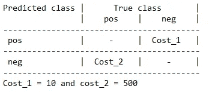

*在这种情况下，成本 _1 指的是需要由一名机械师在车间进行不必要检查的成本，而成本 _2 指的是遗漏一辆故障卡车的成本，这可能会导致故障。*

`*Total_cost = Cost_1 * No_Instances + Cost_2 * No_Instances*`

我们会试试看！

## 环境

> 1.1)我们试图预测什么？

我们需要预测系统故障的类型。它可以是 *APS* 的故障组件，也可以是与 *APS* 无关的故障组件。这一点非常重要，因为我们的预测误差会导致公司不必要的支出。具体来说，我们希望避免*类型 2 错误(错过故障卡车的成本，这可能会导致故障)*。

> 2.2)这是什么类型的问题？监督学习还是非监督学习？分类还是回归？二元还是多类？单变量还是多变量？

这是一个具有多个特征的二元分类问题。

> 2.3)我们有什么类型的数据？

我们有两个 *csv* 文件，一个用于培训，一个用于测试。在实际数据开始之前，两者都显示了 20 个不重要的文本行，我们必须在导入数据框时跳过这些行。列名有一行，缺少的值用“na”表示，因此我们将确保在*读取*CSV 时包含这些值。

2.4)导入数据集

```
training_data <- read.csv("aps_failure_traning_set.csv",
                          skip = 20, 
                          na.strings = "na")test_data <- read.csv("aps_failure_test_set.csv",
                      skip = 20, 
                      na.strings = "na")
```

我们检查两个数据集的维度:

```
dim(training_data)
dim(test_data)[1] 60000   171
[1] 16000   171
```

> 2.5)激活项目期间要使用的包

```
library(dplyr)
library(caret)
library(caretEnsemble)
library(mice)
library(doParallel)
library(car)
```

## 探索性数据分析

> 2.1)查看数据(str 或 dplyr 的一瞥)。第一眼。有什么奇怪的吗？

导入集合时指定`na.strings=”na"`允许 R 将每个特性识别为数字。如果我们不这样做，每列中出现的 *na* 会自动导致它们被归类为*字符*类型。

使用下面的代码，我们可以看到除了我们的响应变量`class`，所有其他的特性都是数字的。

```
glimpse(training_data)glimpse(test_data)
```

> 2.2)它是一个“整洁”的数据集吗？需要“聚集”还是“分散”呢？它是以一种我们可以合作的方式呈现的吗？

很整洁。每行是一个观察值，每列是一个特征。

> 2.3)行名和列名可以吗？我们应该改变他们吗？

我看不出有什么理由要改变它们。

> 2.4)检查数据类型。他们还好吗？如果没有，转换

我们已经评估过数据类型是可以的。在这里，您还需要检查响应变量是否属于 factor 类型，以及预期的两个级别。

> 2.5)我们的响应/目标变量是什么？阶层失衡？研究一下

我们的目标变量是`class`，有两个级别: *neg* 和 *pos* 。积极类包括 APS 系统特定组件的组件故障。负类包括与 APS 无关的部件出现故障的卡车。

每组有多少个*阴性*和*阳性*？

```
summary(training_data$class)
summary(test_data$class) **neg   pos 
59000  1000 
  neg   pos 
15625   375**
```

让我们检查一下比例:

```
options(digits = 2)prop.table(table(training_data$class))
prop.table(table(test_data$class))**neg   pos 
0.983 0.017****neg   pos 
0.977 0.023**
```

好吧，看起来这里有个问题。阶级完全不平衡。

我们可能会想出一个无用的模型，将每个观察结果分类为*阴性*并获得 97.7%的准确性，所以让我们小心我们的准确性分数解释。

稍后我们会看到我们如何处理阶级不平衡。

> 2.6)其余功能。汇总统计数据。了解您的数据

我们正在处理 171 个特征，所以在整个数据集上调用`summary()`在视觉解释方面不会有太大帮助。相反，我们将使用`summary()`函数创建一个数据框。这将使我们能够计算一些新的统计数据，特别是与缺失值相关的统计数据，正如您将看到的，这是该数据的另一个大问题。

利用这个汇总数据框架，我们还将计算所有数据的平均四分位数。这也将允许我们了解更多关于特征的分布和丢失值的平均数。

```
options(scipen = 999)**summary_df** <- do.call(cbind, lapply(training_data[, 
                      2:ncol(training_data)], summary))
**summary_df_t** <- as.data.frame(round(t(summary_df),0))**names**(summary_df_t)[7] <- paste("Missing_values")summary_df_t_2 <- summary_df_t %>% 
                      mutate(obs = nrow(training_data),
                             Missing_prop = Missing_values / obs)print(summary_df_t_2)
```

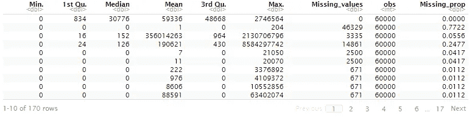

Each row is a feature. In this case we are just looking at the first 10 features

```
summary_df_t_2 %>% summarise(Min = mean(Min.),
                             first_Q = mean(`1st Qu.`),
                             Median = median(Median),
                             Mean = mean(Mean),
                             third_Q = mean(`3rd Qu.`),
                             Max = max(Max.),
                             mean_MV = mean(Missing_values),
                             obs = mean(obs),
                             mean_MV_perc = mean_MV / obs)
```

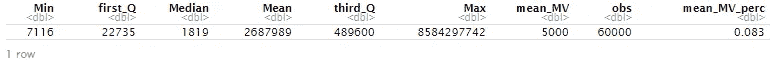

Summary of all features using the mean of each column

我们可以看到，在 60，000 个样本中，每个特征的平均缺失值数为 5，000。这意味着每列平均有 8.3%的缺失值。太多了！

让我们对我们的测试集进行同样的检查:

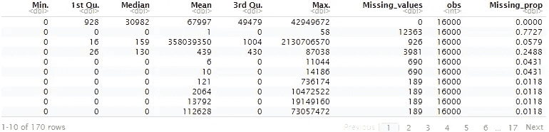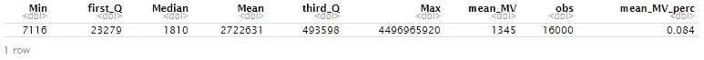

同样，我们还有 8.4%的缺失值。我们将不得不处理他们，之后会有一个特别的部分。

> 2.7)分类数据/因素:创建计数表以了解不同的类别。全部检查一下。

除了我们的响应变量，我们不使用任何其他分类特征。

> 2.8)不必要的列？我们可以很快理解我们不需要的列。放下它们

到目前为止，我们还没有检测到任何要删除的列。这个我们以后再说。

> 2.9)检查是否有缺失值。多少？在哪里？删除它们？归咎于他们？

我们的特征平均存在超过 8%的缺失值。

因为我们不想失去很多信息，所以我们的方法是[估算](https://en.wikipedia.org/wiki/Imputation_(statistics))它们。但是首先，我们不想使用一种技术来分别估算我们的两个集合(训练和测试)。它必须是使用全部信息的一次性估算。为了做到这一点，我们将结合这两个集合，对它们进行处理，然后再次分离。

```
#replicate our sets
training_data_bind <- training_data
test_data_bind <- test_data#create a new column "set" to label the observations
training_data_bind$set <- "TRAIN"
test_data_bind$set <- "TEST"#merge them into 1 single set
full_dataset <- rbind(training_data_bind, test_data_bind)
dim(full_dataset)[1] 76000   172
```

我们最终得到包含 76，000 个样本的单个集合(16，000 个来自测试集，60，000 个来自训练集)。列数为 172 (171 个功能+ 1 个“设置”列)

> 缺失值插补

我们将使用包*鼠标*来估算缺失值。这里有一个关于鼠标如何工作的很好的解释

下面的公式允许我们使用*均值*插补来插补整个数据集:

```
set.seed(123)
imputed_full <- mice(full_dataset, 
                     m=1, 
                     maxit = 5, 
                     method = "mean", 
                     seed = 500)
```

现在我们存储估算值:

```
full_imputed <- complete(imputed_full, 1)
```

然后，我们检查是否仍然保持相同的尺寸:

```
dim(full_imputed)[1] 76000   172
```

现在让我们检查我们没有丢失值:

```
(na_count_full_imputed <-data.frame(sapply(full_imputed, function(y) sum(length(which(is.na(y)))))))
```

等等。如果您运行该代码并查看每一行，您会注意到有些特性仍然缺少值。具体来说有 9 行。

让我们来看看是什么导致了它们:

```
issue_columns <- subset(imputed_full$loggedEvents, 
                        meth == "constant" | meth == "collinear")
print(issue_columns)
```

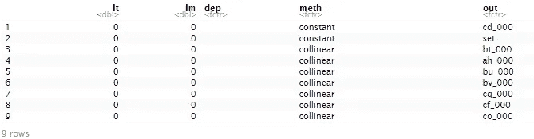

我过滤了估算数据框的`$loggedEvents`属性。这里我们看到一些特征被标记为*常数*或*共线*。其中一个是我们的*集合*列(我们用来把两个集合合二为一的那个)，所以我们不担心那个。其余的主要是共线变量和一个常量变量。鼠标会自动跳过这些栏，让我们知道问题。我们希望删除这些要素，这样我们就有了一个完整的数据集，不会丢失任何值。

为此，我们首先存储列名，注意不要存储*集合的*列名(我们需要它)

```
#create vector of column names
issue_columns_names <- as.character(issue_columns[, "out"])
issue_columns_names <- issue_columns_names[-2]
print(issue_columns_names)[1] "cd_000" "bt_000" "ah_000" "bu_000" "bv_000" "cq_000" "cf_000" "co_000"
```

然后，我们使用存储的向量从数据框中移除这些列，并将其存储为最终的估算数据框:

```
full_imputed_filtered <- full_imputed[ , !(names(full_imputed) %in% 
                                      issue_columns_names)]
dim(full_imputed_filtered)[1] 76000   164
```

请注意，列数从 172 减少到了 164。

现在我们不再有缺失值了！(查一下！)

最后，是时候将我们的完整估算数据集再次分成训练集和测试集，我们需要将其分成与之前完全相同的样本。为此，我们只需使用我们的 *set* 列过滤数据帧。

```
#subset the full_imputed_filtered dataset
training_data_imp <- subset(full_imputed_filtered, set == "TRAIN")
test_data_imp <- subset(full_imputed_filtered, set == "TEST")#drop the "set" column, we don't need it anymore
training_data_imp$set <- NULL
test_data_imp$set <- NULL#check dimensions
dim(training_data_imp)
dim(test_data_imp)[1] 60000   163
[1] 16000   163
```

太好了！，我们有我们的训练和测试集分裂，没有丢失值！

> 2.10)检查异常值和其他不一致的数据点。箱线图。厨师的距离。DBSCAN？

对于该数据集，我们将使用[库克距离](https://en.wikipedia.org/wiki/Cook%27s_distance):

```
cooksd <- cooks.distance(glm(class ~ ., 
                             family = "binomial", 
                             data = training_data_imp))
```

让我们画出结果:

```
plot(cooksd, 
     pch="*", 
     cex=2, 
     main="Influential Obs by Cooks distance") abline(h = 4*mean(cooksd, na.rm=T), col="red")
```

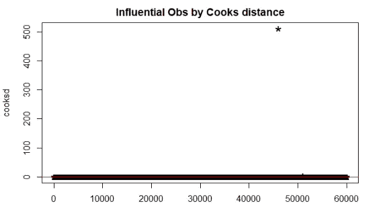

在这个图中，看似一条又黑又粗的黑线，实际上是我们所有的数据点。在右上角，我们还可以看到似乎有 1 个异常值，或者一堆异常值组合在一起。

让我们看看有多少:

```
outliers <- rownames(training_data_imp[cooksd > 4*mean(cooksd, na.rm=T), ])
print(outliers)[1] "617"   "3993"  "5349"  "10383" "10829" "18764" "19301" "21138" "22787" "24360" "24975" "29146" "30633" "33684"
[15] "38785" "45978" "50283" "51003" "52573" "53283" "54957" "57186"
```

根据 cook 的距离测试，总共有 22 个点被认为是异常值。

因为与我们的总数 60，000 相比，这是一个非常低的观察值，所以我决定不删除它们。这似乎只是测量中的可变性，而不是实验误差。

> 2.11)检查数字数据中的多重共线性

EDA 阶段的最后一步是检查多重共线性。我们已经删除了一些被小鼠检测为共线的列。这里，我们将分析有多少双变量关系具有高相关性，如果比例非常高:

```
sum((correlation > 0.5 | correlation < -0.5) & correlation < 1) / (162*162)
[1] 0.12sum((correlation > 0.7 | correlation < -0.7) & correlation < 1) / (162*162)
[1] 0.047sum((correlation > 0.9 | correlation < -0.9) & correlation < 1) / (162*162)
[1] 0.0055
```

这意味着在 26，244 个可能的变量相关性中:

*   12%的人得分高于 0.5
*   比 0.7 高 4.7%
*   比 0.9 高 0.55%

我不会做更多的讨论，并且认为多重共线性在这一点上不是一个大问题。

## 特征工程

我们也不会花时间在这个已经加载了大量功能的数据集中设计功能。没有我们可以使用的额外信息。

## 系统模型化

我们现在已经为建模准备好了训练和测试数据集。我们估算了缺失值，移除了共线要素，并验证了异常值和多重共线性不是我们应该关注的大问题。

由于数据的大小，我们将训练一个*逻辑回归*模型和一个*朴素贝叶斯*模型。与 r *andom forests* 、 *SVMs* 或*梯度推进*模型等更先进的算法相比，两者都非常快。

我在这里不是为了赢得比赛，而是为了证明自己有一个可以接受的分数。

我将使用`caretEnsemble`的`caretList()`在同一时间用相同的重采样来训练两者。

请注意，我在`trainControl()`中指定了*“上升”——采样*。这将解决*等级不平衡*。[关于上采样的更多信息](https://en.wikipedia.org/wiki/Upsampling)。

```
registerDoParallel(3)
getDoParWorkers()set.seed(123)my_ctrl <- trainControl(method = "cv", 
                        number = 5,
                        classProbs = TRUE,
                        savePredictions = "final",
                        index = 
                        createResample(training_data_imp$class, 3),
                        sampling = "up",
                        allowParallel = TRUE) model_list <- caretList(class ~ .,
                        data = training_data_imp,
                        methodList = c("glm", "nb"),
                        metric = "Kappa",
                        tuneList = NULL,
                        continue_on_fail = FALSE,  
                        preProcess = c("center", "scale"),
                        trControl = my_ctrl)
```

我们的结果:

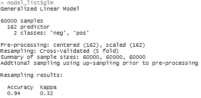

Logistic Regression model

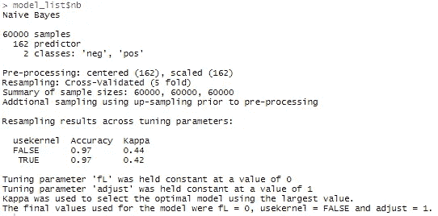

Naive Bayes model

请注意，我们的*准确性*得分低于我们的无用户 ***预测全否定*** *模型*的 97.7%。我们没有获得更高分数的原因是因为我们对数据进行了上采样，从而生成了新的数据点来修复类别不平衡。我们在 caret 的 trainControl 中将其作为一个参数集，所以我不会显示任何细节，但通过这样做，我们提高了预测正类(在这种情况下为“neg”)的能力，而不仅仅是为了最大限度地提高准确性。

## 对看不见的(测试)数据的性能

让我们快速检查一下混淆矩阵:

```
#Logistic Regression model
confusionMatrix(predict(model_list$glm,test_data_imp, type = "raw"), test_data_imp$class)#Naive Bayes model
confusionMatrix(predict(model_list$nb,test_data_imp, type = "raw"), test_data_imp$class)
```

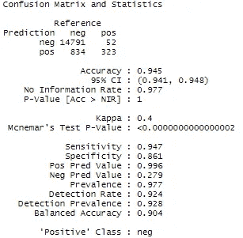

Logistic Regression performance on test set

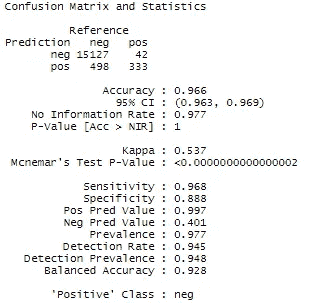

Naive Bayes performance on test set

根据每种错误的成本矩阵，我们的得分为:

逻辑回归模型:52 x 500 + 834 x 10 = 34，340

朴素贝叶斯模型:42 x 500 + 498 x 10 = 25，980

对于这种快速的建模来说，这已经是不错的表现了。我敢打赌，通过更多的努力，我们可以非常接近最佳的 3 名选手:

