# 预期寿命数据的分类技术

> 原文：<https://towardsdatascience.com/classification-techniques-on-life-expectancy-data-118e6f22a877?source=collection_archive---------15----------------------->

## 大陆分类法


Photo by [chuttersnap](https://unsplash.com/@chuttersnap?utm_source=medium&utm_medium=referral) on [Unsplash](https://unsplash.com?utm_source=medium&utm_medium=referral)

我们人类被赋予了分类的概念。我们对所有东西进行分类，从衣柜里所有的牛仔裤放在一个架子下，所有的衬衫放在另一个专为衬衫准备的架子上，到手机上的应用程序和电脑上的文件，每种文件或应用程序都有单独的文件夹。

现在，分类的一个更“数据科学”的定义是，它是一种数据分析形式，提取描述重要数据类别的模型或预测分类变量(类别或目标)值的任务。基本上，找出一个新的观察将属于哪一组预定义的类别。一个非常常见的例子是，我们希望将某些邮件归类为垃圾邮件，而将其他邮件归类为非垃圾邮件。机器能够通过从已知类别的训练数据中学习来完成这项任务。

只有当我们有离散标签作为输出时，才能使用分类算法。像上面的例子中，电子邮件是否被分类为垃圾邮件，只有两种可能的结果，这种情况被称为二元分类。

另一种类型是多标签分类。在多标签分类中，可以将多个标签分配给一个实例。这主要用于音视频分类、文本分类、情感分析中的情感分类等。

无论如何，这是继续阅读本文所需的基础知识和先决条件。

在本文中，我们将对各大洲进行分类，这是标签，将在[预期寿命数据集](https://www.kaggle.com/amansaxena/lifeexpectancy)中用作一个类别。

这是一个非常小的数据集，有 6 列 223 行，每个国家一行。栏目分别是排名、国家、整体生活、男性生活、女性生活和大洲。

为了执行这种分类，我们将使用 5 种不同的分类技术和算法，计算每种算法的精确度和准确度，并对它们进行比较。这 5 种分类算法是:

*   **KNN** — K 近邻算法使用类似距离函数(distance measures)的相似性度量对经过训练后的新数据点进行分类。
*   **SVM** —支持向量机是一种监督学习算法，它将创建一个模型，使用训练集将新的点分配到一个或另一个类别。根据问题，分配可以是线性的或非线性的。
*   **OneR** — OneR 基本上是一个规则算法，这个算法为数据中的每个预测器生成一个规则，然后选择误差最小的规则作为答案。尽管这看起来是一个非常简单的算法，因为它只生成一个规则，但它比一些更复杂的分类算法执行得更好。
*   **RIPPER** —RIPPER 是一个基于规则的学习器，它建立了一套识别类的规则，同时最小化了错误的数量。误差由被规则错误分类的训练样本的数量来定义。这是执行基于规则的分类的直接方式。
*   **C 4.5** — C4.5 是一个统计分类器，因为它生成决策树。它像 ID3 一样从训练数据中构建决策树，并在树的每个节点上选择数据的属性，该属性最有效地将其样本集分成富含一个类或另一个类的子集。这是一种间接的基于规则的分类方法。

现在让我们从使用 R 编程的分析开始，让我们看看哪个分类器执行得最好。

我们将在整个代码中使用以下库/包:e1071、class、caret、rJava、RWeka。

```
#loading libraries
library("e1071")
library(class)
library(caret)
library(rJava)
library(RWeka)
```

# 数据预处理

1.  数据预处理的第一步包括以下内容:

*   使用 *read.csv()* 函数导入 R 中的数据集。
*   通过查看数据集执行一些可视化的描述性分析，并使用 *summary()和 str()* 函数获得数据集的摘要。
*   通过分解将类别标签 continental 转换为分类变量。
*   一些不相关的列也将被删除，这些列不会在分析中使用。像第一个，秩列。

```
#importing csv file in R
dataset <- read.csv(file.choose())#displaying head(first five) elements
head(dataset) 
str(dataset)
#dimentions
dim(dataset) #Converting Continent to factor
dataset[c("Continent")]<- lapply(dataset[c("Continent")], factor)#removing the first (irrelevant) coulmn
dataset <- dataset[,-1]str(dataset)
summary(dataset)
```

**输出**

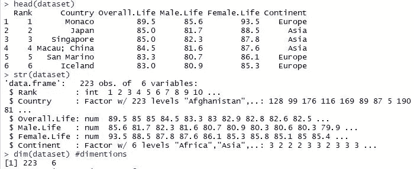

head(), str(), dim() functions

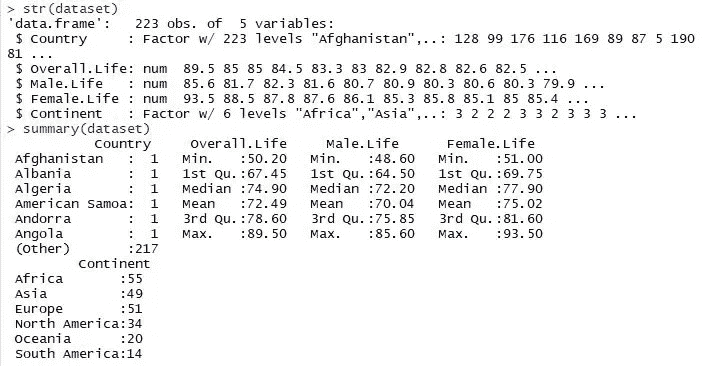

str(), summary() functions after the removal of the first column and the factor converstion

**观察**

尽管 Continent 列已经是 factor 数据类型，但我们仍然运行命令使其成为 factor。有了这个数据视图，我们可以清楚地了解数据的样子， *head()* 函数可以做到这一点。汇总函数向我们展示了一些重要的描述性信息。最重要的是，我们可以看到有多少国家位于哪个洲，这将有助于我们以后检查准确性。我们还可以观察整体、男性和女性预期寿命的均值，分别为 72.49、70.04 和 75.02。还可以观察中间值、四分位数、混合值和最大值。

2.对于数据预处理的第二部分，我们将:

*   通过使用样本方法生成训练和测试元素的随机排列，将数据集以 80:20 的比例划分为训练集和测试集。
*   将训练和测试样本保存在输出变量的列表中。
*   我们可以通过打印输出变量来查看训练和测试样本。

```
#sampling 80% training data
traindata <- sample(seq_len(nrow(dataset)), size = floor(0.80 * nrow(dataset)))
data_train <- dataset[traindata, ]
data_test <- dataset[-traindata,]
t_train <- dataset$Continent[traindata]
t_test <- dataset$Continent[-traindata]output<-list(data_train,data_test,t_train,t_test)#a view of the devided data(into train and test)
print(output)
```

# KNN-K 最近邻算法

KNN 分类将在预处理和训练方法的帮助下执行，可在 caret 包中获得。训练方法中的隧道长度将根据拟合模型结果选择为 20，这将帮助我们自动选择最佳值。

在我们的例子中，K 被选择为 5。此外，精确度用于选择使用最大值的最佳模型。

```
#KNN#setting seed
set.seed(12345)knn_train_test<-output
let_train<-knn_train_test[[1]]
let_test<-knn_train_test[[2]]#Preprocessing and training
trainX <- let_train[,names(let_train) != "Continent"]
preProcValues <- preProcess(x = trainX,method = c("center", "scale"))
print(preProcValues)#Fit Model- Using Caret's train model to find best k
ctrl <- trainControl(method="repeatedcv",repeats = 3)
knnFit <- train(Continent~., data = let_train, method = "knn", 
                trControl = ctrl,preProcess = c("center","scale"), 
                tuneLength = 20)
print(knnFit)
plot(knnFit)#Make predictions
knnPredict <- predict(knnFit,newdata = let_test )
knnPredict#Confusion Matrix
confusionMatrix(knnPredict, let_test$Continent )#Accuracy
knnoutput<-mean(knnPredict== let_test$Continent)
knnoutput
```

**输出**

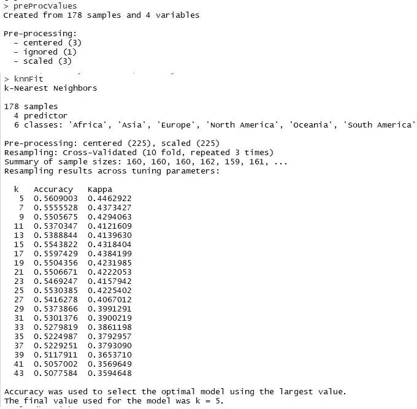

preprocessing using the caret package and finding the knn fit i.e. value of K

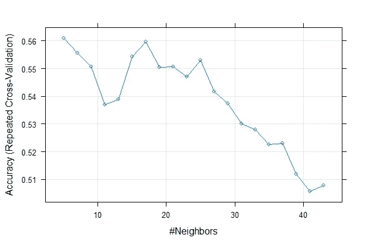

plot depicting the choice of the value of K by using accuracy

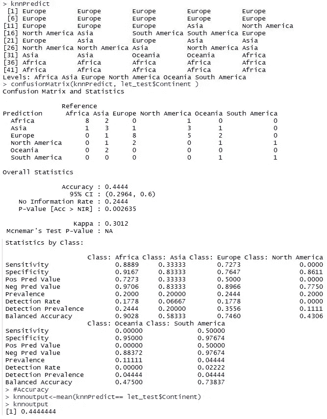

prediction, confusion matrix and accuracy

**观察**

*   首先，我们观察到，通过查看最高精度(通过重复交叉验证)，K 的最佳值被选择为 5。
*   该图还显示 K=5 时的最高精度值为 0.562，K=17 时的精度为 0.559。
*   KNN 的**准确率是 44%。**

# SVM —支持向量机

SVM 分类功能将借助调整方法并使用 e1071 软件包进行部署。通过从调整方法中选择核为线性且成本为 1 来调整 svm 拟合分类。

```
#SVM #setting seed
set.seed(12345)train_test<- output
let_train<-train_test[[1]]
let_test<-train_test[[2]]#Fit model
svmfit <- svm(Continent ~., data = let_train, kernel = "linear", scale = FALSE)
svmfit
svm#Tune to check best performance
tuned <- tune(svm, Continent ~., data = let_train, kernel = "linear", ranges = list(cost=c(0.001,0.01,.1,1,10,100)))
summary(tuned)#Make predictions
p <- predict(svmfit, let_test, type="class")
length(let_test$Continent)
table(p, let_test$Continent)#Analyse results
#Confusion matrix
confusionMatrix(p, let_test$Continent )#Accuracy
#print(mean(p== let_test$Continent))
svmoutput<-mean(p== let_test$Continent)
svmoutput
```

**输出**

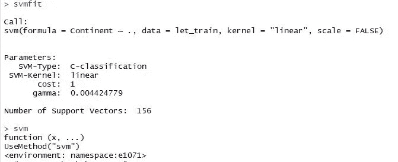

fitting the model using svmfit()

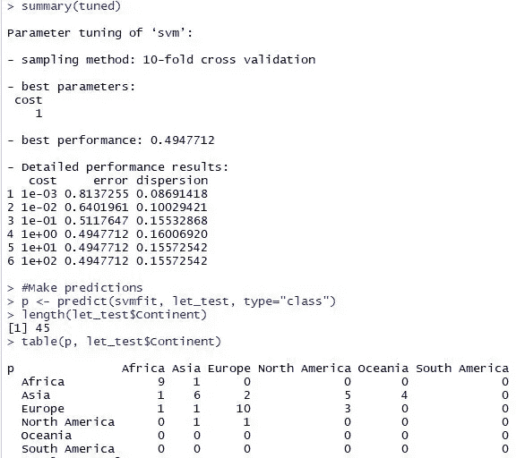

tuning to check for the best performance and predicting the classes

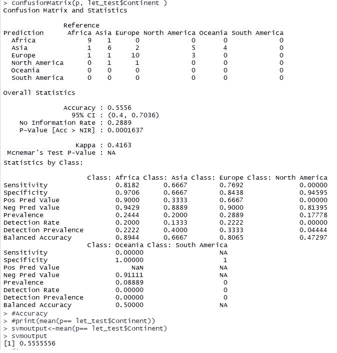

creating the confusion matrix and calculating the accuracy

**观察**

*   我们观察到 SVM 的准确率为 55%

# **OneR —一个规则算法**

```
#OneR#setting seed
set.seed(12345)oner_train_test<- output
let_train<-oner_train_test[[1]]
let_test<-oner_train_test[[2]]#Fitting model
model <- OneR(Continent~.,let_train)
model#prediction
pred <- predict(model, let_test)
predtable(pred,let_test$Continent)
summary(model)#confusion matrix 
confusionMatrix(pred, let_test$Continent)#Accuracy
acc<-mean(pred==let_test$Continent)
acc
```

**输出**

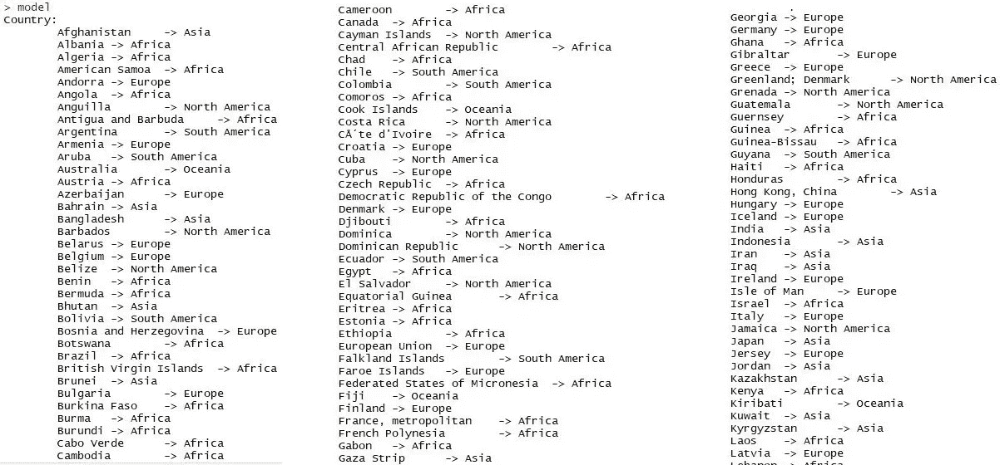

model 1/2

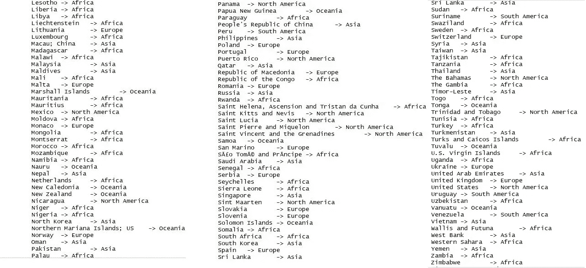

model 2/2

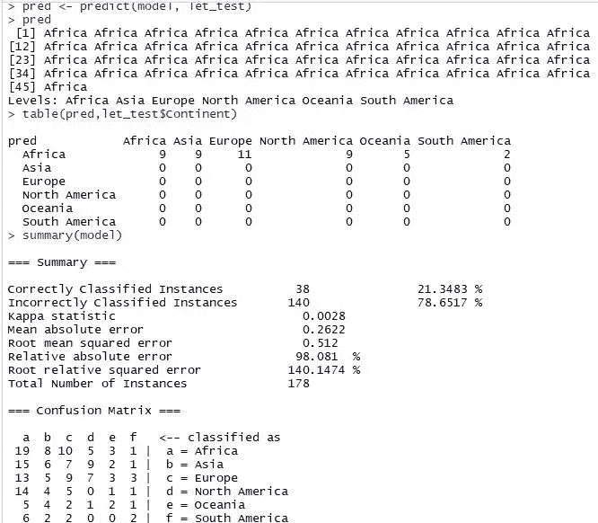

prediction() function, table and summary of the model

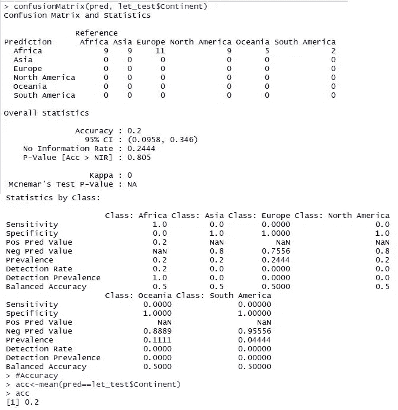

confusion matrix and accuracy

**观察**

*   我们观察了使用训练数据映射的 178 个实例的建模。
*   当使用测试数据进行预测时，只有 38 个正确分类的实例，而 140 个错误分类的实例，因为非洲被作为一个规则。
*   这使得 OneR 算法的**准确率只有 20%。**

# RIPPER —重复增量修剪以产生误差减少算法

Ripper 分类功能将借助 RWeka 包中的 JRip 方法进行部署。

```
#RIPPER Algorithm#setting seed
set.seed(12345)ripper_train_test<- output
let_train<-ripper_train_test[[1]]
let_test<-ripper_train_test[[2]]#fitting model using Weka control function of JRip
model1 <- JRip(Continent~., data=let_train) 
model1#prediction
pred1 <- predict(model1, let_test)
pred1table(pred1, let_test$Continent)
summary(model1)#confusion matrix
confusionMatrix(pred1, let_test$Continent)#Accuracy
acc<-mean(pred1==let_test$Continent)
acc
```

**输出**

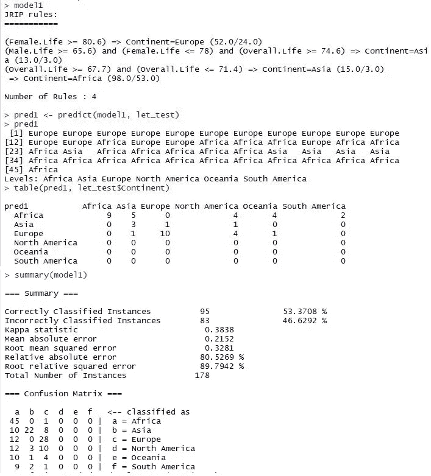

modeling, prediction, tabulation of the prediction and summary

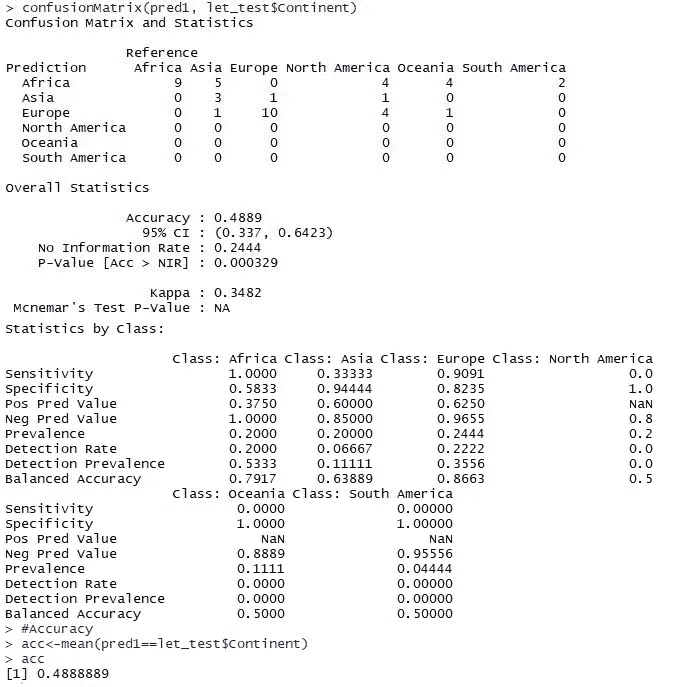

confusion matrix and accuracy

**观察**

*   当使用测试数据进行预测时，95 个实例被正确分类，而 83 个被错误分类。
*   混乱矩阵清楚地显示了哪个大陆被归类为什么。
*   **使用 RIPPER 算法可以观察到 48%的精度**。

# C 4.5 算法

借助 RWeka 包中的 J48 方法部署了 C4.5 分类功能。

```
#C.45 Algorithm#setting seed
set.seed(12345)c45_train_test<- output
let_train<-c45_train_test[[1]]
let_test<-c45_train_test[[2]]# fit model-Using Weka Control function of J48
fit <- J48(Continent~., data=let_train)# summarize the fit
summary(fit)# make predictions
c45predictions <- predict(fit, let_test)# summarize accuracy
tb<-table(c45predictions, let_test$Continent)#Confusion Matrix
confusionMatrix(c45predictions, let_test$Continent )#Accuracy
#print(mean(c45predictions== let_test$Continent))
c45output<-mean(c45predictions== let_test$Continent)
c45output
```

**输出**

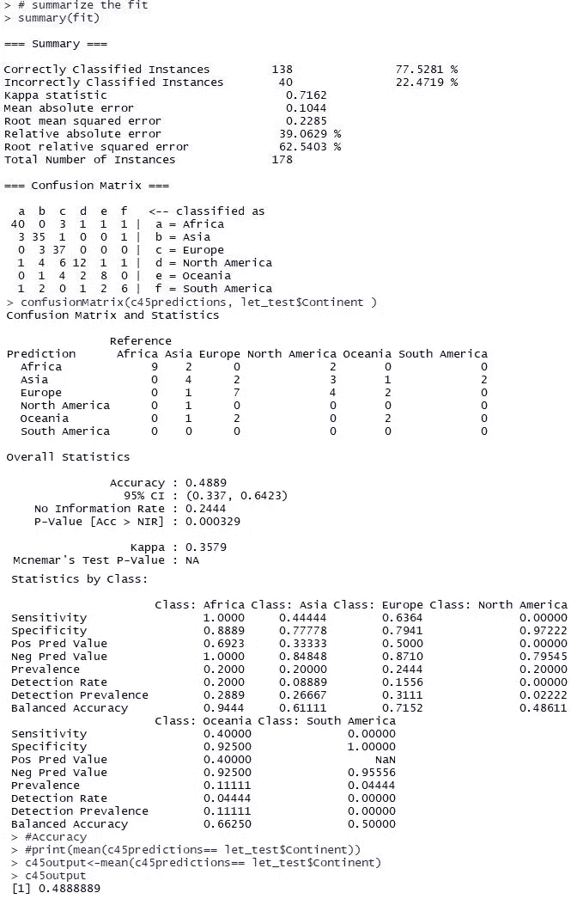

summary of the fit, confusion matrix and accuracy

**观察**

*   通过总结拟合度，我们可以看到 138 个实例被正确分类，而 40 个被错误分类。
*   **使用 C4.5 算法得到的准确率为 48%** 。
*   精确度与 RIPPER 算法非常相似。

# 结论

最后，让我们列出本文中使用的各种分类器的所有精度值。

**精度值——由分类器**确定

*   KNN——44%
*   SVM——55%
*   OneR — 20%
*   裂土器— 48%
*   C4.5 — 48%

显然，SVM 的表现远远超过了所有其他分类技术。RIPPER 和 C4.5 是最接近的，都显示出 48%的准确率，这是非常令人印象深刻的。OneR 算法表现最差，只有 20%的准确率。