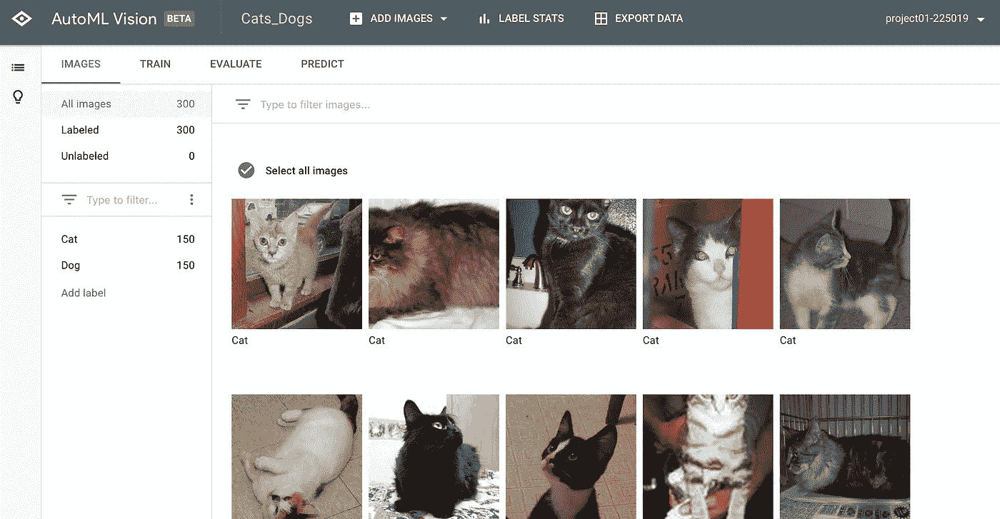
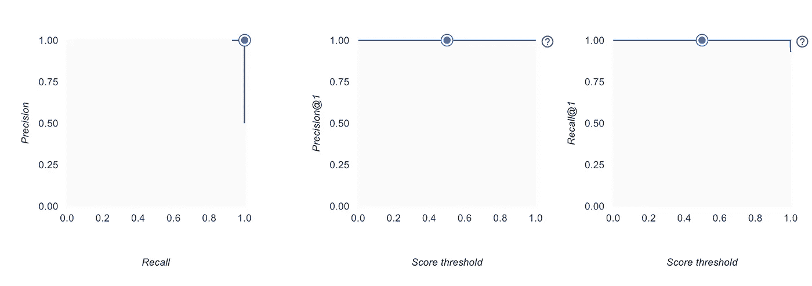
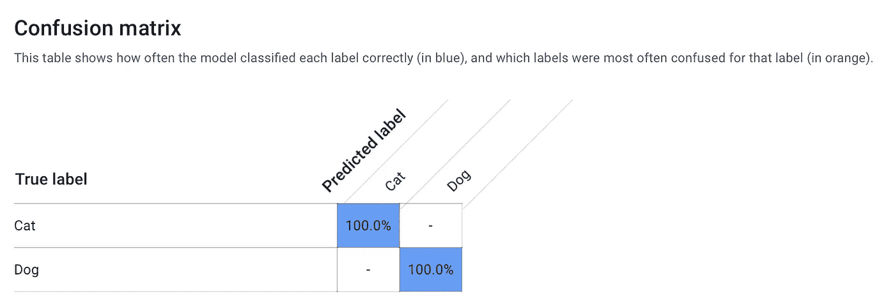
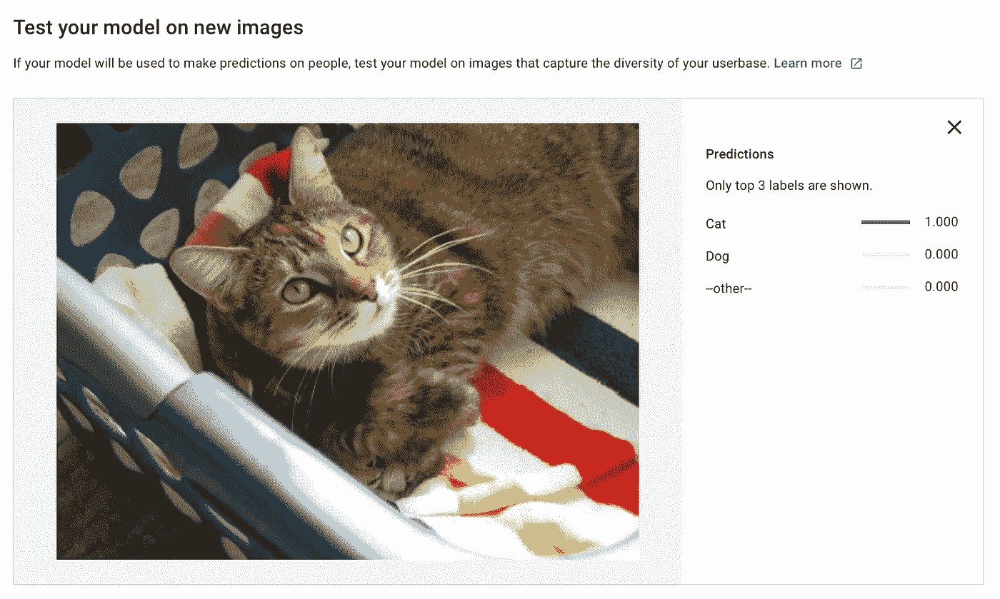
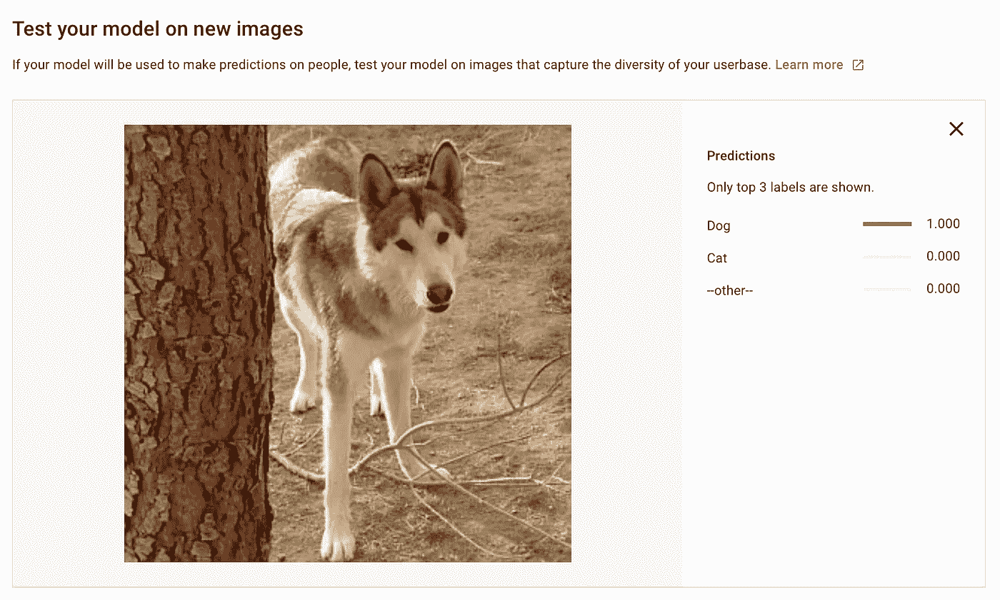
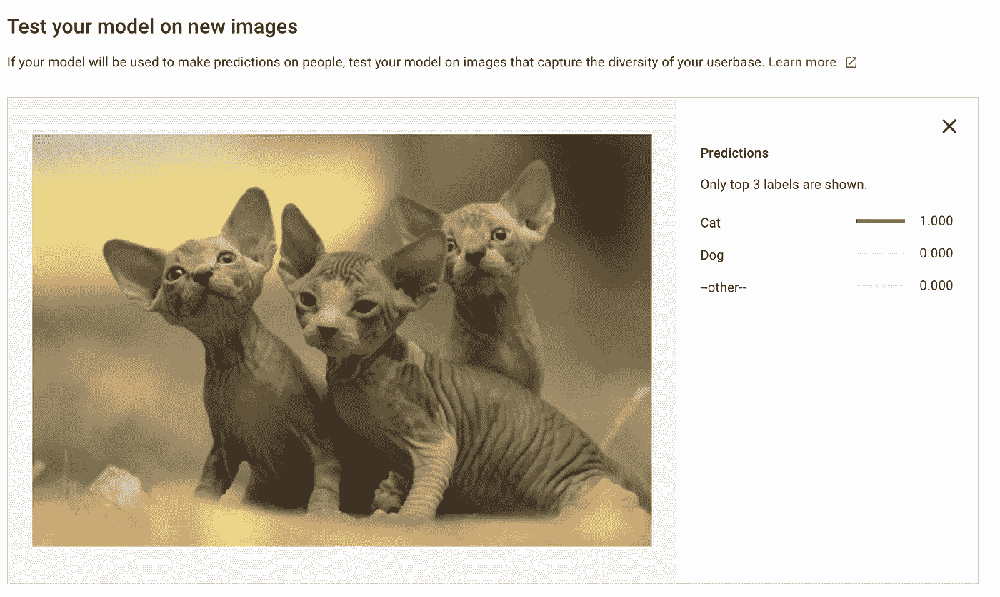
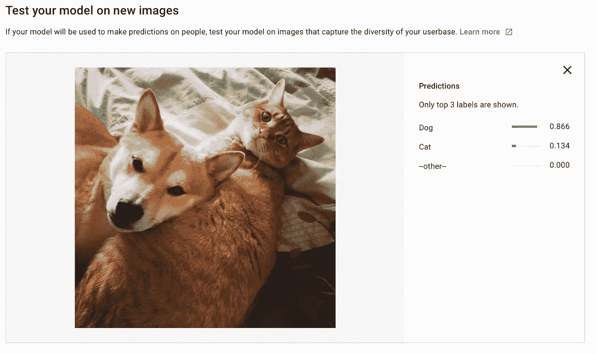
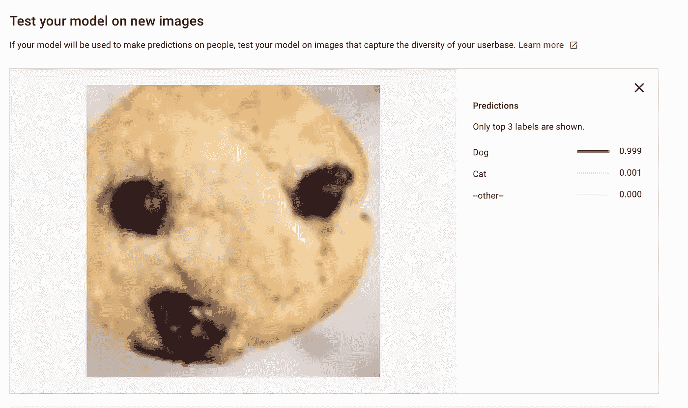

# 基于自动视觉的猫狗图像分类

> 原文：<https://towardsdatascience.com/classifying-cats-dogs-images-with-automl-vision-235b6d6bf27f?source=collection_archive---------20----------------------->

我第一次正式接触谷歌云平台是在 2018 年 11 月参加 [CalHacks 5.0](https://calhacks.io) 的时候。我很快发现他们的云 AI 套件由一系列机器学习产品组成——Cloud AutoML、Cloud Natural Language、Cloud Vision API，仅举几例。

在本学期早些时候我的一次 DataX 课上，我们使用 [Python Keras 库](https://keras.io)对猫和狗的照片进行分类。这给了我用类似的数据集工作的想法。*出于一个更无聊的原因，我的兄弟们非常喜欢宠物(尤其是猫和狗)，我认为部署这种模型对他们来说也是一件有趣的事情。*

通过 Keras 进行图像分类通常需要我(1)找到并标记数据集；(2)训练一个 ML 分类器；(3)部署 ML 模型；& (4)使用 REST API 创建一个服务器来调用 web 上的 ML 分类器。

多亏了 Cloud AutoML，我们只需要执行上面的步骤 1！

**数据集:猫和狗的图像**

幸运的是，为此目的找到一个合适的数据集并不是一件容易的事情。我输入“kaggle 猫狗数据集”，这个链接[作为谷歌搜索结果之一弹出。我分别选取了 150 张猫狗的图片，将这些图片导入到云平台上。之后，我给每张照片贴上“狗”或“猫”的标签。](https://www.microsoft.com/en-us/download/details.aspx?id=54765)

Uploading a total of 300 images for the model (150 each for cats and dogs respectively)

**培训和评估**

下一步是训练模型。默认情况下，AutoML Vision 在训练模型时会将数据集随机分为 3 个独立的集合。

*   训练数据集:80% —用于训练
*   验证数据集:10% —用于超参数调整和决定何时停止训练
*   测试数据集:10% —用于模型评估

对模型进行训练和评估后，我发现了以下情况:

Precision and Recall values for the Model

准确率和召回率都是 100% —这意味着什么？从所有被分配了猫/狗标签的测试示例中，所有的测试示例实际上都被准确地分类了。并且，在所有应该被分配了猫/狗标签的测试例子中，所有的例子实际上都被分配了正确的标签。

根据混淆矩阵，ML 模型能够准确地对所有照片进行分类(100%)。毕竟没有那么令人困惑。

**用新图像进行预测**

接下来，我用新图像测试了 ML 模型。我下载的数据集实际上有超过 10 000 张图片，所以我随机选择了一张狗和一张猫的图片，并将这些图片上传到模型中。

I uploaded an image of a cat for prediction, and the model was able to predict with 100% accuracy that it was **indeed** *a cat!*

Also predicted with 100% accuracy that it was a dog!

即使有了新的图像，这个模型也预测得很好。

不过，我不相信。所以我在网上寻找斯芬克斯的照片——这是一种与狗有着高度相似外貌的猫。我想知道 ML 模型是否会与这张图片混淆。

Sphynxes — a breed of cats that resembles dogs; I was mildy surprised to find out that the ML model was still able to classify this 100% with a “cat” label

事实证明，这个模型仍然能够以 100%的准确率预测出这是一张猫的照片。

但是…如果我们有一只猫和一只狗在同一个图像中会怎么样？

看起来这个模型在这里有点混乱——但是这绝对是我需要努力的地方。

**滑稽的吉娃娃对松饼挑战怎么样？**

你可能已经在互联网上看到了“吉娃娃 vs 松饼”的迷因——这里是。鉴于巧克力碎片松饼(事后看来也可能是巧克力碎片饼干)与吉娃娃的高度相似性，我想测试一下这个模型是否能区分这两者。

看起来它被愚弄了。但老实说，我认为这也可能让人类眼花缭乱。

下一步是什么？

鉴于猫狗分类是一个相对典型的机器学习图像分类问题，算法可能已经针对它进行了良好的训练。我们可以看到，当我们试图将分类问题复杂化时，出现了一些复杂性。

虽然它可能没有最复杂的算法来解决挑战性问题，但它仍然为非 ML 专家提供了一个非常友好的切入点来开始涉足一点 ML！

*嗯，下次更好玩的实验！*