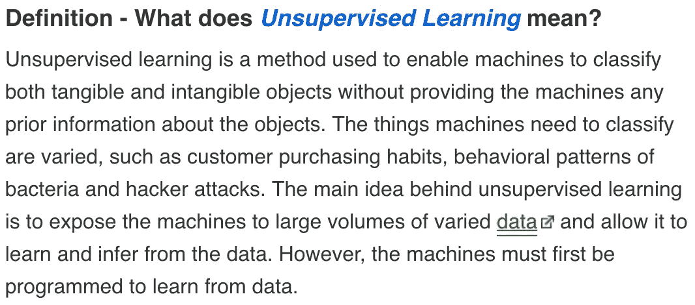
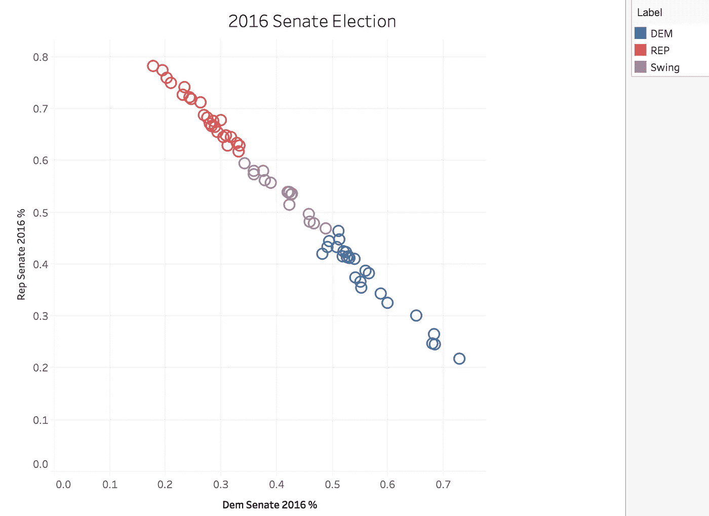
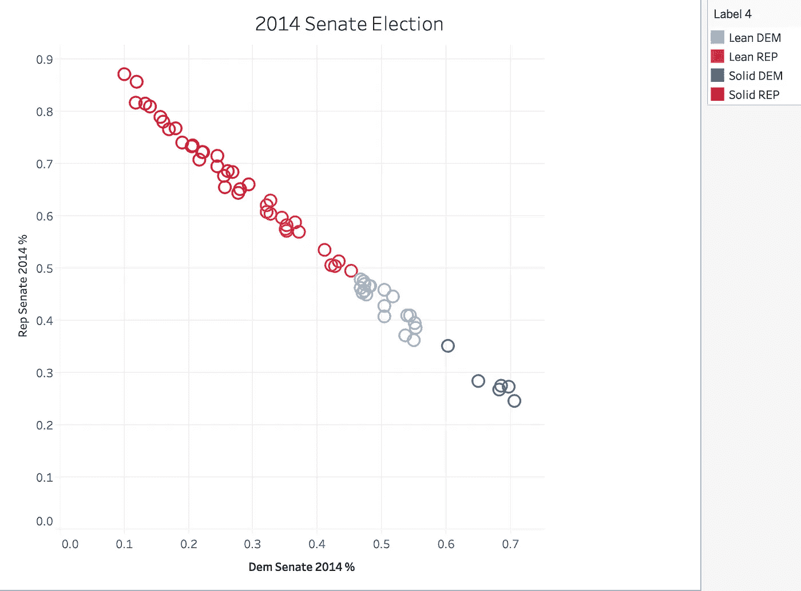
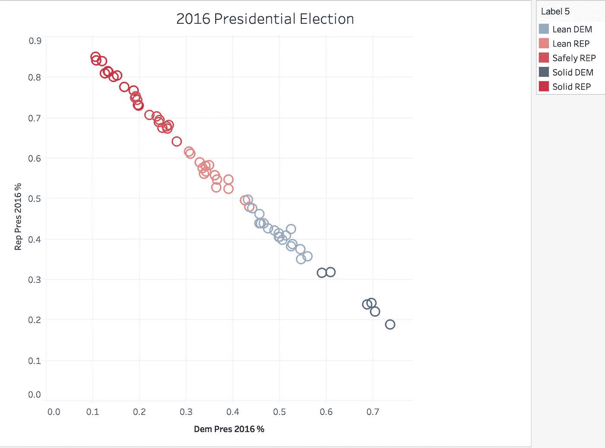
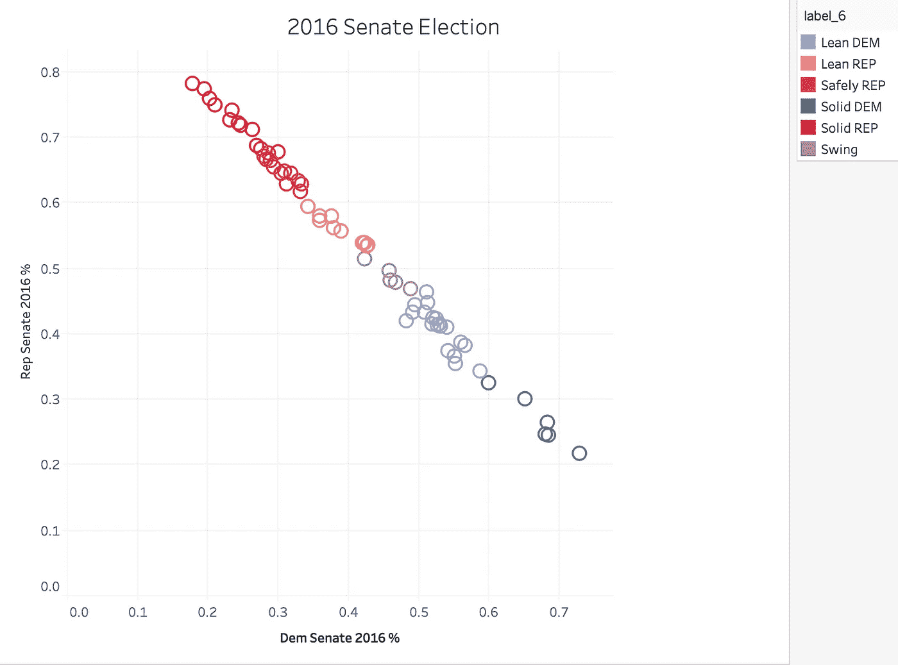
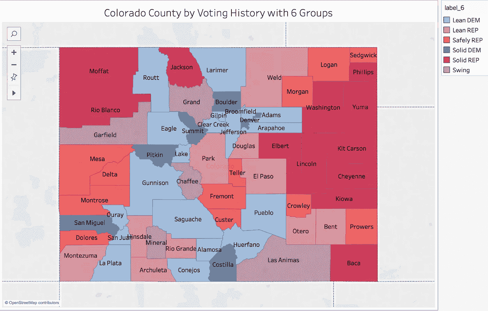
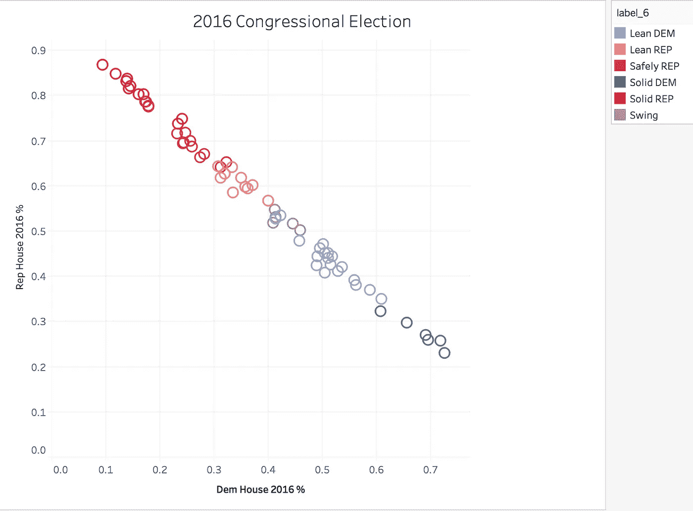
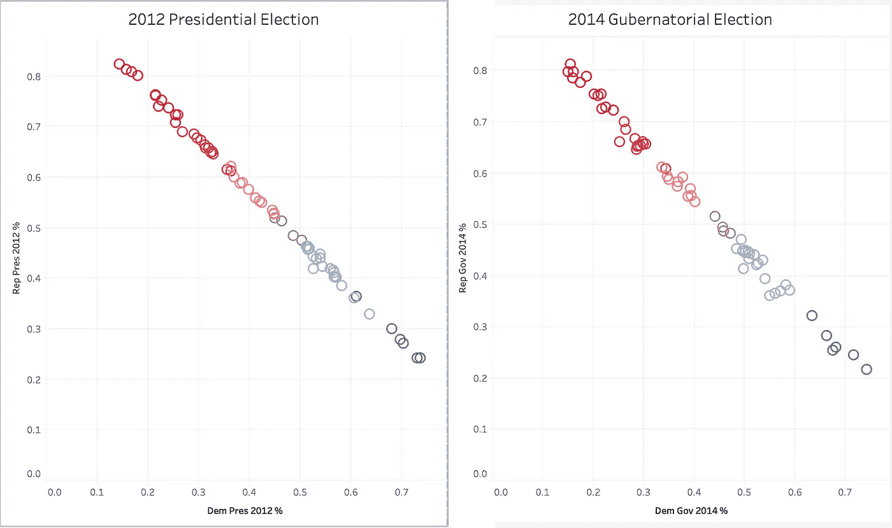

# 使用无监督学习基于投票历史对科罗拉多县进行分类

> 原文：<https://towardsdatascience.com/classifying-colorado-counties-based-on-voting-history-using-unsupervised-learning-aff83d20b64d?source=collection_archive---------12----------------------->

随着选举季节的临近，我想是时候写一写我几个月前做的一个项目了。这个项目围绕一个问题展开，“政治评论家如何判断一个县在历史上是投票支持民主党、共和党还是被认为是摇摆县？”我问了科罗拉多州的两位政治顾问这个问题，他们都以同样的方式回答了这个问题，“根据我们在科罗拉多州工作的经验，我们知道。”作为一名数据科学家和分析型思想家，这个答案并没有让我满意，因此我选择了这个项目。

带着一个问题，下一步是想出我将如何回答这个问题。第一部分是寻找、选择和收集我的数据。由于许多投票信息都是公开数据，我首先去了科罗拉多州的州务卿网站。接下来，我要对将要使用的数据做出一些选择。科罗拉多州州务卿的网站上有所有投票结果，所以我可以从所有可能的结果中选择。我知道，当人们投票给其他人时，投票率会增加，名字越大，也有助于激励公众投票。这让我决定我想要“最高票选举”的投票结果。这些类型的选举往往是人们谈论最多的，也是大多数人投票的原因。出于这个原因，我选择了总统、州长、参议员和国会竞选的投票结果。还有，我只回到了 2012 年。这让我把注意力集中在五年的时间跨度上，包括八场不同的比赛。我的想法是，这些数据足以得到准确的结果，但不能追溯到仅仅了解当前的政治气候。此外，为了简单起见，我只统计了每场竞选中民主党和共和党得票最多的人的票数。

在设置了我的数据参数并在科罗拉多州州务卿的网站上找到数据后，在训练一个模型之前，我必须做一些清理和加入工作。获取信息的最佳方式是从网站上复制下来，粘贴到 excel 电子表格中。(我知道懒惰，但这比使用可下载的杂乱无章的 excel 电子表格或废弃更乱的网站要容易得多。有时候你得做最容易的事。)当我得到可用格式的数据时，是时候为一些比赛做一些连接了。这对于所有的国会竞选都是必要的，因为有些国会选区会将县分开。例如，博尔德县是国会第二选区和第四选区的一部分。在这种情况下，我将博尔德县第 2 区和第 4 区的民主党人的选票相加，得到博尔德县民主党人的总票数。我对共和党的选票和其他几个处理分裂选区的县也采取了同样的做法。为了使数据正常化，我计算了每个政党总票数的百分比。这将使我能够更好地比较不同大小的县，无论是大县还是小县，都不会影响或扭曲我的模型。

我的下一步是建立一个模型。对于这种类型的问题，我知道我需要一个无监督的学习模型，因为我没有目标变量来训练模型。对于那些不熟悉无监督学习的人，我能找到的最好的单一定义来自 Techopedia。

[https://www.techopedia.com/definition/30390/unsupervised-learning](https://www.techopedia.com/definition/30390/unsupervised-learning)

旁注，但无监督学习已经慢慢成为我最喜欢的方法来分析数据，找到我看不到或想不到要寻找的模式。我认为它难以置信地未被充分利用，并且可以为人们试图解决的许多问题提供价值，但是，这可能是另一个博客的话题。无论如何，我强烈建议人们去调查一下。

我需要用来解决这个问题的模型类型叫做聚类模型。我想看看哪些县的表现彼此相似，并对它们进行分组标记。我知道两种主要的聚类无监督学习模型，K-Means 和 DBSCAN(基于密度的含噪声应用空间聚类)。虽然这两个模型都是无监督聚类模型，但它们之间有一个很大的区别。K-Means 让您选择模型将找到多少个分类，而 DBSCAN 将选择模型将自己给出多少个分类。虽然这两个模型都适用于这个数据集，但我的问题陈述要求 3 个不同的群体，共和党、民主党或摇摆派。因此，我使用 K-Means 纯粹是因为我能够设置我的模型将搜索的聚类数。

在运行 K-Means 模型时，它会根据所分配到的分类为每个数据点分配一个数字。我选择 K=3，这是我想要的 3 个集群，这些数字是 0、1 和 2。根据我的问题背景，为了找出这些数字的含义，我用配对图绘制了我的数据点，并将图形的色调设置为模型给该点的标签。在对图表的标签进行了一些分析和放大之后，我确定了每个标签的含义，并将它们重新标记为 DEM、REP 或 Swing，以便于理解。

为了仔细检查我的模型并查看我的结果，我将所有的数据转移到 Tableau，并在那里绘制每场比赛。当我仔细查看我的结果时，我开始注意到我的摇摆或“中间”分类并没有徘徊在投票范围的中心。

这些县中的大多数总是投票给共和党。虽然这一分类是科罗拉多州中三分之一的县，但它不包括在投票百分比方面仅徘徊在中心标记附近的县(每个政党的投票百分比相等)。这让我回到我的数据，并尝试一个不同的模型。我接下来尝试的型号是 DBSCAN。结果不如我已经试过的 K-Means 模型那样好。大多数县将导致“-1”分类。这意味着数据点噪音太大，无法对模型进行分类。即使在测试不同的最小样本和不同的 EPS 值后，(EPS 是两个点的最大距离，可以被认为是相同的分类)，大多数县仍然被归类为“-1”。由于大多数点没有被分类，我知道 DBSCAN 模型不会满足我的需要。

我的下一步是回到 K-Means 模型，在模型中尝试不同的 K。我试过的不同 K 是 4，5，6。粗略地看了一下每个模型的结果，我知道我更加接近我所寻找的了。我将这些结果加载到 Tableau 中，并能够仔细查看每个模型以查看分类。我知道超过 3 个分类，我需要更多的标签名称，而不仅仅是民主党，共和党和摇摆。我将在民主党和共和党前面添加“精简”、“安全”和“稳固”等词，以便在对这些新标签进行分类时给我一些灵活性。

K-表示其中 K=4 包括标签；精简的民主党，精简的共和党，坚定的民主党，坚定的共和党。

虽然我认为 K=4 的 K-Means 模型在对县进行分类方面比 K=3 模型做得好得多，但它不能识别我正在寻找的“摇摆”县。

K-表示其中 K=5 包括标签；Leam 民主党，Lean 共和党，Safely 共和党，Solid 民主党和 Solid 共和党。

K=4 和 K=5 的主要区别在于，新的分类(我称之为安全共和党)是 K=4 的坚定共和党的一个子部分。这个模型没有提供太多新的信息，也没有识别出我要寻找的“摇摆”县。

K-表示其中 K=6 包括标签；摇摆不定，精益民主党，精益共和党，安全共和党，坚实的民主党和坚实的共和党。

就是这个。我能够确定四个郡正好位于投票范围的中间。虽然共和党人确实倾向于赢得这些县，但通常情况下，这场比赛在几个百分点之内，民主党人在这些县中获胜，这足以赢得“摇摆”的分类。这些县是 K=4 和 K=5 模型中精益共和党分类的一个子部分。下面是科罗拉多州的全貌以及每个县的分类。

现在戴上政治迷的帽子，为感兴趣的人谈谈我发现的一些有趣的事情。

在进行这个项目的过程中，有几场比赛吸引了我的注意力，我发现它们很有趣。引起我注意的第一批比赛都是众议院的比赛。首先引起我注意的是这些比赛是所有图形中线性度最低的。此外，众议院的比赛也是最混乱的分类。这是因为众议院选举不是全州范围的选举，每个地区都有自己的竞选人。这使得每个人都有很高的机会在选举中表现异常，导致上面图中提到的差异。一个很好的例子是 2016 年的选举，如下图所示。

另一个有趣的点是，每年的高姿态比赛比当年的其他选举更加线性。总统竞选往往是最引人注目的竞选，也往往有最高的投票率。当用图表表示时，这些往往比州长、参议院或众议院的竞选更加线性。以下是 2012 年总统竞选和 2014 年州长竞选。

我想说的最后一点是关于 2014 年的州长竞选，如上图所示。这是两个级别之间交叉最少的比赛，实际上根本没有交叉。我不知道这是不是侥幸，因为我的数据中只有一次州长竞选。如果这不是偶然的，其他州长竞选也是如此，那么可以肯定地说，了解科罗拉多州的最好方式是通过它的州长选举。

要查看其余的图表，请访问我的 Tableau 公开简介:[https://public.tableau.com/profile/cbjohnson30#!/](https://public.tableau.com/profile/cbjohnson30#!/)
要查看用于此的代码，请访问我的 GitHub:[https://github.com/CBJohnson30](https://github.com/CBJohnson30)