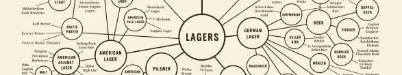
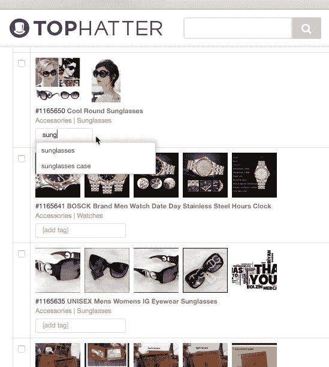
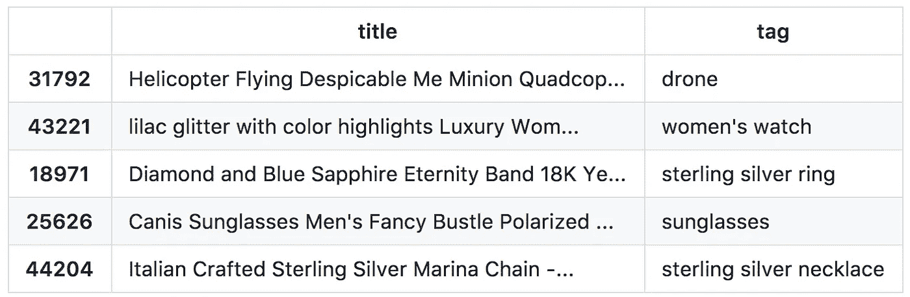
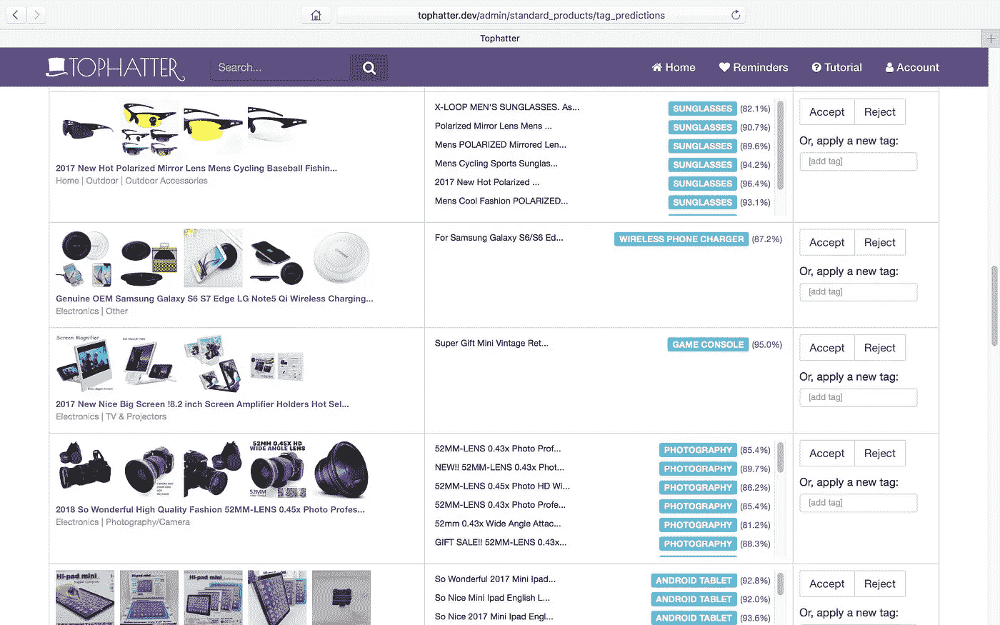

# 利用机器学习对市场库存进行大规模分类

> 原文：<https://towardsdatascience.com/classifying-marketplace-inventory-at-scale-with-machine-learning-99e69eac585e?source=collection_archive---------7----------------------->

*由* [*克里斯*](https://www.linkedin.com/in/chrisestreich) *联合创始人&CTO at*[*top hatter*](http://tophatter.com)*。这最初是向我们的工程团队内部发布的，但我们决定向其他对学习如何将机器学习应用于大规模分类问题感兴趣的人开放。*

# 为什么这很重要？

分类法在像 Tophatter 这样的市场中扮演着几个重要的角色。

**对于购物者:**它支持浏览&深入体验，有助于信息检索。直觉上，我们期望一条通向客户关心的产品集的高效路线胜过一条低效路线。

**对于 Tophatter:** 是商业智能的一种形式。更具体地说，这是一种对产品进行分组的有效方法，以便识别关键的异常值(表现优异或表现不佳)，并发现存在供需不平衡的领域。这些见解可用于对我们优先考虑的产品分销做出有影响力的改变。在一个典型的日子里，Tophatter 购物者进行近 100，000 次购买，每次购买都代表我们的库存调度算法的一个实例，该算法从数百万个产品中选择一个特定的产品进行优先排序。为了做出明智的选择，这种调度算法需要很好地理解产品是什么，以及它的性能如何。分类法是元数据的关键部分，它使调度算法能够做出明智的决策。

# 有哪些挑战？

对于一个有用的分类法，它应该是(1)正确地应用于所有产品，(2)易于使用，以及(3)当新的产品类别弹出时易于改变(有人坐立不安吗？).这具有挑战性，原因如下:

*   **(1)正确性:**市场通常依靠销售者对产品进行分类。这总是会导致一些不正确的分类。
*   **(2)易用性:**分类法可能经常很大而且不明确——一个产品可能看起来适合多个分支。此外，没有“标准”分类法。亚马逊、易贝和谷歌都有自己的，具体程度差别很大。这种复杂性在向市场添加库存时会引起摩擦，因为销售者必须将他们的内部分类映射到特定于他们希望销售的市场的分类。这既烦人又容易出错。
*   **(3)易更改性:**向分类中添加一个新节点很容易，但是我们将如何对应该映射到这个新节点的现有产品进行重新分类呢？删除节点也有同样的问题。

# 我们如何解决这个问题？

一种选择是定义一组标签来表示我们库存中不同类型的产品，手动将这些标签应用于我们产品的子集，并采用机器学习技术来训练分类器，以准确预测给定产品的适当标签。

让我们来看看这个解决方案的利弊:

## 赞成的意见

*   如果我们的模型是好的，我们解决了“正确性”问题。不再有人为失误。
*   从卖家的角度来看，它非常容易使用——系统会自动对每个产品进行分类，因此卖家什么都不用做！
*   在大多数标签系统中，添加或删除标签很简单，如果我们的标签集发生变化，我们可以每天自动对产品进行重新分类。

## 骗局

*   标签没有层次结构，而层次结构对于浏览/下钻很有用。
*   该系统需要大量的人工工作来为产品手工贴标签，以便生成训练数据。此外，还有维护成本。我们需要一个反馈循环来增加我们的训练数据，这样我们的模型才能不断改进。
*   这个系统比卖家给自己的产品分类的系统更复杂。复杂得多。它需要一个数据管道来推动未分类的产品通过分类器并存储结果。

让我们假设这是一个合理的解决方案，并探索一个简单的实现。

# 标签工具(Ruby，Rails，JS)

## 后端

有许多优秀的通用对象标记实现可用于各种 web 框架。对于 Rails，[acts-as-tagable-on](https://github.com/mbleigh/acts-as-taggable-on)是一个很好的选择。

假设您有一个`Product`模型，您可以通过以下方式启用标记:

给产品添加标签就像`product.tag_list.add('foo')`一样简单。

## 前端

为创建、添加和删除标签构建一个良好的前端是至关重要的，因为管理标签的过程是生成我们需要的数据以训练我们的模型并随着时间的推移对其进行改进的过程。

为此，我选择使用一个与 Bootstrap 兼容的 jQuery 插件， [bootstrap-tagsinput](http://bootstrap-tagsinput.github.io/bootstrap-tagsinput/examples/) ，它允许我们快速地异步添加和删除标签。它还支持与 [typeahead.js](https://github.com/twitter/typeahead.js) 的集成，因此我们可以执行标记自动完成，以加快标记速度并减少错误。

在我们的后端之上构建了一个前端标记工具之后，我们得到了以下结果:

# 机器学习(Python，Scikit-Learn)

给定一组用标签正确标记的 k 个产品示例，训练分类器来预测标签相对容易。我们将使用 [scikit-learn](http://scikit-learn.org/) 来完成这项工作。

## 培训用数据

为了让我们开始，我使用上面的标签工具来标记我们几百个最畅销的产品。决定一个框架来指导标记过程是很重要的，并且应该由您的分类法用例来指导。你需要知道需要什么样的特异性。我的经验是生成包含 3 个或更少单词的最具体的标签。比如，我没有选择“戒指”，而是选择了“[材质]戒指”(即“纯银戒指”)。我没有选择“平板”，而是选择了“安卓平板”。

这个手动标记步骤完成后，我将全套标记产品导出到一个 CSV 文件中。这是我们的训练数据。

我们可以很容易地用`pandas`加载它:

让我们快速浏览一下数据:

这些标签似乎对这些产品名称有意义。以下是标签在我们数据集中的分布情况:

有些标签没有很多例子。当预测在训练数据中不经常出现的标签时，我们的模型可能不会做得很好。这是我们可以在数据生成反馈回路中解决的问题。稍后会详细介绍。

## 特征探索

可以说，解决这种类型的机器学习问题时，最重要的步骤是探索训练数据，并搜索可能产生良好预测的特征。这可能需要一段时间。

为了简单起见，我们假设一般来说，产品的标题是标签预测的一个重要特征。实际上，有几个其他产品属性会非常有用(例如，描述、材料、价格、卖家等)，我们应该尝试使用所有这些特性。

## 特征转换

为了将标题转换成我们可以用来使我们的模型适合我们的训练数据的向量，我们将使用`CountVectorizer`:

我们的词汇表中有大约 11K 个单词。现在让我们将标题转换成向量:

让我们检查一个特征向量:

注意，它只在内存中存储向量的非零部分。这个向量表明，我们的文本包含一个出现在索引`241`的单词，一个出现在索引`1508`的单词，等等。

## 培养

让我们使用多项式朴素贝叶斯分类器来拟合我们的训练数据:

让我们在不在我们的训练集中的[产品](https://www.amazon.com/Fidget-Spinner-Ceramic-Increased-Anxiety/dp/B01MSDI80W)上测试分类器:

该分类器似乎工作…至少对于坐立不安纺纱。我想知道它和热狗会有什么关系？😃

我们来看看分类器有多准确。我们将使用 70%的数据进行训练，然后使用剩余的 30%来测量准确性。

我们得到大约 96%的初始精确度。

根据最佳实践，我们应该始终有一个比较基准。为此，让我们将我们的结果与随机算法进行比较:

毫不奇怪，随机猜测很糟糕(即使分层)。

## 网格搜索优化

现在，让我们创建一个适当的管道，并使用网格搜索来调整`CountVectorizer`参数。你可能已经注意到我们没有使用停用词。相反，我们将调整我们的最小和最大文档频率参数，这将自动过滤掉出现频率过高(如停用词)或过低的单词。

你还会注意到我们引入了[二元语法](https://en.wikipedia.org/wiki/Bigram)的概念——这为相邻词对的特征向量增加了列，可以改进我们的算法。当我们考虑相邻单词之间的关系时，我们将使用网格搜索来看看我们的算法是否更好。

这是我们的网格搜索尝试:

让我们以 70% / 30%的比例尝试这些参数:

不错——我们改进了一点。

## 其他分类器

现在让我们尝试一些不同的分类器，看看它们的表现如何:

看来`LogisticRegression`大有可为。我们暂时坚持这一点。

## 推算概率

当我们对产品的完整库存运行模型时，我们会遇到现有标签都不合适的情况。随着时间的推移，我们将希望扩展标签集，以包括几乎所有产品的适当标签，但我们还没有做到这一点。因此，我们想要抛弃明显不好的预测。

我们可以询问分类器，对于我们集合中的任何标签，它认为正确的概率是多少。这里有一个例子:

注意，我输入了一个标题，专门引用了两种不同类型的产品。分类器发现 2 个标签高于 0.1 的概率阈值。

## 反馈回路

我们需要弄清楚什么是合理的门槛。现在，我们将只选择概率最高的标签，并构建一个验证工具来显示概率，并允许人们接受或拒绝预测(确保跳过有把握的预测，以防止不必要的工作)。在这个过程中，我们可以添加新的标签来构建我们的标签集，并通过纠正错误的预测来改善我们的训练数据。这是使我们的模型表现良好的关键反馈循环。

这是我们验证工具的预览，它允许我们快速接受、拒绝或修正预测:

如果您想要快速改进模型，使该工具高效且易于使用是至关重要的。

## 投入生产

最后一步是弄清楚如何将未标记的产品输入到这个模型中，并通过验证工具持久化消费预测。如果您的产品数据库很大(就像我们的一样)，您可能会希望使用 build 来处理大量数据，比如 Spark。你甚至可以相对容易地将这个 scikit 模型移植到 [Spark ML](https://spark.apache.org/docs/1.2.2/ml-guide.html) 上。也许这是未来的博客文章🙂).

如果你的产品数据库没有数百万行，你可以在一个简单的 Python 脚本中做任何事情——如果你喜欢使用 ORM 进行数据库读/写，我们是 [SQLAlchemy](https://www.sqlalchemy.org/) 的忠实粉丝。

## 关于 Tophatter

Tophatter Inc 由 Ashvin Kumar(首席执行官)和 Chris Estreich(首席技术官)创建，于 2012 年 1 月推出。迄今为止，该公司已经从 CRV 的古德沃特资本公司和奥古斯特资本公司筹集了 3500 万美元。该公司在全球拥有 75 名员工，并正在硅谷和上海的办公室积极招聘员工。更多关于 Tophatter 的信息，请访问:【http://www.tophatter.com/about】T4。