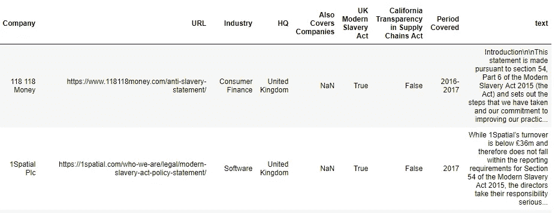
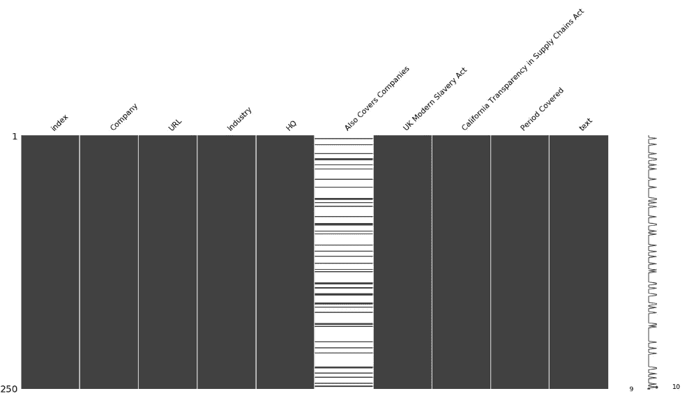
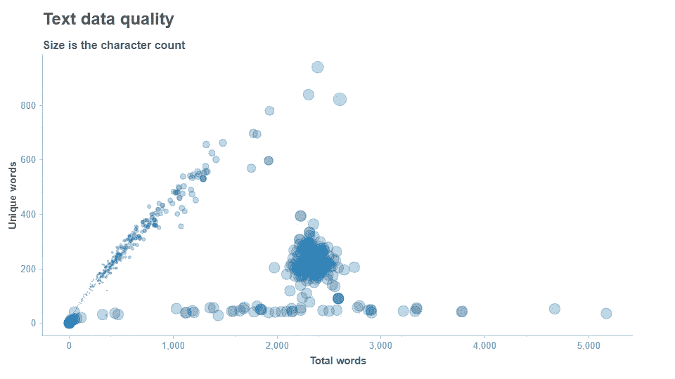
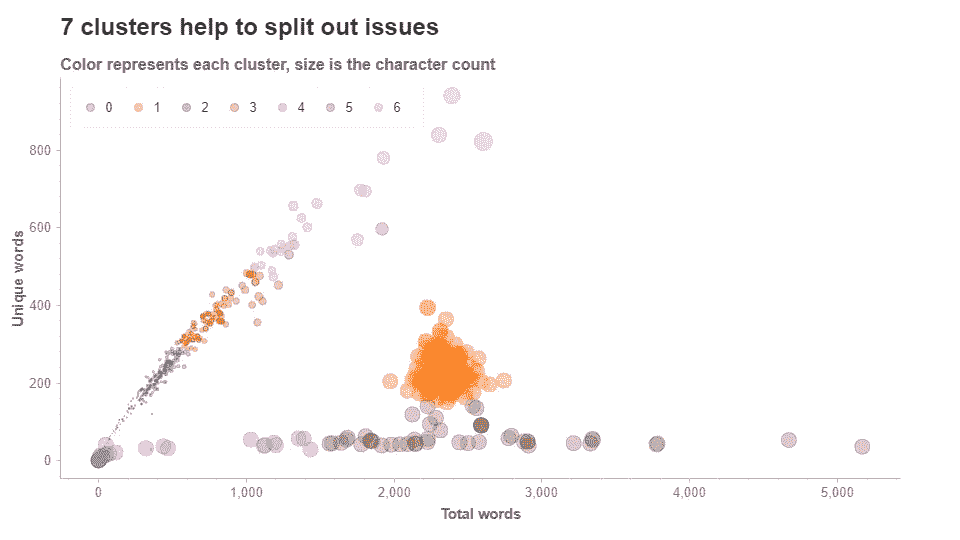

# 使用无监督的机器学习清理您的数据

> 原文：<https://towardsdatascience.com/clean-your-data-with-unsupervised-machine-learning-8491af733595?source=collection_archive---------5----------------------->

## 清理数据不一定是痛苦的！这篇文章是一个快速的例子，展示了如何使用无监督的机器学习来清理堆积如山的杂乱的文本数据，使用现实生活中的数据。


## 我们在对付什么？

在这个例子中，我们面对的是从 HMTL 和 PDF 文件中抓取的数千篇文本文章。返回文本的质量在很大程度上取决于抓取过程。从抽样检查的一些结果中，我们知道存在从坏链接、不可读的 pdf 到已经成功读入的项目的问题，但内容本身完全是垃圾。

与公司现代奴隶制相关的文章从这个数据库返回:[https://www.modernslaveryregistry.org/](https://www.modernslaveryregistry.org/)

这些现在存在于 Pandas 数据框中，每一项都有“元数据”,如公司名称和出版年份，以及从回复中提取的文本:



This is the starting point — the text data is the last column in the data frame

## 快速题外话:错过没有

python Missingno 包超级有用。它可以用 4 行代码在数据框上**安装和运行，如果数据框中有任何缺失信息，它会快速突出显示。它还能够对数据集中的行进行采样，因此可以轻松处理非常大的数据帧。**

```
!conda install -c conda-forge missingno — y
import missingno as msno
%matplotlib inline
msno.matrix(combined.sample(250)) #combined is the df
```

在我们的数据框上运行这个程序，显示出除了一列之外，数据是完整的。由于我们不使用它进行分析，所以不需要做进一步的工作，但是如果在其他区域有缺口，我们必须考虑如何最好地处理这些缺口(例如删除这些行或尝试估算缺失值)。



The chart shows all but one column are complete — we can now focus on our text data

## …回到清理文本数据

浏览数据框中的文本显然存在问题。例如，读取此项目中的 PDF 文件时出现问题:

> CMR644311ABP 英国现代奴隶制声明 2017 年 9 月)ABP 英国现代奴隶制声明 2017 年 9 月 ABP 英国现代奴隶制声明 2017 年 9 月 AABP 英国现代奴隶制声明 2017 年 9 月 bABP…..

这个看起来更糟:

> ！！！！！！！！！！！！！！！！！！！！！！！！！！！！！！！！！！！！！！！！！！！！！！！！！！！！！"#!)*%!+!,(-&*(#!。/&0#&-*!！1!！2–34!5!5/6!！1!！7–8(&9%!！1!！7:;！<=>！.3–8(%&-*($9!！！！！！！！！！！！！！学术界有限公司现代奴隶制合规状态。

这些显然是无法修复的——但是我们如何将它们从正确读取的文本文件中分离出来呢？

## 机器学习拯救世界

我们可能会花费大量时间试图从真实数据中分离出这些损坏的信息，但这正是机器学习的亮点。希望我们可以用它来发现数据中的模式，并自动将其聚类成干净和杂乱的数据，从而节省大量工作。使用 Python，只需三个步骤就能快速轻松地完成这项工作:

**第一步。为算法创建特征:**

以下代码将单词计数、字符计数和唯一单词数作为新列显示在我们的数据框中:

```
#The data frame is called 'combined'
def uniqueWords(X):
    X = X.split(' ')
    X = set(X)
    X = len(X)
    return Xcombined['charCount']   = combined['text'].str.len()
combined['wordCount']   = combined['text'].str.split(' ').str.len()
combined['uniqueWords'] = combined['text'].apply(uniqueWords)
```

**第二步。将数据可视化:**

使用 Spotify 真正优秀的图表库， **Chartify，**我们可以使用我们刚刚创建的新功能快速绘制数据图表:

```
ch = chartify.Chart(blank_labels=True)
ch.plot.scatter(
    data_frame=combined,
    x_column='wordCount',
    y_column='uniqueWords',
    size_column='charCount',
    alpha = 0.3)
ch.set_title("Text data quality")
ch.set_subtitle("Size is the character count")
ch.axes.set_yaxis_label('Unique words')
ch.axes.set_xaxis_label('Total words')
ch.show()
```

这个图表告诉我们大量关于数据集的信息。有明显的词、字、独字增多的趋势。这是意料之中的，但是在这下面还有一大串项目，在底部有一行项目，它们的字数很少，但是字符数很高:



**第三步。创建集群:**

通过使用机器学习对数据进行聚类，我们应该能够自动分割出我们在图表中看到的每个区域，并进一步研究这些区域。以下代码缩放数据，然后对其应用 K-Means 聚类:

```
from sklearn.cluster import KMeans
from sklearn.preprocessing import StandardScaler#The data frame is called 'combined'
X = combined[['charCount','wordCount','uniqueWords']]
scaler = StandardScaler()
X = scaler.fit_transform(X)
kmeans = KMeans(n_clusters=7, random_state=0).fit(X)
combined['Cluster'] = kmeans.labels_
```

再次运行我们的观想，我们得到以下结果:

```
# Overview
ch = chartify.Chart(blank_labels=True)
ch.plot.scatter(
    data_frame=combined,
    x_column='wordCount',
    y_column='uniqueWords',
    size_column='charCount',
    alpha = 0.3,
    color_column='Cluster')
ch.set_title("7 clusters help to split out issues")
ch.set_subtitle("Color represents each cluster, size is the character count")
ch.axes.set_yaxis_label('Unique words')
ch.axes.set_xaxis_label('Total words')
ch.show()
```



这在划分问题领域方面做得很好。看起来集群 1、4 和 5 需要一些进一步的调查。在此之前，让我们放大图表的左下方，以确保聚类仍在此处工作，因为在当前图中很难看到:


魔法；即使在点之间有重叠的地方，该算法也足够健壮，能够仅基于字符数来区分它们。

为什么我们决定选择 7 个集群？反复试验。7 是仍然以有效方式分割数据集的最小数字。

## 检查结果

这一切看起来很棒，但是我们真的实现了我们设定的目标吗？我们可以通过检查每个集群中的内容来检查这一点，特别是集群 1、4 和 5。

卡斯特 1:

```
#locate cluster 1 and return the text column as a list:
combined.loc[combined[‘Cluster’]==1].text.valuesreturns:
3M United Kingdom PLC: modern slavery statement. This statement has been published in accordance with the provisions of the Modern Slavery Act 2015\. It sets out the steps taken by 3M United Kingdom PLC ending 31 December 2016 to prevent modern slavery and human trafficking in its business and supply chains. Introduction from Christiane Gruen, Managing Director of 3M UK.  We, as an organisation, are proud of the steps we have taken, and continue to take, to combat slavery and human trafficking. Global Human Rights Policy was adopted in 2013...
```

这很有趣，文本在这里看起来完全没问题。上面的例子来自 3M，但其他返回区域也是干净的。因此，聚类 1 是从现代奴隶制陈述中获得的真实数据的一部分，而不是较差的数据质量。当我们进一步分析数据时，我们希望研究为什么这个集群存在

群组 4 和 5:

```
#locate cluster 4 and 5 and return the text column as a list:
combined.loc[(combined['Cluster']==4) | (combined['Cluster']==5)].text.valuesreturns:
...UK MODERNSLAVERY ACTStatement for the financial year ending 31 December 2016lUK MODERNSLAVERY ACTStatement for the financial year ending 31 December 2016oUK MODERNSLAVERY ACTStatement for the financial year ending 31 December 2016yUK MODERNSLAVERY ACTStatement for the financial year ending 31 December 2016eUK MODERNSLAVERY ACTStatement for the financial year ending 31 December 2016eUK MODERNSLAVERY ACTStatement for the financial year ending 31 December 2016sUK MODERNSLAVERY ACTStatement for the financial year ending 31 December 2016 UK MODERNSLAVERY ACTStatement for the financial year ending 31 December 2016aUK MODERNSLAVERY ACTStatement for the financial year ending 31 December 2016n...
```

这是我们杂乱的数据。令人印象深刻的是，即使单个单词有意义，该算法也足够智能，可以正确地对上面的例子进行聚类。

我们现在需要做的就是从数据集中排除这些聚类，然后继续分析一组漂亮、干净的数据。